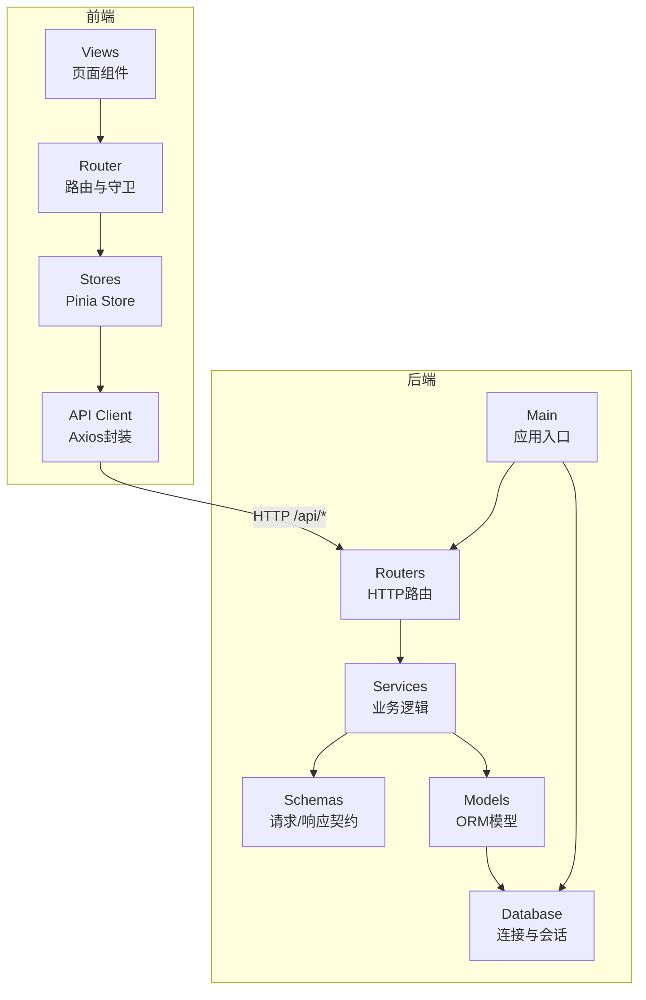
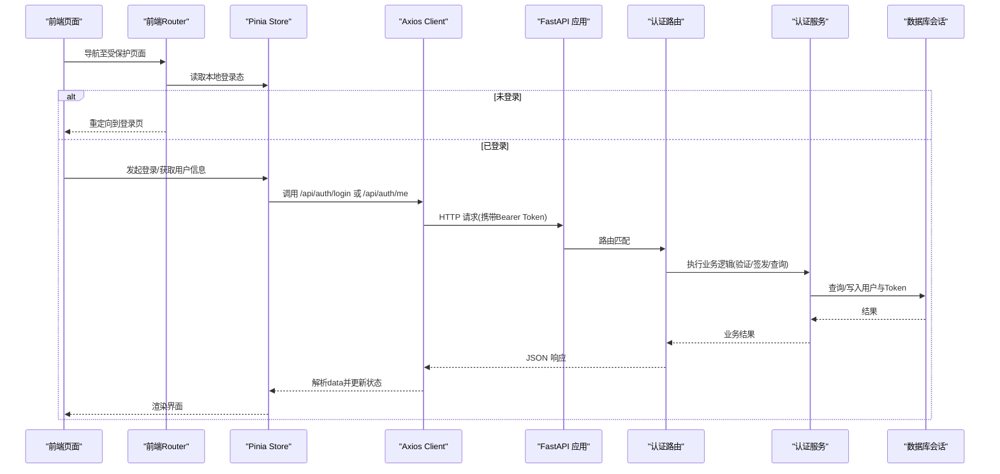
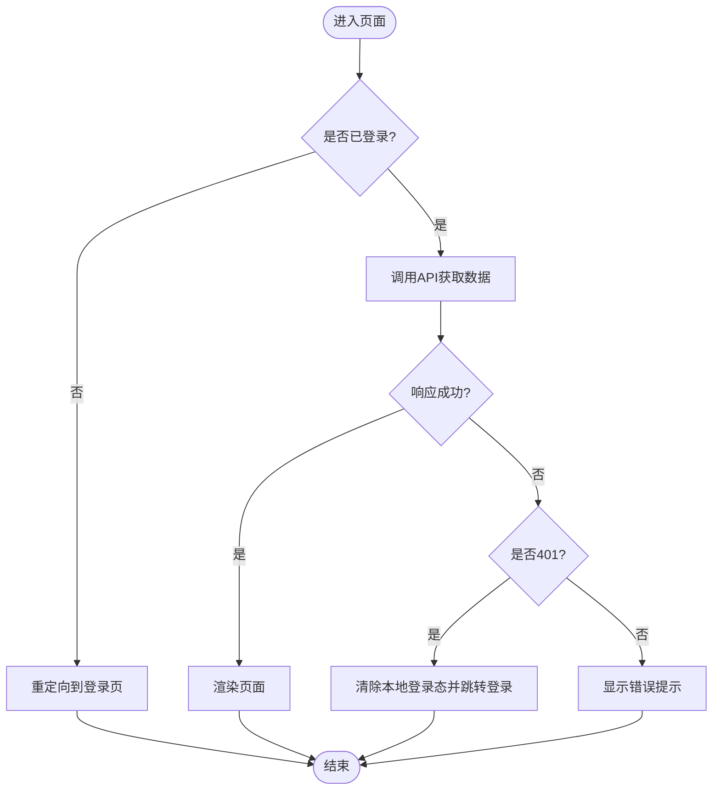
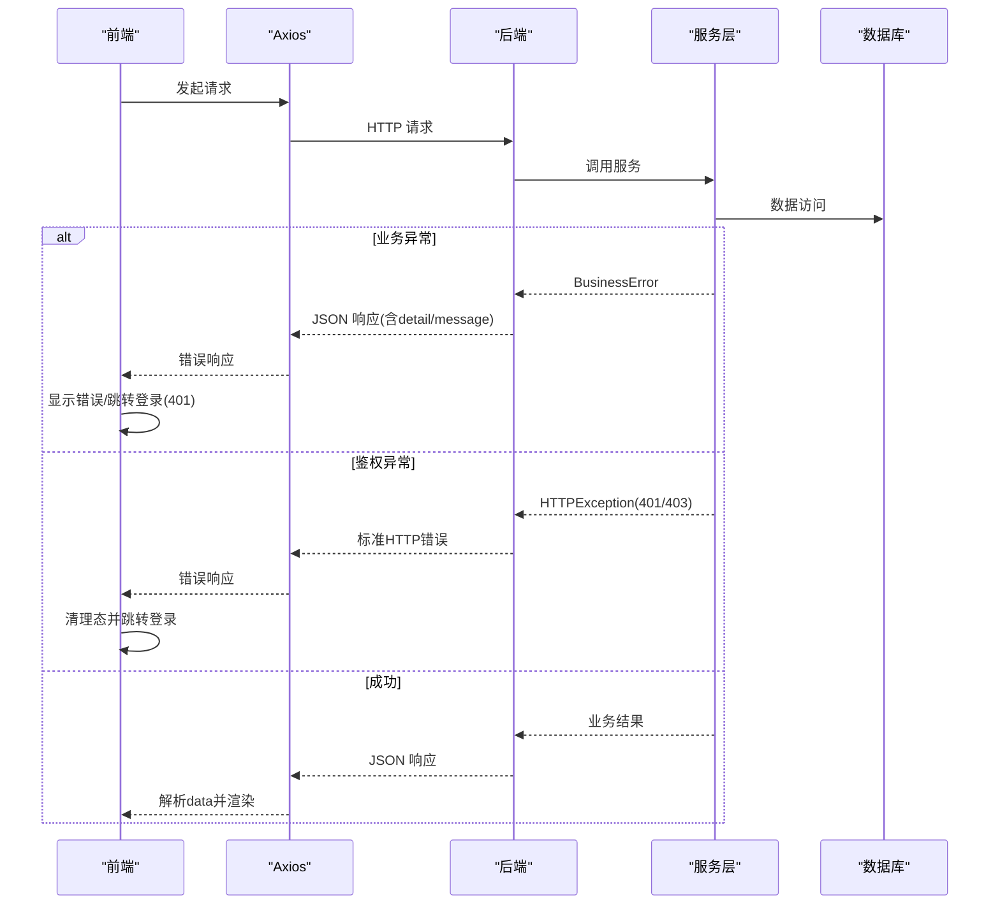
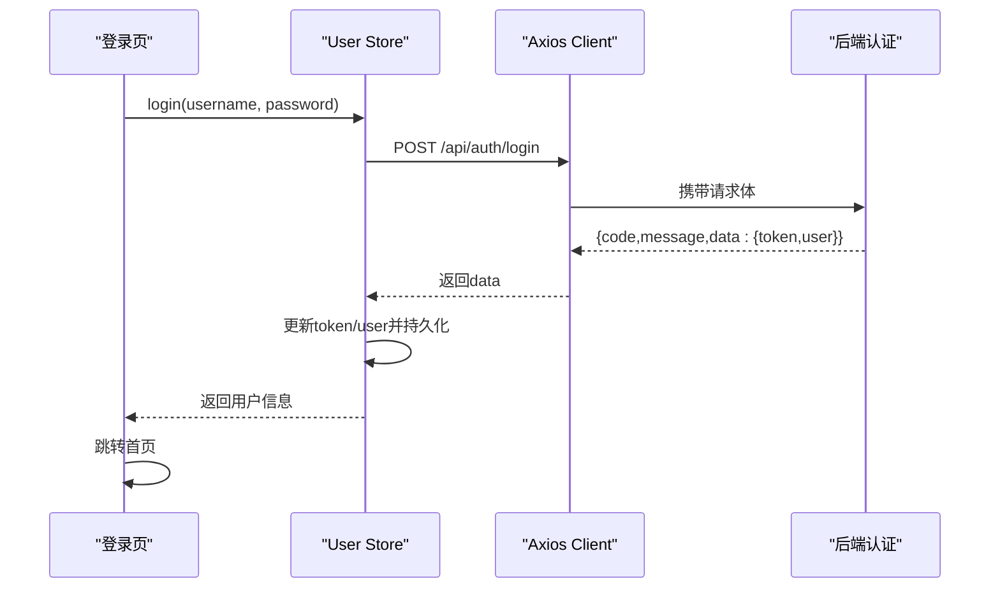
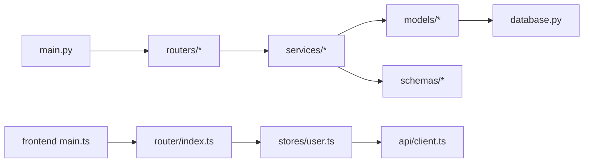

# 分层架构设计

<cite>
**本文引用的文件**
- [backend-python/app/main.py](file://backend-python/app/main.py)
- [backend-python/app/database.py](file://backend-python/app/database.py)
- [backend-python/app/common/errors.py](file://backend-python/app/common/errors.py)
- [backend-python/app/models/base.py](file://backend-python/app/models/base.py)
- [backend-python/app/models/auth.py](file://backend-python/app/models/auth.py)
- [backend-python/app/schemas/base.py](file://backend-python/app/schemas/base.py)
- [backend-python/app/schemas/auth.py](file://backend-python/app/schemas/auth.py)
- [backend-python/app/routers/auth.py](file://backend-python/app/routers/auth.py)
- [backend-python/app/services/auth_service.py](file://backend-python/app/services/auth_service.py)
- [frontend-vue/src/main.ts](file://frontend-vue/src/main.ts)
- [frontend-vue/src/router/index.ts](file://frontend-vue/src/router/index.ts)
- [frontend-vue/src/stores/user.ts](file://frontend-vue/src/stores/user.ts)
- [frontend-vue/src/api/client.ts](file://frontend-vue/src/api/client.ts)
- [frontend-vue/src/views/LoginView.vue](file://frontend-vue/src/views/LoginView.vue)
</cite>

## 目录
1. [简介](#简介)
2. [项目结构](#项目结构)
3. [核心组件](#核心组件)
4. [架构总览](#架构总览)
5. [详细组件分析](#详细组件分析)
6. [依赖关系分析](#依赖关系分析)
7. [性能考虑](#性能考虑)
8. [故障排查指南](#故障排查指南)
9. [结论](#结论)
10. [附录](#附录)

## 简介
本文件面向WMS系统（进销存与业财一体化中后台）的分层架构设计，聚焦MVC模式在前后端的落地：后端采用FastAPI的Routers/Services/Models/Schemas分层；前端采用Vue Router + Pinia + Axios的“视图-状态-数据访问”分层。文档解释各层职责、交互关系、中间件机制、异常处理与错误传播策略，并给出典型实现路径与可视化图示，帮助读者快速理解并扩展系统。

## 项目结构
- 后端（Python/FastAPI）
  - 表现层：routers（路由定义）、common.errors（业务异常）
  - 业务层：services（领域逻辑、鉴权、事务边界）
  - 数据层：models（SQLAlchemy ORM）、database（连接与会话）
  - 契约层：schemas（Pydantic请求/响应模型，统一camelCase）
  - 入口：main（应用生命周期、全局异常处理器、CORS、路由注册）
- 前端（Vue 3）
  - 表现层：views（页面组件）、router（路由与守卫）
  - 状态层：stores（Pinia store，用户态、登录态等）
  - 数据访问层：api/client（Axios封装、拦截器、Mock开关）
  - 入口：main（挂载Pinia、Router、UI库）



图表来源
- [backend-python/app/main.py:1-85](file://backend-python/app/main.py#L1-L85)
- [backend-python/app/routers/auth.py:1-68](file://backend-python/app/routers/auth.py#L1-L68)
- [backend-python/app/services/auth_service.py:1-176](file://backend-python/app/services/auth_service.py#L1-L176)
- [backend-python/app/models/base.py:1-95](file://backend-python/app/models/base.py#L1-L95)
- [backend-python/app/models/auth.py:1-40](file://backend-python/app/models/auth.py#L1-L40)
- [backend-python/app/database.py:1-38](file://backend-python/app/database.py#L1-L38)
- [frontend-vue/src/router/index.ts:1-48](file://frontend-vue/src/router/index.ts#L1-L48)
- [frontend-vue/src/stores/user.ts:1-49](file://frontend-vue/src/stores/user.ts#L1-L49)
- [frontend-vue/src/api/client.ts:1-45](file://frontend-vue/src/api/client.ts#L1-L45)

章节来源
- [backend-python/app/main.py:1-85](file://backend-python/app/main.py#L1-L85)
- [frontend-vue/src/main.ts:1-19](file://frontend-vue/src/main.ts#L1-L19)

## 核心组件
- 后端
  - 应用入口与中间件：统一CORS、全局异常处理、健康检查、路由注册
  - 数据库会话：基于SQLAlchemy的engine/session管理，支持SQLite/MySQL/PostgreSQL切换
  - 模型与契约：ORM模型与Pydantic Schema分离，统一camelCase序列化
  - 服务层：鉴权、用户CRUD、业务规则封装、异常抛出
  - 路由层：参数校验（Schema）、调用服务、返回统一响应体
- 前端
  - 路由与守卫：登录态校验、管理员权限控制
  - 状态管理：Pinia store持久化token与用户信息，提供login/logout/fetchMe
  - API客户端：Axios封装，自动附加Authorization头，统一401处理与Mock适配

章节来源
- [backend-python/app/common/errors.py:1-9](file://backend-python/app/common/errors.py#L1-L9)
- [backend-python/app/database.py:1-38](file://backend-python/app/database.py#L1-L38)
- [backend-python/app/schemas/base.py:1-156](file://backend-python/app/schemas/base.py#L1-L156)
- [backend-python/app/services/auth_service.py:1-176](file://backend-python/app/services/auth_service.py#L1-L176)
- [backend-python/app/routers/auth.py:1-68](file://backend-python/app/routers/auth.py#L1-L68)
- [frontend-vue/src/router/index.ts:1-48](file://frontend-vue/src/router/index.ts#L1-L48)
- [frontend-vue/src/stores/user.ts:1-49](file://frontend-vue/src/stores/user.ts#L1-L49)
- [frontend-vue/src/api/client.ts:1-45](file://frontend-vue/src/api/client.ts#L1-L45)

## 架构总览
下图展示从前端到后端的完整请求链路，包括鉴权、路由分发、服务处理、数据访问与响应返回。



图表来源
- [frontend-vue/src/router/index.ts:31-45](file://frontend-vue/src/router/index.ts#L31-L45)
- [frontend-vue/src/stores/user.ts:21-47](file://frontend-vue/src/stores/user.ts#L21-L47)
- [frontend-vue/src/api/client.ts:18-42](file://frontend-vue/src/api/client.ts#L18-L42)
- [backend-python/app/routers/auth.py:14-33](file://backend-python/app/routers/auth.py#L14-L33)
- [backend-python/app/services/auth_service.py:115-168](file://backend-python/app/services/auth_service.py#L115-L168)
- [backend-python/app/database.py:31-37](file://backend-python/app/database.py#L31-L37)

## 详细组件分析

### 后端MVC分层与职责
- 表现层（Routers）
  - 负责HTTP接口定义、参数校验（通过Pydantic Schema）、调用服务层、构造统一响应体
  - 示例：认证路由提供登录、登出、当前用户、用户管理等端点
- 业务层（Services）
  - 封装领域逻辑与规则（如密码哈希、Token签发与校验、用户CRUD、权限控制）
  - 通过依赖注入获取数据库会话，进行事务性操作
  - 抛出BusinessError以传递业务异常
- 数据层（Models + Database）
  - Models为SQLAlchemy ORM映射，描述表结构与关系
  - Database模块提供engine、session工厂与get_db依赖
- 契约层（Schemas）
  - Pydantic模型统一输入输出格式，启用camelCase别名，保证前后端字段一致

```mermaid
classDiagram
class Router_auth {
+POST "/api/auth/login"
+POST "/api/auth/logout"
+GET "/api/auth/me"
+GET "/api/users"
+POST "/api/users"
+PUT "/api/users/{user_id}"
+DELETE "/api/users/{user_id}"
}
class Service_auth {
+login(db, username, password) dict
+logout(db, token) void
+get_current_user(db, authorization) User
+require_admin(user) User
+create_user(db, data) User
+list_users(db, page, page_size) dict
+update_user(db, user_id, data) User
+delete_user(db, user_id) void
}
class Model_User {
+id int
+username string
+password_hash string
+role string
+status string
+created_at datetime
}
class Model_AuthToken {
+id int
+token string
+user_id int
+expires_at datetime
+created_at datetime
}
class Schema_LoginRequest
class Schema_UserCreate
class Schema_UserUpdate
class Schema_UserResponse
class Database_Session
Router_auth --> Service_auth : "调用"
Service_auth --> Model_User : "读写"
Service_auth --> Model_AuthToken : "读写"
Router_auth --> Schema_LoginRequest : "入参"
Router_auth --> Schema_UserCreate : "入参"
Router_auth --> Schema_UserUpdate : "入参"
Service_auth --> Database_Session : "依赖注入"
```

图表来源
- [backend-python/app/routers/auth.py:14-68](file://backend-python/app/routers/auth.py#L14-L68)
- [backend-python/app/services/auth_service.py:1-176](file://backend-python/app/services/auth_service.py#L1-L176)
- [backend-python/app/models/auth.py:1-40](file://backend-python/app/models/auth.py#L1-L40)
- [backend-python/app/schemas/auth.py:1-38](file://backend-python/app/schemas/auth.py#L1-L38)
- [backend-python/app/database.py:31-37](file://backend-python/app/database.py#L31-L37)

章节来源
- [backend-python/app/routers/auth.py:1-68](file://backend-python/app/routers/auth.py#L1-L68)
- [backend-python/app/services/auth_service.py:1-176](file://backend-python/app/services/auth_service.py#L1-L176)
- [backend-python/app/models/auth.py:1-40](file://backend-python/app/models/auth.py#L1-L40)
- [backend-python/app/schemas/auth.py:1-38](file://backend-python/app/schemas/auth.py#L1-L38)
- [backend-python/app/database.py:1-38](file://backend-python/app/database.py#L1-L38)

### 前端MVC分层与职责
- 表现层（Views + Router）
  - Views负责页面渲染与交互；Router负责路由配置与全局守卫（登录态、管理员权限）
- 状态层（Stores）
  - Pinia store集中管理用户登录态、角色、Token，并提供login/logout/fetchMe等方法
- 数据访问层（API Client）
  - Axios封装统一baseURL、超时、请求拦截（自动附加Authorization）、响应拦截（统一提取data、401跳转）



图表来源
- [frontend-vue/src/router/index.ts:31-45](file://frontend-vue/src/router/index.ts#L31-L45)
- [frontend-vue/src/stores/user.ts:21-47](file://frontend-vue/src/stores/user.ts#L21-L47)
- [frontend-vue/src/api/client.ts:18-42](file://frontend-vue/src/api/client.ts#L18-L42)

章节来源
- [frontend-vue/src/router/index.ts:1-48](file://frontend-vue/src/router/index.ts#L1-L48)
- [frontend-vue/src/stores/user.ts:1-49](file://frontend-vue/src/stores/user.ts#L1-L49)
- [frontend-vue/src/api/client.ts:1-45](file://frontend-vue/src/api/client.ts#L1-L45)

### 中间件机制
- 后端
  - CORS中间件：允许跨域访问，开发/生产均可用
  - 全局异常处理器：将BusinessError转换为JSON响应，保持与HTTPException一致的响应体
- 前端
  - 请求拦截器：自动附加Authorization头
  - 响应拦截器：统一提取data，401时清理本地态并跳转登录页

章节来源
- [backend-python/app/main.py:35-51](file://backend-python/app/main.py#L35-L51)
- [frontend-vue/src/api/client.ts:18-42](file://frontend-vue/src/api/client.ts#L18-L42)

### 异常处理流程与错误传播策略
- 后端
  - 业务异常：Service层抛出BusinessError（携带message与status），由全局异常处理器转为JSON响应
  - 鉴权异常：依赖注入中直接抛HTTPException（401/403），由FastAPI统一处理
- 前端
  - 网络/服务端错误：Axios响应拦截器统一捕获，401时清理本地态并跳转登录；其他错误打印日志并向上抛出
  - 登录页体验：区分超时、离线、账号错误等失败阶段，提供友好提示与重试



图表来源
- [backend-python/app/common/errors.py:1-9](file://backend-python/app/common/errors.py#L1-L9)
- [backend-python/app/main.py:35-41](file://backend-python/app/main.py#L35-L41)
- [backend-python/app/services/auth_service.py:152-168](file://backend-python/app/services/auth_service.py#L152-L168)
- [frontend-vue/src/api/client.ts:27-42](file://frontend-vue/src/api/client.ts#L27-L42)

章节来源
- [backend-python/app/common/errors.py:1-9](file://backend-python/app/common/errors.py#L1-L9)
- [backend-python/app/main.py:35-41](file://backend-python/app/main.py#L35-L41)
- [backend-python/app/services/auth_service.py:152-168](file://backend-python/app/services/auth_service.py#L152-L168)
- [frontend-vue/src/api/client.ts:27-42](file://frontend-vue/src/api/client.ts#L27-L42)

### 状态管理在前端的实现（Pinia Store）
- 使用defineStore定义用户状态（token、user），提供isLoggedIn/isAdmin计算属性
- actions封装login/logout/fetchMe，与后端API交互并持久化到localStorage
- 配合Router守卫与API拦截器，形成完整的登录态管理闭环



图表来源
- [frontend-vue/src/stores/user.ts:21-47](file://frontend-vue/src/stores/user.ts#L21-L47)
- [frontend-vue/src/api/client.ts:18-42](file://frontend-vue/src/api/client.ts#L18-L42)
- [backend-python/app/routers/auth.py:14-18](file://backend-python/app/routers/auth.py#L14-L18)

章节来源
- [frontend-vue/src/stores/user.ts:1-49](file://frontend-vue/src/stores/user.ts#L1-L49)
- [frontend-vue/src/api/client.ts:1-45](file://frontend-vue/src/api/client.ts#L1-L45)

### 典型实现模式（代码片段路径）
- 后端路由+服务调用：[认证路由:14-33](file://backend-python/app/routers/auth.py#L14-L33)、[认证服务:115-168](file://backend-python/app/services/auth_service.py#L115-L168)
- 数据模型与契约：[基础模型:14-95](file://backend-python/app/models/base.py#L14-L95)、[认证模型:19-40](file://backend-python/app/models/auth.py#L19-L40)、[通用Schema:11-35](file://backend-python/app/schemas/base.py#L11-L35)、[认证Schema:10-38](file://backend-python/app/schemas/auth.py#L10-L38)
- 数据库会话：[数据库模块:22-37](file://backend-python/app/database.py#L22-L37)
- 前端路由守卫：[路由守卫:31-45](file://frontend-vue/src/router/index.ts#L31-L45)
- 前端状态管理：[用户Store:12-47](file://frontend-vue/src/stores/user.ts#L12-L47)
- 前端API封装：[Axios客户端:4-42](file://frontend-vue/src/api/client.ts#L4-L42)
- 登录页交互：[登录页:150-185](file://frontend-vue/src/views/LoginView.vue#L150-L185)

## 依赖关系分析
- 后端
  - main依赖所有routers、database、errors；routers依赖services与schemas；services依赖models与database；models依赖database
  - 解耦点：通过依赖注入（get_db）与Pydantic Schema隔离HTTP与业务/数据层
- 前端
  - views依赖router与store；store依赖api；api依赖axios与环境变量；router依赖store与本地存储
  - 解耦点：通过Pinia集中状态、Axios统一拦截，避免在各页面重复处理鉴权与错误



图表来源
- [backend-python/app/main.py:53-69](file://backend-python/app/main.py#L53-L69)
- [backend-python/app/routers/auth.py:1-11](file://backend-python/app/routers/auth.py#L1-L11)
- [backend-python/app/services/auth_service.py:1-20](file://backend-python/app/services/auth_service.py#L1-L20)
- [backend-python/app/models/base.py:11-11](file://backend-python/app/models/base.py#L11-L11)
- [backend-python/app/database.py:22-37](file://backend-python/app/database.py#L22-L37)
- [frontend-vue/src/main.ts:10-18](file://frontend-vue/src/main.ts#L10-L18)
- [frontend-vue/src/router/index.ts:1-29](file://frontend-vue/src/router/index.ts#L1-L29)
- [frontend-vue/src/stores/user.ts:1-16](file://frontend-vue/src/stores/user.ts#L1-L16)
- [frontend-vue/src/api/client.ts:1-16](file://frontend-vue/src/api/client.ts#L1-L16)

章节来源
- [backend-python/app/main.py:53-69](file://backend-python/app/main.py#L53-L69)
- [frontend-vue/src/main.ts:10-18](file://frontend-vue/src/main.ts#L10-L18)

## 性能考虑
- 后端
  - 数据库连接池：SQLAlchemy engine可配置pool相关参数以提升并发能力
  - 会话管理：使用get_db确保每次请求独立会话，避免共享状态
  - 冷启动优化：健康检查与健康探针用于Serverless预热，减少首请求延迟
- 前端
  - 懒加载路由：按需import页面组件，减小首屏体积
  - Mock模式：构建时注入VITE_USE_MOCK=true可纯前端演示，避免网络开销
  - 超时与重试：合理设置timeout并在登录页提供等待反馈与重试入口

章节来源
- [backend-python/app/main.py:77-84](file://backend-python/app/main.py#L77-L84)
- [frontend-vue/src/router/index.ts:7-27](file://frontend-vue/src/router/index.ts#L7-L27)
- [frontend-vue/src/api/client.ts:4-16](file://frontend-vue/src/api/client.ts#L4-L16)
- [frontend-vue/src/views/LoginView.vue:26-49](file://frontend-vue/src/views/LoginView.vue#L26-L49)

## 故障排查指南
- 后端
  - 业务异常：检查Service层抛出的BusinessError message与status码，确认全局异常处理器是否正确转换
  - 鉴权失败：确认Authorization头格式为Bearer token，且token未过期、用户状态为ACTIVE
  - 数据库问题：检查DATABASE_URL环境变量与连接参数，确认表结构已创建（lifespan中Base.metadata.create_all）
- 前端
  - 401跳转：确认Axios响应拦截器是否生效，本地token是否被正确清理
  - 登录失败：查看登录页错误提示阶段（timeout/offline/账号错误），根据提示调整网络或服务状态
  - Mock模式：确认构建环境变量VITE_USE_MOCK=true，且mockAdapter已替换默认adapter

章节来源
- [backend-python/app/common/errors.py:1-9](file://backend-python/app/common/errors.py#L1-L9)
- [backend-python/app/main.py:35-41](file://backend-python/app/main.py#L35-L41)
- [backend-python/app/services/auth_service.py:152-168](file://backend-python/app/services/auth_service.py#L152-L168)
- [frontend-vue/src/api/client.ts:27-42](file://frontend-vue/src/api/client.ts#L27-L42)
- [frontend-vue/src/views/LoginView.vue:135-185](file://frontend-vue/src/views/LoginView.vue#L135-L185)

## 结论
本WMS系统在后端采用FastAPI的Routers/Services/Models/Schemas分层，在前端采用Vue Router/Pinia/Axios的分层架构，清晰划分了表现、业务与数据职责。通过依赖注入、全局异常处理、统一Schema与拦截器，实现了良好的解耦与可维护性。结合Pinia的状态管理与前端路由守卫，形成了健壮的鉴权与状态管理闭环。建议在后续扩展中继续遵循该分层原则，逐步完善业务服务与数据模型，提升系统的可扩展性与稳定性。

## 附录
- 关键路径参考
  - 后端入口与中间件：[main.py:1-85](file://backend-python/app/main.py#L1-L85)
  - 数据库与会话：[database.py:1-38](file://backend-python/app/database.py#L1-L38)
  - 认证路由与服务：[auth.py:1-68](file://backend-python/app/routers/auth.py#L1-L68)、[auth_service.py:1-176](file://backend-python/app/services/auth_service.py#L1-L176)
  - 模型与契约：[base.py:1-95](file://backend-python/app/models/base.py#L1-L95)、[auth.py:1-40](file://backend-python/app/models/auth.py#L1-L40)、[base.py:1-156](file://backend-python/app/schemas/base.py#L1-L156)、[auth.py:1-38](file://backend-python/app/schemas/auth.py#L1-L38)
  - 前端入口与路由：[main.ts:1-19](file://frontend-vue/src/main.ts#L1-L19)、[index.ts:1-48](file://frontend-vue/src/router/index.ts#L1-L48)
  - 状态管理与API：[user.ts:1-49](file://frontend-vue/src/stores/user.ts#L1-L49)、[client.ts:1-45](file://frontend-vue/src/api/client.ts#L1-L45)
  - 登录页交互：[LoginView.vue:1-200](file://frontend-vue/src/views/LoginView.vue#L1-L200)