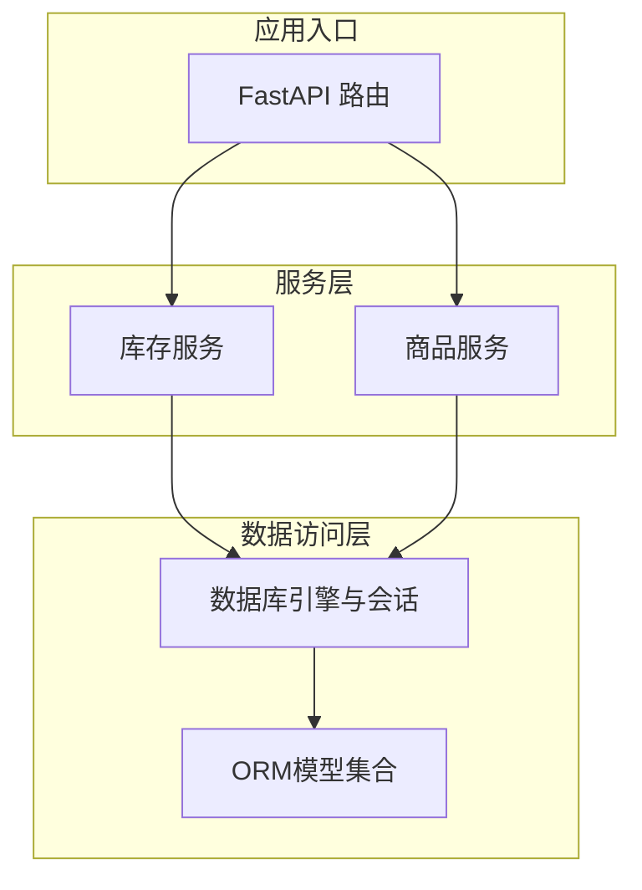
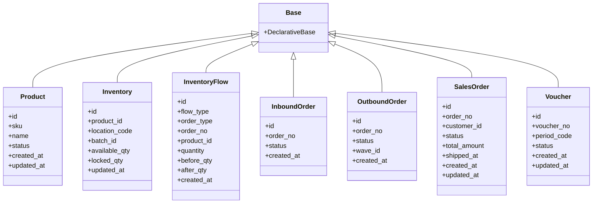
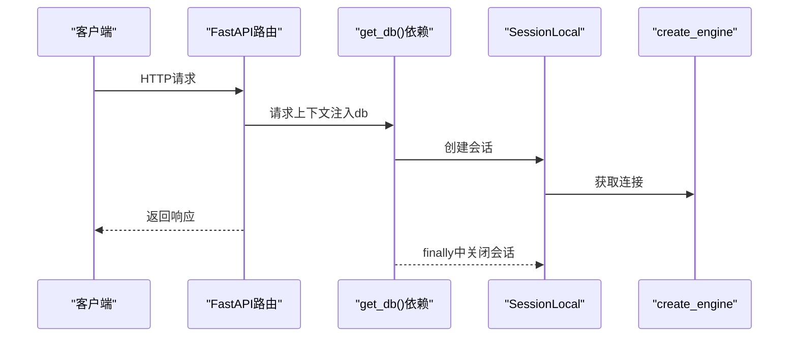
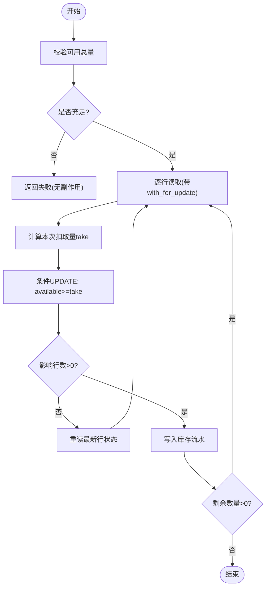
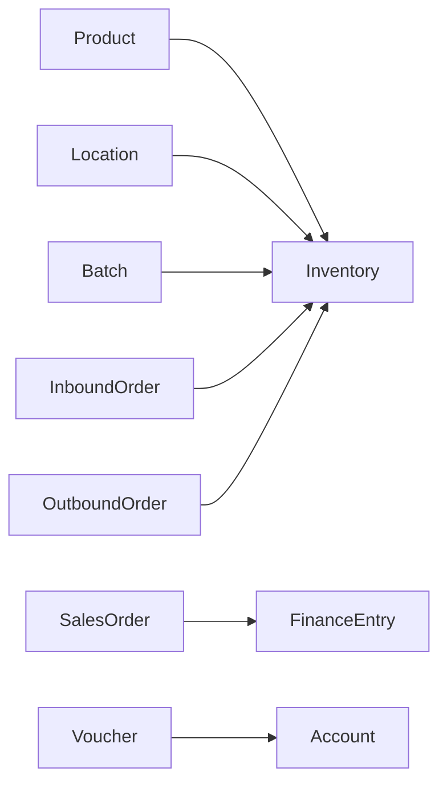

# 数据访问层设计

<cite>
**本文引用的文件列表**
- [database.py](file://backend-python/app/database.py)
- [base.py](file://backend-python/app/models/base.py)
- [inventory.py](file://backend-python/app/models/inventory.py)
- [orders.py](file://backend-python/app/models/orders.py)
- [finance.py](file://backend-python/app/models/finance.py)
- [accounting.py](file://backend-python/app/models/accounting.py)
- [auth.py](file://backend-python/app/models/auth.py)
- [__init__.py](file://backend-python/app/models/__init__.py)
- [inventory_service.py](file://backend-python/app/services/inventory_service.py)
- [product_service.py](file://backend-python/app/services/product_service.py)
</cite>

## 目录
1. [引言](#引言)
2. [项目结构](#项目结构)
3. [核心组件](#核心组件)
4. [架构总览](#架构总览)
5. [详细组件分析](#详细组件分析)
6. [依赖关系分析](#依赖关系分析)
7. [性能与查询优化](#性能与查询优化)
8. [事务与会话管理](#事务与会话管理)
9. [索引、约束与完整性](#索引约束与完整性)
10. [多数据库适配](#多数据库适配)
11. [复杂查询与批量操作示例](#复杂查询与批量操作示例)
12. [故障排查指南](#故障排查指南)
13. [结论](#结论)

## 引言
本设计文档面向WMS系统的数据访问层，聚焦SQLAlchemy ORM模型的设计模式、表结构与关系映射、查询优化策略、数据库连接与会话生命周期、事务控制机制、数据模型继承体系与通用字段处理、索引与约束设计、数据完整性保证，以及多数据库适配方案。文档同时提供复杂查询、批量操作与数据迁移的实现思路，帮助读者在生产环境中正确、高效地使用数据访问层。

## 项目结构
后端采用分层架构：
- 数据访问层：SQLAlchemy ORM模型定义于 app/models，统一基类与引擎会话在 app/database.py。
- 服务层：业务逻辑封装于 app/services，调用ORM进行读写，并保证库存流水一致性。
- 路由层：FastAPI路由（app/routers）通过依赖注入获取数据库会话，调用服务层完成业务。

图表来源
- [database.py:1-38](file://backend-python/app/database.py#L1-L38)
- [inventory_service.py:1-200](file://backend-python/app/services/inventory_service.py#L1-L200)
- [product_service.py:1-69](file://backend-python/app/services/product_service.py#L1-L69)

章节来源
- [database.py:1-38](file://backend-python/app/database.py#L1-L38)
- [__init__.py:1-78](file://backend-python/app/models/__init__.py#L1-L78)

## 核心组件
- 数据库连接与会话：engine、SessionLocal、Base、get_db依赖。
- 基础模型：Product、Customer、Warehouse、Zone、Location等实体。
- 库存域：Batch、Inventory、InventoryFlow，实现可用量与锁定量分离及全量流水。
- 单据域：入库/出库/退货/移库/调整/盘点/波次/拣货单及其明细。
- 业财域：销售订单、财务流水、核销明细。
- 会计内核：科目表、凭证、分录、期间。
- 认证域：用户与令牌。

章节来源
- [database.py:1-38](file://backend-python/app/database.py#L1-L38)
- [base.py:14-95](file://backend-python/app/models/base.py#L14-L95)
- [inventory.py:18-98](file://backend-python/app/models/inventory.py#L18-L98)
- [orders.py:17-300](file://backend-python/app/models/orders.py#L17-L300)
- [finance.py:26-117](file://backend-python/app/models/finance.py#L26-L117)
- [accounting.py:63-159](file://backend-python/app/models/accounting.py#L63-L159)
- [auth.py:19-40](file://backend-python/app/models/auth.py#L19-L40)

## 架构总览
数据访问层以SQLAlchemy为核心，通过统一的Base声明式基类组织所有模型；通过engine与sessionmaker管理连接池与会话；服务层封装业务规则与并发安全策略（如条件更新、行锁、流水记录）。

图表来源
- [database.py:27-28](file://backend-python/app/database.py#L27-L28)
- [base.py:14-95](file://backend-python/app/models/base.py#L14-L95)
- [inventory.py:18-98](file://backend-python/app/models/inventory.py#L18-L98)
- [orders.py:17-300](file://backend-python/app/models/orders.py#L17-L300)
- [finance.py:26-117](file://backend-python/app/models/finance.py#L26-L117)
- [accounting.py:108-159](file://backend-python/app/models/accounting.py#L108-L159)

## 详细组件分析

### 数据库连接与会话管理
- 引擎创建：根据环境变量DATABASE_URL选择MySQL/PostgreSQL或SQLite；SQLite设置check_same_thread=False以支持多线程。
- 会话工厂：autocommit=False, autoflush=False，避免自动提交与刷新带来的副作用。
- FastAPI依赖：get_db提供请求级会话，确保请求结束后关闭会话，防止连接泄漏。

图表来源
- [database.py:1-38](file://backend-python/app/database.py#L1-L38)

章节来源
- [database.py:1-38](file://backend-python/app/database.py#L1-L38)

### 基础模型与通用字段
- 基类：所有模型继承自Base（DeclarativeBase），统一管理元数据。
- 通用字段：id主键、created_at/updated_at时间戳、status状态字段、软删除策略（如产品INACTIVE）。
- 关系映射：使用relationship建立一对多、多对一关联，配合cascade="all, delete-orphan"维护级联删除。

章节来源
- [base.py:14-95](file://backend-python/app/models/base.py#L14-L95)
- [orders.py:17-300](file://backend-python/app/models/orders.py#L17-L300)

### 库存域模型与流水机制
- Batch：批次维度，支持有效期管理。
- Inventory：按(product_id, location_code, batch_id)唯一，分离available与locked，保障拣货锁定与发货扣减的原子性。
- InventoryFlow：全量可追溯，记录每次变动的flow_type、order_type、order_no、前后数量等。

图表来源
- [inventory_service.py:91-144](file://backend-python/app/services/inventory_service.py#L91-L144)

章节来源
- [inventory.py:18-98](file://backend-python/app/models/inventory.py#L18-L98)
- [inventory_service.py:1-200](file://backend-python/app/services/inventory_service.py#L1-L200)

### 单据域模型与状态机
- 入库单：PENDING → COMPLETED，收货后回填批次并增加库存。
- 出库单：PENDING → PICKED → SHIPPED，拣货锁定与发货扣减分步执行。
- 波次：聚合多个出库单生成拣货任务。
- 退货单：PENDING → RECEIVED → DONE，按处置策略处理库存。
- 移库/调整：直接完成，写双向流水。
- 盘点：快照账面库存，差异自动生成调整单并写流水。

章节来源
- [orders.py:17-300](file://backend-python/app/models/orders.py#L17-L300)

### 业财与会计内核
- 销售订单：DRAFT → CONFIRMED → SHIPPED → COMPLETED/CANCELLED，金额与发货时间留痕。
- 财务流水：应收/应付/收款/付款，已核销金额与未核销余额分离，幂等兜底。
- 核销明细：支持部分核销与多次核销。
- 会计科目：树状COA，辅助核算维度。
- 凭证：状态机DRAFT → POSTED → REVERSED，红字冲销双向关联。
- 期间：自然月OPEN/CLOSED，关闭期间拒绝写入。

章节来源
- [finance.py:26-117](file://backend-python/app/models/finance.py#L26-L117)
- [accounting.py:63-159](file://backend-python/app/models/accounting.py#L63-L159)

### 认证域模型
- User：角色与状态管理，支持软禁用。
- AuthToken：登录令牌，支持过期与撤销。

章节来源
- [auth.py:19-40](file://backend-python/app/models/auth.py#L19-L40)

## 依赖关系分析
- 模型间依赖：Inventory依赖Product、Location、Batch；单据依赖Product、Customer、Warehouse等主数据。
- 服务层依赖：库存服务依赖Inventory、InventoryFlow、Location、Product；商品服务依赖Product。
- 模块解耦：通过app/models/__init__.py集中导出模型，便于服务层按需导入。

图表来源
- [inventory.py:18-98](file://backend-python/app/models/inventory.py#L18-L98)
- [orders.py:17-300](file://backend-python/app/models/orders.py#L17-L300)
- [finance.py:26-117](file://backend-python/app/models/finance.py#L26-L117)
- [accounting.py:63-159](file://backend-python/app/models/accounting.py#L63-L159)

章节来源
- [__init__.py:1-78](file://backend-python/app/models/__init__.py#L1-L78)

## 性能与查询优化
- 索引设计：
  - 库存表：按location_code、product_id建索引，减少扫描范围。
  - 流水表：按order_no、product_id、created_at建索引，提升溯源与报表查询效率。
  - 销售订单：按status建索引，加速状态筛选。
  - 财务流水：按partner_name、entry_type建索引，提升往来对账查询性能。
  - 凭证：按period_code、status建复合索引，加速期间汇总。
- 查询优化：
  - 使用joinedload加载关联对象，减少N+1查询。
  - 分页查询使用offset/limit，结合排序字段提升稳定性。
  - 批量操作优先使用bulk insert/update，减少往返开销。
- 并发安全：
  - 条件更新（available >= take）防止覆盖提交。
  - with_for_update在PostgreSQL下加行锁，SQLite忽略但兼容。

章节来源
- [inventory.py:33-61](file://backend-python/app/models/inventory.py#L33-L61)
- [inventory.py:63-98](file://backend-python/app/models/inventory.py#L63-L98)
- [finance.py:26-117](file://backend-python/app/models/finance.py#L26-L117)
- [accounting.py:108-159](file://backend-python/app/models/accounting.py#L108-L159)
- [inventory_service.py:91-200](file://backend-python/app/services/inventory_service.py#L91-L200)

## 事务与会话管理
- 会话生命周期：每个HTTP请求通过get_db创建独立会话，请求结束时关闭，避免连接泄漏。
- 事务边界：服务层方法应在上层事务中调用（如路由层或编排器开启事务），确保多表操作的原子性。
- 提交策略：服务层不主动commit，由调用方控制提交时机，便于回滚与重试。

章节来源
- [database.py:31-38](file://backend-python/app/database.py#L31-L38)
- [inventory_service.py:1-10](file://backend-python/app/services/inventory_service.py#L1-L10)

## 索引、约束与完整性
- 唯一约束：
  - 商品SKU唯一。
  - 库存行(product_id, location_code, batch_id)唯一。
  - 财务流水(source_order_no, entry_type)唯一，作为幂等兜底。
  - 凭证分录(voucher_id, seq)唯一，保证分录顺序。
- 外键约束：
  - 库存行关联产品、库位、批次。
  - 单据关联主数据（产品、客户、仓库等）。
- 数据完整性：
  - 软删除策略（如产品INACTIVE）保留历史可追溯。
  - 状态机约束（字符串枚举）限制状态流转。
  - 金额字段在服务层round到两位小数，避免精度问题。

章节来源
- [base.py:22-35](file://backend-python/app/models/base.py#L22-L35)
- [inventory.py:33-61](file://backend-python/app/models/inventory.py#L33-L61)
- [finance.py:71-117](file://backend-python/app/models/finance.py#L71-L117)
- [accounting.py:138-159](file://backend-python/app/models/accounting.py#L138-L159)

## 多数据库适配
- 默认SQLite：本地开发零配置，适合快速验证。
- 生产环境切换：设置DATABASE_URL为mysql+pymysql或postgresql+psycopg2等驱动URL，无需修改代码。
- 连接参数：SQLite需check_same_thread=False；其他数据库按驱动要求配置。

章节来源
- [database.py:5-22](file://backend-python/app/database.py#L5-L22)

## 复杂查询与批量操作示例
以下为常见模式的实现思路与参考路径（不包含具体代码内容）：
- 复杂查询：
  - 库存汇总：按product_id、location_code分组求和available与locked，结合索引提升性能。
    - 参考路径：[inventory_service.py:101-109](file://backend-python/app/services/inventory_service.py#L101-L109)
  - 分页搜索：按关键字模糊匹配产品名称与SKU，结合排序与分页。
    - 参考路径：[product_service.py:9-22](file://backend-python/app/services/product_service.py#L9-L22)
- 批量操作：
  - 批量入库：循环创建Batch与Inventory，批量写入InventoryFlow，最后统一提交。
    - 参考路径：[inventory_service.py:75-88](file://backend-python/app/services/inventory_service.py#L75-L88)
  - 批量扣减：跨批次逐行扣减，条件更新防并发冲突，每行写流水。
    - 参考路径：[inventory_service.py:91-144](file://backend-python/app/services/inventory_service.py#L91-L144)
- 数据迁移：
  - 新增字段：在模型中添加Column，运行Alembic生成迁移脚本，评估影响范围与兼容性。
  - 新增索引：在模型__table_args__中添加Index，生成迁移脚本并在生产低峰期执行。
  - 数据修复：编写一次性脚本，基于现有数据修正不一致状态，完成后清理。

章节来源
- [inventory_service.py:75-144](file://backend-python/app/services/inventory_service.py#L75-L144)
- [product_service.py:9-22](file://backend-python/app/services/product_service.py#L9-L22)

## 故障排查指南
- 库存不足：
  - 现象：扣减或锁定返回False。
  - 排查：检查可用总量SUM与逐行条件更新结果，确认是否存在并发竞争。
  - 参考路径：[inventory_service.py:91-144](file://backend-python/app/services/inventory_service.py#L91-L144)
- 重复流水：
  - 现象：同一订单号出现重复流水。
  - 排查：检查调用方事务边界与幂等逻辑，确认是否重复提交。
  - 参考路径：[inventory_service.py:57-73](file://backend-python/app/services/inventory_service.py#L57-L73)
- 会话泄漏：
  - 现象：连接数持续增长。
  - 排查：确认get_db依赖是否正确注入，finally块是否执行关闭。
  - 参考路径：[database.py:31-38](file://backend-python/app/database.py#L31-L38)
- 性能瓶颈：
  - 现象：慢查询或高CPU。
  - 排查：检查缺失索引、N+1查询、大表全表扫描，必要时添加索引或改写查询。
  - 参考路径：[inventory.py:40-48](file://backend-python/app/models/inventory.py#L40-L48)

章节来源
- [inventory_service.py:57-144](file://backend-python/app/services/inventory_service.py#L57-L144)
- [database.py:31-38](file://backend-python/app/database.py#L31-L38)
- [inventory.py:40-48](file://backend-python/app/models/inventory.py#L40-L48)

## 结论
本数据访问层以SQLAlchemy为核心，通过清晰的模型分层、严格的约束与索引设计、完善的事务与会话管理，实现了高内聚、低耦合的数据访问能力。库存域采用可用量与锁定量分离、全量流水与并发安全策略，保障了WMS核心业务的准确性与可追溯性。通过环境变量切换数据库驱动，系统具备良好的多数据库适配能力。建议在生产环境中结合监控与慢查询日志持续优化性能，并遵循事务边界与幂等设计原则，确保系统稳定可靠。