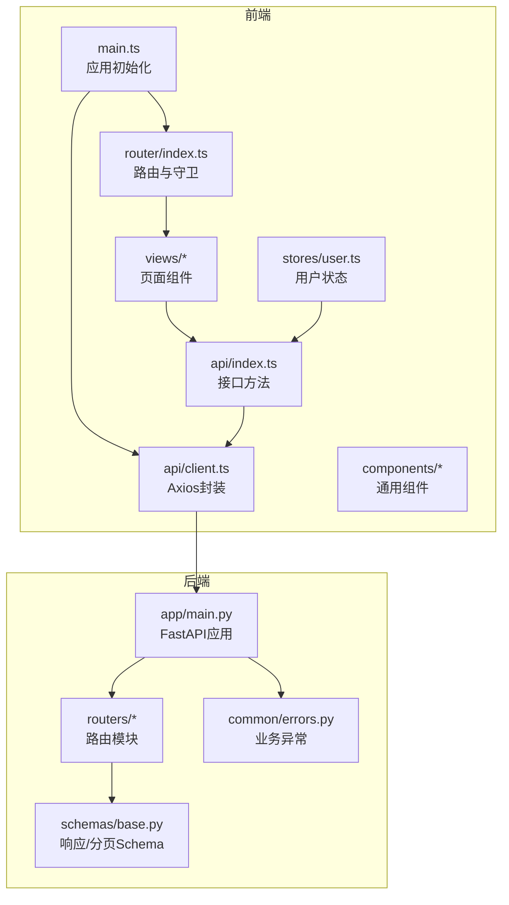
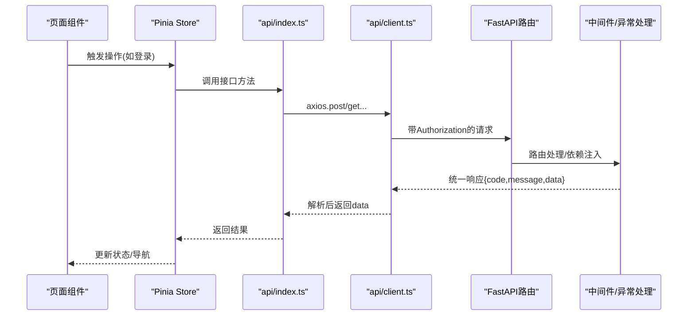
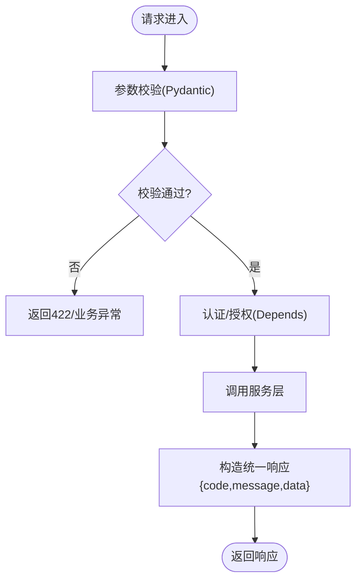
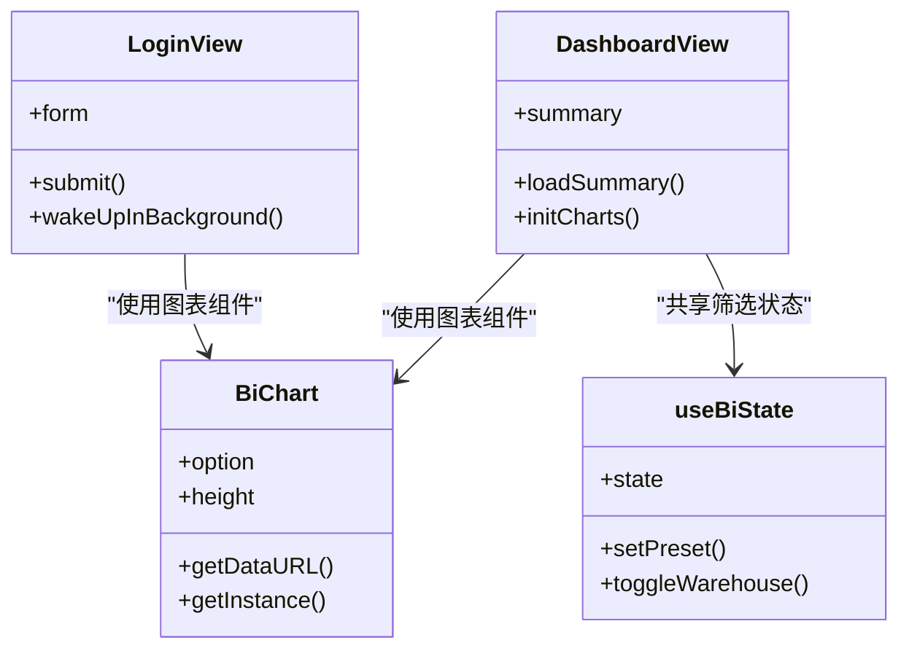
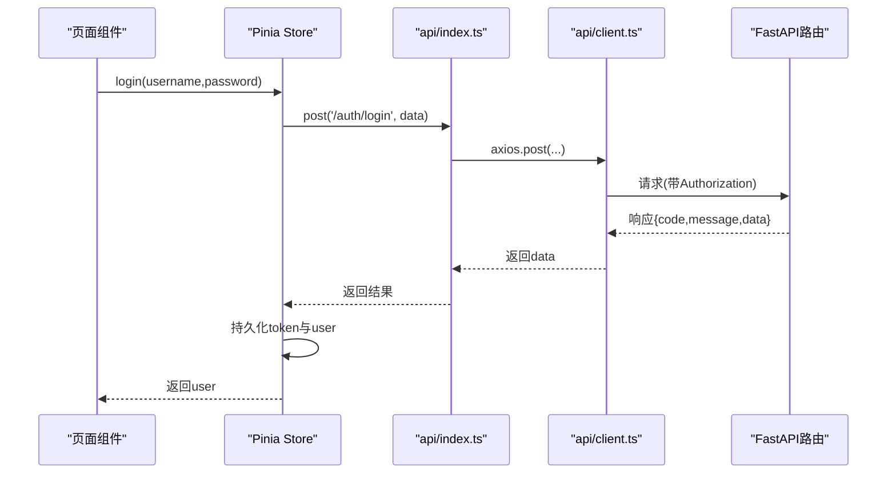
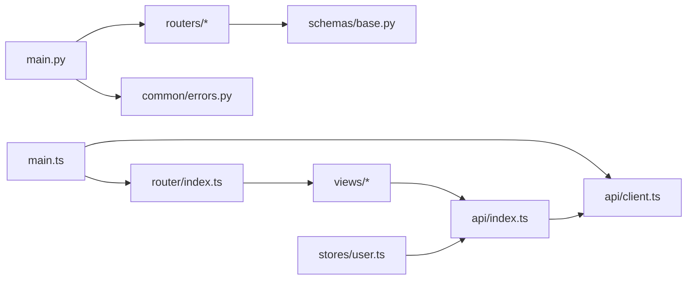

# 表现层设计

<cite>
**本文引用的文件**
- [backend-python/app/main.py](file://backend-python/app/main.py)
- [backend-python/app/routers/auth.py](file://backend-python/app/routers/auth.py)
- [backend-python/app/routers/products.py](file://backend-python/app/routers/products.py)
- [backend-python/app/schemas/base.py](file://backend-python/app/schemas/base.py)
- [backend-python/app/common/errors.py](file://backend-python/app/common/errors.py)
- [frontend-vue/src/main.ts](file://frontend-vue/src/main.ts)
- [frontend-vue/src/router/index.ts](file://frontend-vue/src/router/index.ts)
- [frontend-vue/src/api/client.ts](file://frontend-vue/src/api/client.ts)
- [frontend-vue/src/api/index.ts](file://frontend-vue/src/api/index.ts)
- [frontend-vue/src/stores/user.ts](file://frontend-vue/src/stores/user.ts)
- [frontend-vue/src/views/LoginView.vue](file://frontend-vue/src/views/LoginView.vue)
- [frontend-vue/src/components/BiChart.vue](file://frontend-vue/src/components/BiChart.vue)
- [frontend-vue/src/composables/useBiState.ts](file://frontend-vue/src/composables/useBiState.ts)
</cite>

## 目录
1. [引言](#引言)
2. [项目结构](#项目结构)
3. [核心组件](#核心组件)
4. [架构总览](#架构总览)
5. [详细组件分析](#详细组件分析)
6. [依赖关系分析](#依赖关系分析)
7. [性能考量](#性能考量)
8. [故障排查指南](#故障排查指南)
9. [结论](#结论)

## 引言
本设计文档聚焦WMS系统的前后端表现层：后端基于FastAPI的RESTful路由组织、请求参数校验与统一响应格式；前端基于Vue 3 + Pinia + Element Plus，划分页面组件（views）与通用组件（components），并通过统一的API客户端封装、状态管理与错误处理机制实现前后端数据交互。文档同时说明中间件的使用场景与实现方式，并给出具体代码路径示例，便于快速定位最佳实践。

## 项目结构
- 后端（Python/FastAPI）
  - 应用入口与生命周期：[backend-python/app/main.py](file://backend-python/app/main.py)
  - 路由模块：按业务域拆分，如鉴权、商品、库存、出入库、财务等
  - 数据模型与Schema：Pydantic定义输入输出，统一驼峰序列化
  - 异常与错误：统一业务异常类型与全局处理器
- 前端（Vue 3）
  - 应用初始化与插件注册：[frontend-vue/src/main.ts](file://frontend-vue/src/main.ts)
  - 路由与守卫：[frontend-vue/src/router/index.ts](file://frontend-vue/src/router/index.ts)
  - API客户端与接口封装：[frontend-vue/src/api/client.ts](file://frontend-vue/src/api/client.ts)、[frontend-vue/src/api/index.ts](file://frontend-vue/src/api/index.ts)
  - 状态管理：用户态Pinia Store：[frontend-vue/src/stores/user.ts](file://frontend-vue/src/stores/user.ts)
  - 页面组件：登录、看板及各业务视图
  - 通用组件：图表容器、模态框、汇总卡片等
  - 组合式函数：BI工作台筛选状态共享

**图示来源**
- [backend-python/app/main.py:27-69](file://backend-python/app/main.py#L27-L69)
- [frontend-vue/src/main.ts:10-18](file://frontend-vue/src/main.ts#L10-L18)
- [frontend-vue/src/router/index.ts:3-29](file://frontend-vue/src/router/index.ts#L3-L29)
- [frontend-vue/src/api/client.ts:4-16](file://frontend-vue/src/api/client.ts#L4-L16)
- [frontend-vue/src/api/index.ts:40-52](file://frontend-vue/src/api/index.ts#L40-L52)
- [frontend-vue/src/stores/user.ts:12-48](file://frontend-vue/src/stores/user.ts#L12-L48)

**章节来源**
- [backend-python/app/main.py:27-84](file://backend-python/app/main.py#L27-L84)
- [frontend-vue/src/main.ts:1-18](file://frontend-vue/src/main.ts#L1-L18)
- [frontend-vue/src/router/index.ts:1-48](file://frontend-vue/src/router/index.ts#L1-L48)

## 核心组件
- FastAPI应用与中间件
  - 应用启动时创建数据库表并初始化数据；注册CORS中间件；集中注册各业务路由；提供健康检查端点。
  - 参考：[backend-python/app/main.py:16-84](file://backend-python/app/main.py#L16-L84)
- 统一响应与分页
  - 使用Pydantic基类统一驼峰序列化；ApiResponse与PageResult作为标准返回结构。
  - 参考：[backend-python/app/schemas/base.py:11-35](file://backend-python/app/schemas/base.py#L11-L35)
- 统一错误处理
  - BusinessError携带HTTP状态码，由全局异常处理器转换为统一JSON响应体。
  - 参考：[backend-python/app/common/errors.py:4-9](file://backend-python/app/common/errors.py#L4-L9)、[backend-python/app/main.py:35-41](file://backend-python/app/main.py#L35-L41)
- 前端API客户端
  - Axios实例配置baseURL、超时、请求拦截器自动附加Authorization头；响应拦截器统一提取data并在401时清理登录态跳转登录页；支持Mock模式。
  - 参考：[frontend-vue/src/api/client.ts:4-44](file://frontend-vue/src/api/client.ts#L4-L44)
- 前端路由与守卫
  - Hash历史模式；集中定义页面路由；beforeEach进行登录态与管理员权限校验。
  - 参考：[frontend-vue/src/router/index.ts:1-48](file://frontend-vue/src/router/index.ts#L1-L48)
- 用户状态管理
  - Pinia store持久化token与用户信息；提供登录、获取当前用户、登出等操作。
  - 参考：[frontend-vue/src/stores/user.ts:1-49](file://frontend-vue/src/stores/user.ts#L1-L49)

**章节来源**
- [backend-python/app/main.py:16-84](file://backend-python/app/main.py#L16-L84)
- [backend-python/app/schemas/base.py:11-35](file://backend-python/app/schemas/base.py#L11-L35)
- [backend-python/app/common/errors.py:4-9](file://backend-python/app/common/errors.py#L4-L9)
- [frontend-vue/src/api/client.ts:4-44](file://frontend-vue/src/api/client.ts#L4-L44)
- [frontend-vue/src/router/index.ts:1-48](file://frontend-vue/src/router/index.ts#L1-L48)
- [frontend-vue/src/stores/user.ts:1-49](file://frontend-vue/src/stores/user.ts#L1-L49)

## 架构总览
前后端通过RESTful API交互：前端页面组件调用api/index.ts中的方法，经由client.ts的Axios实例发送请求；后端FastAPI路由接收请求，调用服务层处理业务，返回统一ApiResponse结构；全局异常处理器将业务异常转为标准错误响应。

**图示来源**
- [frontend-vue/src/stores/user.ts:22-35](file://frontend-vue/src/stores/user.ts#L22-L35)
- [frontend-vue/src/api/index.ts:459-476](file://frontend-vue/src/api/index.ts#L459-L476)
- [frontend-vue/src/api/client.ts:18-41](file://frontend-vue/src/api/client.ts#L18-L41)
- [backend-python/app/routers/auth.py:15-32](file://backend-python/app/routers/auth.py#L15-L32)
- [backend-python/app/main.py:35-41](file://backend-python/app/main.py#L35-L41)

## 详细组件分析

### FastAPI路由层设计模式
- RESTful端点组织
  - 按业务域拆分为独立Router，统一前缀与tags；在应用入口集中include_router注册。
  - 示例：鉴权路由包含登录、登出、当前用户、用户管理等；商品路由提供CRUD。
  - 参考：[backend-python/app/routers/auth.py:15-67](file://backend-python/app/routers/auth.py#L15-L67)、[backend-python/app/routers/products.py:10-46](file://backend-python/app/routers/products.py#L10-L46)、[backend-python/app/main.py:53-69](file://backend-python/app/main.py#L53-L69)
- 请求参数验证
  - 使用Pydantic Schema对请求体进行强类型校验；Query参数使用默认值与约束（ge、le、alias）。
  - 参考：[backend-python/app/routers/auth.py:36-44](file://backend-python/app/routers/auth.py#L36-L44)、[backend-python/app/schemas/base.py:39-77](file://backend-python/app/schemas/base.py#L39-L77)
- 响应格式标准化
  - 所有成功响应统一为{code, message, data}；分页使用PageResult；响应模型使用CamelModel保证字段命名一致。
  - 参考：[backend-python/app/schemas/base.py:24-35](file://backend-python/app/schemas/base.py#L24-L35)、[backend-python/app/routers/products.py:13-21](file://backend-python/app/routers/products.py#L13-L21)
- 认证与授权
  - 通过Depends注入当前用户；部分路由依赖require_admin限制管理员访问。
  - 参考：[backend-python/app/routers/auth.py:36-44](file://backend-python/app/routers/auth.py#L36-L44)

**图示来源**
- [backend-python/app/routers/auth.py:15-32](file://backend-python/app/routers/auth.py#L15-L32)
- [backend-python/app/routers/products.py:13-21](file://backend-python/app/routers/products.py#L13-L21)
- [backend-python/app/schemas/base.py:24-35](file://backend-python/app/schemas/base.py#L24-L35)

**章节来源**
- [backend-python/app/routers/auth.py:15-67](file://backend-python/app/routers/auth.py#L15-L67)
- [backend-python/app/routers/products.py:10-46](file://backend-python/app/routers/products.py#L10-L46)
- [backend-python/app/schemas/base.py:11-35](file://backend-python/app/schemas/base.py#L11-L35)

### 前端Vue组件架构
- 页面组件（views）职责
  - 负责业务页面的展示与交互，调用api/index.ts中的接口方法，结合Pinia Store管理本地状态。
  - 示例：登录页处理表单校验、服务预热、登录流程与错误提示；看板页加载统计数据与图表。
  - 参考：[frontend-vue/src/views/LoginView.vue:150-185](file://frontend-vue/src/views/LoginView.vue#L150-L185)、[frontend-vue/src/views/DashboardView.vue:140-152](file://frontend-vue/src/views/DashboardView.vue#L140-L152)
- 通用组件（components）职责
  - 提供可复用的UI能力，如ECharts容器组件封装初始化、监听resize、暴露导出图片等方法。
  - 参考：[frontend-vue/src/components/BiChart.vue:23-49](file://frontend-vue/src/components/BiChart.vue#L23-L49)
- 组合式函数（composables）
  - 跨页面共享状态与逻辑，如BI工作台的筛选状态与面板切换。
  - 参考：[frontend-vue/src/composables/useBiState.ts:22-58](file://frontend-vue/src/composables/useBiState.ts#L22-L58)

**图示来源**
- [frontend-vue/src/views/LoginView.vue:150-185](file://frontend-vue/src/views/LoginView.vue#L150-L185)
- [frontend-vue/src/views/DashboardView.vue:140-152](file://frontend-vue/src/views/DashboardView.vue#L140-L152)
- [frontend-vue/src/components/BiChart.vue:23-49](file://frontend-vue/src/components/BiChart.vue#L23-L49)
- [frontend-vue/src/composables/useBiState.ts:22-58](file://frontend-vue/src/composables/useBiState.ts#L22-L58)

**章节来源**
- [frontend-vue/src/views/LoginView.vue:150-185](file://frontend-vue/src/views/LoginView.vue#L150-L185)
- [frontend-vue/src/views/DashboardView.vue:140-152](file://frontend-vue/src/views/DashboardView.vue#L140-L152)
- [frontend-vue/src/components/BiChart.vue:1-59](file://frontend-vue/src/components/BiChart.vue#L1-L59)
- [frontend-vue/src/composables/useBiState.ts:1-60](file://frontend-vue/src/composables/useBiState.ts#L1-L60)

### 前后端数据交互模式
- API调用封装
  - api/index.ts按业务域导出接口方法，统一请求路径与类型定义；client.ts提供Axios实例与拦截器。
  - 参考：[frontend-vue/src/api/index.ts:40-52](file://frontend-vue/src/api/index.ts#L40-L52)、[frontend-vue/src/api/client.ts:4-44](file://frontend-vue/src/api/client.ts#L4-L44)
- 状态管理集成
  - Pinia Store集中管理用户态，封装登录、获取当前用户、登出等操作，并与localStorage持久化。
  - 参考：[frontend-vue/src/stores/user.ts:22-48](file://frontend-vue/src/stores/user.ts#L22-L48)
- 错误处理机制
  - 前端响应拦截器统一处理401并跳转登录；页面级捕获接口失败并降级到Mock或友好提示。
  - 参考：[frontend-vue/src/api/client.ts:27-41](file://frontend-vue/src/api/client.ts#L27-L41)、[frontend-vue/src/views/DashboardView.vue:140-152](file://frontend-vue/src/views/DashboardView.vue#L140-L152)

**图示来源**
- [frontend-vue/src/stores/user.ts:22-35](file://frontend-vue/src/stores/user.ts#L22-L35)
- [frontend-vue/src/api/index.ts:459-476](file://frontend-vue/src/api/index.ts#L459-L476)
- [frontend-vue/src/api/client.ts:18-41](file://frontend-vue/src/api/client.ts#L18-L41)
- [backend-python/app/routers/auth.py:15-32](file://backend-python/app/routers/auth.py#L15-L32)

**章节来源**
- [frontend-vue/src/api/index.ts:40-52](file://frontend-vue/src/api/index.ts#L40-L52)
- [frontend-vue/src/api/client.ts:4-44](file://frontend-vue/src/api/client.ts#L4-L44)
- [frontend-vue/src/stores/user.ts:22-48](file://frontend-vue/src/stores/user.ts#L22-L48)

### 中间件的使用场景与实现方式
- CORS中间件
  - 允许跨域请求，适用于开发环境与生产环境的前后端分离部署。
  - 参考：[backend-python/app/main.py:44-51](file://backend-python/app/main.py#L44-L51)
- 全局异常处理中间件
  - 捕获BusinessError并转换为统一JSON响应，确保错误一致性。
  - 参考：[backend-python/app/main.py:35-41](file://backend-python/app/main.py#L35-L41)
- 前端请求/响应拦截器
  - 请求拦截器自动附加Authorization头；响应拦截器统一处理错误与401跳转。
  - 参考：[frontend-vue/src/api/client.ts:18-41](file://frontend-vue/src/api/client.ts#L18-L41)

**章节来源**
- [backend-python/app/main.py:35-51](file://backend-python/app/main.py#L35-L51)
- [frontend-vue/src/api/client.ts:18-41](file://frontend-vue/src/api/client.ts#L18-L41)

## 依赖关系分析
- 后端依赖
  - main.py依赖数据库引擎、路由模块、异常处理；路由模块依赖服务层与Schema。
  - 参考：[backend-python/app/main.py:7-13](file://backend-python/app/main.py#L7-L13)
- 前端依赖
  - main.ts注册Pinia、路由、Element Plus；router/index.ts定义路由与守卫；api/client.ts封装Axios；api/index.ts定义接口方法；stores/user.ts管理用户状态。
  - 参考：[frontend-vue/src/main.ts:10-18](file://frontend-vue/src/main.ts#L10-L18)、[frontend-vue/src/router/index.ts:1-48](file://frontend-vue/src/router/index.ts#L1-L48)、[frontend-vue/src/api/client.ts:4-44](file://frontend-vue/src/api/client.ts#L4-L44)、[frontend-vue/src/api/index.ts:40-52](file://frontend-vue/src/api/index.ts#L40-L52)、[frontend-vue/src/stores/user.ts:1-49](file://frontend-vue/src/stores/user.ts#L1-L49)

**图示来源**
- [backend-python/app/main.py:7-13](file://backend-python/app/main.py#L7-L13)
- [frontend-vue/src/main.ts:10-18](file://frontend-vue/src/main.ts#L10-L18)
- [frontend-vue/src/router/index.ts:1-48](file://frontend-vue/src/router/index.ts#L1-L48)
- [frontend-vue/src/api/client.ts:4-44](file://frontend-vue/src/api/client.ts#L4-L44)
- [frontend-vue/src/api/index.ts:40-52](file://frontend-vue/src/api/index.ts#L40-L52)
- [frontend-vue/src/stores/user.ts:1-49](file://frontend-vue/src/stores/user.ts#L1-L49)

**章节来源**
- [backend-python/app/main.py:7-13](file://backend-python/app/main.py#L7-L13)
- [frontend-vue/src/main.ts:10-18](file://frontend-vue/src/main.ts#L10-L18)
- [frontend-vue/src/router/index.ts:1-48](file://frontend-vue/src/router/index.ts#L1-L48)
- [frontend-vue/src/api/client.ts:4-44](file://frontend-vue/src/api/client.ts#L4-L44)
- [frontend-vue/src/api/index.ts:40-52](file://frontend-vue/src/api/index.ts#L40-L52)
- [frontend-vue/src/stores/user.ts:1-49](file://frontend-vue/src/stores/user.ts#L1-L49)

## 性能考量
- 后端
  - 使用Pydantic Schema进行请求校验，减少无效数据处理；统一响应结构降低解析成本。
  - 健康检查端点不查库，适合冷启动预热。
  - 参考：[backend-python/app/main.py:77-84](file://backend-python/app/main.py#L77-L84)
- 前端
  - 登录页在服务冷启动期间显示进度反馈，提升用户体验；图表组件使用ResizeObserver优化渲染。
  - 参考：[frontend-vue/src/views/LoginView.vue:101-133](file://frontend-vue/src/views/LoginView.vue#L101-L133)、[frontend-vue/src/components/BiChart.vue:33-35](file://frontend-vue/src/components/BiChart.vue#L33-L35)

## 故障排查指南
- 后端异常
  - BusinessError被全局处理器捕获，返回统一错误响应；检查status与message字段定位问题。
  - 参考：[backend-python/app/common/errors.py:4-9](file://backend-python/app/common/errors.py#L4-L9)、[backend-python/app/main.py:35-41](file://backend-python/app/main.py#L35-L41)
- 前端错误
  - 401时自动清理登录态并跳转登录页；网络错误或超时显示友好提示；看板接口失败降级到Mock数据。
  - 参考：[frontend-vue/src/api/client.ts:27-41](file://frontend-vue/src/api/client.ts#L27-L41)、[frontend-vue/src/views/DashboardView.vue:140-152](file://frontend-vue/src/views/DashboardView.vue#L140-L152)

**章节来源**
- [backend-python/app/common/errors.py:4-9](file://backend-python/app/common/errors.py#L4-L9)
- [backend-python/app/main.py:35-41](file://backend-python/app/main.py#L35-L41)
- [frontend-vue/src/api/client.ts:27-41](file://frontend-vue/src/api/client.ts#L27-L41)
- [frontend-vue/src/views/DashboardView.vue:140-152](file://frontend-vue/src/views/DashboardView.vue#L140-L152)

## 结论
本表现层设计通过FastAPI的路由模块化、Pydantic参数校验与统一响应结构，结合Vue 3的页面组件、通用组件、组合式函数与Pinia状态管理，实现了清晰的前后端解耦与高效的数据交互。中间件与拦截器确保了跨域、认证与错误处理的统一性。该设计具备良好的可扩展性与可维护性，适合企业级WMS系统的持续演进。