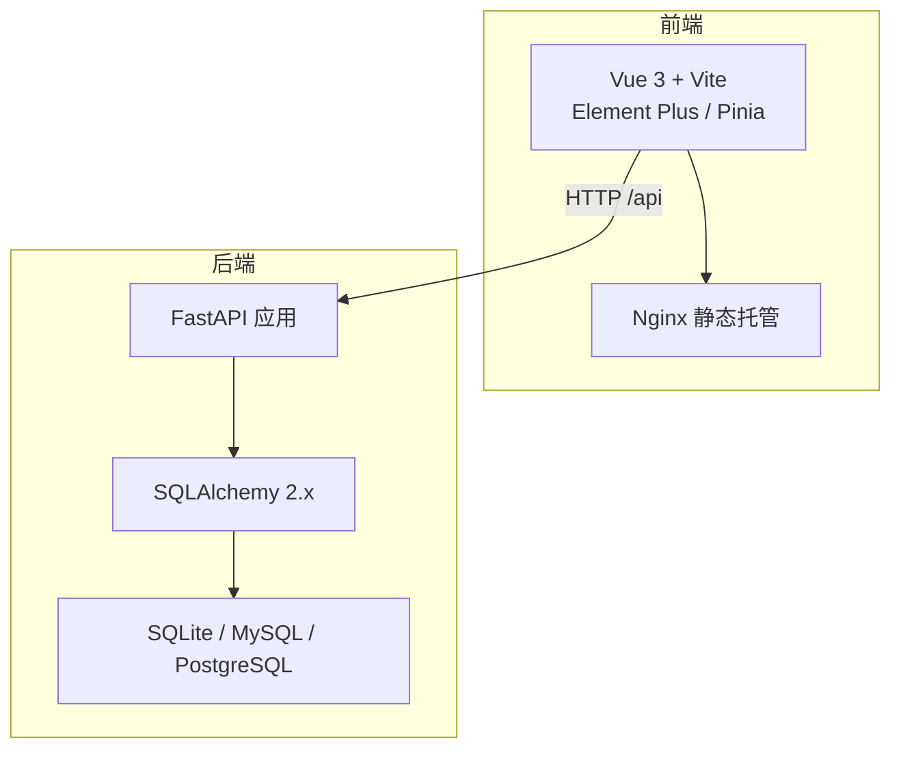
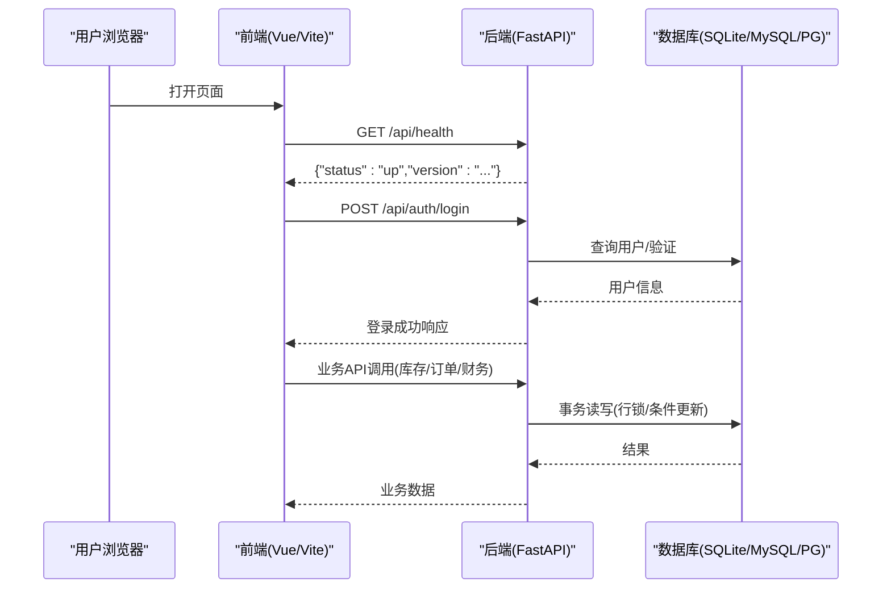
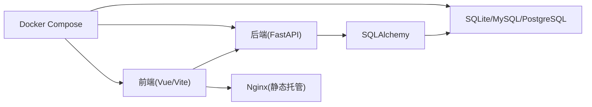

# 技术选型说明

<cite>
**本文引用的文件**
- [backend-python/pyproject.toml](file://backend-python/pyproject.toml)
- [backend-python/app/main.py](file://backend-python/app/main.py)
- [backend-python/app/database.py](file://backend-python/app/database.py)
- [backend-python/Dockerfile](file://backend-python/Dockerfile)
- [frontend-vue/package.json](file://frontend-vue/package.json)
- [frontend-vue/vite.config.ts](file://frontend-vue/vite.config.ts)
- [frontend-vue/Dockerfile](file://frontend-vue/Dockerfile)
- [docker-compose.yml](file://docker-compose.yml)
- [README.md](file://README.md)
</cite>

## 目录
1. [引言](#引言)
2. [项目结构](#项目结构)
3. [核心组件](#核心组件)
4. [架构总览](#架构总览)
5. [详细组件分析](#详细组件分析)
6. [依赖关系分析](#依赖关系分析)
7. [性能考量](#性能考量)
8. [故障排查指南](#故障排查指南)
9. [结论](#结论)
10. [附录](#附录)

## 引言
本技术选型说明面向WMS（进销存+业财一体）系统，围绕后端Python FastAPI、前端Vue 3、数据库SQLite/MySQL/PostgreSQL适配策略、第三方库选择标准、容器化部署方案以及技术风险与替代方案进行系统化阐述。文档基于仓库实际实现，提供版本兼容性与升级路径建议，帮助团队在演进过程中保持技术栈的稳定性与可维护性。

## 项目结构
- 后端：Python + FastAPI，使用SQLAlchemy ORM与Pydantic v2进行数据建模与校验；默认开发环境使用SQLite，生产可通过环境变量切换至MySQL或PostgreSQL；通过Docker镜像构建并运行。
- 前端：Vue 3 + TypeScript + Vite + Element Plus + Pinia；通过Nginx静态托管，开发时Vite代理到后端API；支持GitHub Pages纯前端Mock模式。
- 编排：Docker Compose一键启动MySQL、后端FastAPI、前端Nginx三服务；CI使用GitHub Actions执行测试与构建校验。

图表来源
- [frontend-vue/vite.config.ts:19-27](file://frontend-vue/vite.config.ts#L19-L27)
- [backend-python/app/main.py:27-69](file://backend-python/app/main.py#L27-L69)
- [backend-python/app/database.py:1-22](file://backend-python/app/database.py#L1-L22)
- [docker-compose.yml:1-46](file://docker-compose.yml#L1-L46)

章节来源
- [README.md:66-76](file://README.md#L66-L76)
- [docker-compose.yml:1-46](file://docker-compose.yml#L1-L46)

## 核心组件
- 后端入口与生命周期：FastAPI应用启动时自动建表与初始化种子数据，统一异常处理，注册各业务路由模块。
- 数据库连接与ORM：SQLAlchemy引擎根据环境变量动态选择SQLite或MySQL/PostgreSQL；提供会话工厂与依赖注入函数。
- 数据契约：Pydantic v2定义统一的camelCase输入输出模型，前后端保持一致的数据契约。
- 前端工程：Vite构建、TypeScript类型检查、Element Plus UI组件、Pinia状态管理、ECharts可视化。
- 容器化：后端基于python:3.11-slim镜像，前端基于node:20构建后由nginx:alpine托管；Compose编排三服务并设置健康检查与端口映射。

章节来源
- [backend-python/app/main.py:16-85](file://backend-python/app/main.py#L16-L85)
- [backend-python/app/database.py:1-38](file://backend-python/app/database.py#L1-L38)
- [backend-python/app/schemas/base.py:11-35](file://backend-python/app/schemas/base.py#L11-L35)
- [frontend-vue/src/main.ts:1-19](file://frontend-vue/src/main.ts#L1-L19)
- [frontend-vue/vite.config.ts:6-33](file://frontend-vue/vite.config.ts#L6-L33)
- [backend-python/Dockerfile:1-27](file://backend-python/Dockerfile#L1-L27)
- [frontend-vue/Dockerfile:1-25](file://frontend-vue/Dockerfile#L1-L25)
- [docker-compose.yml:1-46](file://docker-compose.yml#L1-L46)

## 架构总览
系统采用前后端分离架构：前端通过Vite开发服务器代理/api请求到后端；生产环境由Nginx托管静态资源并反向代理API。后端以FastAPI提供RESTful接口，使用SQLAlchemy访问数据库，支持SQLite（开发）与MySQL/PostgreSQL（生产）。通过Docker Compose将数据库、后端、前端打包为可复现的运行环境。

图表来源
- [backend-python/app/main.py:72-85](file://backend-python/app/main.py#L72-L85)
- [backend-python/app/database.py:1-38](file://backend-python/app/database.py#L1-L38)
- [frontend-vue/vite.config.ts:19-27](file://frontend-vue/vite.config.ts#L19-L27)
- [docker-compose.yml:22-42](file://docker-compose.yml#L22-L42)

## 详细组件分析

### 后端框架：Python + FastAPI
- 选择原因
  - 高性能异步I/O，适合高并发API场景；生态成熟，集成简单。
  - 自动生成OpenAPI文档，便于前后端联调与测试。
  - 与Pydantic深度集成，天然支持请求/响应数据校验与序列化。
- 版本与兼容性
  - Python >=3.11；FastAPI >=0.111.0；Uvicorn作为ASGI服务器。
  - 依赖声明位于pyproject.toml，便于依赖管理与可重现构建。
- 升级路径
  - 遵循语义化版本，优先小版本升级；关注FastAPI与SQLAlchemy主版本变更。
  - 通过CI（pytest + build）保障升级不破坏现有功能。

章节来源
- [backend-python/pyproject.toml:1-17](file://backend-python/pyproject.toml#L1-L17)
- [backend-python/app/main.py:27-69](file://backend-python/app/main.py#L27-L69)
- [backend-python/Dockerfile:1-27](file://backend-python/Dockerfile#L1-L27)

### 前端框架：Vue 3 + TypeScript + Vite + Element Plus
- 选择原因
  - Vue 3组合式API与TypeScript结合，提升可维护性与类型安全。
  - Vite提供极速开发与构建体验，插件生态丰富。
  - Element Plus提供企业级UI组件，降低界面开发成本。
  - Pinia用于轻量状态管理，契合中后台应用需求。
- 版本与兼容性
  - Vue ^3.4.0、Vue Router ^4.3.0、Element Plus ^2.7.0、Vite ^5.2.0、TypeScript ^5.4.0。
  - 构建产物由Nginx托管，支持子路径部署（如GitHub Pages）。
- 升级路径
  - 使用包管理器锁定版本（package-lock.json），逐步升级并配合vitest单测与Playwright E2E回归。
  - 关注Vite与Vue插件的兼容性矩阵，避免大版本跳跃带来的破坏性变更。

章节来源
- [frontend-vue/package.json:15-32](file://frontend-vue/package.json#L15-L32)
- [frontend-vue/vite.config.ts:6-33](file://frontend-vue/vite.config.ts#L6-L33)
- [frontend-vue/src/main.ts:1-19](file://frontend-vue/src/main.ts#L1-L19)
- [frontend-vue/Dockerfile:1-25](file://frontend-vue/Dockerfile#L1-L25)

### 数据库适配策略：SQLite / MySQL / PostgreSQL
- 设计原则
  - 开发零配置：默认SQLite，本地快速启动与调试。
  - 生产可替换：通过DATABASE_URL环境变量无缝切换至MySQL或PostgreSQL。
  - 统一ORM抽象：SQLAlchemy屏蔽底层差异，便于迁移与扩展。
- 连接与引擎
  - 根据是否设置DATABASE_URL决定使用SQLite或外部数据库；SQLite需关闭线程安全检查参数。
  - 提供SessionLocal与get_db依赖注入，确保请求级会话生命周期管理。
- 版本与兼容性
  - SQLAlchemy 2.x；MySQL驱动pymysql；PostgreSQL驱动psycopg2-binary；Alembic用于迁移。
  - Docker Compose提供MySQL 8.0实例，健康检查保证启动顺序。
- 升级路径
  - 先升级SQLAlchemy至最新稳定版，再评估驱动与方言特性变化；通过测试覆盖确保一致性。
  - 生产数据库升级前进行备份与灰度验证，关注字符集与索引优化。

章节来源
- [backend-python/app/database.py:1-38](file://backend-python/app/database.py#L1-L38)
- [backend-python/pyproject.toml:7-17](file://backend-python/pyproject.toml#L7-L17)
- [docker-compose.yml:5-20](file://docker-compose.yml#L5-L20)

### 第三方库选择标准
- SQLAlchemy ORM
  - 理由：成熟的对象关系映射，支持多数据库方言；2.x版本带来更好的类型提示与性能。
  - 标准：明确版本约束，配合Alembic进行数据库迁移管理。
- Pydantic v2
  - 理由：高性能数据校验与序列化；与FastAPI原生集成；支持别名生成（camelCase）统一前后端契约。
  - 标准：所有API入参与出参均通过Pydantic模型定义，确保类型一致与错误提示友好。
- Element Plus
  - 理由：企业级组件库，覆盖表单、表格、弹窗等常见场景；主题定制能力强。
  - 标准：按需引入图标与组件，控制包体积；与Vue 3组合式API风格一致。
- 其他关键库
  - Uvicorn：高性能ASGI服务器，适合FastAPI生产部署。
  - Axios/ECharts/Pinia/Vitest/Playwright：分别承担HTTP客户端、可视化、状态管理、单元测试与端到端测试。

章节来源
- [backend-python/pyproject.toml:7-24](file://backend-python/pyproject.toml#L7-L24)
- [backend-python/app/schemas/base.py:11-35](file://backend-python/app/schemas/base.py#L11-L35)
- [frontend-vue/package.json:15-32](file://frontend-vue/package.json#L15-L32)

### 容器化部署：Docker与Docker Compose
- 后端镜像
  - 基础镜像python:3.11-slim；安装依赖时使用国内镜像源并设置超时重试，提高构建鲁棒性。
  - 暴露8000端口，启动命令指向FastAPI应用入口。
- 前端镜像
  - 构建阶段使用node:20-alpine，修复esbuild二进制路径问题；最终使用nginx:alpine托管静态资源。
  - 暴露80端口，配置文件反代/api到后端服务。
- 编排与服务发现
  - docker-compose.yml定义mysql、backend、frontend三个服务；通过depends_on与健康检查确保启动顺序。
  - 环境变量集中管理数据库连接串与凭据，便于不同环境切换。
- 升级与回滚
  - 镜像标签化管理（如:latest或版本号），滚动更新服务；保留旧镜像以便快速回滚。
  - 数据库迁移通过Alembic在应用启动或独立任务中执行，确保Schema一致性。

章节来源
- [backend-python/Dockerfile:1-27](file://backend-python/Dockerfile#L1-L27)
- [frontend-vue/Dockerfile:1-25](file://frontend-vue/Dockerfile#L1-L25)
- [docker-compose.yml:1-46](file://docker-compose.yml#L1-L46)

### 技术风险评估与替代方案
- 风险点
  - SQLite在生产环境的并发限制与锁竞争可能成为瓶颈；需评估流量规模与写入频率。
  - 第三方依赖升级可能导致破坏性变更（如FastAPI/SQLAlchemy主版本升级）。
  - 前端构建依赖网络不稳定导致失败（已通过镜像源与重试策略缓解）。
- 替代方案
  - 后端框架：若需要更成熟的微服务治理与生态，可考虑Spring Boot（Java）；但学习成本与维护复杂度更高。
  - 前端框架：React + Ant Design可作为替代，但团队技能栈与历史资产需权衡。
  - 数据库：PostgreSQL在复杂查询与并发控制方面更强，适合高负载与复杂业务；MySQL在生态与运维经验上更普及。
  - 容器编排：Kubernetes适用于大规模集群与弹性伸缩；当前Docker Compose满足单机/小规模部署需求。

[本节为概念性分析，不直接引用具体代码文件]

## 依赖关系分析
- 后端依赖链
  - FastAPI -> Uvicorn -> SQLAlchemy -> 数据库驱动(pymysql/psycopg2)
  - Pydantic v2负责数据校验与序列化
  - Alembic负责数据库迁移
- 前端依赖链
  - Vue 3 -> Vite -> Element Plus -> Pinia -> Axios -> ECharts
  - 测试：Vitest（单元）、Playwright（E2E）
- 编排依赖
  - Compose编排MySQL、后端、前端；健康检查与端口映射确保服务间通信

图表来源
- [backend-python/pyproject.toml:7-17](file://backend-python/pyproject.toml#L7-L17)
- [frontend-vue/package.json:15-32](file://frontend-vue/package.json#L15-L32)
- [docker-compose.yml:1-46](file://docker-compose.yml#L1-L46)

章节来源
- [backend-python/pyproject.toml:7-24](file://backend-python/pyproject.toml#L7-L24)
- [frontend-vue/package.json:15-32](file://frontend-vue/package.json#L15-L32)
- [docker-compose.yml:1-46](file://docker-compose.yml#L1-L46)

## 性能考量
- 后端
  - 使用异步I/O与高效ASGI服务器（Uvicorn），适合高并发API。
  - 数据库层通过SQLAlchemy事务与行级锁（SELECT FOR UPDATE）防止超卖；条件更新与重试机制减少冲突。
  - 生产数据库建议使用连接池与合适的索引策略，关注慢查询与锁等待。
- 前端
  - Vite构建速度快，按需加载与代码分割优化首屏时间。
  - ECharts大数据量渲染需分页与虚拟滚动；图表主题与缓存策略影响性能。
- 容器
  - 镜像分层优化，利用缓存加速构建；合理设置资源限制与健康检查。

[本节为通用性能指导，不直接引用具体代码文件]

## 故障排查指南
- 后端启动失败
  - 检查DATABASE_URL是否正确；确认数据库服务已就绪且凭据无误。
  - 查看日志定位异常堆栈；确认依赖安装完整。
- 前端无法访问API
  - 开发环境确认Vite代理配置正确；生产环境检查Nginx反向代理规则。
  - 跨域问题：后端CORS已允许所有来源，必要时调整allow_origins与credentials。
- 数据库连接异常
  - 检查驱动版本与方言匹配；确认字符集与权限设置。
  - 使用健康检查与端口探测定位服务可用性。
- 构建失败
  - 网络问题：使用国内镜像源与重试策略；清理缓存后重试。
  - 依赖冲突：锁定版本并逐步升级，配合单测回归。

章节来源
- [backend-python/app/main.py:35-51](file://backend-python/app/main.py#L35-L51)
- [backend-python/app/database.py:11-22](file://backend-python/app/database.py#L11-L22)
- [frontend-vue/vite.config.ts:19-27](file://frontend-vue/vite.config.ts#L19-L27)
- [docker-compose.yml:5-20](file://docker-compose.yml#L5-L20)

## 结论
本WMS系统采用FastAPI + Vue 3的技术栈，兼顾开发效率与运行性能；通过SQLAlchemy与Pydantic实现数据建模与契约统一；容器化与编排简化了部署流程。SQLite用于开发零配置，生产可平滑切换至MySQL/PostgreSQL。建议在演进过程中持续完善测试覆盖、监控指标与性能调优，并建立依赖升级与回滚策略，确保系统长期稳定运行。

[本节为总结性内容，不直接引用具体代码文件]

## 附录
- 快速启动与环境变量
  - 使用docker-compose一键启动全栈；通过.env或环境变量配置数据库连接。
  - 前端开发时通过Vite代理访问后端API；生产由Nginx托管静态资源。
- 版本清单
  - 后端：Python 3.11+、FastAPI >=0.111.0、SQLAlchemy >=2.0.30、Pydantic >=2.7.0。
  - 前端：Vue ^3.4.0、Element Plus ^2.7.0、Vite ^5.2.0、TypeScript ^5.4.0。
  - 数据库：SQLite（开发）、MySQL 8.0（容器）、PostgreSQL（可选）。
- 参考文件
  - 后端入口与生命周期：[backend-python/app/main.py](file://backend-python/app/main.py)
  - 数据库连接与ORM：[backend-python/app/database.py](file://backend-python/app/database.py)
  - 数据契约与模型：[backend-python/app/schemas/base.py](file://backend-python/app/schemas/base.py)
  - 前端工程配置：[frontend-vue/vite.config.ts](file://frontend-vue/vite.config.ts)、[frontend-vue/package.json](file://frontend-vue/package.json)
  - 容器化与编排：[backend-python/Dockerfile](file://backend-python/Dockerfile)、[frontend-vue/Dockerfile](file://frontend-vue/Dockerfile)、[docker-compose.yml](file://docker-compose.yml)

章节来源
- [README.md:121-158](file://README.md#L121-L158)
- [backend-python/pyproject.toml:1-17](file://backend-python/pyproject.toml#L1-L17)
- [frontend-vue/package.json:15-32](file://frontend-vue/package.json#L15-L32)
- [docker-compose.yml:1-46](file://docker-compose.yml#L1-L46)