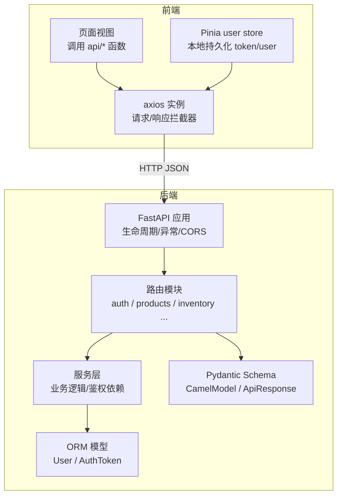
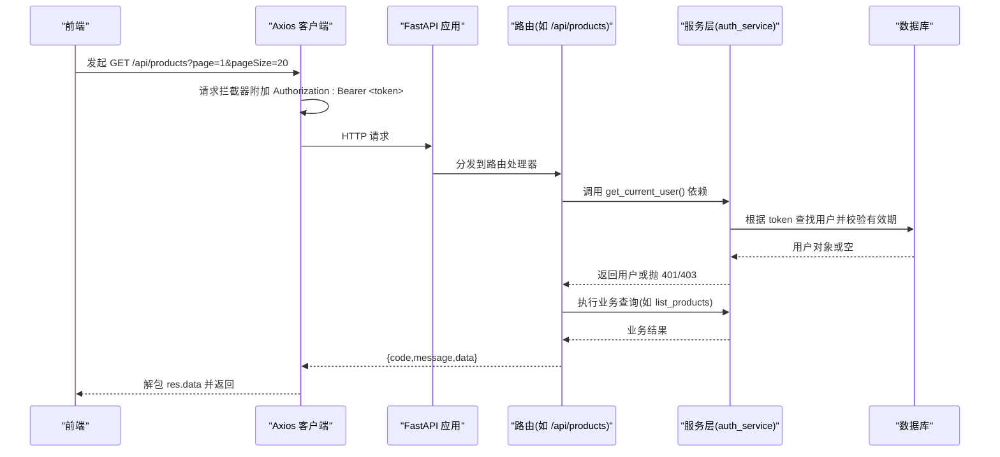
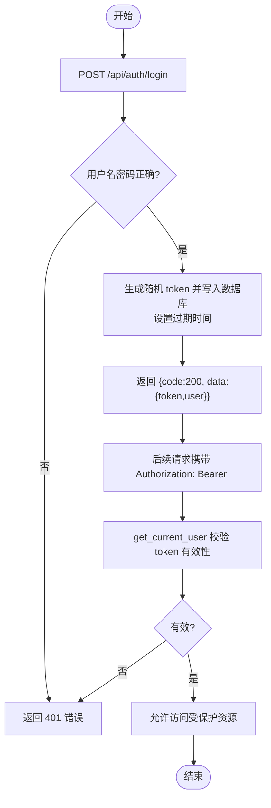
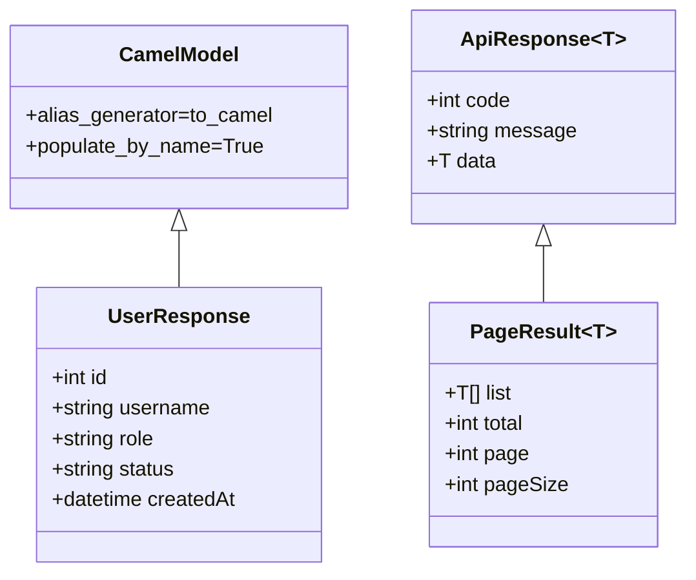
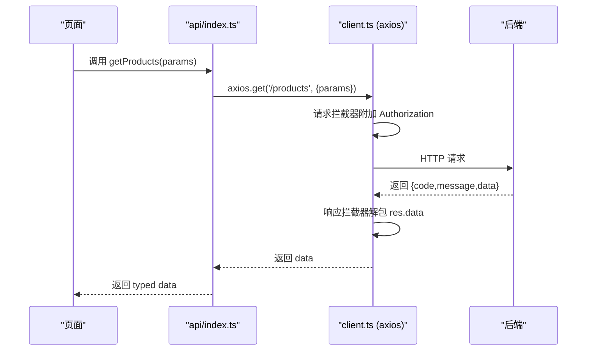
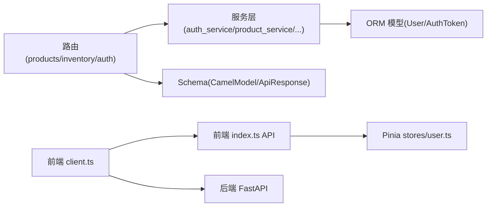

# 前后端数据交互

<cite>
**本文引用的文件**
- [backend-python/app/main.py](file://backend-python/app/main.py)
- [backend-python/app/routers/auth.py](file://backend-python/app/routers/auth.py)
- [backend-python/app/services/auth_service.py](file://backend-python/app/services/auth_service.py)
- [backend-python/app/models/auth.py](file://backend-python/app/models/auth.py)
- [backend-python/app/schemas/base.py](file://backend-python/app/schemas/base.py)
- [backend-python/app/schemas/auth.py](file://backend-python/app/schemas/auth.py)
- [backend-python/app/common/errors.py](file://backend-python/app/common/errors.py)
- [backend-python/app/routers/inventory.py](file://backend-python/app/routers/inventory.py)
- [backend-python/app/routers/products.py](file://backend-python/app/routers/products.py)
- [frontend-vue/src/api/client.ts](file://frontend-vue/src/api/client.ts)
- [frontend-vue/src/api/index.ts](file://frontend-vue/src/api/index.ts)
- [frontend-vue/src/stores/user.ts](file://frontend-vue/src/stores/user.ts)
</cite>

## 目录
1. [简介](#简介)
2. [项目结构](#项目结构)
3. [核心组件](#核心组件)
4. [架构总览](#架构总览)
5. [详细组件分析](#详细组件分析)
6. [依赖关系分析](#依赖关系分析)
7. [性能考虑](#性能考虑)
8. [故障排查指南](#故障排查指南)
9. [结论](#结论)
10. [附录：API 契约与示例](#附录api-契约与示例)

## 简介
本文件面向 WMS（进销存 + 业财一体）系统的前后端数据交互，覆盖以下主题：
- RESTful API 设计规范：HTTP 方法选择、URL 命名约定、请求/响应格式标准化
- 认证机制：JWT/令牌管理、权限验证、会话保持
- 前端 API 客户端设计模式：请求拦截器、错误处理、重试策略建议
- 数据序列化/反序列化：Pydantic 模型与 TypeScript 接口映射
- WebSocket 实时通信：当前仓库未实现，给出扩展建议
- 具体 API 调用示例：登录、商品 CRUD、库存查询等
- 性能优化建议：请求合并、缓存策略、懒加载等

## 项目结构
后端采用 FastAPI 模块化路由组织，统一通过 main.py 注册路由并配置全局异常、CORS、健康检查。认证相关逻辑集中在 auth 路由与服务层；业务模块按领域划分（产品、库存、入库、出库、波次、财务等）。前端基于 Vue + Axios，封装统一的 axios 实例、拦截器与类型化 API 函数，并通过 Pinia store 管理用户状态与令牌。

图表来源
- [backend-python/app/main.py:16-85](file://backend-python/app/main.py#L16-L85)
- [backend-python/app/routers/auth.py:1-68](file://backend-python/app/routers/auth.py#L1-L68)
- [backend-python/app/services/auth_service.py:1-176](file://backend-python/app/services/auth_service.py#L1-L176)
- [backend-python/app/models/auth.py:1-40](file://backend-python/app/models/auth.py#L1-L40)
- [backend-python/app/schemas/base.py:11-35](file://backend-python/app/schemas/base.py#L11-L35)
- [frontend-vue/src/api/client.ts:1-45](file://frontend-vue/src/api/client.ts#L1-L45)
- [frontend-vue/src/stores/user.ts:1-49](file://frontend-vue/src/stores/user.ts#L1-L49)

章节来源
- [backend-python/app/main.py:16-85](file://backend-python/app/main.py#L16-L85)
- [frontend-vue/src/api/client.ts:1-45](file://frontend-vue/src/api/client.ts#L1-L45)

## 核心组件
- 后端应用入口与中间件：统一异常处理、CORS、健康探针
- 认证路由与服务：登录/登出/当前用户、管理员权限校验、令牌存储与过期清理
- 数据模型与 Schema：用户与令牌模型、Pydantic camelCase 序列化基类、统一响应包装
- 前端 Axios 客户端：自动附加 Authorization 头、401 时清理登录态并跳转
- 前端 Store：登录/登出/获取当前用户、本地持久化 token 与用户信息

章节来源
- [backend-python/app/main.py:35-85](file://backend-python/app/main.py#L35-L85)
- [backend-python/app/routers/auth.py:14-68](file://backend-python/app/routers/auth.py#L14-L68)
- [backend-python/app/services/auth_service.py:115-176](file://backend-python/app/services/auth_service.py#L115-L176)
- [backend-python/app/models/auth.py:19-40](file://backend-python/app/models/auth.py#L19-L40)
- [backend-python/app/schemas/base.py:11-35](file://backend-python/app/schemas/base.py#L11-L35)
- [frontend-vue/src/api/client.ts:18-42](file://frontend-vue/src/api/client.ts#L18-L42)
- [frontend-vue/src/stores/user.ts:12-49](file://frontend-vue/src/stores/user.ts#L12-L49)

## 架构总览
下图展示一次受保护资源请求的完整链路：前端携带 Bearer Token 发起请求，后端路由通过依赖注入解析并校验令牌，成功则执行业务逻辑并返回统一响应体。

图表来源
- [backend-python/app/routers/products.py:10-21](file://backend-python/app/routers/products.py#L10-L21)
- [backend-python/app/services/auth_service.py:152-168](file://backend-python/app/services/auth_service.py#L152-L168)
- [frontend-vue/src/api/client.ts:18-25](file://frontend-vue/src/api/client.ts#L18-L25)

## 详细组件分析

### 认证与授权流程
- 登录：POST /api/auth/login，返回包含 token 和用户信息的 data
- 登出：POST /api/auth/logout，使当前 token 失效
- 当前用户：GET /api/auth/me，需有效 token
- 权限控制：get_current_user 依赖注入解析 Authorization 头；require_admin 限制管理员操作

图表来源
- [backend-python/app/routers/auth.py:14-33](file://backend-python/app/routers/auth.py#L14-L33)
- [backend-python/app/services/auth_service.py:115-168](file://backend-python/app/services/auth_service.py#L115-L168)

章节来源
- [backend-python/app/routers/auth.py:14-68](file://backend-python/app/routers/auth.py#L14-L68)
- [backend-python/app/services/auth_service.py:115-176](file://backend-python/app/services/auth_service.py#L115-L176)
- [backend-python/app/models/auth.py:19-40](file://backend-python/app/models/auth.py#L19-L40)

### 数据序列化与类型映射
- 后端使用 Pydantic 的 CamelModel 基类，开启 alias_generator=to_camel 与 populate_by_name=True，实现输入输出均支持 camelCase
- 统一响应体 ApiResponse(code, message, data)，分页 PageResult(list,total,page,pageSize)
- 前端在 TypeScript 中定义对应接口（如 Product、Customer、InventoryRow 等），与后端 camelCase 字段一一对应

图表来源
- [backend-python/app/schemas/base.py:11-35](file://backend-python/app/schemas/base.py#L11-L35)
- [backend-python/app/schemas/auth.py:22-37](file://backend-python/app/schemas/auth.py#L22-L37)

章节来源
- [backend-python/app/schemas/base.py:11-35](file://backend-python/app/schemas/base.py#L11-L35)
- [frontend-vue/src/api/index.ts:12-26](file://frontend-vue/src/api/index.ts#L12-L26)

### 前端 API 客户端设计
- 基础配置：baseURL 可配置（开发走 Vite 代理，生产走 nginx 反代），超时默认 10s
- 请求拦截器：从 localStorage 读取 psifin_token 并附加 Authorization: Bearer
- 响应拦截器：统一提取 res.data；遇到 401 清除本地 token 与用户信息，并跳转到登录页
- 可选 Mock：构建时注入 VITE_USE_MOCK=true 启用浏览器内 Mock 适配器

图表来源
- [frontend-vue/src/api/client.ts:1-45](file://frontend-vue/src/api/client.ts#L1-L45)
- [frontend-vue/src/api/index.ts:40-52](file://frontend-vue/src/api/index.ts#L40-L52)

章节来源
- [frontend-vue/src/api/client.ts:1-45](file://frontend-vue/src/api/client.ts#L1-L45)
- [frontend-vue/src/api/index.ts:40-52](file://frontend-vue/src/api/index.ts#L40-L52)

### 库存与商品 API 示例
- 商品列表：GET /api/products?keyword=&page=1&pageSize=20
- 商品详情：GET /api/products/{id}
- 创建商品：POST /api/products
- 更新商品：PUT /api/products/{id}
- 删除商品：DELETE /api/products/{id}
- 库存查询：GET /api/inventory?view=product|location&warehouseId=&batchNo=&page=1&pageSize=20
- 库存流水：GET /api/inventory/flows?orderNo=&productId=&locationCode=&flowType=&page=1&pageSize=20
- 批次查询：GET /api/inventory/batches?keyword=&page=1&pageSize=20

章节来源
- [backend-python/app/routers/products.py:10-47](file://backend-python/app/routers/products.py#L10-L47)
- [backend-python/app/routers/inventory.py:9-62](file://backend-python/app/routers/inventory.py#L9-L62)
- [frontend-vue/src/api/index.ts:40-52](file://frontend-vue/src/api/index.ts#L40-L52)
- [frontend-vue/src/api/index.ts:199-220](file://frontend-vue/src/api/index.ts#L199-L220)

### 用户与鉴权 API 示例
- 登录：POST /api/auth/login，请求体 {username,password}，返回 {code:200, data:{token,user}}
- 登出：POST /api/auth/logout，携带 Authorization: Bearer <token>
- 当前用户：GET /api/auth/me，返回用户信息
- 用户管理（仅 admin）：GET/POST/PUT/DELETE /api/users

章节来源
- [backend-python/app/routers/auth.py:14-68](file://backend-python/app/routers/auth.py#L14-L68)
- [frontend-vue/src/api/index.ts:459-488](file://frontend-vue/src/api/index.ts#L459-L488)

### WebSocket 实时通信
当前仓库未发现 WebSocket 服务端或前端连接实现。若需要实时推送（如库存变动通知、订单状态变更），建议：
- 后端：引入 websockets 库，提供 /ws 端点，基于 token 鉴权后建立连接，按频道/房间广播消息
- 前端：使用原生 WebSocket 或 socket.io-client，监听事件并更新 UI
- 消息格式：统一 envelope 结构 {type, payload, timestamp}，便于扩展

[本节为概念性说明，不直接分析具体代码文件]

## 依赖关系分析
- 路由依赖：所有受保护路由通过 dependencies=[Depends(get_current_user)] 强制鉴权
- 服务层：auth_service 提供登录、登出、用户 CRUD、鉴权依赖
- 模型层：User、AuthToken 用于持久化用户与令牌
- Schema 层：CamelModel 统一 camelCase 序列化；ApiResponse/PageResult 统一响应结构
- 前端：client.ts 负责网络层，index.ts 暴露类型化 API，stores/user.ts 管理登录态

图表来源
- [backend-python/app/routers/products.py:10-21](file://backend-python/app/routers/products.py#L10-L21)
- [backend-python/app/routers/inventory.py:9-31](file://backend-python/app/routers/inventory.py#L9-L31)
- [backend-python/app/services/auth_service.py:152-176](file://backend-python/app/services/auth_service.py#L152-L176)
- [backend-python/app/models/auth.py:19-40](file://backend-python/app/models/auth.py#L19-L40)
- [backend-python/app/schemas/base.py:11-35](file://backend-python/app/schemas/base.py#L11-L35)
- [frontend-vue/src/api/client.ts:1-45](file://frontend-vue/src/api/client.ts#L1-L45)
- [frontend-vue/src/api/index.ts:40-52](file://frontend-vue/src/api/index.ts#L40-L52)
- [frontend-vue/src/stores/user.ts:12-49](file://frontend-vue/src/stores/user.ts#L12-L49)

章节来源
- [backend-python/app/routers/products.py:10-47](file://backend-python/app/routers/products.py#L10-L47)
- [backend-python/app/routers/inventory.py:9-62](file://backend-python/app/routers/inventory.py#L9-L62)
- [backend-python/app/services/auth_service.py:152-176](file://backend-python/app/services/auth_service.py#L152-L176)
- [frontend-vue/src/api/client.ts:1-45](file://frontend-vue/src/api/client.ts#L1-L45)
- [frontend-vue/src/api/index.ts:40-52](file://frontend-vue/src/api/index.ts#L40-L52)
- [frontend-vue/src/stores/user.ts:12-49](file://frontend-vue/src/stores/user.ts#L12-L49)

## 性能考虑
- 请求合并：对高频且参数相近的列表查询（如库存、订单）可使用防抖/节流合并请求，减少重复网络开销
- 缓存策略：
  - 读多写少数据（如仓库、库区、商品分类）可在内存或 IndexedDB 缓存，配合版本号或时间戳失效
  - 列表数据可按资源维度做轻量级缓存，避免频繁刷新
- 懒加载：详情页、图表数据按需加载，首屏只加载必要数据
- 分页与限流：后端已支持 page/pageSize，前端合理设置 pageSize，避免一次性拉取过多数据
- 冷启动预热：登录页挂载时可静默调用 /health，降低首次请求延迟（已在前端 API 中提供 warmUpService）

[本节为通用指导，不直接分析具体代码文件]

## 故障排查指南
- 401 未登录或过期：
  - 检查前端是否携带 Authorization 头（请求拦截器会自动附加）
  - 检查本地是否保存了有效的 token（localStorage psifin_token）
  - 后端 get_current_user 会校验 token 是否存在且未过期
- 403 无权限：
  - 非管理员访问管理员接口会被拒绝（require_admin 依赖）
- 业务异常：
  - 后端 BusinessError 会被统一处理器转换为 {code,status,message,data} 响应
- 网络错误：
  - 前端响应拦截器会记录错误消息并提示，必要时可结合重试机制（指数退避）提升健壮性

章节来源
- [backend-python/app/common/errors.py:4-9](file://backend-python/app/common/errors.py#L4-L9)
- [backend-python/app/main.py:35-41](file://backend-python/app/main.py#L35-L41)
- [frontend-vue/src/api/client.ts:27-42](file://frontend-vue/src/api/client.ts#L27-L42)
- [backend-python/app/services/auth_service.py:152-176](file://backend-python/app/services/auth_service.py#L152-L176)

## 结论
本系统采用清晰的 RESTful 分层架构与统一的响应规范，前后端通过 camelCase 字段保持一致的数据契约。认证机制基于数据库存储的随机令牌，具备撤销与过期能力；前端通过拦截器与 store 实现令牌管理与状态同步。建议在后续版本中补充 WebSocket 实时通信与更完善的缓存/重试策略，以提升用户体验与系统弹性。

## 附录：API 契约与示例

### 统一响应格式
- 成功：{code: 200, message: "success", data: T}
- 失败：{code: 非2xx, message: "错误描述", data: null}
- 分页：PageResult 包含 list、total、page、pageSize

章节来源
- [backend-python/app/schemas/base.py:24-35](file://backend-python/app/schemas/base.py#L24-L35)

### 登录流程示例
- 前端调用 login({username,password})，后端返回 {token,user}
- 前端将 token 与 user 存入 localStorage，并在后续请求中自动附加 Authorization 头
- 如需预热，可先调用 warmUpService() 触发后端冷启动

章节来源
- [frontend-vue/src/api/index.ts:459-476](file://frontend-vue/src/api/index.ts#L459-L476)
- [frontend-vue/src/stores/user.ts:22-35](file://frontend-vue/src/stores/user.ts#L22-L35)
- [backend-python/app/routers/auth.py:14-33](file://backend-python/app/routers/auth.py#L14-L33)

### 商品 CRUD 示例
- 列表：GET /api/products?keyword=&page=1&pageSize=20
- 详情：GET /api/products/{id}
- 创建：POST /api/products，请求体遵循 ProductPayload
- 更新：PUT /api/products/{id}，请求体遵循 Partial<ProductPayload>
- 删除：DELETE /api/products/{id}

章节来源
- [backend-python/app/routers/products.py:10-47](file://backend-python/app/routers/products.py#L10-L47)
- [frontend-vue/src/api/index.ts:40-52](file://frontend-vue/src/api/index.ts#L40-L52)

### 库存查询示例
- 库存概览：GET /api/inventory?view=product|location&warehouseId=&batchNo=&page=1&pageSize=20
- 库存流水：GET /api/inventory/flows?orderNo=&productId=&locationCode=&flowType=&page=1&pageSize=20
- 批次查询：GET /api/inventory/batches?keyword=&page=1&pageSize=20

章节来源
- [backend-python/app/routers/inventory.py:12-62](file://backend-python/app/routers/inventory.py#L12-L62)
- [frontend-vue/src/api/index.ts:199-220](file://frontend-vue/src/api/index.ts#L199-L220)