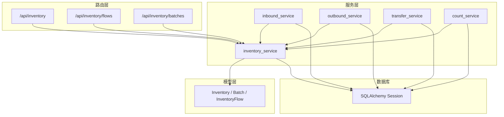
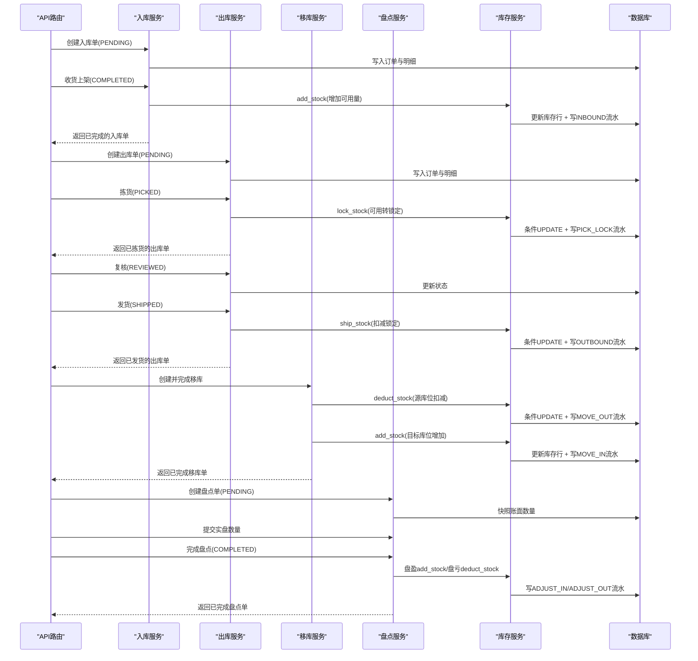
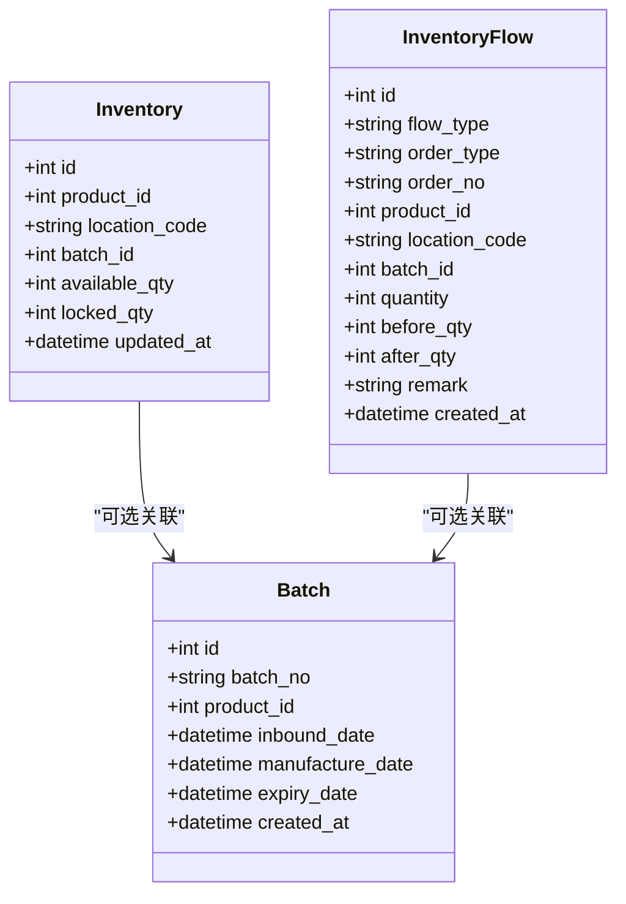
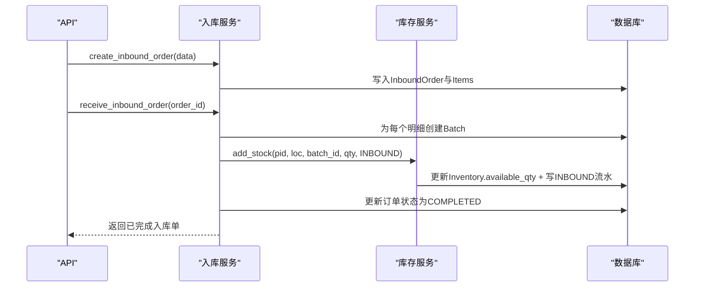
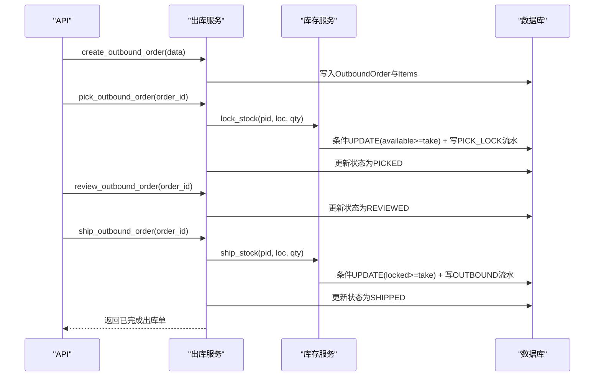
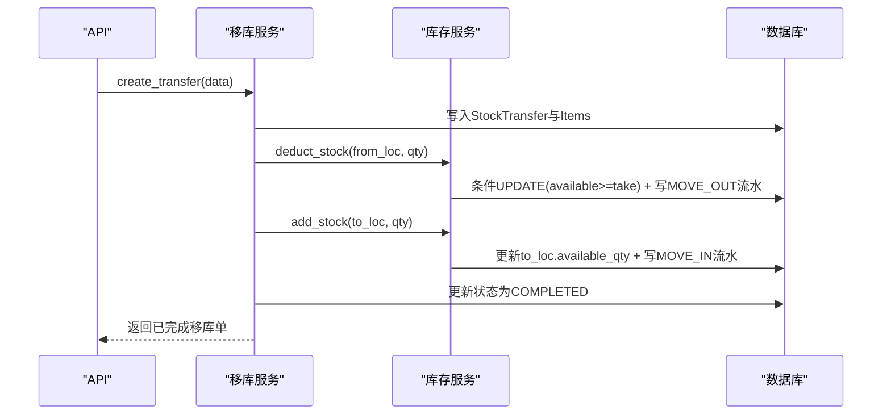
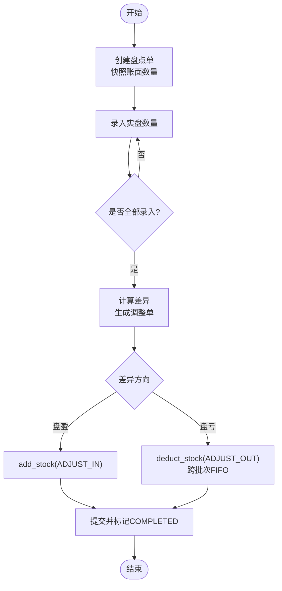
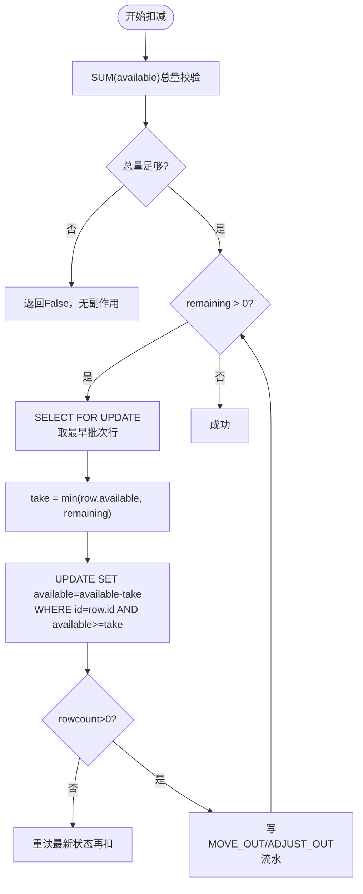

# 库存数据流

<cite>
**本文引用的文件**
- [inventory.py](file://backend-python/app/models/inventory.py)
- [inventory_service.py](file://backend-python/app/services/inventory_service.py)
- [inbound_service.py](file://backend-python/app/services/inbound_service.py)
- [outbound_service.py](file://backend-python/app/services/outbound_service.py)
- [transfer_service.py](file://backend-python/app/services/transfer_service.py)
- [count_service.py](file://backend-python/app/services/count_service.py)
- [inventory.py](file://backend-python/app/routers/inventory.py)
- [inventory.py](file://backend-python/app/schemas/inventory.py)
- [errors.py](file://backend-python/app/common/errors.py)
- [database.py](file://backend-python/app/database.py)
- [test_inventory_service.py](file://backend-python/tests/test_inventory_service.py)
</cite>

## 目录
1. [简介](#简介)
2. [项目结构](#项目结构)
3. [核心组件](#核心组件)
4. [架构总览](#架构总览)
5. [详细组件分析](#详细组件分析)
6. [依赖关系分析](#依赖关系分析)
7. [性能考量](#性能考量)
8. [故障排查指南](#故障排查指南)
9. [结论](#结论)
10. [附录](#附录)

## 简介
本文件面向WMS系统的库存数据流，系统性说明入库、出库、调拨、盘点等操作的完整数据流转过程与原子性保证机制。重点解释可用量(available)与锁定量(locked)的分离设计、跨批次扣减的FIFO策略实现、并发控制（条件UPDATE防超卖、行锁使用、事务回滚）、以及库存流水记录的数据结构与追溯机制。文档同时给出关键流程的调用序列图与流程图，并标注对应源码位置，便于定位与二次开发。

## 项目结构
后端采用分层架构：
- 模型层(models)：定义库存、批次、库存流水等实体及约束
- 服务层(services)：封装库存变动的业务逻辑（入库、出库、移库、盘点）
- 路由层(routers)：暴露REST接口，调用服务层完成业务处理
- 数据库(database)：提供SQLAlchemy引擎与会话管理，支持SQLite/MySQL/PostgreSQL切换

图表来源
- [inventory.py:12-61](file://backend-python/app/routers/inventory.py#L12-L61)
- [inventory_service.py:1-437](file://backend-python/app/services/inventory_service.py#L1-L437)
- [inventory.py:18-98](file://backend-python/app/models/inventory.py#L18-L98)
- [database.py:1-38](file://backend-python/app/database.py#L1-L38)

章节来源
- [inventory.py:12-61](file://backend-python/app/routers/inventory.py#L12-L61)
- [inventory_service.py:1-437](file://backend-python/app/services/inventory_service.py#L1-L437)
- [inventory.py:18-98](file://backend-python/app/models/inventory.py#L18-L98)
- [database.py:1-38](file://backend-python/app/database.py#L1-L38)

## 核心组件
- 库存行(Inventory)：按(product_id, location_code, batch_id)维度维护可用量(available_qty)与锁定量(locked_qty)，并提供唯一约束与索引优化查询
- 批次(Batch)：一次收货生成一个批次，支持有效期字段，用于追溯与先进先出(FIFO)
- 库存流水(InventoryFlow)：每次库存变动必须写流水，包含flow_type、order_type、order_no、before_qty、after_qty等，全量可追溯
- 库存服务(inventory_service)：统一入口，提供add_stock、deduct_stock、lock_stock、ship_stock、查询等方法，确保所有变更写流水且具备并发安全
- 业务服务：inbound_service、outbound_service、transfer_service、count_service分别负责入库、出库、移库、盘点流程，组合调用库存服务完成原子操作

章节来源
- [inventory.py:18-98](file://backend-python/app/models/inventory.py#L18-L98)
- [inventory_service.py:1-437](file://backend-python/app/services/inventory_service.py#L1-L437)
- [inbound_service.py:1-150](file://backend-python/app/services/inbound_service.py#L1-L150)
- [outbound_service.py:1-196](file://backend-python/app/services/outbound_service.py#L1-L196)
- [transfer_service.py:1-127](file://backend-python/app/services/transfer_service.py#L1-L127)
- [count_service.py:1-298](file://backend-python/app/services/count_service.py#L1-L298)

## 架构总览
库存数据流的核心在于“可用量”和“锁定量”的分离，以及“流水即真相”的可追溯设计。所有库存变动通过inventory_service统一入口，强制写流水；出库链路通过“拣货锁定→复核→发货”三段式状态机，避免超卖；调拨与盘点在事务内完成双向或差异调整，失败整体回滚。

图表来源
- [inbound_service.py:92-129](file://backend-python/app/services/inbound_service.py#L92-L129)
- [outbound_service.py:102-176](file://backend-python/app/services/outbound_service.py#L102-L176)
- [transfer_service.py:34-113](file://backend-python/app/services/transfer_service.py#L34-L113)
- [count_service.py:82-279](file://backend-python/app/services/count_service.py#L82-L279)
- [inventory_service.py:75-251](file://backend-python/app/services/inventory_service.py#L75-L251)

## 详细组件分析

### 库存模型与流水
- 库存行(Inventory)：唯一约束(product_id, location_code, batch_id)，索引(location_code, product_id)优化查询；available_qty与locked_qty分离
- 批次(Batch)：batch_no唯一，关联product_id，支持inbound_date/manufacture_date/expiry_date
- 库存流水(InventoryFlow)：flow_type涵盖INBOUND/OUTBOUND/PICK_LOCK/MOVE_OUT/MOVE_IN/ADJUST_IN/ADJUST_OUT/RETURN_IN；order_type为INBOUND/OUTBOUND/TRANSFER/ADJUSTMENT/RETURN；记录before_qty/after_qty以便审计

图表来源
- [inventory.py:18-98](file://backend-python/app/models/inventory.py#L18-L98)

章节来源
- [inventory.py:18-98](file://backend-python/app/models/inventory.py#L18-L98)

### 入库流程（INBOUND）
- 创建入库单：校验商品与库位存在，生成单号，写入订单与明细，不改变库存
- 收货上架：为每个明细生成批次（批次号=单号-明细id），调用add_stock增加可用量，写INBOUND流水，订单状态变更为COMPLETED
- 原子性：整个收货流程在一个事务内，任一步失败全部回滚

图表来源
- [inbound_service.py:38-129](file://backend-python/app/services/inbound_service.py#L38-L129)
- [inventory_service.py:75-88](file://backend-python/app/services/inventory_service.py#L75-L88)

章节来源
- [inbound_service.py:38-129](file://backend-python/app/services/inbound_service.py#L38-L129)
- [inventory_service.py:75-88](file://backend-python/app/services/inventory_service.py#L75-L88)

### 出库流程（OUTBOUND）
- 创建出库单：校验商品与库位存在，生成单号，写入订单与明细，不改变库存
- 拣货(pick)：聚合同一(商品,库位)的明细，调用lock_stock将可用量转为锁定量，写PICK_LOCK流水；不足则抛出BusinessError并回滚
- 复核(review)：仅更新状态，进行二次核对
- 发货(ship)：聚合同一(商品,库位)的明细，调用ship_stock扣减锁定量，写OUTBOUND流水；不足则抛出BusinessError并回滚

图表来源
- [outbound_service.py:42-176](file://backend-python/app/services/outbound_service.py#L42-L176)
- [inventory_service.py:147-251](file://backend-python/app/services/inventory_service.py#L147-L251)

章节来源
- [outbound_service.py:42-176](file://backend-python/app/services/outbound_service.py#L42-L176)
- [inventory_service.py:147-251](file://backend-python/app/services/inventory_service.py#L147-L251)

### 调拨流程（TRANSFER）
- 创建并完成移库：校验商品与库位存在，生成单号，写入转移单与明细
- 源库位扣减：调用deduct_stock跨批次扣减可用量，写MOVE_OUT流水
- 目标库位增加：调用add_stock增加可用量（无批次绑定，简化处理），写MOVE_IN流水
- 原子性：任一环节失败整体回滚

图表来源
- [transfer_service.py:34-113](file://backend-python/app/services/transfer_service.py#L34-L113)
- [inventory_service.py:91-144](file://backend-python/app/services/inventory_service.py#L91-L144)

章节来源
- [transfer_service.py:34-113](file://backend-python/app/services/transfer_service.py#L34-L113)
- [inventory_service.py:91-144](file://backend-python/app/services/inventory_service.py#L91-L144)

### 盘点流程（COUNT）
- 创建盘点单：校验范围（ALL/LOCATION/ZONE/PRODUCT），快照范围内账面数量（可用+锁定合计），生成盘点明细
- 录入实盘数量：多次提交覆盖，保持PENDING状态
- 完成盘点：校验全部明细已录入，汇总差异，自动生成调整单；盘盈调用add_stock，盘亏调用deduct_stock（跨批次FIFO），写ADJUST_IN/ADJUST_OUT流水；失败整体回滚

图表来源
- [count_service.py:82-279](file://backend-python/app/services/count_service.py#L82-L279)
- [inventory_service.py:75-144](file://backend-python/app/services/inventory_service.py#L75-L144)

章节来源
- [count_service.py:82-279](file://backend-python/app/services/count_service.py#L82-L279)
- [inventory_service.py:75-144](file://backend-python/app/services/inventory_service.py#L75-L144)

### 可用量与锁定量的分离设计
- 可用量(available_qty)：可直接用于销售出库的库存
- 锁定量(locked_qty)：拣货暂存，防止重复分配；发货时扣减锁定量
- 分离优势：
  - 明确区分“可售”与“已分配”，避免超卖
  - 支持拣货与发货解耦，提升作业效率
  - 便于统计与审计（PICK_LOCK与OUTBOUND流水清晰）

章节来源
- [inventory_service.py:147-251](file://backend-python/app/services/inventory_service.py#L147-L251)

### 跨批次扣减的FIFO策略
- 实现方式：deduct_stock按库存行id升序选择（order_by(id.asc())），优先扣减早期批次
- 并发安全：使用with_for_update()（PostgreSQL下生效）与条件UPDATE(available>=take)双重保障
- 结果：保证先进先出，减少过期风险

图表来源
- [inventory_service.py:91-144](file://backend-python/app/services/inventory_service.py#L91-L144)

章节来源
- [inventory_service.py:91-144](file://backend-python/app/services/inventory_service.py#L91-L144)

### 并发控制机制
- 条件UPDATE防超卖：所有扣减/锁定/发货均使用WHERE条件(available>=take或locked>=take)确保原子性
- 行锁：with_for_update()在PostgreSQL下加行锁，SQLite忽略但条件UPDATE仍有效
- 事务回滚：业务服务捕获BusinessError并db.rollback()，保证一致性
- 重试：单号冲突等场景使用for attempt in range(5)重试

章节来源
- [inventory_service.py:91-251](file://backend-python/app/services/inventory_service.py#L91-L251)
- [outbound_service.py:102-176](file://backend-python/app/services/outbound_service.py#L102-L176)
- [transfer_service.py:34-113](file://backend-python/app/services/transfer_service.py#L34-L113)
- [count_service.py:207-279](file://backend-python/app/services/count_service.py#L207-L279)
- [errors.py:1-9](file://backend-python/app/common/errors.py#L1-L9)

### 库存流水记录与追溯
- 数据结构：flow_type、order_type、order_no、product_id、location_code、batch_id、quantity、before_qty、after_qty、remark
- 追溯能力：通过order_no关联单据，通过product_id/location_code/batch_id定位具体库存行，before/after记录变化前后值
- 查询：query_flows支持按order_no、product_id、location_code、flow_type过滤，分页返回

章节来源
- [inventory.py:63-98](file://backend-python/app/models/inventory.py#L63-L98)
- [inventory_service.py:348-401](file://backend-python/app/services/inventory_service.py#L348-L401)

### 错误处理与异常恢复
- BusinessError：携带HTTP状态码，由全局异常处理器统一转换
- 常见错误：库存不足、状态不允许、基础数据不存在、单号冲突
- 恢复策略：
  - 业务层捕获BusinessError并db.rollback()
  - 单号冲突使用重试机制
  - 库存不足直接返回False或抛出BusinessError，调用方根据返回值决定后续流程

章节来源
- [errors.py:1-9](file://backend-python/app/common/errors.py#L1-L9)
- [outbound_service.py:102-176](file://backend-python/app/services/outbound_service.py#L102-L176)
- [transfer_service.py:34-113](file://backend-python/app/services/transfer_service.py#L34-L113)
- [count_service.py:207-279](file://backend-python/app/services/count_service.py#L207-L279)

## 依赖关系分析
库存服务依赖模型层与数据库会话，业务服务依赖库存服务完成库存变动。路由层仅做参数校验与响应包装。

图表来源
- [inventory.py:12-61](file://backend-python/app/routers/inventory.py#L12-L61)
- [inventory_service.py:1-437](file://backend-python/app/services/inventory_service.py#L1-L437)
- [database.py:1-38](file://backend-python/app/database.py#L1-L38)

章节来源
- [inventory.py:12-61](file://backend-python/app/routers/inventory.py#L12-L61)
- [inventory_service.py:1-437](file://backend-python/app/services/inventory_service.py#L1-L437)
- [database.py:1-38](file://backend-python/app/database.py#L1-L38)

## 性能考量
- 索引优化：inventory表对location_code与product_id建立索引，加速常用查询
- N+1问题：查询时使用joinedload一次性加载关联对象，避免逐行查库
- 聚合查询：product视图按(商品,仓库)汇总，减少前端渲染压力
- 分页：所有列表接口支持page/pageSize，避免大数据集传输

章节来源
- [inventory.py:40-48](file://backend-python/app/models/inventory.py#L40-L48)
- [inventory_service.py:256-345](file://backend-python/app/services/inventory_service.py#L256-L345)
- [inventory_service.py:348-401](file://backend-python/app/services/inventory_service.py#L348-L401)

## 故障排查指南
- 库存不足：检查deduct_stock/lock_stock/ship_stock返回值，确认上游是否提前释放锁定或并发竞争
- 状态不允许：检查订单状态机，确保当前状态允许执行该操作
- 基础数据不存在：校验product_id与location_code是否存在
- 单号冲突：检查generate_order_no实现与数据库唯一约束，必要时重试
- 流水缺失：确认所有库存变动是否通过inventory_service统一入口，避免绕过流水

章节来源
- [outbound_service.py:102-176](file://backend-python/app/services/outbound_service.py#L102-L176)
- [transfer_service.py:34-113](file://backend-python/app/services/transfer_service.py#L34-L113)
- [count_service.py:207-279](file://backend-python/app/services/count_service.py#L207-L279)
- [inventory_service.py:91-251](file://backend-python/app/services/inventory_service.py#L91-L251)

## 结论
本WMS系统通过“可用量与锁定量分离”、“条件UPDATE防超卖”、“事务回滚保证原子性”、“全量流水可追溯”等设计，实现了高可靠性的库存数据流。入库、出库、调拨、盘点等核心流程均在服务层封装，调用方无需关心底层并发细节，即可保证数据一致性与可审计性。未来可考虑引入分布式锁或消息队列以支持更高并发场景。

## 附录

### 代码示例路径（不展示具体代码内容）
- 库存增加（入库/移库入/盘盈）：[add_stock:75-88](file://backend-python/app/services/inventory_service.py#L75-L88)
- 库存扣减（出库/移库出/盘亏，FIFO）：[deduct_stock:91-144](file://backend-python/app/services/inventory_service.py#L91-L144)
- 库存锁定（拣货）：[lock_stock:147-202](file://backend-python/app/services/inventory_service.py#L147-L202)
- 库存发货（扣减锁定）：[ship_stock:205-251](file://backend-python/app/services/inventory_service.py#L205-L251)
- 入库流程：[receive_inbound_order:92-129](file://backend-python/app/services/inbound_service.py#L92-L129)
- 出库流程：[pick_outbound_order:102-133](file://backend-python/app/services/outbound_service.py#L102-L133)、[ship_outbound_order:146-176](file://backend-python/app/services/outbound_service.py#L146-L176)
- 调拨流程：[create_transfer:34-113](file://backend-python/app/services/transfer_service.py#L34-L113)
- 盘点流程：[complete_count:207-279](file://backend-python/app/services/count_service.py#L207-L279)
- 库存查询：[query_inventory:256-345](file://backend-python/app/services/inventory_service.py#L256-L345)
- 流水查询：[query_flows:348-401](file://backend-python/app/services/inventory_service.py#L348-L401)

章节来源
- [inventory_service.py:75-251](file://backend-python/app/services/inventory_service.py#L75-L251)
- [inbound_service.py:92-129](file://backend-python/app/services/inbound_service.py#L92-L129)
- [outbound_service.py:102-176](file://backend-python/app/services/outbound_service.py#L102-L176)
- [transfer_service.py:34-113](file://backend-python/app/services/transfer_service.py#L34-L113)
- [count_service.py:207-279](file://backend-python/app/services/count_service.py#L207-L279)

### 测试用例参考
- 新增库存与流水：[test_add_stock_creates_row_and_flow:31-42](file://backend-python/tests/test_inventory_service.py#L31-L42)
- 同批次累加：[test_add_stock_accumulates_same_row:44-50](file://backend-python/tests/test_inventory_service.py#L44-L50)
- 跨批次FIFO扣减：[test_deduct_stock_cross_batch_fifo:53-69](file://backend-python/tests/test_inventory_service.py#L53-L69)
- 库存不足返回False：[test_deduct_stock_insufficient_returns_false:71-83](file://backend-python/tests/test_inventory_service.py#L71-L83)
- 锁定与发货：[test_lock_and_ship_stock:85-109](file://backend-python/tests/test_inventory_service.py#L85-L109)
- 锁定不足：[test_lock_stock_insufficient:111-121](file://backend-python/tests/test_inventory_service.py#L111-L121)
- 产品视图聚合：[test_query_inventory_product_view_aggregates:123-135](file://backend-python/tests/test_inventory_service.py#L123-L135)
- 库位视图含批次：[test_query_inventory_location_view_has_batch:137-147](file://backend-python/tests/test_inventory_service.py#L137-L147)
- 关键词与仓库过滤：[test_query_inventory_keyword_and_warehouse_filter:149-158](file://backend-python/tests/test_inventory_service.py#L149-L158)
- 流水可追溯：[test_query_flows_traceable:160-171](file://backend-python/tests/test_inventory_service.py#L160-L171)

章节来源
- [test_inventory_service.py:31-171](file://backend-python/tests/test_inventory_service.py#L31-L171)