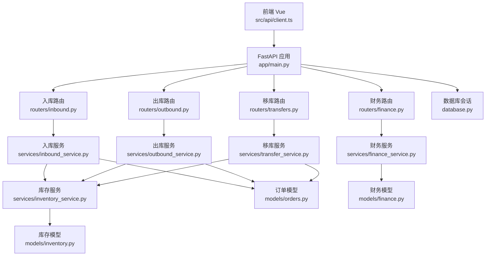
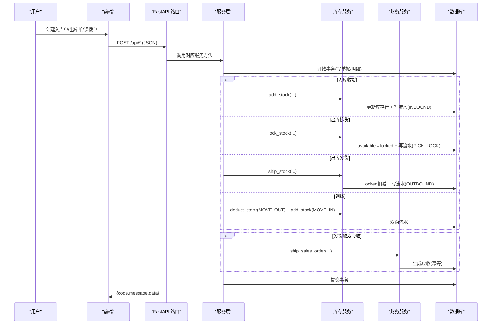
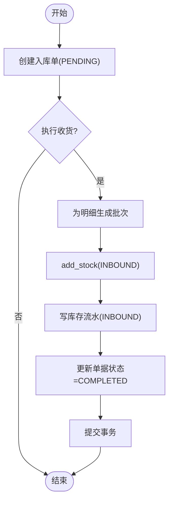
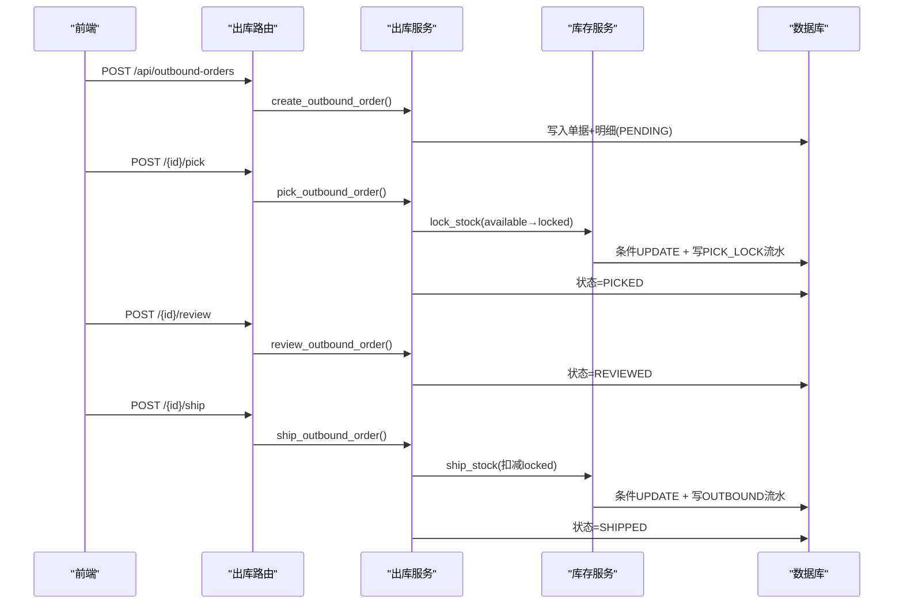
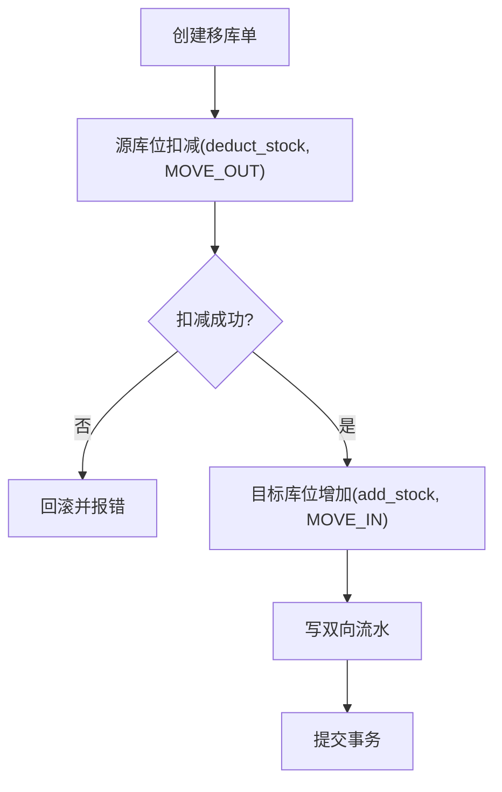
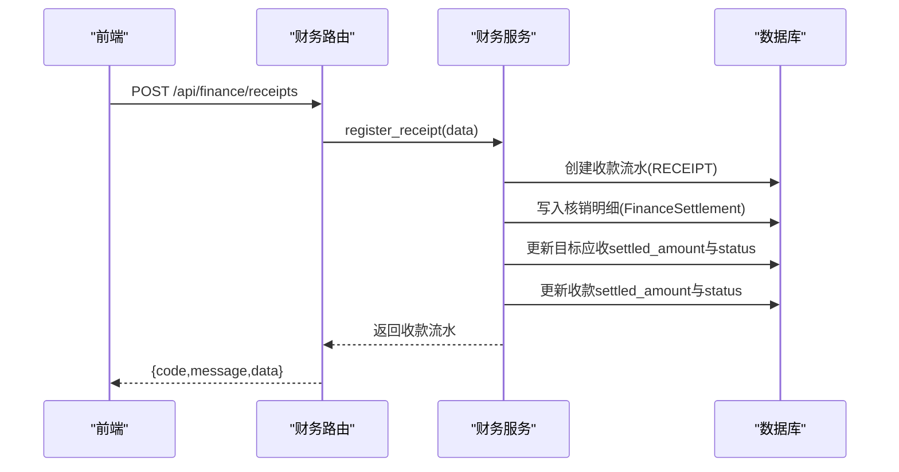
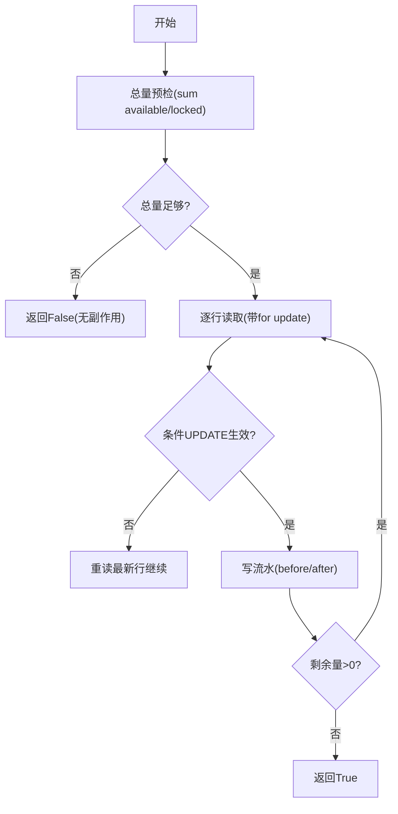
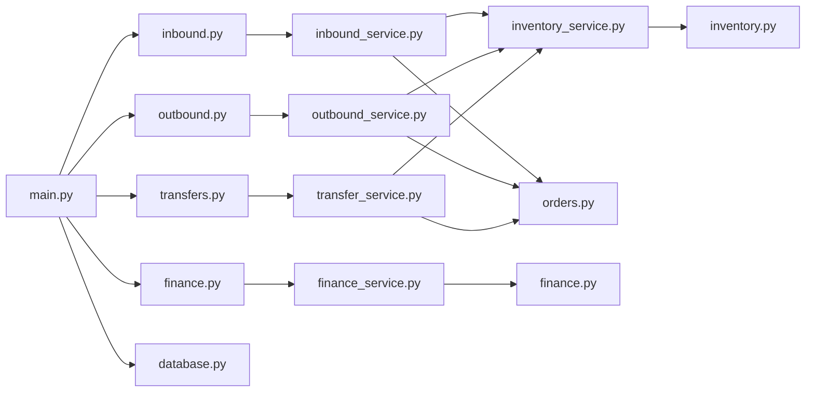

# 数据流设计

<cite>
**本文引用的文件**
- [backend-python/app/main.py](file://backend-python/app/main.py)
- [backend-python/app/database.py](file://backend-python/app/database.py)
- [backend-python/app/models/inventory.py](file://backend-python/app/models/inventory.py)
- [backend-python/app/models/finance.py](file://backend-python/app/models/finance.py)
- [backend-python/app/models/orders.py](file://backend-python/app/models/orders.py)
- [backend-python/app/services/inventory_service.py](file://backend-python/app/services/inventory_service.py)
- [backend-python/app/services/inbound_service.py](file://backend-python/app/services/inbound_service.py)
- [backend-python/app/services/outbound_service.py](file://backend-python/app/services/outbound_service.py)
- [backend-python/app/services/transfer_service.py](file://backend-python/app/services/transfer_service.py)
- [backend-python/app/services/finance_service.py](file://backend-python/app/services/finance_service.py)
- [backend-python/app/routers/inbound.py](file://backend-python/app/routers/inbound.py)
- [backend-python/app/routers/outbound.py](file://backend-python/app/routers/outbound.py)
- [backend-python/app/routers/transfers.py](file://backend-python/app/routers/transfers.py)
- [backend-python/app/routers/finance.py](file://backend-python/app/routers/finance.py)
- [frontend-vue/src/api/client.ts](file://frontend-vue/src/api/client.ts)
</cite>

## 目录
1. [引言](#引言)
2. [项目结构](#项目结构)
3. [核心组件](#核心组件)
4. [架构总览](#架构总览)
5. [详细组件分析](#详细组件分析)
6. [依赖关系分析](#依赖关系分析)
7. [性能与一致性](#性能与一致性)
8. [故障排查指南](#故障排查指南)
9. [结论](#结论)
10. [附录：前后端交互协议](#附录：前后端交互协议)

## 引言
本文件面向WMS系统的数据流设计，覆盖从用户操作到数据存储的端到端流程，重点说明库存变动的数据流（入库、出库、调拨）与财务流水的生成和核销流程，确保业财一体的数据同步。文档同时给出关键业务流程的数据流图与时序图，并总结缓存策略、数据同步机制与事务处理要点。

## 项目结构
后端采用FastAPI分层架构：路由层负责HTTP接口与参数校验；服务层封装业务状态机与事务边界；模型层定义数据库表结构与关系；数据库层提供连接与会话管理。前端通过统一的axios客户端发起请求，自动附加鉴权头并统一处理响应。

图表来源
- [backend-python/app/main.py:27-69](file://backend-python/app/main.py#L27-L69)
- [backend-python/app/routers/inbound.py:1-45](file://backend-python/app/routers/inbound.py#L1-L45)
- [backend-python/app/routers/outbound.py:1-61](file://backend-python/app/routers/outbound.py#L1-L61)
- [backend-python/app/routers/transfers.py:1-47](file://backend-python/app/routers/transfers.py#L1-L47)
- [backend-python/app/routers/finance.py:1-60](file://backend-python/app/routers/finance.py#L1-L60)
- [backend-python/app/services/inbound_service.py:1-150](file://backend-python/app/services/inbound_service.py#L1-L150)
- [backend-python/app/services/outbound_service.py:1-196](file://backend-python/app/services/outbound_service.py#L1-L196)
- [backend-python/app/services/transfer_service.py:1-127](file://backend-python/app/services/transfer_service.py#L1-L127)
- [backend-python/app/services/finance_service.py:1-607](file://backend-python/app/services/finance_service.py#L1-L607)
- [backend-python/app/services/inventory_service.py:1-437](file://backend-python/app/services/inventory_service.py#L1-L437)
- [backend-python/app/models/inventory.py:1-98](file://backend-python/app/models/inventory.py#L1-L98)
- [backend-python/app/models/finance.py:1-117](file://backend-python/app/models/finance.py#L1-L117)
- [backend-python/app/models/orders.py:1-300](file://backend-python/app/models/orders.py#L1-L300)
- [backend-python/app/database.py:1-38](file://backend-python/app/database.py#L1-L38)

章节来源
- [backend-python/app/main.py:27-69](file://backend-python/app/main.py#L27-L69)
- [backend-python/app/database.py:1-38](file://backend-python/app/database.py#L1-L38)

## 核心组件
- 库存域：批次、库存行（可用量/锁定量）、库存流水，保证全量可追溯与并发安全。
- 单据域：入库单、出库单、拣货单、波次、退货单、移库单、调整单、盘点单，均具备明确状态机。
- 财务域：销售订单、应收/应付/收款/付款流水、核销明细，支持部分核销与预收余额。
- 服务层：按领域拆分，封装状态流转、事务边界、幂等与一致性保障。
- 路由层：RESTful接口，统一返回格式，依赖注入数据库会话与当前用户。

章节来源
- [backend-python/app/models/inventory.py:1-98](file://backend-python/app/models/inventory.py#L1-L98)
- [backend-python/app/models/orders.py:1-300](file://backend-python/app/models/orders.py#L1-L300)
- [backend-python/app/models/finance.py:1-117](file://backend-python/app/models/finance.py#L1-L117)
- [backend-python/app/services/inventory_service.py:1-437](file://backend-python/app/services/inventory_service.py#L1-L437)
- [backend-python/app/services/inbound_service.py:1-150](file://backend-python/app/services/inbound_service.py#L1-L150)
- [backend-python/app/services/outbound_service.py:1-196](file://backend-python/app/services/outbound_service.py#L1-L196)
- [backend-python/app/services/transfer_service.py:1-127](file://backend-python/app/services/transfer_service.py#L1-L127)
- [backend-python/app/services/finance_service.py:1-607](file://backend-python/app/services/finance_service.py#L1-L607)

## 架构总览
系统以“单据驱动”为核心：所有库存变动由单据触发，并通过库存服务原子更新库存行与写入流水；财务侧在发货时生成应收，收款登记后支持部分核销，账龄实时计算不落库。

图表来源
- [backend-python/app/routers/inbound.py:13-26](file://backend-python/app/routers/inbound.py#L13-L26)
- [backend-python/app/routers/outbound.py:13-42](file://backend-python/app/routers/outbound.py#L13-L42)
- [backend-python/app/routers/transfers.py:15-18](file://backend-python/app/routers/transfers.py#L15-L18)
- [backend-python/app/routers/finance.py:39-52](file://backend-python/app/routers/finance.py#L39-L52)
- [backend-python/app/services/inbound_service.py:92-129](file://backend-python/app/services/inbound_service.py#L92-L129)
- [backend-python/app/services/outbound_service.py:102-176](file://backend-python/app/services/outbound_service.py#L102-L176)
- [backend-python/app/services/transfer_service.py:34-113](file://backend-python/app/services/transfer_service.py#L34-L113)
- [backend-python/app/services/finance_service.py:246-268](file://backend-python/app/services/finance_service.py#L246-L268)
- [backend-python/app/services/inventory_service.py:75-251](file://backend-python/app/services/inventory_service.py#L75-L251)

## 详细组件分析

### 入库数据流（收货上架）
- 创建入库单：仅落库单据与明细，不改变库存。
- 收货上架：为每个明细生成批次，累加可用库存，写INBOUND流水，单据状态变更为已完成。
- 一致性：整个流程在同一事务内，任何步骤失败回滚。

图表来源
- [backend-python/app/routers/inbound.py:13-26](file://backend-python/app/routers/inbound.py#L13-L26)
- [backend-python/app/services/inbound_service.py:38-129](file://backend-python/app/services/inbound_service.py#L38-L129)
- [backend-python/app/services/inventory_service.py:75-88](file://backend-python/app/services/inventory_service.py#L75-L88)

章节来源
- [backend-python/app/routers/inbound.py:13-26](file://backend-python/app/routers/inbound.py#L13-L26)
- [backend-python/app/services/inbound_service.py:38-129](file://backend-python/app/services/inbound_service.py#L38-L129)
- [backend-python/app/models/orders.py:17-48](file://backend-python/app/models/orders.py#L17-L48)
- [backend-python/app/models/inventory.py:18-98](file://backend-python/app/models/inventory.py#L18-L98)

### 出库数据流（拣货-复核-发货）
- 创建出库单：PENDING，不改变库存。
- 拣货：将可用库存锁定为已拣货暂存（available→locked），写PICK_LOCK流水，防超卖。
- 复核：二次核对数量，状态PICKED→REVIEWED。
- 发货：扣减锁定库存，写OUTBOUND流水，状态REVIEWED→SHIPPED。
- 一致性：每步聚合明细逐行原子更新，失败整体回滚。

图表来源
- [backend-python/app/routers/outbound.py:13-42](file://backend-python/app/routers/outbound.py#L13-L42)
- [backend-python/app/services/outbound_service.py:42-176](file://backend-python/app/services/outbound_service.py#L42-L176)
- [backend-python/app/services/inventory_service.py:147-251](file://backend-python/app/services/inventory_service.py#L147-L251)

章节来源
- [backend-python/app/routers/outbound.py:13-42](file://backend-python/app/routers/outbound.py#L13-L42)
- [backend-python/app/services/outbound_service.py:42-176](file://backend-python/app/services/outbound_service.py#L42-L176)
- [backend-python/app/models/orders.py:50-81](file://backend-python/app/models/orders.py#L50-L81)
- [backend-python/app/models/inventory.py:33-98](file://backend-python/app/models/inventory.py#L33-L98)

### 调拨数据流（库位间转移）
- 创建并完成移库单：源库位扣减可用量（MOVE_OUT），目标库位增加可用量（MOVE_IN），双向写流水。
- 一致性：同一事务内完成，任一环节失败整体回滚。

图表来源
- [backend-python/app/routers/transfers.py:15-18](file://backend-python/app/routers/transfers.py#L15-L18)
- [backend-python/app/services/transfer_service.py:34-113](file://backend-python/app/services/transfer_service.py#L34-L113)
- [backend-python/app/services/inventory_service.py:91-144](file://backend-python/app/services/inventory_service.py#L91-L144)

章节来源
- [backend-python/app/routers/transfers.py:15-18](file://backend-python/app/routers/transfers.py#L15-L18)
- [backend-python/app/services/transfer_service.py:34-113](file://backend-python/app/services/transfer_service.py#L34-L113)
- [backend-python/app/models/orders.py:187-216](file://backend-python/app/models/orders.py#L187-L216)

### 财务流水与核销（业财一体）
- 销售订单：草稿→确认→发货→完成/作废。
- 发货生成应收：在发货事务内生成应收流水，幂等保护（唯一约束+预查）。
- 收款登记：金额可大于核销金额，差额作为未核销余额（预收）。
- 核销：支持部分核销，更新目标应收与收款流水状态。
- 账龄：以到期日为基准实时分段，不落库。

图表来源
- [backend-python/app/routers/finance.py:39-52](file://backend-python/app/routers/finance.py#L39-L52)
- [backend-python/app/services/finance_service.py:411-439](file://backend-python/app/services/finance_service.py#L411-L439)
- [backend-python/app/models/finance.py:71-117](file://backend-python/app/models/finance.py#L71-L117)

章节来源
- [backend-python/app/routers/finance.py:13-60](file://backend-python/app/routers/finance.py#L13-L60)
- [backend-python/app/services/finance_service.py:246-268](file://backend-python/app/services/finance_service.py#L246-L268)
- [backend-python/app/services/finance_service.py:295-336](file://backend-python/app/services/finance_service.py#L295-L336)
- [backend-python/app/services/finance_service.py:341-439](file://backend-python/app/services/finance_service.py#L341-L439)
- [backend-python/app/models/finance.py:24-117](file://backend-python/app/models/finance.py#L24-L117)

### 库存服务核心算法（并发安全）
- 扣减/锁定/发货均采用“总量预检 + 逐行条件UPDATE + 失败重读重试”，避免并发下陈旧读覆盖导致超卖。
- 使用with_for_update在支持行锁的数据库上增强一致性；SQLite忽略但仍有条件UPDATE兜底。
- 所有变更必须写库存流水，保证全量可追溯。

图表来源
- [backend-python/app/services/inventory_service.py:91-251](file://backend-python/app/services/inventory_service.py#L91-L251)

章节来源
- [backend-python/app/services/inventory_service.py:91-251](file://backend-python/app/services/inventory_service.py#L91-L251)

## 依赖关系分析
- 路由层依赖服务层，服务层依赖模型层与库存服务。
- 库存服务依赖库存模型与基础实体（产品、库位、仓库、批次）。
- 财务服务依赖财务模型与销售订单模型。
- 数据库层提供引擎与会话，供各层注入使用。

图表来源
- [backend-python/app/main.py:53-69](file://backend-python/app/main.py#L53-L69)
- [backend-python/app/routers/inbound.py:1-45](file://backend-python/app/routers/inbound.py#L1-L45)
- [backend-python/app/routers/outbound.py:1-61](file://backend-python/app/routers/outbound.py#L1-L61)
- [backend-python/app/routers/transfers.py:1-47](file://backend-python/app/routers/transfers.py#L1-L47)
- [backend-python/app/routers/finance.py:1-60](file://backend-python/app/routers/finance.py#L1-L60)
- [backend-python/app/services/inbound_service.py:1-150](file://backend-python/app/services/inbound_service.py#L1-L150)
- [backend-python/app/services/outbound_service.py:1-196](file://backend-python/app/services/outbound_service.py#L1-L196)
- [backend-python/app/services/transfer_service.py:1-127](file://backend-python/app/services/transfer_service.py#L1-L127)
- [backend-python/app/services/finance_service.py:1-607](file://backend-python/app/services/finance_service.py#L1-L607)
- [backend-python/app/services/inventory_service.py:1-437](file://backend-python/app/services/inventory_service.py#L1-L437)
- [backend-python/app/models/inventory.py:1-98](file://backend-python/app/models/inventory.py#L1-L98)
- [backend-python/app/models/finance.py:1-117](file://backend-python/app/models/finance.py#L1-L117)
- [backend-python/app/models/orders.py:1-300](file://backend-python/app/models/orders.py#L1-L300)
- [backend-python/app/database.py:1-38](file://backend-python/app/database.py#L1-L38)

章节来源
- [backend-python/app/main.py:53-69](file://backend-python/app/main.py#L53-L69)
- [backend-python/app/database.py:1-38](file://backend-python/app/database.py#L1-L38)

## 性能与一致性
- 事务边界：所有库存与单据变更在服务层包裹于单一事务，失败即回滚，避免中间态。
- 并发控制：库存服务对扣减/锁定/发货采用“总量预检 + 条件UPDATE + 失败重试”，在高并发下防止超卖。
- 查询优化：列表查询使用joinedload一次性加载关联对象，避免N+1；常用过滤列建索引。
- 幂等性：应收生成通过“预查 + 唯一约束 + IntegrityError兜底”实现幂等；单号冲突重试。
- 缓存策略：当前代码未引入应用级缓存；如需提升热点查询性能，可在库存/报表查询层引入Redis缓存，并以事件或定时任务刷新。
- 数据同步：库存与财务通过“发货触发应收”的强一致事务绑定；收款核销独立事务，支持部分核销与预收余额。

[本节为通用指导，无需特定文件引用]

## 故障排查指南
- 业务异常统一处理：全局捕获BusinessError并返回标准JSON格式，便于前端统一提示。
- 常见错误定位：
  - 库存不足：检查lock_stock/deduct_stock返回值与库存流水；核对批次与库位维度。
  - 单号冲突：查看IntegrityError重试逻辑与唯一约束；必要时清理脏数据。
  - 核销失败：检查目标应收是否存在、类型是否正确、金额是否超过未结余额。
- 日志与追踪：利用库存流水(order_no, flow_type, before/after)进行问题溯源。

章节来源
- [backend-python/app/main.py:35-41](file://backend-python/app/main.py#L35-L41)
- [backend-python/app/services/inventory_service.py:91-251](file://backend-python/app/services/inventory_service.py#L91-L251)
- [backend-python/app/services/finance_service.py:341-439](file://backend-python/app/services/finance_service.py#L341-L439)

## 结论
本设计以“单据驱动 + 库存流水 + 财务幂等”为核心，确保库存与财务数据的一致性与可追溯性。通过服务层事务边界、库存服务的并发安全算法以及财务的幂等与部分核销能力，实现了端到端的可靠数据流。建议在后续演进中按需引入缓存与异步化以提升性能与扩展性。

[本节为总结，无需特定文件引用]

## 附录：前后端交互协议
- 基础约定
  - 基地址：前端默认通过VITE_API_BASE或代理访问/api。
  - 鉴权：请求拦截器自动附加Authorization: Bearer <token>。
  - 响应体：统一包含code、message、data字段。
- 典型接口
  - 入库单
    - POST /api/inbound-orders：创建入库单（PENDING）
    - POST /api/inbound-orders/{order_id}/receive：收货上架（PENDING→COMPLETED）
    - GET /api/inbound-orders：分页查询
  - 出库单
    - POST /api/outbound-orders：创建出库单（PENDING）
    - POST /api/outbound-orders/{order_id}/pick：拣货锁定（PENDING→PICKED）
    - POST /api/outbound-orders/{order_id}/review：复核（PICKED→REVIEWED）
    - POST /api/outbound-orders/{order_id}/ship：发货（REVIEWED→SHIPPED）
  - 移库与调整
    - POST /api/transfers：创建并完成移库
    - POST /api/adjustments：创建并完成调整
  - 财务
    - GET /api/finance/receivables：应收台账（含逾期标记）
    - GET /api/finance/aging：账龄分布
    - POST /api/finance/receipts：登记收款并核销（可选）
    - POST /api/finance/receipts/{receipt_id}/allocate：继续核销
    - DELETE /api/finance/receivables/{entry_id}：删除应收（无核销记录时）

章节来源
- [frontend-vue/src/api/client.ts:1-45](file://frontend-vue/src/api/client.ts#L1-L45)
- [backend-python/app/routers/inbound.py:13-45](file://backend-python/app/routers/inbound.py#L13-L45)
- [backend-python/app/routers/outbound.py:13-61](file://backend-python/app/routers/outbound.py#L13-L61)
- [backend-python/app/routers/transfers.py:15-47](file://backend-python/app/routers/transfers.py#L15-L47)
- [backend-python/app/routers/finance.py:13-60](file://backend-python/app/routers/finance.py#L13-L60)