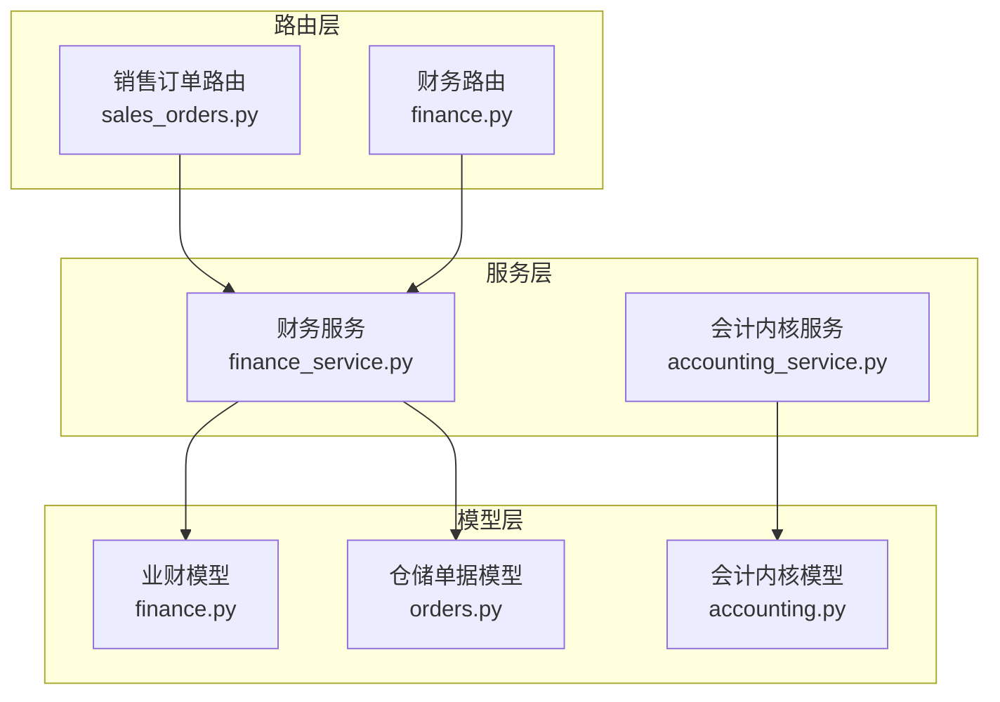
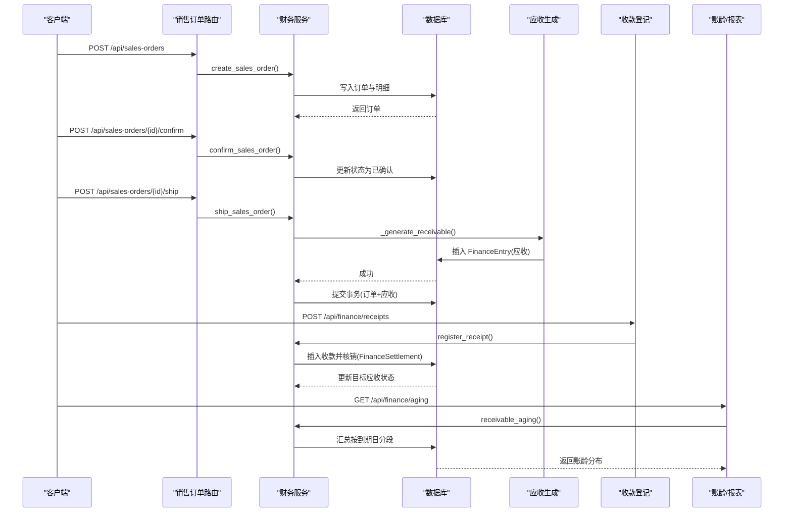
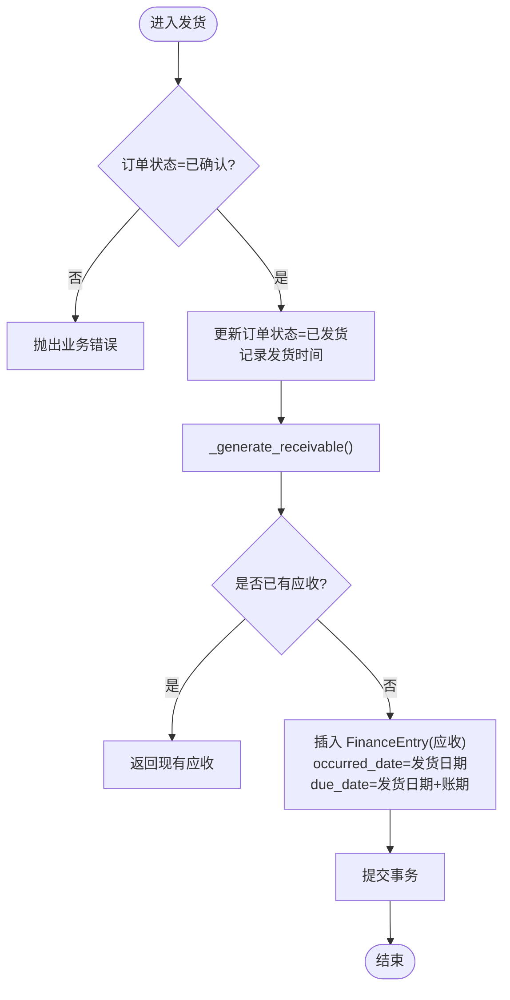
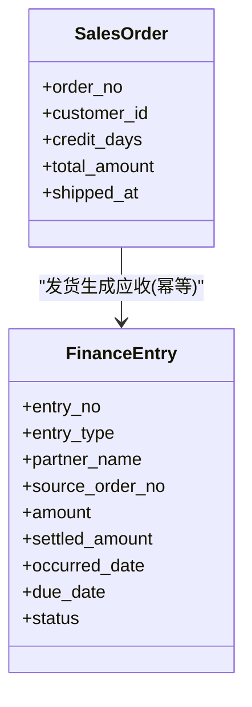
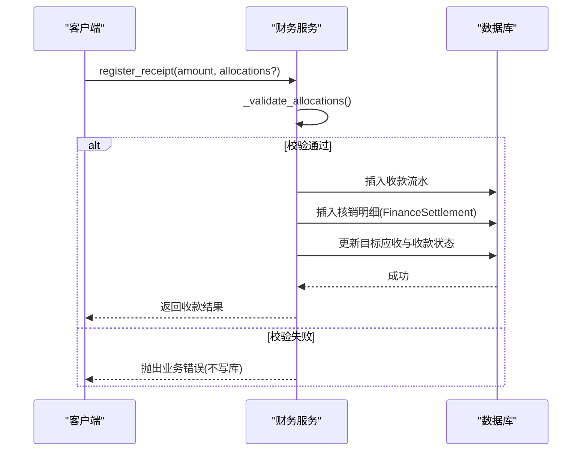
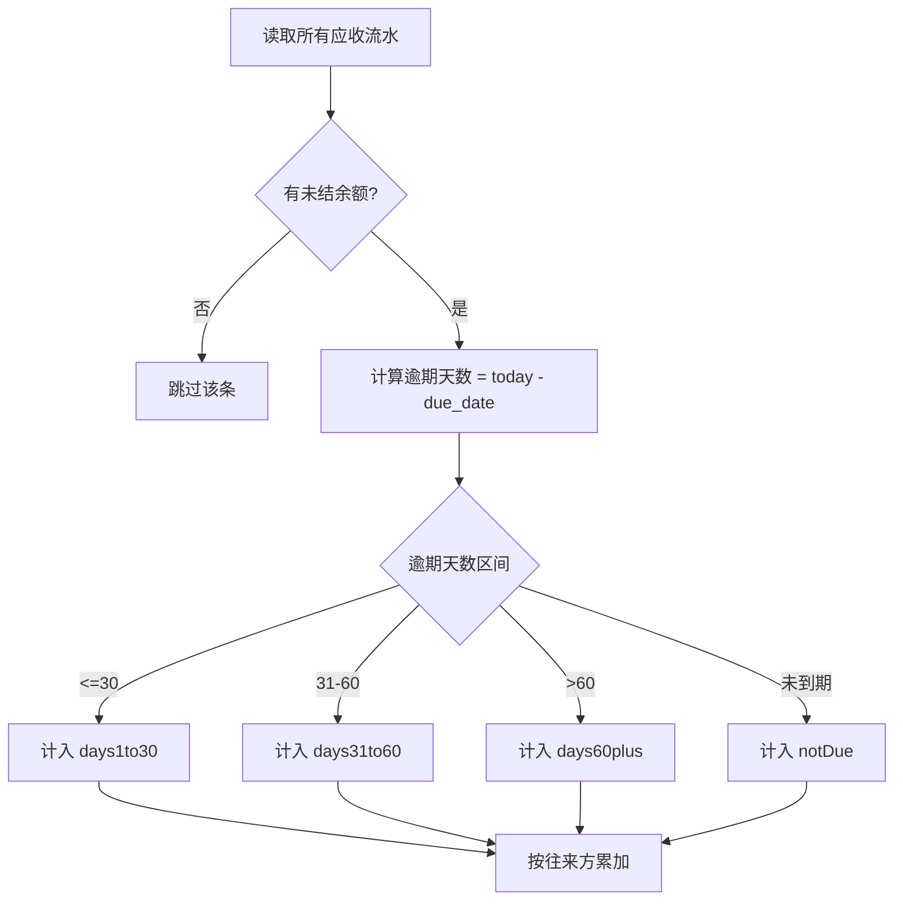
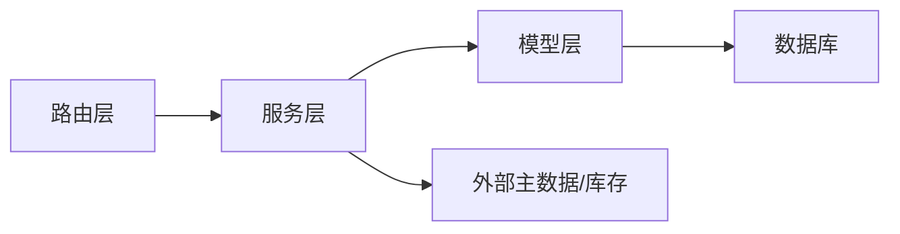

# 财务数据流

<cite>
**本文引用的文件**
- [finance.py](file://backend-python/app/models/finance.py)
- [finance_service.py](file://backend-python/app/services/finance_service.py)
- [finance.py](file://backend-python/app/routers/finance.py)
- [finance.py](file://backend-python/app/schemas/finance.py)
- [accounting.py](file://backend-python/app/models/accounting.py)
- [accounting_service.py](file://backend-python/app/services/accounting_service.py)
- [sales_orders.py](file://backend-python/app/routers/sales_orders.py)
- [orders.py](file://backend-python/app/models/orders.py)
- [test_finance_service.py](file://backend-python/tests/test_finance_service.py)
- [test_accounting_core.py](file://backend-python/tests/test_accounting_core.py)
</cite>

## 目录
1. [引言](#引言)
2. [项目结构](#项目结构)
3. [核心组件](#核心组件)
4. [架构总览](#架构总览)
5. [详细组件分析](#详细组件分析)
6. [依赖关系分析](#依赖关系分析)
7. [性能与一致性](#性能与一致性)
8. [故障排查指南](#故障排查指南)
9. [结论](#结论)
10. [附录：API 接口说明](#附录api-接口说明)

## 引言
本文件面向 WMS 系统的“业财一体”财务数据流，覆盖从销售订单确认、发货生成应收、收款核销到账龄分析与财务报表的完整闭环。重点说明：
- 财务流水 FinanceEntry 的自动生成规则与幂等机制
- 应收应付账龄算法与报表口径
- 审计追踪与可追溯性（业务单据→财务流水→凭证）
- 端到端业务流程图与数据流向图
- 财务数据查询与分析 API 说明

## 项目结构
后端采用 FastAPI + SQLAlchemy 分层设计：
- 路由层 routers：暴露 REST API
- 服务层 services：封装业务逻辑与事务边界
- 模型层 models：定义数据库表结构与关系
- Schema 层 schemas：请求/响应校验
- 测试 tests：覆盖关键流程与边界条件

图表来源
- [sales_orders.py:1-81](file://backend-python/app/routers/sales_orders.py#L1-L81)
- [finance.py:1-60](file://backend-python/app/routers/finance.py#L1-L60)
- [finance_service.py:1-607](file://backend-python/app/services/finance_service.py#L1-L607)
- [accounting_service.py:1-327](file://backend-python/app/services/accounting_service.py#L1-L327)
- [finance.py:1-117](file://backend-python/app/models/finance.py#L1-L117)
- [accounting.py:1-159](file://backend-python/app/models/accounting.py#L1-L159)
- [orders.py:1-300](file://backend-python/app/models/orders.py#L1-L300)

章节来源
- [sales_orders.py:1-81](file://backend-python/app/routers/sales_orders.py#L1-L81)
- [finance.py:1-60](file://backend-python/app/routers/finance.py#L1-L60)
- [finance_service.py:1-607](file://backend-python/app/services/finance_service.py#L1-L607)
- [accounting_service.py:1-327](file://backend-python/app/services/accounting_service.py#L1-L327)
- [finance.py:1-117](file://backend-python/app/models/finance.py#L1-L117)
- [accounting.py:1-159](file://backend-python/app/models/accounting.py#L1-L159)
- [orders.py:1-300](file://backend-python/app/models/orders.py#L1-L300)

## 核心组件
- 销售订单与明细：SalesOrder / SalesOrderItem，状态机 DRAFT → CONFIRMED → SHIPPED → COMPLETED/CANCELLED
- 财务流水：FinanceEntry，统一应收/应付/收款/付款，金额与已核销分离，状态由 settled_amount 推导
- 核销明细：FinanceSettlement，支持部分核销与多次核销
- 会计内核：Account/Voucher/VoucherLine/Period，科目树、凭证生命周期、期间管理
- 仓储单据：OutboundOrder 等（预留关联 outbound_order_no）

章节来源
- [finance.py:24-117](file://backend-python/app/models/finance.py#L24-L117)
- [accounting.py:63-159](file://backend-python/app/models/accounting.py#L63-L159)
- [orders.py:50-120](file://backend-python/app/models/orders.py#L50-L120)

## 架构总览
下图展示“销售→发货→应收→收款→核销→报表”的数据流转与系统交互。

图表来源
- [sales_orders.py:13-66](file://backend-python/app/routers/sales_orders.py#L13-L66)
- [finance_service.py:235-336](file://backend-python/app/services/finance_service.py#L235-L336)
- [finance_service.py:411-439](file://backend-python/app/services/finance_service.py#L411-L439)
- [finance_service.py:479-506](file://backend-python/app/services/finance_service.py#L479-L506)
- [finance.py:26-117](file://backend-python/app/models/finance.py#L26-L117)

## 详细组件分析

### 销售订单与发货触发应收
- 创建订单：校验客户与商品，计算总金额，落库订单与明细
- 确认订单：仅允许草稿转已确认
- 发货：在同一个数据库事务中完成订单状态变更与应收生成；若应收生成失败则整单回滚，避免“已发货无应收”中间态
- 完成/作废：状态机保护，防止非法跳转

图表来源
- [finance_service.py:246-336](file://backend-python/app/services/finance_service.py#L246-L336)
- [finance.py:26-45](file://backend-python/app/models/finance.py#L26-L45)

章节来源
- [finance_service.py:118-290](file://backend-python/app/services/finance_service.py#L118-L290)
- [sales_orders.py:13-81](file://backend-python/app/routers/sales_orders.py#L13-L81)

### 财务流水 FinanceEntry 自动生成规则
- 触发时机：订单发货时自动创建应收
- 幂等保障：
  - 服务层预查同一 source_order_no + entry_type 是否已存在
  - 数据库唯一约束 (source_order_no, entry_type) 兜底
  - 并发冲突捕获 IntegrityError 并拒绝重复入账
- 字段规则：
  - amount = 订单总金额
  - occurred_date = 发货日期
  - due_date = 发货日期 + credit_days
  - status 由 settled_amount 与 amount 推导：OPEN/PARTIAL/SETTLED

图表来源
- [finance_service.py:295-336](file://backend-python/app/services/finance_service.py#L295-L336)
- [finance.py:71-102](file://backend-python/app/models/finance.py#L71-L102)

章节来源
- [finance_service.py:295-336](file://backend-python/app/services/finance_service.py#L295-L336)
- [finance.py:71-102](file://backend-python/app/models/finance.py#L71-L102)

### 收款登记与核销
- 收款登记：创建收款流水 FinanceEntry(entry_type=RECEIPT)，可选同时核销到一张或多张应收
- 核销校验：
  - 目标应收必须存在且类型为应收/应付
  - 单笔核销金额不得超未结余额
  - 合计核销金额不得超可用余额
- 核销写入：
  - 写入 FinanceSettlement 明细
  - 更新目标应收 settled_amount 与 status
  - 更新收款 settled_amount 与 status
- 预收复用：收款金额大于核销金额的部分作为未核销余额，可后续继续核销到其他应收

图表来源
- [finance_service.py:341-439](file://backend-python/app/services/finance_service.py#L341-L439)
- [finance.py:104-117](file://backend-python/app/models/finance.py#L104-L117)

章节来源
- [finance_service.py:341-439](file://backend-python/app/services/finance_service.py#L341-L439)
- [finance.py:104-117](file://backend-python/app/models/finance.py#L104-L117)

### 账龄分析算法
- 基准：以 FinanceEntry.due_date 为基准计算逾期天数
- 分段：
  - notDue：未到期或无到期日
  - days1to30：逾期 ≤ 30 天
  - days31to60：逾期 31-60 天
  - days60plus：逾期 > 60 天
- 聚合：按往来方(partner_name)汇总应收总额、已核销总额、未结余额与各段分布
- 实时计算：不落库，每次查询基于当前日期动态分段

图表来源
- [finance_service.py:467-506](file://backend-python/app/services/finance_service.py#L467-L506)

章节来源
- [finance_service.py:467-506](file://backend-python/app/services/finance_service.py#L467-L506)

### 财务报表生成逻辑
- 驾驶舱摘要：
  - 应收总额、已收总额、未结总额、逾期总额
  - 订单数量与订单金额（排除作废）
- 趋势：
  - 近 N 天每日订单金额（按 created_at）
  - 近 N 天每日收款金额（按 occurred_date）
- 数据来源：FinanceEntry 与 SalesOrder，保证与财务流水同源

章节来源
- [finance_service.py:511-588](file://backend-python/app/services/finance_service.py#L511-L588)

### 审计追踪与可追溯性
- 业务单据溯源：
  - FinanceEntry.source_order_no 指向原始销售订单号
  - FinanceSettlement.receipt_entry_id/target_entry_id 链接收款与目标应收
- 凭证审计（会计内核）：
  - Voucher 状态机 DRAFT → POSTED → REVERSED，过账后不可改删
  - 红字冲销双向关联：reverses_voucher_no ↔ reversed_voucher_no
  - 期间控制：关闭期间禁止写入，反结账需倒序
- 删除保护：
  - 已核销的应收不允许删除，防止断链

章节来源
- [finance.py:71-117](file://backend-python/app/models/finance.py#L71-L117)
- [accounting.py:108-159](file://backend-python/app/models/accounting.py#L108-L159)
- [accounting_service.py:220-297](file://backend-python/app/services/accounting_service.py#L220-L297)
- [finance_service.py:593-607](file://backend-python/app/services/finance_service.py#L593-L607)

## 依赖关系分析
- 路由与服务解耦：路由仅负责参数绑定与调用服务
- 服务与模型耦合：服务直接操作 ORM 模型，封装事务与业务规则
- 幂等与一致性：
  - 唯一约束 + 预查 + 异常处理三重保障
  - 发货与应收生成在同一事务内，失败整体回滚
- 外部依赖：
  - 客户/商品主数据校验
  - 出库单号预留关联（outbound_order_no）

图表来源
- [sales_orders.py:1-81](file://backend-python/app/routers/sales_orders.py#L1-L81)
- [finance_service.py:1-607](file://backend-python/app/services/finance_service.py#L1-L607)
- [finance.py:1-117](file://backend-python/app/models/finance.py#L1-L117)

章节来源
- [sales_orders.py:1-81](file://backend-python/app/routers/sales_orders.py#L1-L81)
- [finance_service.py:1-607](file://backend-python/app/services/finance_service.py#L1-L607)

## 性能与一致性
- 幂等与并发：
  - 唯一约束 (source_order_no, entry_type) 防重复入账
  - 服务层预查减少无效写入
- 事务边界：
  - 发货与应收生成同事务，确保一致性
  - 收款核销先校验再写入，避免脏数据
- 金额精度：
  - 演示口径使用 Float，服务层统一 round(...,2)
  - 未来接入会计引擎时将转换为 Decimal 记账
- 查询优化：
  - 索引：伙伴名称、类型、过期日等
  - 账龄实时计算，避免冗余存储

章节来源
- [finance_service.py:45-60](file://backend-python/app/services/finance_service.py#L45-L60)
- [finance_service.py:295-336](file://backend-python/app/services/finance_service.py#L295-L336)
- [finance.py:79-86](file://backend-python/app/models/finance.py#L79-L86)

## 故障排查指南
- 重复发货报错：检查订单状态是否为已确认，避免重复调用
- 应收生成失败：查看是否已存在相同 source_order_no 的应收；检查数据库唯一约束
- 核销超额：核对目标应收未结余额与本次核销金额；确保 allocations 合计不超过可用余额
- 删除应收被拒：如存在核销记录，需先撤销核销或走冲销流程
- 期间锁定：关闭期间无法创建/过账凭证，需按倒序反结账

章节来源
- [finance_service.py:246-268](file://backend-python/app/services/finance_service.py#L246-L268)
- [finance_service.py:341-439](file://backend-python/app/services/finance_service.py#L341-L439)
- [finance_service.py:593-607](file://backend-python/app/services/finance_service.py#L593-L607)
- [accounting_service.py:119-163](file://backend-python/app/services/accounting_service.py#L119-L163)

## 结论
本系统实现了从销售订单到财务流水的自动化闭环：
- 发货即生成应收，幂等可靠
- 收款核销灵活，支持部分核销与预收复用
- 账龄分析以到期日为基准，实时准确
- 会计内核提供凭证生命周期与期间控制，满足合规要求
- 全链路可追溯，每笔财务变动均可回溯至原始业务单据

## 附录：API 接口说明

### 销售订单
- POST /api/sales-orders：创建销售订单（草稿），金额由明细汇总
- GET /api/sales-orders：分页查询订单列表
- GET /api/sales-orders/{order_id}：获取订单详情
- PUT /api/sales-orders/{order_id}：编辑订单（仅草稿）
- POST /api/sales-orders/{order_id}/confirm：确认订单
- POST /api/sales-orders/{order_id}/ship：发货并自动生成应收
- POST /api/sales-orders/{order_id}/complete：完成订单
- POST /api/sales-orders/{order_id}/cancel：作废订单

章节来源
- [sales_orders.py:13-81](file://backend-python/app/routers/sales_orders.py#L13-L81)

### 财务台账与账龄
- GET /api/finance/receivables：应收/应付台账，支持按伙伴、状态、未结、逾期筛选
- GET /api/finance/aging：按往来方的应收余额与账龄分布

章节来源
- [finance.py:13-36](file://backend-python/app/routers/finance.py#L13-L36)

### 收款登记与核销
- POST /api/finance/receipts：登记收款并核销（可选），到账金额可大于核销金额，差额为预收
- POST /api/finance/receipts/{receipt_id}/allocate：将某笔收款的未核销余额继续核销到其他应收
- DELETE /api/finance/receivables/{entry_id}：删除应收流水（已有核销记录时禁止）

章节来源
- [finance.py:39-60](file://backend-python/app/routers/finance.py#L39-L60)

### 经营驾驶舱
- GET /api/executive/summary：应收/回款/逾期/订单统计
- GET /api/executive/trends?days=N：近 N 天订单与收款趋势

章节来源
- [finance_service.py:511-588](file://backend-python/app/services/finance_service.py#L511-L588)

### 数据结构参考
- 销售订单与明细：SalesOrder / SalesOrderItem
- 财务流水与核销：FinanceEntry / FinanceSettlement
- 会计内核：Account / Voucher / VoucherLine / Period

章节来源
- [finance.py:24-117](file://backend-python/app/models/finance.py#L24-L117)
- [accounting.py:63-159](file://backend-python/app/models/accounting.py#L63-L159)