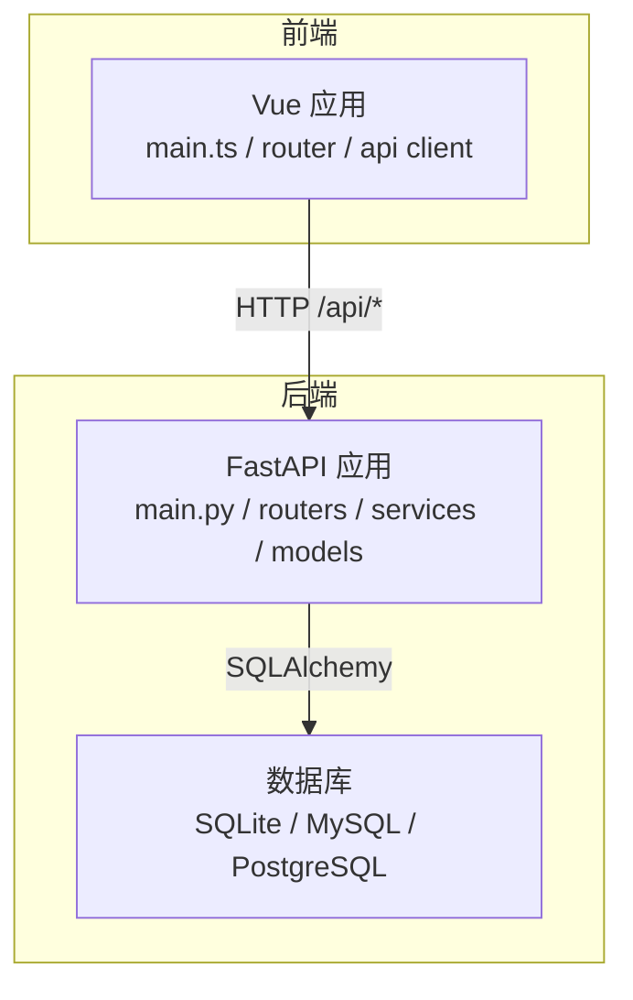
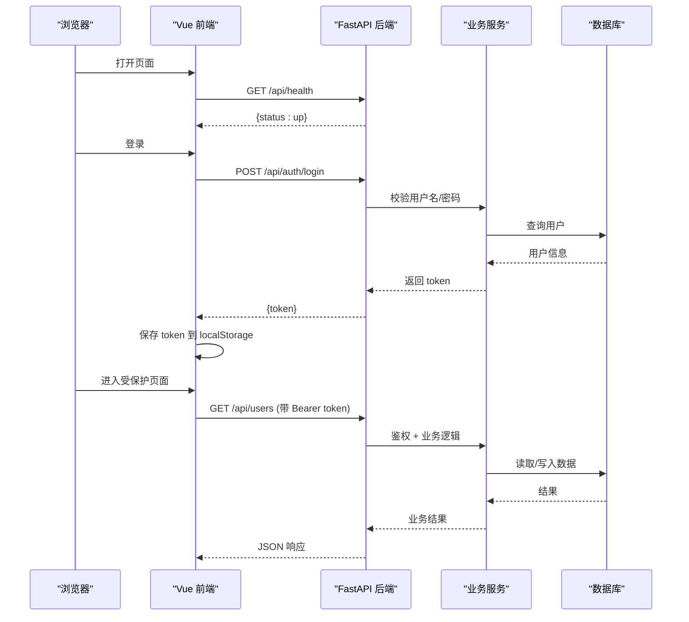
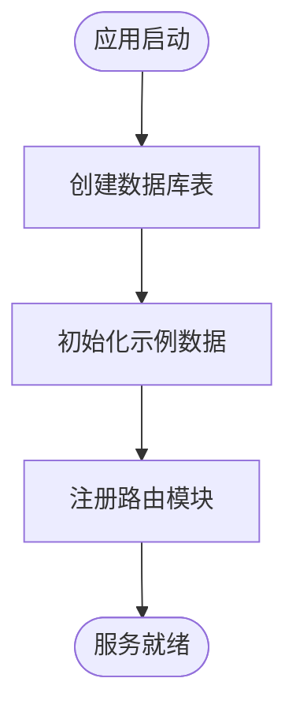
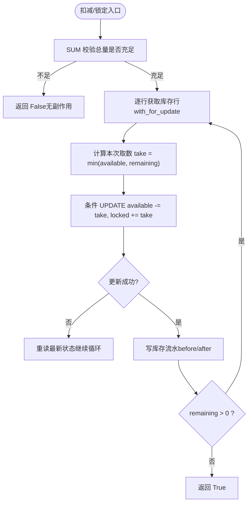
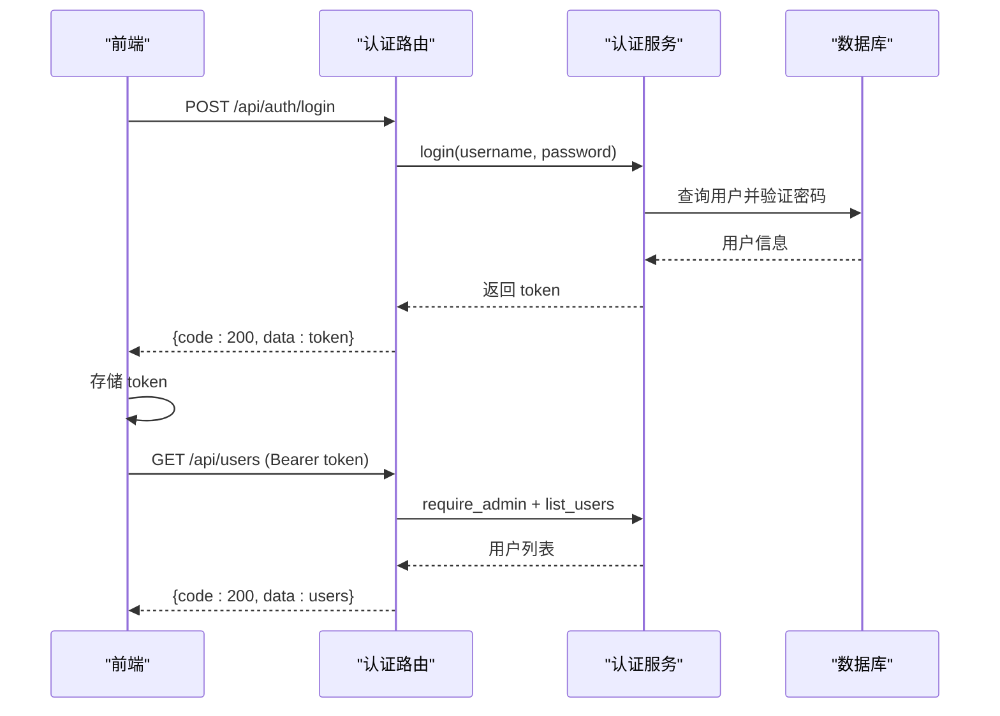
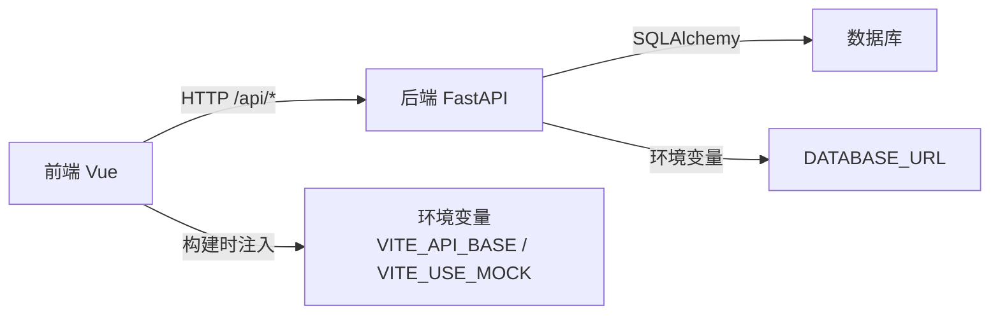

# 整体架构概览

<cite>
**本文引用的文件**
- [backend-python/app/main.py](file://backend-python/app/main.py)
- [backend-python/app/database.py](file://backend-python/app/database.py)
- [backend-python/app/models/base.py](file://backend-python/app/models/base.py)
- [backend-python/app/routers/auth.py](file://backend-python/app/routers/auth.py)
- [backend-python/app/services/inventory_service.py](file://backend-python/app/services/inventory_service.py)
- [frontend-vue/src/main.ts](file://frontend-vue/src/main.ts)
- [frontend-vue/src/api/client.ts](file://frontend-vue/src/api/client.ts)
- [frontend-vue/src/router/index.ts](file://frontend-vue/src/router/index.ts)
- [docker-compose.yml](file://docker-compose.yml)
- [README.md](file://README.md)
- [docs/PRD.md](file://docs/PRD.md)
</cite>

## 目录
1. [简介](#简介)
2. [项目结构](#项目结构)
3. [核心组件](#核心组件)
4. [架构总览](#架构总览)
5. [详细组件分析](#详细组件分析)
6. [依赖关系分析](#依赖关系分析)
7. [性能与可扩展性](#性能与可扩展性)
8. [故障排查指南](#故障排查指南)
9. [结论](#结论)
10. [附录](#附录)

## 简介
本系统为“进销存 + 业财一体”的中后台 WMS，采用前后端分离架构：后端基于 FastAPI 提供 RESTful API，前端基于 Vue 3 + Element Plus 构建单页应用；数据层通过 SQLAlchemy 抽象，默认 SQLite 开发、可无缝切换 MySQL/PostgreSQL。系统以模块化单体为主，具备向微服务演进的扩展点（按业务域拆分路由与服务）。文档重点说明系统边界、外部集成点（认证、数据库）、请求处理流程、可扩展性与模块化原则。

**章节来源**
- [README.md:1-117](file://README.md#L1-L117)
- [docs/PRD.md:13-69](file://docs/PRD.md#L13-L69)

## 项目结构
仓库包含三大主体：
- 后端：backend-python（FastAPI 应用、路由、服务、模型、数据库配置）
- 前端：frontend-vue（Vue 3 应用、路由、状态管理、API 客户端）
- 部署与编排：docker-compose.yml（MySQL、后端、前端 Nginx）

**图表来源**
- [backend-python/app/main.py:27-69](file://backend-python/app/main.py#L27-L69)
- [frontend-vue/src/main.ts:1-19](file://frontend-vue/src/main.ts#L1-L19)
- [frontend-vue/src/api/client.ts:1-45](file://frontend-vue/src/api/client.ts#L1-L45)
- [backend-python/app/database.py:1-38](file://backend-python/app/database.py#L1-L38)

**章节来源**
- [README.md:81-117](file://README.md#L81-L117)
- [docker-compose.yml:1-46](file://docker-compose.yml#L1-L46)

## 核心组件
- 后端入口与生命周期：FastAPI 应用启动时自动建表并初始化示例数据；统一异常处理器；CORS 中间件；注册各业务路由模块。
- 数据访问层：SQLAlchemy 引擎与 Session 工厂，支持环境变量切换数据库；Base 模型基类；get_db 依赖注入。
- 领域模型：仓库/库区/库位、商品、客户等基础实体；库存行（product_id, location_code, batch_id）分离可用量与锁定量。
- 业务服务：库存服务作为所有库存变动的唯一入口，强制写流水，保证全量可追溯与并发安全。
- 认证与权限：登录/登出/当前用户、管理员鉴权；前端路由守卫与 Token 拦截器。
- 前端应用：Vue 3 + Pinia + Element Plus；路由守卫控制登录态与角色；axios 客户端统一封装请求/响应拦截与 Mock 模式。

**章节来源**
- [backend-python/app/main.py:16-69](file://backend-python/app/main.py#L16-L69)
- [backend-python/app/database.py:1-38](file://backend-python/app/database.py#L1-L38)
- [backend-python/app/models/base.py:14-95](file://backend-python/app/models/base.py#L14-L95)
- [backend-python/app/services/inventory_service.py:1-200](file://backend-python/app/services/inventory_service.py#L1-L200)
- [backend-python/app/routers/auth.py:1-68](file://backend-python/app/routers/auth.py#L1-L68)
- [frontend-vue/src/router/index.ts:1-48](file://frontend-vue/src/router/index.ts#L1-L48)
- [frontend-vue/src/api/client.ts:1-45](file://frontend-vue/src/api/client.ts#L1-L45)

## 架构总览
系统采用前后端分离的模块化单体架构，遵循“路由→服务→模型/数据库”的分层设计。认证由后端提供 Token，前端通过拦截器附加 Authorization 头；数据库通过环境变量动态切换，便于开发与生产一致化。

**图表来源**
- [backend-python/app/main.py:72-84](file://backend-python/app/main.py#L72-L84)
- [backend-python/app/routers/auth.py:14-32](file://backend-python/app/routers/auth.py#L14-L32)
- [frontend-vue/src/api/client.ts:18-42](file://frontend-vue/src/api/client.ts#L18-L42)

## 详细组件分析

### 后端 FastAPI 应用
- 应用生命周期：lifespan 中创建表并初始化种子数据（仅库为空时），确保本地与容器环境开箱即用。
- 中间件与异常：启用 CORS；统一 BusinessError 转 JSON 响应，保持与 HTTPException 一致的响应体。
- 路由注册：按业务域划分路由模块（库存、出入库、波次、财务、经营驾驶舱等），便于后续拆分为独立服务。

**图表来源**
- [backend-python/app/main.py:16-31](file://backend-python/app/main.py#L16-L31)
- [backend-python/app/main.py:53-69](file://backend-python/app/main.py#L53-L69)

**章节来源**
- [backend-python/app/main.py:16-84](file://backend-python/app/main.py#L16-L84)

### 数据访问层（数据库）
- 连接策略：默认 SQLite（psi_fin.db），可通过 DATABASE_URL 切换至 MySQL/PostgreSQL；生产建议使用关系型数据库。
- 会话管理：SessionLocal 配合 get_db 依赖注入，确保请求级事务与资源释放。
- 模型基类：Base 继承 DeclarativeBase，供所有 ORM 模型使用。

**章节来源**
- [backend-python/app/database.py:1-38](file://backend-python/app/database.py#L1-L38)

### 领域模型（基础数据）
- 仓库层级：Warehouse → Zone → Location，Location 带优先级用于上架推荐。
- 商品与客户：Product 含 FNSKU、箱规、尺寸重量；Customer 分层 A/B/C。
- 这些模型为库存、出入库、波次等业务提供基础维度。

**章节来源**
- [backend-python/app/models/base.py:14-95](file://backend-python/app/models/base.py#L14-L95)

### 库存服务（核心业务）
- 设计原则：所有库存变动必须通过该服务，强制写流水；库存行维度为 (product_id, location_code, batch_id)，available 与 locked 分离。
- 并发安全：SUM 预校验总量不足直接返回 False；逐行条件 UPDATE（available >= take）+ with_for_update()；失败重读重试，避免并发覆盖。
- 流水记录：每次扣减/锁定/入库/移库/调整/退货均写 InventoryFlow，保留 before/after 数量与备注。

**图表来源**
- [backend-python/app/services/inventory_service.py:91-200](file://backend-python/app/services/inventory_service.py#L91-L200)

**章节来源**
- [backend-python/app/services/inventory_service.py:1-200](file://backend-python/app/services/inventory_service.py#L1-L200)

### 认证与权限
- 后端：提供登录、登出、当前用户接口；管理员操作需 require_admin 依赖。
- 前端：路由守卫检查 token 与角色；axios 拦截器自动附加 Authorization 头，401 时清理登录态并跳转登录。

**图表来源**
- [backend-python/app/routers/auth.py:14-68](file://backend-python/app/routers/auth.py#L14-L68)
- [frontend-vue/src/api/client.ts:18-42](file://frontend-vue/src/api/client.ts#L18-L42)
- [frontend-vue/src/router/index.ts:31-45](file://frontend-vue/src/router/index.ts#L31-L45)

**章节来源**
- [backend-python/app/routers/auth.py:1-68](file://backend-python/app/routers/auth.py#L1-L68)
- [frontend-vue/src/api/client.ts:1-45](file://frontend-vue/src/api/client.ts#L1-L45)
- [frontend-vue/src/router/index.ts:1-48](file://frontend-vue/src/router/index.ts#L1-L48)

### 前端应用
- 应用初始化：挂载 Pinia、Element Plus、路由；全局注册图标。
- 路由与守卫：登录后默认进入看板；/users 仅管理员；未登录重定向到登录页。
- API 客户端：统一 baseURL（/api 或 VITE_API_BASE），Mock 模式开关，请求/响应拦截器处理 token 与错误。

**章节来源**
- [frontend-vue/src/main.ts:1-19](file://frontend-vue/src/main.ts#L1-L19)
- [frontend-vue/src/router/index.ts:1-48](file://frontend-vue/src/router/index.ts#L1-L48)
- [frontend-vue/src/api/client.ts:1-45](file://frontend-vue/src/api/client.ts#L1-L45)

## 依赖关系分析
- 前端依赖：Vue Router、Pinia、Element Plus、ECharts；axios 客户端通过环境变量切换真实后端或 Mock。
- 后端依赖：FastAPI、Uvicorn、SQLAlchemy、Pydantic v2、Alembic；数据库驱动支持 SQLite/MySQL/PostgreSQL。
- 部署依赖：Docker Compose 编排 MySQL、后端、前端（Nginx 反代 /api）。

**图表来源**
- [frontend-vue/src/api/client.ts:4-16](file://frontend-vue/src/api/client.ts#L4-L16)
- [backend-python/app/database.py:11-22](file://backend-python/app/database.py#L11-L22)
- [docker-compose.yml:22-42](file://docker-compose.yml#L22-L42)

**章节来源**
- [backend-python/pyproject.toml:1-36](file://backend-python/pyproject.toml#L1-L36)
- [frontend-vue/package.json:1-34](file://frontend-vue/package.json#L1-L34)
- [docker-compose.yml:1-46](file://docker-compose.yml#L1-L46)

## 性能与可扩展性
- 性能要点：
  - 库存扣减/锁定采用 SUM 预校验 + 条件 UPDATE + 行锁（PostgreSQL），避免超卖与并发覆盖。
  - 全量库存流水记录，便于审计与报表取数。
  - 前端服务端分页、搜索防抖（见 README 优化建议）。
- 可扩展性：
  - 模块化单体：路由按业务域拆分，未来可按域拆分为独立服务（如 inventory、finance、auth）。
  - 数据库可移植：通过 DATABASE_URL 切换，适配不同环境。
  - 认证与权限：Token 机制与前端守卫解耦，便于接入 OAuth/SSO（非本期目标）。
  - 外部集成点：预留文件存储、消息队列、AI 能力（PRD 中明确 AI 为可选模块，核心不依赖）。

**章节来源**
- [backend-python/app/services/inventory_service.py:1-200](file://backend-python/app/services/inventory_service.py#L1-L200)
- [README.md:58-79](file://README.md#L58-L79)
- [docs/PRD.md:99-118](file://docs/PRD.md#L99-L118)

## 故障排查指南
- 健康检查：/api/health 用于存活探针与冷启动预热，无需鉴权与数据库连接。
- 认证问题：
  - 401 时前端自动清除 token 并跳转登录；检查 Authorization 头是否正确附加。
  - 后端登出使 token 失效，重新登录获取新 token。
- 数据库连接：
  - 确认 DATABASE_URL 设置正确；本地开发默认 SQLite，生产建议使用 MySQL/PostgreSQL。
  - Docker Compose 中 mysql 服务健康检查通过后 backend 才启动。
- 库存并发：
  - 若出现扣减失败，检查库存总量与批次可用性；日志关注 InventoryFlow 记录。
  - 在高并发场景下，确保使用支持行锁的数据库（PostgreSQL）。

**章节来源**
- [backend-python/app/main.py:72-84](file://backend-python/app/main.py#L72-L84)
- [frontend-vue/src/api/client.ts:27-42](file://frontend-vue/src/api/client.ts#L27-L42)
- [backend-python/app/database.py:11-22](file://backend-python/app/database.py#L11-L22)
- [docker-compose.yml:5-20](file://docker-compose.yml#L5-L20)

## 结论
本 WMS 系统以模块化单体架构实现前后端分离，核心围绕库存与业财一体化展开。通过统一的服务入口与全量流水，保障数据一致性与可追溯性；通过环境变量与 ORM 抽象，实现数据库可移植与环境一致性。系统具备清晰的扩展边界与演进路径，可在需要时按业务域拆分为微服务，并逐步引入外部集成（认证、文件存储、AI 能力）。

## 附录
- 快速启动：推荐使用 docker-compose 一键启动全栈；本地开发可分别启动前后端。
- 在线演示：提供真后端与纯前端 Mock 两种模式，便于体验与发布。
- 测试：后端 pytest、前端 vitest 与 Playwright E2E，保障质量与回归。

**章节来源**
- [README.md:121-167](file://README.md#L121-L167)
- [README.md:216-241](file://README.md#L216-L241)