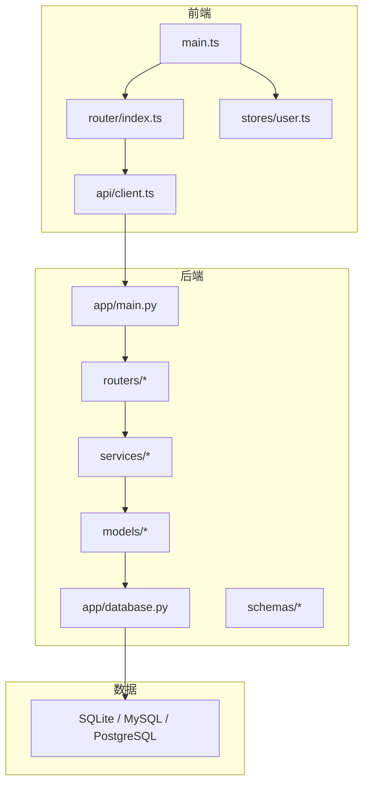
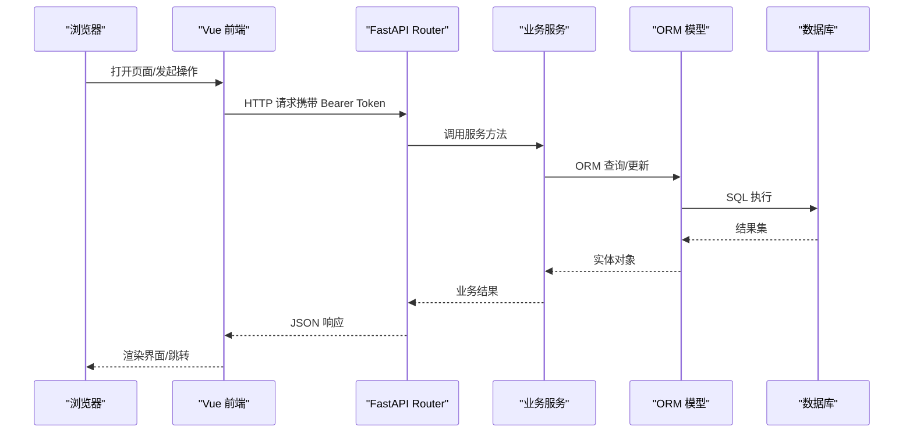
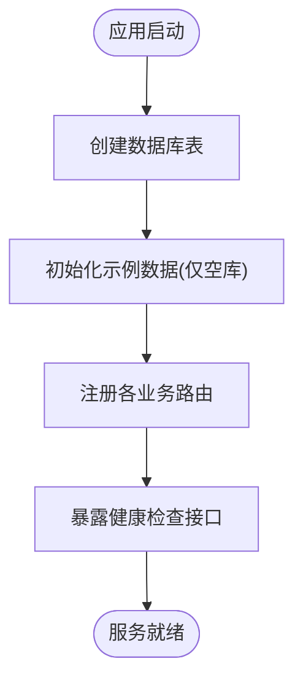
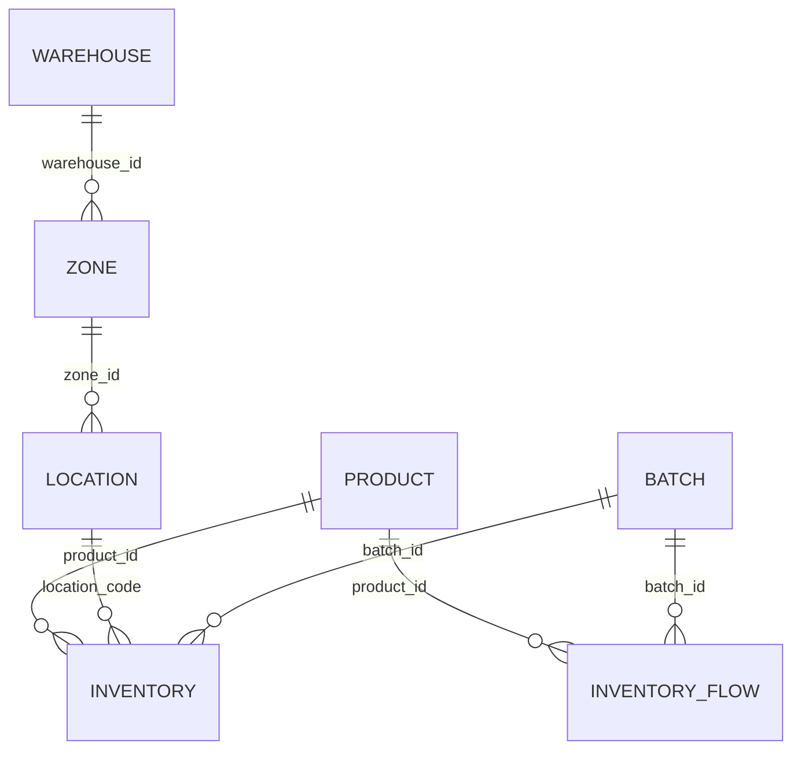
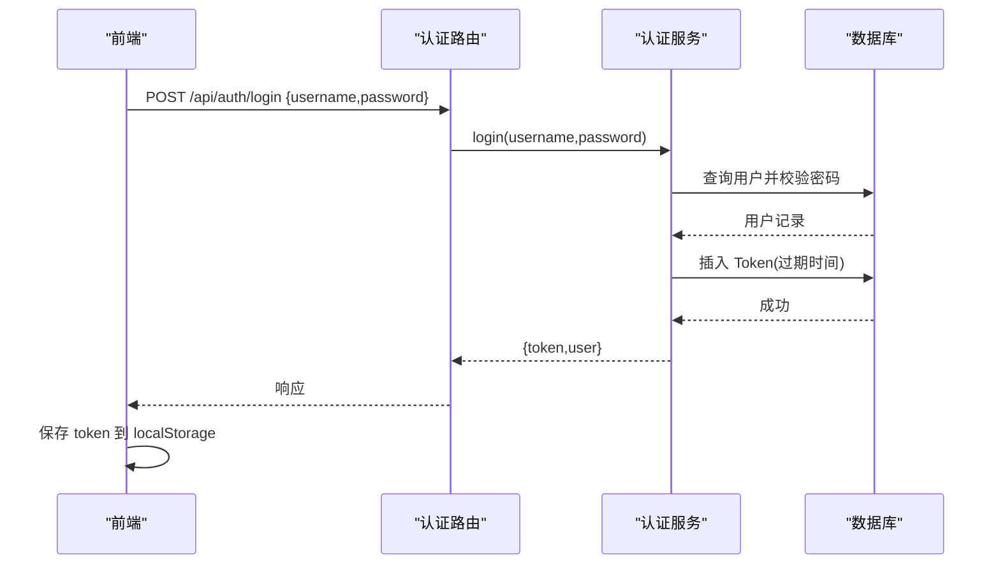
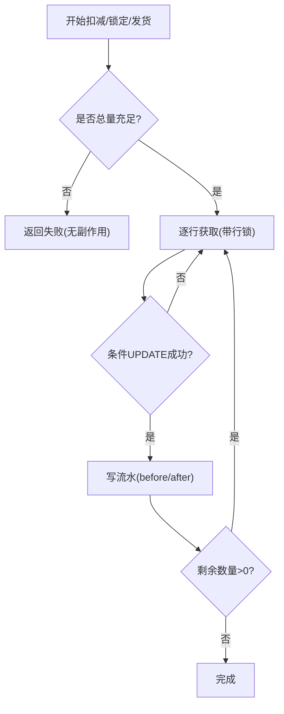
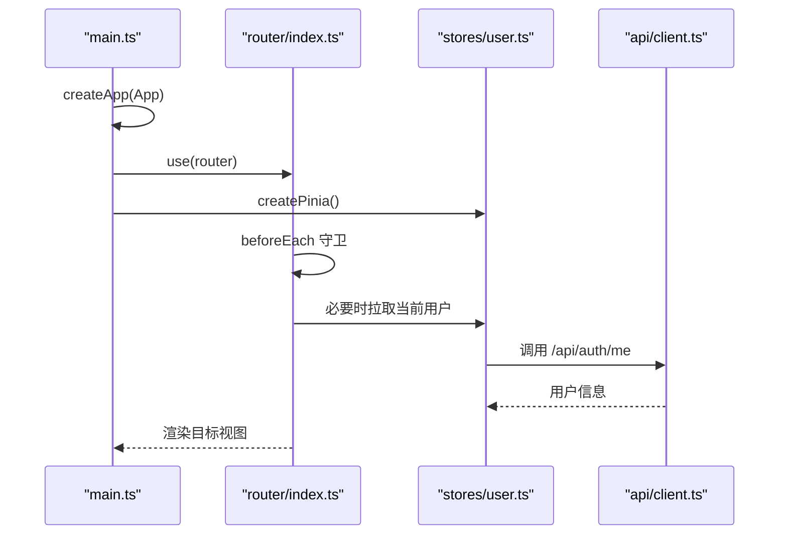
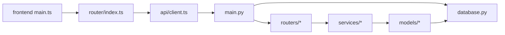
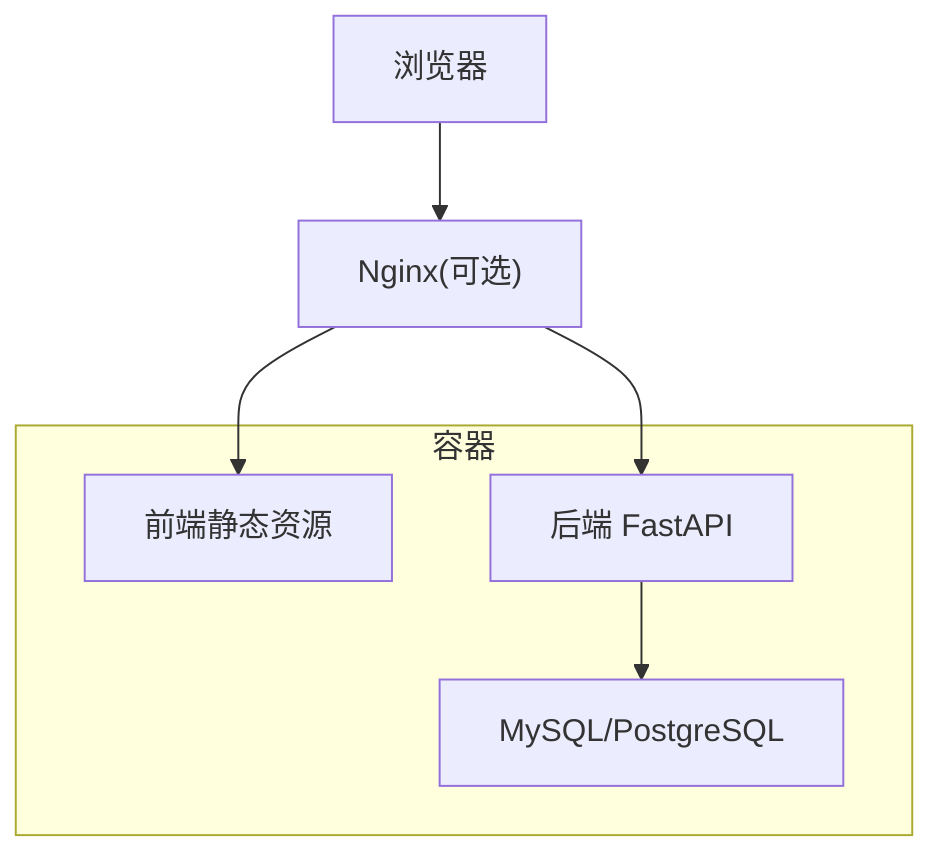

# 系统架构设计

<cite>
**本文引用的文件**
- [backend-python/app/main.py](file://backend-python/app/main.py)
- [backend-python/app/database.py](file://backend-python/app/database.py)
- [backend-python/app/models/base.py](file://backend-python/app/models/base.py)
- [backend-python/app/models/inventory.py](file://backend-python/app/models/inventory.py)
- [backend-python/app/services/inventory_service.py](file://backend-python/app/services/inventory_service.py)
- [backend-python/app/services/auth_service.py](file://backend-python/app/services/auth_service.py)
- [backend-python/app/routers/auth.py](file://backend-python/app/routers/auth.py)
- [backend-python/init_data.py](file://backend-python/init_data.py)
- [frontend-vue/src/main.ts](file://frontend-vue/src/main.ts)
- [frontend-vue/src/router/index.ts](file://frontend-vue/src/router/index.ts)
- [frontend-vue/src/api/client.ts](file://frontend-vue/src/api/client.ts)
- [frontend-vue/src/stores/user.ts](file://frontend-vue/src/stores/user.ts)
- [docker-compose.yml](file://docker-compose.yml)
- [README.md](file://README.md)
</cite>

## 目录
1. [简介](#简介)
2. [项目结构](#项目结构)
3. [核心组件](#核心组件)
4. [架构总览](#架构总览)
5. [详细组件分析](#详细组件分析)
6. [依赖关系分析](#依赖关系分析)
7. [性能与可扩展性](#性能与可扩展性)
8. [故障排查指南](#故障排查指南)
9. [结论](#结论)
10. [附录](#附录)

## 简介
本系统为“进销存 + 业财一体”中后台，后端采用 Python FastAPI + SQLAlchemy，前端采用 Vue 3 + Element Plus + Pinia。系统支持 SQLite（开发零配置）与 MySQL/PostgreSQL（生产可切换），通过 Docker Compose 一键启动全栈。库存底座对标领星跨境仓储系统：批次库存、可用+锁定分离、全量流水、单据状态机；业财层打通销售订单→发货生成应收→收款核销→经营驾驶舱的收入侧闭环。

## 项目结构
- 后端（backend-python）
  - app/main.py：FastAPI 应用入口，定义生命周期、CORS、路由注册、健康检查与统一异常处理
  - app/database.py：数据库引擎与会话管理，SQLite/MySQL/PG 自动切换
  - app/models/*：SQLAlchemy 数据模型（基础主数据、库存域等）
  - app/schemas/*：Pydantic v2 请求/响应契约（camelCase 双向兼容）
  - app/services/*：业务服务（库存、认证、财务等）
  - app/routers/*：API 路由模块（按领域划分）
  - init_data.py：启动时建表与种子数据（仅空库时执行）
- 前端（frontend-vue）
  - src/main.ts：应用初始化（Pinia、Element Plus、Router）
  - src/router/index.ts：路由与登录守卫
  - src/api/client.ts：Axios 客户端（Mock/真实后端切换、鉴权拦截）
  - src/stores/user.ts：用户态（登录/登出/当前用户）
- 基础设施
  - docker-compose.yml：MySQL + Backend + Frontend 编排
  - README.md：技术栈、快速启动、功能说明、测试与部署

**图表来源**
- [backend-python/app/main.py:16-69](file://backend-python/app/main.py#L16-L69)
- [backend-python/app/database.py:1-38](file://backend-python/app/database.py#L1-L38)
- [frontend-vue/src/main.ts:1-19](file://frontend-vue/src/main.ts#L1-L19)
- [frontend-vue/src/router/index.ts:1-48](file://frontend-vue/src/router/index.ts#L1-L48)
- [frontend-vue/src/api/client.ts:1-45](file://frontend-vue/src/api/client.ts#L1-L45)

**章节来源**
- [README.md:66-115](file://README.md#L66-L115)
- [docker-compose.yml:1-46](file://docker-compose.yml#L1-L46)

## 核心组件
- 应用生命周期与健康检查
  - 启动时创建所有表并初始化示例数据（仅空库）
  - 提供 /api/health 存活探针，不查库、无鉴权
- 数据库连接策略
  - 默认 SQLite（本地 psi_fin.db），可通过环境变量 DATABASE_URL 切换至 MySQL/PostgreSQL
  - 会话通过 get_db 依赖注入，自动关闭
- 安全与鉴权
  - 密码 PBKDF2-SHA256 + 随机盐，Token 入库可撤销，有效期 7 天
  - 全局依赖 get_current_user、require_admin 实现接口级鉴权与角色控制
- 库存核心
  - 可用量与锁定量分离，批次维度管理
  - 全量流水记录每次变动（before/after）
  - 并发防超卖：SUM 校验 + with_for_update + 条件 UPDATE + 失败重试
- 前后端契约
  - Pydantic CamelModel 统一 camelCase 输入输出，避免命名不一致问题

**章节来源**
- [backend-python/app/main.py:16-85](file://backend-python/app/main.py#L16-L85)
- [backend-python/app/database.py:1-38](file://backend-python/app/database.py#L1-L38)
- [backend-python/app/services/auth_service.py:1-176](file://backend-python/app/services/auth_service.py#L1-L176)
- [backend-python/app/services/inventory_service.py:1-437](file://backend-python/app/services/inventory_service.py#L1-L437)
- [backend-python/app/schemas/base.py:11-35](file://backend-python/app/schemas/base.py#L11-L35)

## 架构总览
系统采用分层架构与 MVC 模式：
- 表现层（View）：Vue 前端页面与路由守卫，负责交互与状态展示
- 控制器层（Controller）：FastAPI Router，接收请求、参数校验、调用服务
- 服务层（Service）：业务逻辑封装（库存、认证、财务等），保证事务边界与一致性
- 数据访问层（Model）：SQLAlchemy 模型与查询，持久化到数据库
- 基础设施：Docker Compose 编排，Nginx 反代（生产），CI/CD 自动化构建与发布

**图表来源**
- [backend-python/app/routers/auth.py:14-33](file://backend-python/app/routers/auth.py#L14-L33)
- [backend-python/app/services/auth_service.py:116-134](file://backend-python/app/services/auth_service.py#L116-L134)
- [frontend-vue/src/api/client.ts:18-42](file://frontend-vue/src/api/client.ts#L18-L42)

## 详细组件分析

### 后端应用生命周期与路由注册
- 生命周期：lifespan 钩子在启动时创建表并初始化示例数据（仅当库为空）
- 中间件：CORS 允许跨域（开发/代理场景）
- 路由：按领域注册多个 router（产品、仓库、入库、出库、库存、波次、退货、调拨、盘点、销售订单、财务、经营驾驶舱等）
- 健康检查：/api/health 返回版本信息，供前端预热与外部保活

**图表来源**
- [backend-python/app/main.py:16-69](file://backend-python/app/main.py#L16-L69)
- [backend-python/init_data.py:12-84](file://backend-python/init_data.py#L12-L84)

**章节来源**
- [backend-python/app/main.py:16-85](file://backend-python/app/main.py#L16-L85)
- [backend-python/init_data.py:12-157](file://backend-python/init_data.py#L12-L157)

### 数据库连接与模型设计
- 连接策略：读取 DATABASE_URL，未设置则使用相对路径的 SQLite 文件
- 会话管理：SessionLocal + get_db 依赖注入，确保请求级事务与资源释放
- 基础模型：Product、Customer、Warehouse、Zone、Location 构成主数据骨架
- 库存模型：Batch、Inventory（available/locked）、InventoryFlow（全量流水）

**图表来源**
- [backend-python/app/models/base.py:14-95](file://backend-python/app/models/base.py#L14-L95)
- [backend-python/app/models/inventory.py:18-98](file://backend-python/app/models/inventory.py#L18-L98)
- [backend-python/app/database.py:1-38](file://backend-python/app/database.py#L1-L38)

**章节来源**
- [backend-python/app/database.py:1-38](file://backend-python/app/database.py#L1-L38)
- [backend-python/app/models/base.py:14-95](file://backend-python/app/models/base.py#L14-L95)
- [backend-python/app/models/inventory.py:18-98](file://backend-python/app/models/inventory.py#L18-L98)

### 认证与授权流程
- 登录：验证用户名/密码，签发随机 Token 并写入数据库，返回 token 与用户信息
- 鉴权：get_current_user 解析 Authorization 头，校验 Token 有效性及用户状态
- 权限：require_admin 限制管理员专属接口
- 前端：axios 拦截器自动附加 Token，401 时清理本地态并跳转登录页

**图表来源**
- [backend-python/app/routers/auth.py:14-33](file://backend-python/app/routers/auth.py#L14-L33)
- [backend-python/app/services/auth_service.py:116-134](file://backend-python/app/services/auth_service.py#L116-L134)
- [frontend-vue/src/api/client.ts:18-42](file://frontend-vue/src/api/client.ts#L18-L42)
- [frontend-vue/src/stores/user.ts:21-46](file://frontend-vue/src/stores/user.ts#L21-L46)

**章节来源**
- [backend-python/app/services/auth_service.py:1-176](file://backend-python/app/services/auth_service.py#L1-L176)
- [backend-python/app/routers/auth.py:1-68](file://backend-python/app/routers/auth.py#L1-L68)
- [frontend-vue/src/stores/user.ts:1-49](file://frontend-vue/src/stores/user.ts#L1-L49)

### 库存核心：可用/锁定与全量流水
- 设计原则：所有库存变动必须通过统一入口，强制写流水，保证可追溯
- 并发安全：先 SUM 总量校验，再逐行 with_for_update + 条件 UPDATE，失败重读重试
- 关键能力：
  - add_stock：入库/移库入/盘盈增加可用量
  - deduct_stock：出库扣减可用量（跨批次 FIFO）
  - lock_stock：拣货锁定（available- → locked+）
  - ship_stock：发货扣减锁定量
- 查询优化：joinedload 预加载关联，避免 N+1；分页与多条件过滤

**图表来源**
- [backend-python/app/services/inventory_service.py:91-251](file://backend-python/app/services/inventory_service.py#L91-L251)

**章节来源**
- [backend-python/app/services/inventory_service.py:1-437](file://backend-python/app/services/inventory_service.py#L1-L437)
- [backend-python/app/models/inventory.py:18-98](file://backend-python/app/models/inventory.py#L18-L98)

### 前端初始化与路由守卫
- 应用初始化：创建 Vue 应用，挂载 Pinia、Element Plus、Router
- 路由：Hash 模式，集中定义页面路由与元信息（标题、权限）
- 守卫：除登录外均要求登录；/users 仅管理员可访问
- API 客户端：baseURL 可配置，Mock 模式开关，自动附加 Bearer Token，401 清理态并跳转

**图表来源**
- [frontend-vue/src/main.ts:1-19](file://frontend-vue/src/main.ts#L1-L19)
- [frontend-vue/src/router/index.ts:1-48](file://frontend-vue/src/router/index.ts#L1-L48)
- [frontend-vue/src/api/client.ts:1-45](file://frontend-vue/src/api/client.ts#L1-L45)
- [frontend-vue/src/stores/user.ts:1-49](file://frontend-vue/src/stores/user.ts#L1-L49)

**章节来源**
- [frontend-vue/src/main.ts:1-19](file://frontend-vue/src/main.ts#L1-L19)
- [frontend-vue/src/router/index.ts:1-48](file://frontend-vue/src/router/index.ts#L1-L48)
- [frontend-vue/src/api/client.ts:1-45](file://frontend-vue/src/api/client.ts#L1-L45)
- [frontend-vue/src/stores/user.ts:1-49](file://frontend-vue/src/stores/user.ts#L1-L49)

### MVC 职责划分
- Model（数据模型）：SQLAlchemy 模型定义表结构与关系，承载数据约束与索引
- View（视图）：Vue 页面与组件，负责 UI 渲染与用户交互
- Controller（控制器）：FastAPI Router 接收请求、参数校验、调用服务并返回响应
- Service（服务）：业务规则与事务边界，协调多个 Model 操作，保证一致性
- Schema（契约）：Pydantic 模型统一前后端字段命名与校验

**章节来源**
- [backend-python/app/models/base.py:14-95](file://backend-python/app/models/base.py#L14-L95)
- [backend-python/app/models/inventory.py:18-98](file://backend-python/app/models/inventory.py#L18-L98)
- [backend-python/app/routers/auth.py:1-68](file://backend-python/app/routers/auth.py#L1-L68)
- [backend-python/app/services/auth_service.py:1-176](file://backend-python/app/services/auth_service.py#L1-L176)
- [backend-python/app/schemas/base.py:11-35](file://backend-python/app/schemas/base.py#L11-L35)

## 依赖关系分析
- 后端内部依赖
  - main.py 依赖 database、routers、common/errors
  - routers 依赖 services、schemas、database
  - services 依赖 models、database、common/errors
  - models 依赖 database.Base
- 前端依赖
  - main.ts 依赖 router、stores、UI 框架
  - api/client.ts 提供统一的网络请求与拦截
  - stores/user.ts 依赖 api 进行登录态管理
- 基础设施依赖
  - docker-compose.yml 编排 MySQL、Backend、Frontend，声明端口与环境变量

**图表来源**
- [backend-python/app/main.py:16-69](file://backend-python/app/main.py#L16-L69)
- [backend-python/app/database.py:1-38](file://backend-python/app/database.py#L1-L38)
- [frontend-vue/src/main.ts:1-19](file://frontend-vue/src/main.ts#L1-L19)
- [frontend-vue/src/router/index.ts:1-48](file://frontend-vue/src/router/index.ts#L1-L48)
- [frontend-vue/src/api/client.ts:1-45](file://frontend-vue/src/api/client.ts#L1-L45)

**章节来源**
- [docker-compose.yml:1-46](file://docker-compose.yml#L1-L46)

## 性能与可扩展性
- 数据库
  - 开发默认 SQLite，零配置；生产建议 MySQL/PostgreSQL，通过 DATABASE_URL 无缝切换
  - 库存查询使用 joinedload 减少 N+1；常用列建立索引提升查询效率
- 并发与一致性
  - 库存操作使用 with_for_update（PG 生效，SQLite 忽略）+ 条件 UPDATE + 失败重试，防止超卖
  - 整单事务：任一明细失败回滚，不留半成品
- 前端性能
  - 服务端分页 + 搜索防抖（文档提及）；Mock 模式便于离线开发与演示
- 可扩展性
  - 模块化路由与服务，新增领域只需添加 router/service/schema/model
  - 容器化编排，水平扩展后端实例，配合反向代理与负载均衡

[本节为通用指导，不直接分析具体文件]

## 故障排查指南
- 登录失败或 401
  - 检查前端是否携带 Authorization: Bearer <token>
  - 检查后端 Token 是否有效且未过期
  - 确认用户状态为启用
- 库存不足或扣减失败
  - 检查 available/locked 是否足够
  - 查看 InventoryFlow 流水定位异常环节
- 健康检查
  - 访问 /api/health 确认后端服务状态
- 容器启动
  - 使用 docker compose up -d --build 一键启动
  - 检查 MySQL 健康检查与依赖顺序

**章节来源**
- [backend-python/app/main.py:72-85](file://backend-python/app/main.py#L72-L85)
- [backend-python/app/services/auth_service.py:152-176](file://backend-python/app/services/auth_service.py#L152-L176)
- [backend-python/app/services/inventory_service.py:91-251](file://backend-python/app/services/inventory_service.py#L91-L251)
- [docker-compose.yml:1-46](file://docker-compose.yml#L1-L46)

## 结论
本系统以清晰的层次化架构与 MVC 模式组织代码，后端通过 FastAPI 提供高内聚低耦合的 API，前端通过 Vue 3 提供现代化交互体验。库存核心以“可用/锁定分离 + 全量流水 + 并发防超卖”保障数据一致性与可追溯性。通过环境变量与容器编排，系统可在开发/生产环境间平滑迁移，具备良好的可扩展性与可维护性。

[本节为总结性内容，不直接分析具体文件]

## 附录

### 技术决策与权衡
- SQLite vs MySQL/PostgreSQL
  - SQLite：开发零配置、快速迭代；适合单机与轻量场景
  - MySQL/PostgreSQL：生产高并发、强一致、行锁与事务更完善；通过 DATABASE_URL 切换
- 前后端分离
  - 解耦开发与部署，前端可独立构建与发布（含 Mock 模式）
  - 通过 Nginx/Vite 代理统一 /api 路径，简化跨域与部署
- 鉴权方案
  - 基于 Token 的无状态鉴权思路（Token 入库可撤销），兼顾灵活与安全
  - 角色控制（admin/operator）满足最小权限原则

[本节为概念性内容，不直接分析具体文件]

### 部署拓扑图

**图表来源**
- [docker-compose.yml:1-46](file://docker-compose.yml#L1-L46)
- [frontend-vue/src/api/client.ts:4-16](file://frontend-vue/src/api/client.ts#L4-L16)

### 横切关注点
- 安全性
  - 密码哈希（PBKDF2-SHA256）、Token 失效机制、接口级鉴权与角色控制
  - CORS 在代理场景下按需放宽
- 监控
  - 健康检查 /api/health 用于存活探测与冷启动预热
  - 日志与错误统一处理（BusinessError 转 JSON 响应）
- 灾难恢复
  - 数据库备份策略（生产环境建议定期备份）
  - 容器重启策略（restart: unless-stopped）

**章节来源**
- [backend-python/app/services/auth_service.py:25-43](file://backend-python/app/services/auth_service.py#L25-L43)
- [backend-python/app/main.py:35-51](file://backend-python/app/main.py#L35-L51)
- [docker-compose.yml:15-20](file://docker-compose.yml#L15-L20)