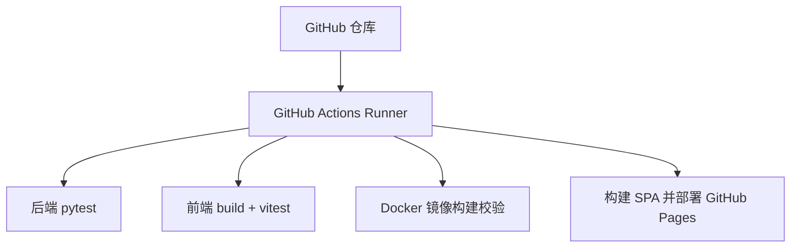
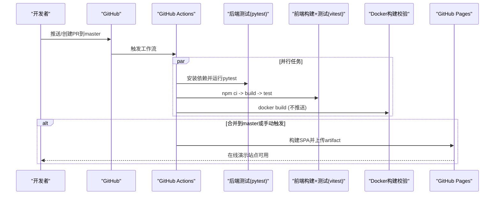
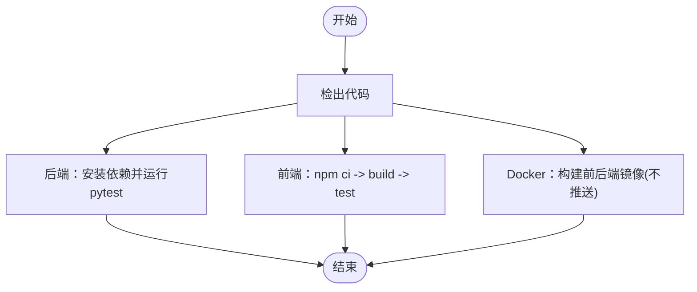
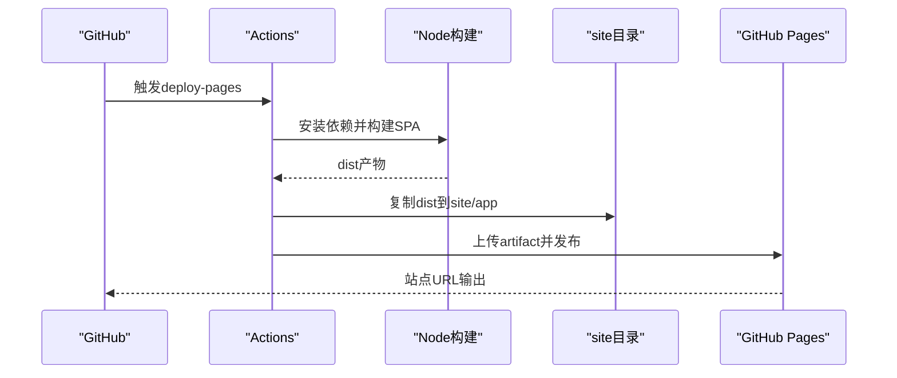
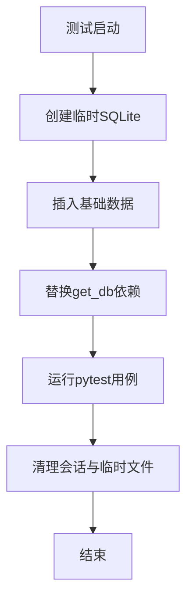
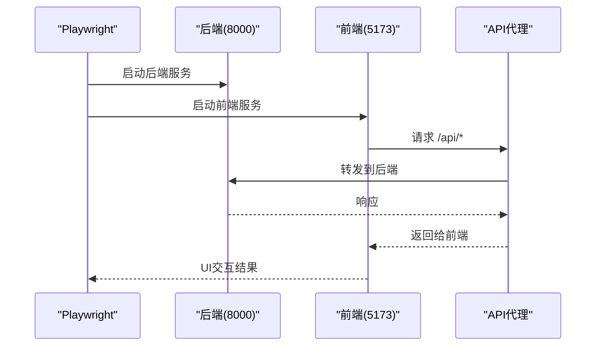
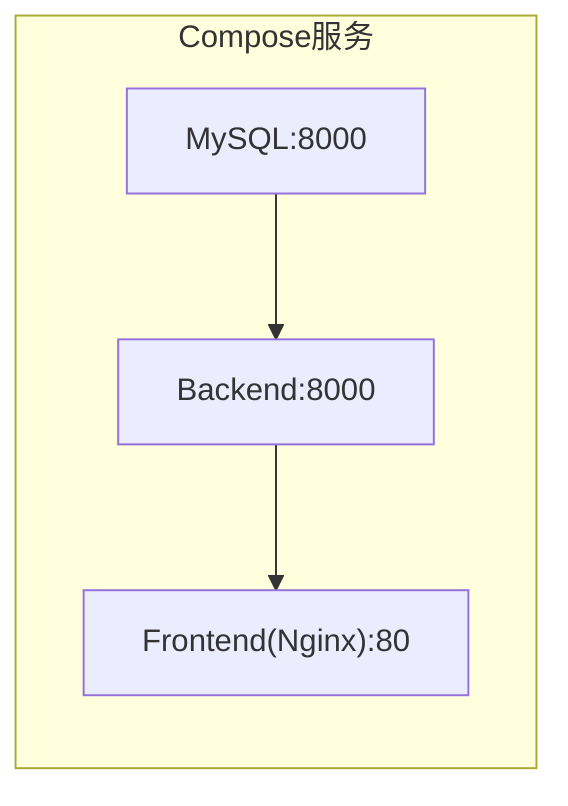
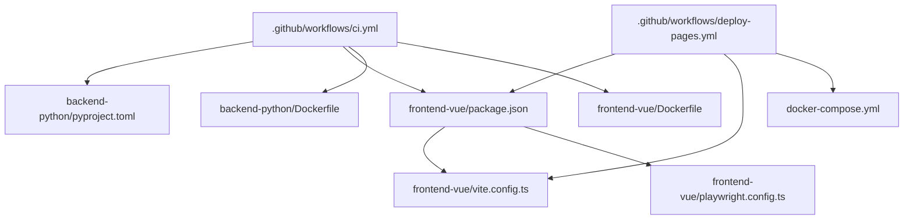

# CI/CD流水线

<cite>
**本文引用的文件**
- [ci.yml](file://.github/workflows/ci.yml)
- [deploy-pages.yml](file://.github/workflows/deploy-pages.yml)
- [pyproject.toml](file://backend-python/pyproject.toml)
- [Dockerfile（后端）](file://backend-python/Dockerfile)
- [Dockerfile（前端）](file://frontend-vue/Dockerfile)
- [vite.config.ts](file://frontend-vue/vite.config.ts)
- [playwright.config.ts](file://frontend-vue/playwright.config.ts)
- [docker-compose.yml](file://docker-compose.yml)
- [README.md](file://README.md)
</cite>

## 目录
1. [简介](#简介)
2. [项目结构](#项目结构)
3. [核心组件](#核心组件)
4. [架构总览](#架构总览)
5. [详细组件分析](#详细组件分析)
6. [依赖关系分析](#依赖关系分析)
7. [性能与稳定性](#性能与稳定性)
8. [故障排查指南](#故障排查指南)
9. [结论](#结论)
10. [附录：扩展与监控](#附录：扩展与监控)

## 简介
本仓库为WMS系统（进销存·业财一体中后台），采用前后端分离架构。CI/CD基于GitHub Actions，覆盖代码检查、单元测试、容器镜像构建校验以及演示站点发布。本文档聚焦于工作流配置、自动化流程、环境策略、扩展点与可观测性实践，帮助团队在开发、测试、生产等环境中稳定交付。

## 项目结构
- 后端：Python + FastAPI，使用pytest进行单元测试，提供Docker镜像构建与本地一键启动。
- 前端：Vue 3 + TypeScript + Vite，使用vitest进行单元测试，Playwright进行E2E，Nginx托管静态产物。
- CI：两个工作流
  - ci.yml：触发于push/PR到master，执行后端pytest、前端build+vitest、Docker镜像构建校验。
  - deploy-pages.yml：将前端SPA构建产物发布到GitHub Pages，支持手动触发。

**图表来源**
- [ci.yml:1-67](file://.github/workflows/ci.yml#L1-L67)
- [deploy-pages.yml:1-61](file://.github/workflows/deploy-pages.yml#L1-L61)

**章节来源**
- [ci.yml:1-67](file://.github/workflows/ci.yml#L1-L67)
- [deploy-pages.yml:1-61](file://.github/workflows/deploy-pages.yml#L1-L61)
- [README.md:233-241](file://README.md#L233-L241)

## 核心组件
- 后端测试：使用pytest，通过临时SQLite数据库隔离，不依赖真实数据库。
- 前端构建与测试：TypeScript类型检查、Vite构建、vitest单元测试；E2E由Playwright自动拉起前后端服务。
- 容器化：前后端分别提供Dockerfile，CI中进行构建校验（不推送镜像）。
- 演示站点发布：构建前端SPA并拷贝至site/app，发布到GitHub Pages。

**章节来源**
- [pyproject.toml:19-24](file://backend-python/pyproject.toml#L19-L24)
- [package.json:6-13](file://frontend-vue/package.json#L6-L13)
- [Dockerfile（后端）:1-27](file://backend-python/Dockerfile#L1-L27)
- [Dockerfile（前端）:1-25](file://frontend-vue/Dockerfile#L1-L25)
- [playwright.config.ts:1-49](file://frontend-vue/playwright.config.ts#L1-L49)

## 架构总览
下图展示了从代码提交到构建、测试、发布的完整流水线，包括并行执行的测试任务与最终的页面部署。

**图表来源**
- [ci.yml:1-67](file://.github/workflows/ci.yml#L1-L67)
- [deploy-pages.yml:1-61](file://.github/workflows/deploy-pages.yml#L1-L61)

## 详细组件分析

### 工作流一：CI（代码质量与构建校验）
- 触发条件：push/PR到master分支。
- 任务划分：
  - 后端pytest：安装依赖后运行测试，使用临时SQLite数据库，避免影响真实数据。
  - 前端构建与测试：npm ci缓存加速，执行类型检查与构建，再运行vitest。
  - Docker镜像构建校验：分别对前后端执行docker build，仅验证可构建性，不推送镜像仓库。

**图表来源**
- [ci.yml:1-67](file://.github/workflows/ci.yml#L1-L67)

**章节来源**
- [ci.yml:1-67](file://.github/workflows/ci.yml#L1-L67)
- [pyproject.toml:19-24](file://backend-python/pyproject.toml#L19-L24)
- [package.json:6-13](file://frontend-vue/package.json#L6-L13)

### 工作流二：Deploy Pages（演示站点发布）
- 触发条件：push到master或手动触发workflow_dispatch。
- 权限：读取内容、写入Pages、ID令牌。
- 步骤：
  - 设置Node环境并缓存依赖。
  - 构建前端SPA（pages模式，base注入子路径）。
  - 将dist复制到site/app，上传artifact并发布到GitHub Pages。

**图表来源**
- [deploy-pages.yml:1-61](file://.github/workflows/deploy-pages.yml#L1-L61)
- [vite.config.ts:6-12](file://frontend-vue/vite.config.ts#L6-L12)

**章节来源**
- [deploy-pages.yml:1-61](file://.github/workflows/deploy-pages.yml#L1-L61)
- [vite.config.ts:6-12](file://frontend-vue/vite.config.ts#L6-L12)

### 后端测试夹具与数据隔离
- 使用临时SQLite数据库，确保测试互不影响。
- 通过dependency_overrides替换数据库会话，避免触碰开发库。
- 预置基础数据（商品、客户、仓库、库区、库位）以支撑用例。

**图表来源**
- [conftest.py:1-90](file://backend-python/tests/conftest.py#L1-L90)

**章节来源**
- [conftest.py:1-90](file://backend-python/tests/conftest.py#L1-L90)

### 前端E2E与环境代理
- Playwright自动拉起后端FastAPI与前端Vite服务，复用本地进程（非CI环境）。
- 前端开发服务器将/api请求代理到后端，便于联调与E2E。
- CI环境下禁用GPU与shader cache，提升稳定性。

**图表来源**
- [playwright.config.ts:1-49](file://frontend-vue/playwright.config.ts#L1-L49)
- [vite.config.ts:19-27](file://frontend-vue/vite.config.ts#L19-L27)

**章节来源**
- [playwright.config.ts:1-49](file://frontend-vue/playwright.config.ts#L1-L49)
- [vite.config.ts:19-27](file://frontend-vue/vite.config.ts#L19-L27)

### 容器化与本地一键启动
- 后端Dockerfile：安装依赖并启动uvicorn，暴露8000端口。
- 前端Dockerfile：多阶段构建，最终由nginx托管静态资源，暴露80端口。
- docker-compose编排MySQL、后端、前端，支持健康检查与服务依赖。

**图表来源**
- [docker-compose.yml:1-46](file://docker-compose.yml#L1-L46)
- [Dockerfile（后端）:1-27](file://backend-python/Dockerfile#L1-L27)
- [Dockerfile（前端）:1-25](file://frontend-vue/Dockerfile#L1-L25)

**章节来源**
- [docker-compose.yml:1-46](file://docker-compose.yml#L1-L46)
- [Dockerfile（后端）:1-27](file://backend-python/Dockerfile#L1-L27)
- [Dockerfile（前端）:1-25](file://frontend-vue/Dockerfile#L1-L25)

## 依赖关系分析
- 工作流间无直接耦合，但共享仓库代码与配置文件。
- 前端构建依赖vite配置与脚本命令；E2E依赖playwright配置。
- 后端测试依赖pytest配置与夹具；容器构建依赖Dockerfile。
- 发布流程依赖GitHub Pages权限与artifact上传。

**图表来源**
- [ci.yml:1-67](file://.github/workflows/ci.yml#L1-L67)
- [deploy-pages.yml:1-61](file://.github/workflows/deploy-pages.yml#L1-L61)
- [pyproject.toml:1-36](file://backend-python/pyproject.toml#L1-L36)
- [package.json:1-34](file://frontend-vue/package.json#L1-L34)
- [vite.config.ts:1-34](file://frontend-vue/vite.config.ts#L1-L34)
- [playwright.config.ts:1-49](file://frontend-vue/playwright.config.ts#L1-L49)
- [docker-compose.yml:1-46](file://docker-compose.yml#L1-L46)

**章节来源**
- [ci.yml:1-67](file://.github/workflows/ci.yml#L1-L67)
- [deploy-pages.yml:1-61](file://.github/workflows/deploy-pages.yml#L1-L61)
- [pyproject.toml:1-36](file://backend-python/pyproject.toml#L1-L36)
- [package.json:1-34](file://frontend-vue/package.json#L1-L34)
- [vite.config.ts:1-34](file://frontend-vue/vite.config.ts#L1-L34)
- [playwright.config.ts:1-49](file://frontend-vue/playwright.config.ts#L1-L49)
- [docker-compose.yml:1-46](file://docker-compose.yml#L1-L46)

## 性能与稳定性
- 缓存优化：
  - 前端使用npm缓存与lockfile严格安装，减少网络波动影响。
  - 后端Dockerfile使用国内镜像源并增加重试与超时参数，提高依赖下载成功率。
- 并发与隔离：
  - 后端测试使用独立临时SQLite，避免数据污染与锁竞争。
  - 前端E2E在非CI环境复用已有服务，缩短启动时间。
- 稳定性增强：
  - Playwright在CI环境禁用GPU与shader cache，降低渲染异常风险。
  - 工作流启用concurrency控制，避免重复部署冲突。

[本节为通用指导，无需具体文件引用]

## 故障排查指南
- 后端测试失败：
  - 检查pytest是否成功安装依赖，确认临时数据库创建与基础数据注入是否正常。
  - 若涉及异步，确认pytest-asyncio模式已启用。
- 前端构建失败：
  - 检查Node版本与依赖缓存是否匹配，必要时清理node_modules后重新安装。
  - 查看vite构建日志，确认环境变量与base路径配置正确。
- E2E失败：
  - 确认Playwright能拉起前后端服务，端口未被占用。
  - 在CI环境检查浏览器通道与沙箱参数是否生效。
- 镜像构建失败：
  - 检查Dockerfile中的依赖源与重试参数，确认网络可达。
  - 核对上下文目录与忽略规则，避免无关文件干扰构建。
- 页面发布失败：
  - 检查GitHub Pages权限与artifact路径是否正确。
  - 确认构建产物已复制到site目录并包含必要静态文件。

**章节来源**
- [ci.yml:1-67](file://.github/workflows/ci.yml#L1-L67)
- [deploy-pages.yml:1-61](file://.github/workflows/deploy-pages.yml#L1-L61)
- [playwright.config.ts:1-49](file://frontend-vue/playwright.config.ts#L1-L49)
- [Dockerfile（后端）:1-27](file://backend-python/Dockerfile#L1-L27)
- [Dockerfile（前端）:1-25](file://frontend-vue/Dockerfile#L1-L25)

## 结论
当前CI/CD覆盖了关键的质量门禁与演示站点发布，具备较好的可维护性与扩展性。建议在生产部署前引入更严格的分支保护、环境隔离与制品管理策略，并完善失败通知与日志收集机制，以提升整体交付效率与可观测性。

[本节为总结性内容，无需具体文件引用]

## 附录：扩展与监控

### 添加新的自动化任务
- 新增任务示例：
  - 代码风格检查：在前端加入ESLint/Prettier，在后端加入ruff/black。
  - 安全扫描：使用pip-audit、npm audit进行依赖漏洞检测。
  - 覆盖率报告：集成pytest和vitest的覆盖率输出，并在PR中展示。
- 实现方式：
  - 在ci.yml中新增jobs，复用现有steps（checkout、setup、install、run）。
  - 利用actions/cache缓存依赖，提升执行速度。

**章节来源**
- [ci.yml:1-67](file://.github/workflows/ci.yml#L1-L67)

### 失败通知与日志收集
- 失败通知：
  - 在工作流末尾添加通知步骤，结合企业微信/钉钉/Slack Webhook发送消息。
  - 根据job状态判断是否发送告警，避免误报。
- 日志收集：
  - 使用actions/upload-artifact保存关键日志（如构建日志、测试报告）。
  - 在E2E失败时保留trace与截图，便于定位问题。

**章节来源**
- [ci.yml:1-67](file://.github/workflows/ci.yml#L1-L67)
- [deploy-pages.yml:1-61](file://.github/workflows/deploy-pages.yml#L1-L61)

### 监控指标与可观测性
- 构建时长与成功率：
  - 通过GitHub Actions的runs与artifacts统计趋势。
- 测试覆盖率：
  - 生成覆盖率报告并归档，作为质量门禁的一部分。
- 依赖更新与漏洞：
  - 定期运行依赖扫描，生成报告并纳入CI。

[本节为通用指导，无需具体文件引用]