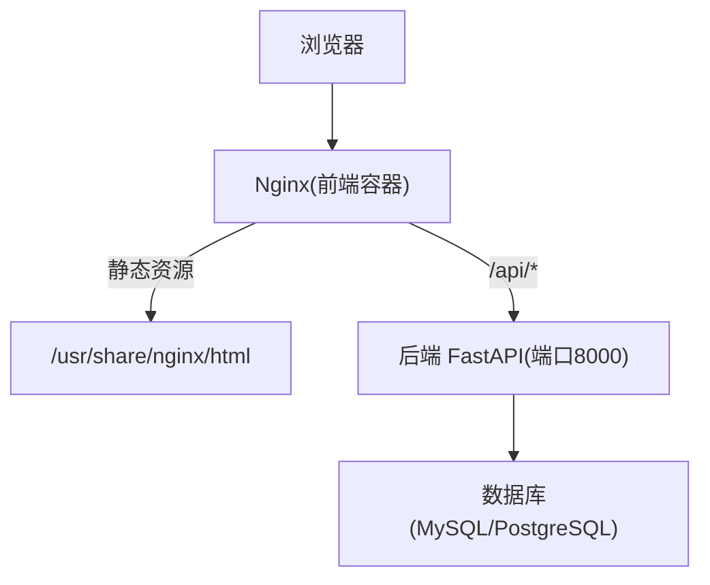
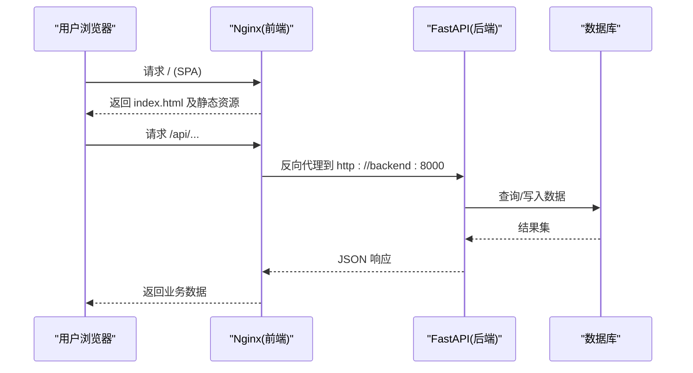
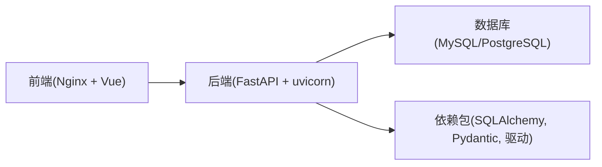

# 生产环境配置

<cite>
**本文引用的文件**
- [docker-compose.yml](file://docker-compose.yml)
- [backend-python/app/main.py](file://backend-python/app/main.py)
- [backend-python/app/database.py](file://backend-python/app/database.py)
- [frontend-vue/nginx.conf](file://frontend-vue/nginx.conf)
- [backend-python/Dockerfile](file://backend-python/Dockerfile)
- [frontend-vue/Dockerfile](file://frontend-vue/Dockerfile)
- [render.yaml](file://render.yaml)
- [backend-python/requirements.txt](file://backend-python/requirements.txt)
- [backend-python/pyproject.toml](file://backend-python/pyproject.toml)
- [frontend-vue/vite.config.ts](file://frontend-vue/vite.config.ts)
- [.gitignore](file://.gitignore)
- [README.md](file://README.md)
</cite>

## 目录
1. [简介](#简介)
2. [项目结构](#项目结构)
3. [核心组件](#核心组件)
4. [架构总览](#架构总览)
5. [详细组件分析](#详细组件分析)
6. [依赖关系分析](#依赖关系分析)
7. [性能考虑](#性能考虑)
8. [故障排查指南](#故障排查指南)
9. [结论](#结论)
10. [附录](#附录)

## 简介
本文件面向生产环境的部署与优化，覆盖数据库连接、缓存策略、静态资源优化、Nginx 反向代理与负载均衡、安全（HTTPS、CORS、CSRF）、环境变量与敏感信息管理、性能调优参数与资源限制、备份恢复与灾难恢复等。内容基于仓库中的 Docker Compose、Dockerfile、Nginx 配置、FastAPI 应用入口、数据库初始化逻辑以及云平台蓝图进行说明，确保在生产中可落地执行。

## 项目结构
本项目采用前后端分离：
- 后端：FastAPI + SQLAlchemy，默认支持 SQLite，通过环境变量切换 MySQL/PostgreSQL。
- 前端：Vue 3 + Vite，构建产物由 Nginx 托管，并通过 /api 反向代理到后端。
- 编排：Docker Compose 一键拉起 MySQL、后端、前端；Render Blueprint 提供云原生部署方案。

图示来源
- [frontend-vue/nginx.conf:1-21](file://frontend-vue/nginx.conf#L1-L21)
- [backend-python/app/main.py:27-85](file://backend-python/app/main.py#L27-L85)
- [docker-compose.yml:5-45](file://docker-compose.yml#L5-L45)

章节来源
- [docker-compose.yml:1-46](file://docker-compose.yml#L1-L46)
- [README.md:66-115](file://README.md#L66-L115)

## 核心组件
- 数据库连接与引擎：通过环境变量 DATABASE_URL 动态选择 SQLite 或外部数据库，并创建引擎与会话工厂。
- 应用生命周期：启动时自动建表与初始化示例数据（仅当库为空）。
- CORS 中间件：当前为宽松模式，便于开发；生产建议收紧。
- 健康检查：/api/health 用于存活探针与冷启动预热。
- 前端 Nginx：提供 SPA 路由兜底，并将 /api 请求反向代理到后端服务。
- 容器化：前后端均提供 Dockerfile，后端使用 uvicorn 启动，前端使用 nginx 托管静态资源。
- 云平台：render.yaml 定义 PostgreSQL、后端 Web Service、前端静态站点及环境变量注入。

章节来源
- [backend-python/app/database.py:1-38](file://backend-python/app/database.py#L1-L38)
- [backend-python/app/main.py:16-85](file://backend-python/app/main.py#L16-L85)
- [frontend-vue/nginx.conf:1-21](file://frontend-vue/nginx.conf#L1-L21)
- [backend-python/Dockerfile:1-27](file://backend-python/Dockerfile#L1-L27)
- [frontend-vue/Dockerfile:1-25](file://frontend-vue/Dockerfile#L1-L25)
- [render.yaml:1-45](file://render.yaml#L1-L45)

## 架构总览
下图展示生产环境典型部署拓扑：浏览器访问 Nginx，Nginx 提供静态资源并将 API 请求转发至后端；后端通过数据库驱动连接持久层；健康检查与日志可用于监控与排障。

图示来源
- [frontend-vue/nginx.conf:1-21](file://frontend-vue/nginx.conf#L1-L21)
- [backend-python/app/main.py:27-85](file://backend-python/app/main.py#L27-L85)
- [backend-python/app/database.py:1-38](file://backend-python/app/database.py#L1-L38)

## 详细组件分析

### 数据库连接池与连接管理
- 连接字符串：通过环境变量 DATABASE_URL 指定数据库类型与连接信息；未设置时回退到 SQLite。
- 引擎与会话：使用 create_engine 创建引擎，sessionmaker 创建会话工厂；每个请求通过依赖注入获取会话并在 finally 中关闭。
- 生产建议：
  - 使用外部数据库（MySQL/PostgreSQL），避免 SQLite 并发限制。
  - 在引擎创建处增加连接池参数（如 pool_size、max_overflow、pool_recycle、pool_pre_ping）以适配高并发与长连接场景。
  - 对慢查询与连接超时进行监控与告警。

章节来源
- [backend-python/app/database.py:1-38](file://backend-python/app/database.py#L1-L38)
- [docker-compose.yml:22-33](file://docker-compose.yml#L22-L33)
- [render.yaml:16-33](file://render.yaml#L16-L33)

### 缓存配置
- 现状：代码中未发现内置缓存实现。
- 生产建议：
  - 引入 Redis 作为缓存层，缓存热点库存、字典表、报表聚合结果等。
  - 在 service 层增加缓存读写与失效策略（TTL、写后失效、版本号）。
  - 结合数据库变更事件或定时任务清理过期缓存。

[本节为通用实践建议，不直接分析具体文件]

### 静态资源优化
- 构建产物：前端通过 Vite 构建生成 dist，由 Nginx 托管。
- 缓存策略：建议在 Nginx 中对静态资源启用强缓存（Cache-Control/ETag），对 HTML 使用短缓存或无缓存。
- 压缩与传输：开启 gzip/brotli 压缩，合理设置 Content-Type 与缓存头。
- 子路径部署：Vite base 可通过环境变量控制，便于多环境部署。

章节来源
- [frontend-vue/Dockerfile:19-25](file://frontend-vue/Dockerfile#L19-L25)
- [frontend-vue/nginx.conf:1-21](file://frontend-vue/nginx.conf#L1-L21)
- [frontend-vue/vite.config.ts:6-13](file://frontend-vue/vite.config.ts#L6-L13)

### Nginx 反向代理与负载均衡
- 反向代理：Nginx 将 /api 请求转发到后端服务（compose 中为 backend:8000）。
- SPA 路由：根路径 try_files 兜底到 index.html，保证前端路由正常工作。
- 负载均衡：
  - 单实例：当前配置为单后端实例。
  - 多实例：可在 upstream 中定义多个后端节点，配合健康检查与权重分配。
  - 跨域：若前端与后端不同源，需在后端 CORS 或 Nginx 层处理跨域。

章节来源
- [frontend-vue/nginx.conf:1-21](file://frontend-vue/nginx.conf#L1-L21)
- [docker-compose.yml:22-42](file://docker-compose.yml#L22-L42)

### 安全配置最佳实践
- HTTPS：
  - 在 Nginx 层终止 TLS，配置证书与强制跳转 HTTPS。
  - 禁用不安全协议与弱加密套件。
- CORS：
  - 当前后端允许所有来源；生产应限定允许的域名与方法头，必要时启用 allow_credentials 并严格白名单。
- CSRF：
  - 若使用 Cookie 鉴权，需在服务端启用 CSRF 防护；当前文档注释表明无 cookie 场景，但上线前请根据实际鉴权方式评估。
- 最小权限：
  - 数据库账号仅授予必要权限；网络层限制后端仅对数据库端口开放。
- 敏感信息：
  - 使用环境变量或密钥管理服务存储密码、令牌等敏感信息，禁止硬编码。

章节来源
- [backend-python/app/main.py:44-51](file://backend-python/app/main.py#L44-L51)
- [.gitignore:39-43](file://.gitignore#L39-L43)

### 环境变量管理与敏感信息存储
- 环境变量：
  - DATABASE_URL：数据库连接串，生产必须设置。
  - VITE_API_BASE：前端构建时注入后端 API 基础地址（渲染平台示例）。
  - VITE_BASE：前端部署子路径控制。
- 敏感信息：
  - .env 与 .env.local 被忽略，不应提交到版本库。
  - 云平台（Render）通过 envVars 注入数据库连接串与前端 API 地址。
- 建议：
  - 统一使用环境变量或密钥管理服务（如 Vault、KMS）管理敏感配置。
  - 在 CI/CD 中注入敏感变量，不在镜像或代码中保留明文。

章节来源
- [docker-compose.yml:8-12](file://docker-compose.yml#L8-L12)
- [docker-compose.yml:25-27](file://docker-compose.yml#L25-L27)
- [render.yaml:25-44](file://render.yaml#L25-L44)
- [frontend-vue/vite.config.ts:6-13](file://frontend-vue/vite.config.ts#L6-L13)
- [.gitignore:39-43](file://.gitignore#L39-L43)

### 性能调优参数与资源限制
- 后端：
  - 使用 uvicorn 标准版，生产建议调整 workers 数量（按 CPU 核数与 I/O 模型设定）。
  - 数据库连接池参数（见“数据库连接池”小节）提升并发能力。
  - 日志级别调整为 warning/error，减少磁盘 IO。
- 前端：
  - 静态资源启用压缩与缓存；按需加载与懒路由。
  - 列表与服务端分页结合，减少首屏体积。
- 容器：
  - 为各服务设置内存与 CPU 限制，防止资源争用。
  - 使用 healthcheck 与 restart policy 保障可用性。

章节来源
- [backend-python/Dockerfile:25-27](file://backend-python/Dockerfile#L25-L27)
- [backend-python/requirements.txt:1-13](file://backend-python/requirements.txt#L1-L13)
- [backend-python/pyproject.toml:7-17](file://backend-python/pyproject.toml#L7-L17)
- [docker-compose.yml:15-20](file://docker-compose.yml#L15-L20)

### 备份恢复与灾难恢复
- 数据库备份：
  - MySQL：使用 mysqldump 或云厂商备份工具定期全量+增量备份。
  - PostgreSQL：使用 pg_dump/pg_basebackup 或云服务快照。
- 备份策略：
  - 每日全量备份，每小时增量备份；异地容灾存储。
  - 备份文件加密与访问控制。
- 恢复演练：
  - 定期演练恢复流程，验证 RTO/RPO 目标。
  - 记录恢复步骤与回滚方案。
- 应用与配置：
  - 将 Nginx 配置、Docker Compose、CI/CD 配置纳入版本控制。
  - 使用蓝绿或灰度发布降低回滚风险。

[本节为通用实践建议，不直接分析具体文件]

## 依赖关系分析
- 后端依赖：FastAPI、uvicorn、SQLAlchemy、Pydantic、数据库驱动（pymysql/psycopg2-binary）、Alembic、python-dotenv、mangum（Serverless）。
- 前端依赖：Vue、Vite、TypeScript、Element Plus、ECharts（页面图表）。
- 运行时依赖：Nginx（静态托管与反向代理）、数据库（MySQL/PostgreSQL）。

图示来源
- [backend-python/requirements.txt:1-13](file://backend-python/requirements.txt#L1-L13)
- [backend-python/pyproject.toml:7-17](file://backend-python/pyproject.toml#L7-L17)
- [frontend-vue/Dockerfile:19-25](file://frontend-vue/Dockerfile#L19-L25)

章节来源
- [backend-python/requirements.txt:1-13](file://backend-python/requirements.txt#L1-L13)
- [backend-python/pyproject.toml:7-17](file://backend-python/pyproject.toml#L7-L17)

## 性能考虑
- 数据库：
  - 连接池参数：pool_size、max_overflow、pool_recycle、pool_pre_ping。
  - 索引与查询优化：对高频查询字段建立索引，避免 N+1 查询。
- 应用：
  - 异步 I/O：FastAPI 天然异步，合理设计接口避免阻塞。
  - 限流与熔断：在网关或应用层增加限流，保护后端。
- 前端：
  - 静态资源缓存与压缩。
  - 路由懒加载与组件按需引入。
- 容器：
  - 资源限制与弹性伸缩（HPA）。
  - 健康检查与优雅重启。

[本节为通用实践建议，不直接分析具体文件]

## 故障排查指南
- 健康检查：
  - /api/health 用于存活探针与冷启动预热，确保服务可达。
- 常见问题：
  - 数据库连接失败：检查 DATABASE_URL、网络连通性、账号权限。
  - 跨域错误：核对后端 CORS 配置与前端域名白名单。
  - 静态资源 404：确认 Nginx 静态目录与 try_files 配置。
- 日志与监控：
  - 收集应用日志与访问日志，集中存储与分析。
  - 设置关键指标告警（QPS、延迟、错误率、数据库连接数）。

章节来源
- [backend-python/app/main.py:77-85](file://backend-python/app/main.py#L77-L85)
- [frontend-vue/nginx.conf:8-19](file://frontend-vue/nginx.conf#L8-L19)

## 结论
本生产环境配置文档基于现有代码与配置文件，提供了数据库连接、缓存、静态资源、Nginx 反向代理与安全、环境变量管理、性能调优与备份恢复的落地建议。生产上线前，请根据实际业务规模与安全要求完善连接池、缓存、HTTPS、CORS、CSRF、资源限制与备份策略，并进行充分的压测与演练。

## 附录
- 快速启动：参考 README 中的 Docker Compose 与本地开发方式。
- 在线演示：包含 Serverless 部署的前后端地址与 GitHub Pages 纯前端演示。

章节来源
- [README.md:12-33](file://README.md#L12-L33)
- [README.md:121-166](file://README.md#L121-L166)