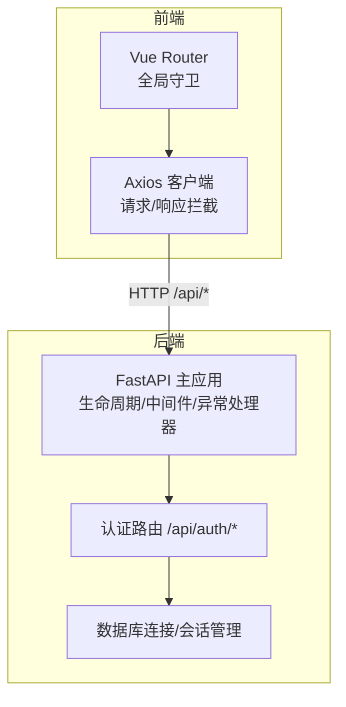
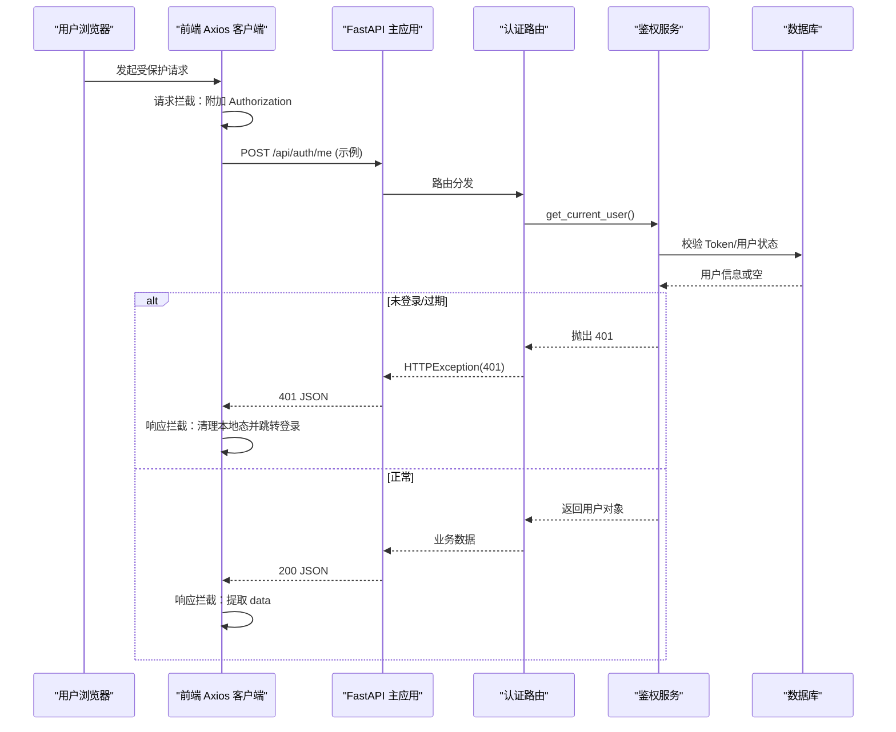
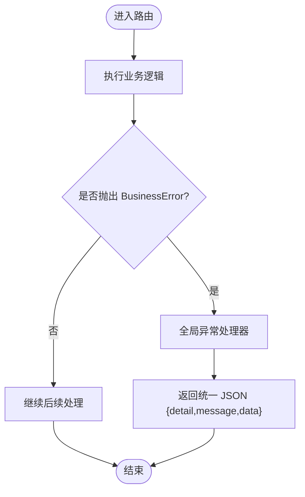
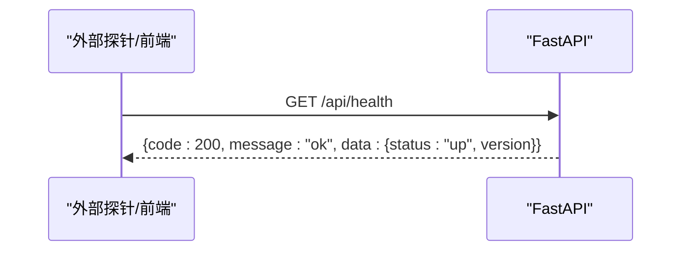
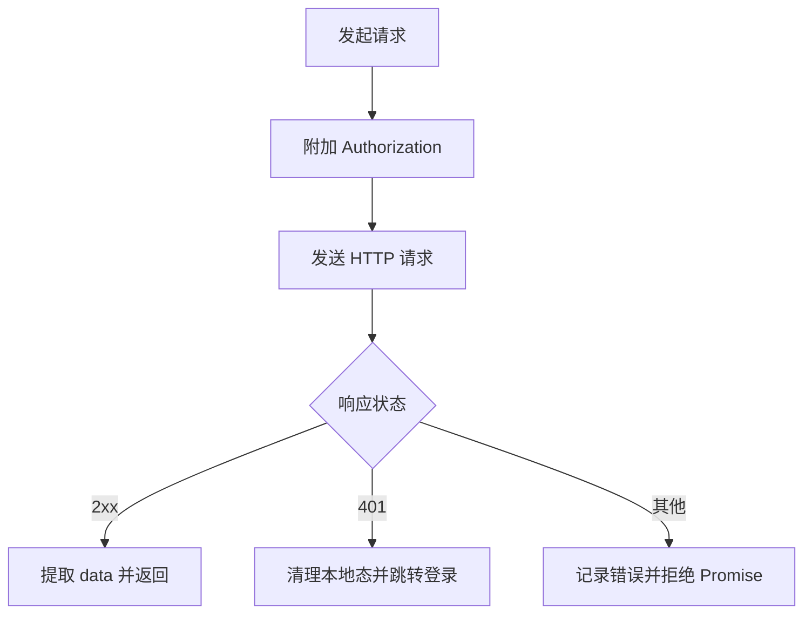

# 监控和日志

<cite>
**本文引用的文件**
- [backend-python/app/main.py](file://backend-python/app/main.py)
- [backend-python/app/common/errors.py](file://backend-python/app/common/errors.py)
- [backend-python/app/services/auth_service.py](file://backend-python/app/services/auth_service.py)
- [backend-python/app/routers/auth.py](file://backend-python/app/routers/auth.py)
- [backend-python/app/database.py](file://backend-python/app/database.py)
- [frontend-vue/src/api/client.ts](file://frontend-vue/src/api/client.ts)
- [frontend-vue/src/router/index.ts](file://frontend-vue/src/router/index.ts)
- [backend-python/pyproject.toml](file://backend-python/pyproject.toml)
</cite>

## 目录
1. [简介](#简介)
2. [项目结构](#项目结构)
3. [核心组件](#核心组件)
4. [架构总览](#架构总览)
5. [详细组件分析](#详细组件分析)
6. [依赖关系分析](#依赖关系分析)
7. [性能考虑](#性能考虑)
8. [故障排查指南](#故障排查指南)
9. [结论](#结论)
10. [附录](#附录)

## 简介
本文件面向 WMS（进销存与业财一体）系统的“监控与日志”主题，聚焦以下目标：
- 后端 API 的错误处理机制与日志记录策略
- 前端请求拦截器与错误处理逻辑
- 应用性能监控、错误追踪与告警配置建议
- 健康检查端点与系统状态监控实现
- 生产环境日志轮转与存储方案
- 常见问题诊断方法与调试技巧

## 项目结构
本项目采用前后端分离架构：
- 后端基于 FastAPI，提供 RESTful API，包含统一异常处理、CORS、路由注册与健康检查端点。
- 前端基于 Vue + Axios，封装统一的 HTTP 客户端，具备请求/响应拦截器、鉴权态管理与路由守卫。

图表来源
- [backend-python/app/main.py:27-84](file://backend-python/app/main.py#L27-L84)
- [backend-python/app/routers/auth.py:15-32](file://backend-python/app/routers/auth.py#L15-L32)
- [backend-python/app/database.py:1-38](file://backend-python/app/database.py#L1-L38)
- [frontend-vue/src/api/client.ts:1-45](file://frontend-vue/src/api/client.ts#L1-L45)
- [frontend-vue/src/router/index.ts:31-45](file://frontend-vue/src/router/index.ts#L31-L45)

章节来源
- [backend-python/app/main.py:27-84](file://backend-python/app/main.py#L27-L84)
- [frontend-vue/src/api/client.ts:1-45](file://frontend-vue/src/api/client.ts#L1-L45)
- [frontend-vue/src/router/index.ts:31-45](file://frontend-vue/src/router/index.ts#L31-L45)

## 核心组件
- 后端统一异常处理：通过全局异常处理器将业务异常转换为标准 JSON 响应，便于前端一致化处理。
- 健康检查端点：轻量级存活探针，不查库、不鉴权，适合外部探针与前端预热。
- 前端 Axios 客户端：集中配置 baseURL、超时、请求头；请求拦截自动附加 token；响应拦截统一提取 data、处理 401 并跳转登录页。
- 路由守卫：除登录页外要求登录；管理员页面限制角色访问。

章节来源
- [backend-python/app/main.py:35-41](file://backend-python/app/main.py#L35-L41)
- [backend-python/app/main.py:77-84](file://backend-python/app/main.py#L77-L84)
- [frontend-vue/src/api/client.ts:18-42](file://frontend-vue/src/api/client.ts#L18-L42)
- [frontend-vue/src/router/index.ts:31-45](file://frontend-vue/src/router/index.ts#L31-L45)

## 架构总览
下图展示一次受保护 API 调用的端到端流程，包括前端拦截、后端鉴权、异常处理与健康检查。

图表来源
- [frontend-vue/src/api/client.ts:18-42](file://frontend-vue/src/api/client.ts#L18-L42)
- [backend-python/app/routers/auth.py:29-32](file://backend-python/app/routers/auth.py#L29-L32)
- [backend-python/app/services/auth_service.py:152-168](file://backend-python/app/services/auth_service.py#L152-L168)
- [backend-python/app/main.py:35-41](file://backend-python/app/main.py#L35-L41)

## 详细组件分析

### 后端统一异常处理
- 业务异常类型：定义携带消息与 HTTP 状态码的业务异常类。
- 全局异常处理器：捕获业务异常并返回统一 JSON 结构，保证前后端契约一致。
- 鉴权相关异常：在依赖注入中直接抛出 HTTP 异常（如 401/403），由框架统一处理。

图表来源
- [backend-python/app/common/errors.py:4-9](file://backend-python/app/common/errors.py#L4-L9)
- [backend-python/app/main.py:35-41](file://backend-python/app/main.py#L35-L41)

章节来源
- [backend-python/app/common/errors.py:4-9](file://backend-python/app/common/errors.py#L4-L9)
- [backend-python/app/main.py:35-41](file://backend-python/app/main.py#L35-L41)
- [backend-python/app/services/auth_service.py:152-168](file://backend-python/app/services/auth_service.py#L152-L168)

### 健康检查端点与系统状态监控
- 健康检查接口：返回固定结构与版本信息，用于存活探针与冷启动预热。
- 无副作用：不查询数据库、不进行鉴权，确保高可用探测的稳定性。

图表来源
- [backend-python/app/main.py:77-84](file://backend-python/app/main.py#L77-L84)

章节来源
- [backend-python/app/main.py:77-84](file://backend-python/app/main.py#L77-L84)

### 前端请求拦截器与错误处理
- 请求拦截：自动从本地存储读取 token 并附加到请求头。
- 响应拦截：统一提取 data；当 401 时清除本地登录态并跳转到登录页；记录错误信息。
- 构建期 Mock：支持纯前端演示模式，所有 /api 请求由浏览器内 Mock 响应。

图表来源
- [frontend-vue/src/api/client.ts:18-42](file://frontend-vue/src/api/client.ts#L18-L42)

章节来源
- [frontend-vue/src/api/client.ts:1-45](file://frontend-vue/src/api/client.ts#L1-45)

### 路由守卫与权限控制
- 全局守卫：除登录页外均要求登录；管理员页面仅 admin 可访问。
- 与前端错误处理联动：若 token 失效，被后端 401 后前端会跳转登录，避免无效页面停留。

章节来源
- [frontend-vue/src/router/index.ts:31-45](file://frontend-vue/src/router/index.ts#L31-L45)
- [frontend-vue/src/api/client.ts:27-42](file://frontend-vue/src/api/client.ts#L27-L42)

### 数据库连接与可用性影响
- 默认 SQLite，生产可通过环境变量切换 MySQL/PostgreSQL。
- 健康检查不依赖数据库，避免探测失败；但业务接口可能受数据库影响，需结合外部探针进行分层探测。

章节来源
- [backend-python/app/database.py:1-38](file://backend-python/app/database.py#L1-L38)

## 依赖关系分析
- 后端依赖 FastAPI、SQLAlchemy、Pydantic 等；可选依赖包含测试与异步支持。
- 前端依赖 Axios、Vue Router、Element Plus 等。
- 模块耦合：主应用集中注册路由与中间件；认证路由依赖鉴权服务；前端 Axios 与路由守卫共同保障鉴权流程。

图表来源
- [backend-python/app/main.py:53-69](file://backend-python/app/main.py#L53-L69)
- [backend-python/app/routers/auth.py:15-32](file://backend-python/app/routers/auth.py#L15-L32)
- [backend-python/app/services/auth_service.py:152-168](file://backend-python/app/services/auth_service.py#L152-L168)
- [frontend-vue/src/api/client.ts:1-45](file://frontend-vue/src/api/client.ts#L1-45)
- [frontend-vue/src/router/index.ts:31-45](file://frontend-vue/src/router/index.ts#L31-L45)

章节来源
- [backend-python/pyproject.toml:7-17](file://backend-python/pyproject.toml#L7-L17)
- [backend-python/app/main.py:53-69](file://backend-python/app/main.py#L53-L69)

## 性能考虑
- 健康检查端点无副作用，适合作为容器/Serverless 存活探针与前端预热请求。
- 前端列表与看板已采用分页、防抖等优化；建议在监控层增加关键接口的耗时统计（如登录、库存查询）。
- 数据库连接池与慢查询监控在生产环境尤为重要，建议结合数据库引擎指标与 APM 工具采集。

[本节为通用指导，不直接分析具体文件]

## 故障排查指南
- 401 未登录/过期：
  - 检查前端是否成功附加 Authorization 头；确认本地 token 是否存在且有效。
  - 后端依赖注入会在 token 缺失或过期时抛出 401；前端响应拦截会自动清理本地态并跳转登录。
- 业务错误：
  - 后端通过全局异常处理器返回统一 JSON；前端可在响应拦截中统一提示。
- 健康检查失败：
  - 若 /api/health 不可用，优先检查进程存活、端口监听与反向代理配置。
- 数据库问题：
  - 健康检查不依赖数据库，但业务接口可能受影响；检查 DATABASE_URL 与连接池配置。

章节来源
- [frontend-vue/src/api/client.ts:27-42](file://frontend-vue/src/api/client.ts#L27-L42)
- [backend-python/app/main.py:35-41](file://backend-python/app/main.py#L35-L41)
- [backend-python/app/main.py:77-84](file://backend-python/app/main.py#L77-L84)
- [backend-python/app/database.py:1-38](file://backend-python/app/database.py#L1-L38)

## 结论
当前系统在“监控与日志”方面已具备基础能力：
- 后端提供统一异常处理与健康检查端点，便于外部监控与前端预热。
- 前端通过 Axios 拦截器与路由守卫实现一致的鉴权与错误处理体验。
- 生产环境建议补充结构化日志、APM、日志收集与分析平台，以及告警策略，以完善可观测性。

[本节为总结性内容，不直接分析具体文件]

## 附录

### 后端日志记录策略建议
- 接入结构化日志（JSON 格式），记录请求 ID、方法、路径、状态码、耗时、用户标识等。
- 对关键业务操作（登录、登出、库存变更、财务记账）记录审计日志。
- 使用日志级别区分 INFO/WARN/ERROR，避免在生产输出 DEBUG 日志。

[本节为通用建议，不直接分析具体文件]

### 前端错误追踪与上报建议
- 在 Axios 响应拦截中统一捕获错误并上报至错误追踪平台（如 Sentry），附带 URL、参数、堆栈。
- 对路由守卫与页面加载失败进行埋点，辅助定位前端崩溃场景。

[本节为通用建议，不直接分析具体文件]

### 应用性能监控（APM）与告警配置建议
- 后端：接入 APM 采集接口耗时、数据库慢查询、异常率与 QPS；设置阈值告警（如错误率 > 1%、P95 > 500ms）。
- 前端：采集首屏时间、接口成功率、JS 错误率；设置告警通知渠道（邮件/企微/钉钉）。
- 健康检查：对外暴露 /api/health，供负载均衡与编排系统探测。

[本节为通用建议，不直接分析具体文件]

### 日志收集、分析与可视化方案建议
- 收集：使用 Filebeat/Fluent Bit 采集应用日志与访问日志，转发至 ELK/Opensearch 或云日志服务。
- 分析：建立索引策略与保留周期；创建常用仪表盘（错误分布、TOP 慢接口、登录失败趋势）。
- 可视化：按业务域划分看板（库存、财务、用户），支持下钻到明细与关联事件。

[本节为通用建议，不直接分析具体文件]

### 生产环境日志轮转与存储策略
- 日志轮转：按大小/时间切分，保留最近 N 天；压缩归档并迁移至对象存储。
- 存储策略：热数据在线检索，冷数据归档；敏感字段脱敏（密码、令牌）。
- 安全合规：访问控制、加密传输与静态加密，满足审计要求。

[本节为通用建议，不直接分析具体文件]

### 常见问题的诊断方法与调试技巧
- 登录失败：
  - 检查用户名/密码是否正确；确认账号状态是否为启用；查看后端是否返回 401/403。
- 权限不足：
  - 确认当前用户角色；管理员页面需 admin 角色；前端路由守卫会阻止非 admin 访问。
- 接口超时：
  - 调整前端超时配置；检查后端与数据库性能；必要时开启慢查询日志。
- 跨域问题：
  - 后端已配置 CORS；确保前端通过同源代理访问（开发 Vite 代理，生产 nginx 反代）。

章节来源
- [backend-python/app/services/auth_service.py:116-168](file://backend-python/app/services/auth_service.py#L116-L168)
- [frontend-vue/src/router/index.ts:31-45](file://frontend-vue/src/router/index.ts#L31-L45)
- [frontend-vue/src/api/client.ts:4-10](file://frontend-vue/src/api/client.ts#L4-L10)
- [backend-python/app/main.py:44-51](file://backend-python/app/main.py#L44-L51)