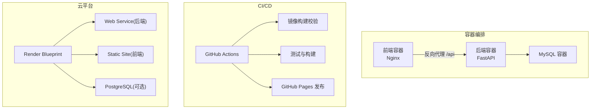
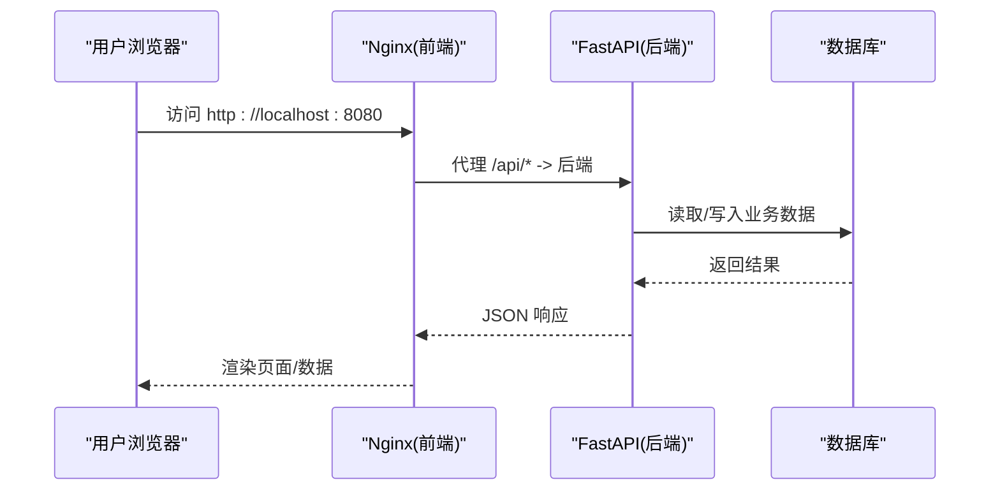
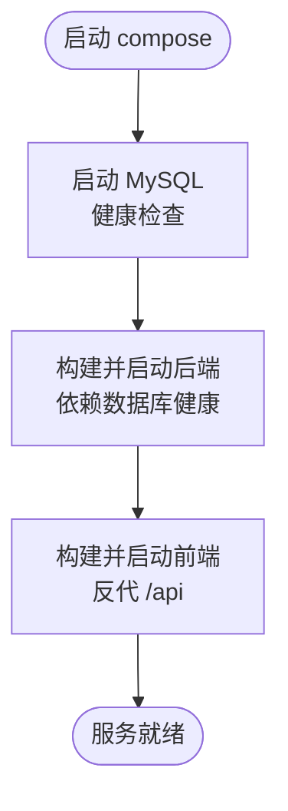
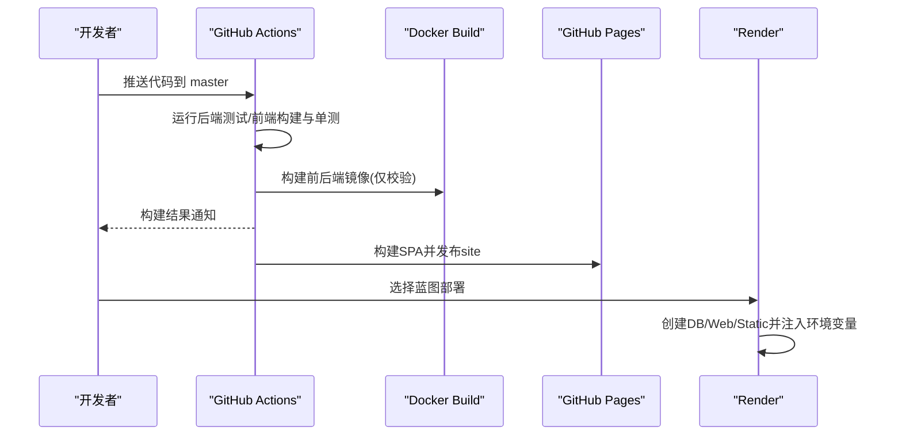

# 部署和运维

<cite>
**本文引用的文件**
- [docker-compose.yml](file://docker-compose.yml)
- [backend-python/Dockerfile](file://backend-python/Dockerfile)
- [frontend-vue/Dockerfile](file://frontend-vue/Dockerfile)
- [backend-python/.dockerignore](file://backend-python/.dockerignore)
- [frontend-vue/.dockerignore](file://frontend-vue/.dockerignore)
- [.github/workflows/ci.yml](file://.github/workflows/ci.yml)
- [.github/workflows/deploy-pages.yml](file://.github/workflows/deploy-pages.yml)
- [render.yaml](file://render.yaml)
- [backend-python/app/main.py](file://backend-python/app/main.py)
- [backend-python/app/database.py](file://backend-python/app/database.py)
- [backend-python/pyproject.toml](file://backend-python/pyproject.toml)
- [backend-python/requirements.txt](file://backend-python/requirements.txt)
- [frontend-vue/vite.config.ts](file://frontend-vue/vite.config.ts)
- [frontend-vue/nginx.conf](file://frontend-vue/nginx.conf)
- [frontend-vue/package.json](file://frontend-vue/package.json)
- [README.md](file://README.md)
</cite>

## 目录
1. [简介](#简介)
2. [项目结构](#项目结构)
3. [核心组件](#核心组件)
4. [架构总览](#架构总览)
5. [详细组件分析](#详细组件分析)
6. [依赖关系分析](#依赖关系分析)
7. [性能与资源规划](#性能与资源规划)
8. [监控、日志与故障排查](#监控日志与故障排查)
9. [备份恢复与灾难恢复](#备份恢复与灾难恢复)
10. [扩展性与高可用设计](#扩展性与高可用设计)
11. [多环境差异化管理](#多环境差异化管理)
12. [结论](#结论)

## 简介
本文件面向 WMS（进销存·业财一体）系统的部署与运维，覆盖 Docker 容器化部署、CI/CD 流水线、生产监控与日志、环境变量与安全、性能调优、备份恢复与灾备、扩展性与高可用方案，以及多环境差异化管理。文档基于仓库中的实际配置与代码实现进行说明，确保可落地、可复现。

## 项目结构
系统由前后端分离的模块组成：
- 后端：Python + FastAPI，使用 SQLAlchemy 连接数据库，提供 REST API 与 OpenAPI 文档。
- 前端：Vue 3 + Vite，构建为静态资源并由 Nginx 托管，反向代理 /api 到后端。
- 编排：Docker Compose 一键拉起 MySQL、后端、前端；Render Blueprint 支持云原生部署；GitHub Actions 负责 CI 与 Pages 发布。

图表来源
- [docker-compose.yml:1-46](file://docker-compose.yml#L1-L46)
- [backend-python/Dockerfile:1-27](file://backend-python/Dockerfile#L1-L27)
- [frontend-vue/Dockerfile:1-25](file://frontend-vue/Dockerfile#L1-L25)
- [.github/workflows/ci.yml:1-67](file://.github/workflows/ci.yml#L1-L67)
- [.github/workflows/deploy-pages.yml:1-61](file://.github/workflows/deploy-pages.yml#L1-L61)
- [render.yaml:1-45](file://render.yaml#L1-L45)

章节来源
- [README.md:121-166](file://README.md#L121-L166)
- [docker-compose.yml:1-46](file://docker-compose.yml#L1-L46)

## 核心组件
- 后端服务：FastAPI 应用，启动时自动建表并初始化示例数据；暴露 /docs 接口文档与 /api/health 健康检查。
- 前端服务：Vite 构建产物由 Nginx 托管，/api 请求反向代理至后端。
- 数据库：默认 SQLite（开发），可通过环境变量切换为 MySQL/PostgreSQL；Compose 中默认使用 MySQL 8.0。
- 编排与部署：Docker Compose 本地一键启动；Render Blueprint 一键创建 Web/Static/DB；GitHub Actions 执行测试、构建与发布。

章节来源
- [backend-python/app/main.py:16-85](file://backend-python/app/main.py#L16-L85)
- [backend-python/app/database.py:1-38](file://backend-python/app/database.py#L1-L38)
- [frontend-vue/nginx.conf:1-21](file://frontend-vue/nginx.conf#L1-L21)
- [docker-compose.yml:1-46](file://docker-compose.yml#L1-L46)
- [render.yaml:1-45](file://render.yaml#L1-L45)

## 架构总览
下图展示本地与云端两种典型部署形态及关键交互：

图表来源
- [frontend-vue/nginx.conf:13-19](file://frontend-vue/nginx.conf#L13-L19)
- [backend-python/app/main.py:72-85](file://backend-python/app/main.py#L72-L85)
- [docker-compose.yml:22-33](file://docker-compose.yml#L22-L33)

## 详细组件分析

### Docker 容器化部署
- 后端镜像
  - 基础镜像：python:3.11-slim
  - 安装依赖：优先国内源，失败回退；EXPOSE 8000；启动命令 uvicorn app.main:app
  - .dockerignore 排除测试、缓存等无关文件，减小镜像体积
- 前端镜像
  - 构建阶段：node:20-alpine，安装依赖并构建 dist
  - 运行阶段：nginx:alpine，托管静态资源，反向代理 /api 到后端服务名
- 编排
  - docker-compose.yml 定义 mysql、backend、frontend 三服务，设置环境变量、端口映射、健康检查与重启策略
  - 通过 depends_on 与 healthcheck 保证启动顺序与可用性

图表来源
- [docker-compose.yml:5-42](file://docker-compose.yml#L5-L42)
- [backend-python/Dockerfile:1-27](file://backend-python/Dockerfile#L1-L27)
- [frontend-vue/Dockerfile:1-25](file://frontend-vue/Dockerfile#L1-L25)

章节来源
- [backend-python/Dockerfile:1-27](file://backend-python/Dockerfile#L1-L27)
- [frontend-vue/Dockerfile:1-25](file://frontend-vue/Dockerfile#L1-L25)
- [docker-compose.yml:1-46](file://docker-compose.yml#L1-L46)
- [backend-python/.dockerignore:1-9](file://backend-python/.dockerignore#L1-L9)
- [frontend-vue/.dockerignore:1-8](file://frontend-vue/.dockerignore#L1-L8)

### CI/CD 流水线
- GitHub Actions CI
  - 触发：push/PR 到 master
  - 任务：后端 pytest、前端 build+vitest、Docker 镜像构建校验（不推送）
- GitHub Pages 部署
  - 构建前端 SPA（pages 模式），将产物放入 site/app，发布整个 site 目录
- Render Blueprint
  - 一键创建 PostgreSQL、后端 Web Service、前端 Static Site
  - 自动注入数据库连接串，前端需配置后端 API 地址

图表来源
- [.github/workflows/ci.yml:1-67](file://.github/workflows/ci.yml#L1-L67)
- [.github/workflows/deploy-pages.yml:1-61](file://.github/workflows/deploy-pages.yml#L1-L61)
- [render.yaml:1-45](file://render.yaml#L1-L45)

章节来源
- [.github/workflows/ci.yml:1-67](file://.github/workflows/ci.yml#L1-L67)
- [.github/workflows/deploy-pages.yml:1-61](file://.github/workflows/deploy-pages.yml#L1-L61)
- [render.yaml:1-45](file://render.yaml#L1-L45)

### 环境变量与配置
- 数据库连接
  - 后端通过 DATABASE_URL 切换数据库类型与连接信息；未设置时使用 SQLite
  - Compose 中通过环境变量注入 MySQL 连接串
- 前端代理与基路径
  - vite.config.ts 配置开发服务器代理 /api 到后端
  - base 可由环境变量注入，适配 GitHub Pages 子路径
- 平台特定配置
  - Render 通过 envVars 注入数据库连接串与前端的后端 API 地址

章节来源
- [backend-python/app/database.py:1-38](file://backend-python/app/database.py#L1-L38)
- [docker-compose.yml:22-33](file://docker-compose.yml#L22-L33)
- [frontend-vue/vite.config.ts:1-34](file://frontend-vue/vite.config.ts#L1-L34)
- [render.yaml:25-44](file://render.yaml#L25-L44)

### 安全设置
- CORS
  - 后端启用允许所有来源的跨域中间件（无 cookie 场景）
- 网络与镜像
  - 使用 .dockerignore 排除敏感与冗余文件
  - 前端 nginx 仅暴露静态资源，API 通过反向代理转发
- 密钥与环境变量
  - 数据库凭据通过环境变量注入，避免硬编码
  - 生产环境建议限制 CORS 白名单、启用 HTTPS 与鉴权

章节来源
- [backend-python/app/main.py:44-51](file://backend-python/app/main.py#L44-L51)
- [backend-python/.dockerignore:1-9](file://backend-python/.dockerignore#L1-L9)
- [frontend-vue/.dockerignore:1-8](file://frontend-vue/.dockerignore#L1-L8)
- [frontend-vue/nginx.conf:13-19](file://frontend-vue/nginx.conf#L13-L19)

### 健康检查与探针
- 后端提供 /api/health 轻量健康检查，不查库、不鉴权，适合冷启动预热与外部保活脚本
- Compose 对 MySQL 配置健康检查，确保依赖就绪后再启动后端

章节来源
- [backend-python/app/main.py:77-85](file://backend-python/app/main.py#L77-L85)
- [docker-compose.yml:15-20](file://docker-compose.yml#L15-L20)

## 依赖关系分析
- 后端依赖
  - FastAPI、uvicorn、SQLAlchemy、Pydantic、pymysql、psycopg2-binary、alembic、dotenv
  - 通过 pyproject.toml 与 requirements.txt 声明依赖，便于不同部署方式识别
- 前端依赖
  - Vue、Element Plus、ECharts、Pinia、Vite、TypeScript、Vitest、Playwright
  - package.json 管理脚本与依赖版本
- 运行时依赖
  - 前端 Nginx 反向代理到后端服务名（compose）或公网域名（Render）

图表来源
- [backend-python/pyproject.toml:7-17](file://backend-python/pyproject.toml#L7-L17)
- [backend-python/requirements.txt:1-13](file://backend-python/requirements.txt#L1-L13)
- [frontend-vue/package.json:15-32](file://frontend-vue/package.json#L15-L32)
- [frontend-vue/nginx.conf:13-19](file://frontend-vue/nginx.conf#L13-L19)

章节来源
- [backend-python/pyproject.toml:1-36](file://backend-python/pyproject.toml#L1-L36)
- [backend-python/requirements.txt:1-13](file://backend-python/requirements.txt#L1-L13)
- [frontend-vue/package.json:1-34](file://frontend-vue/package.json#L1-L34)

## 性能与资源规划
- 镜像优化
  - 后端 slim 基础镜像、禁用字节码、使用国内源加速安装、排除测试与缓存
  - 前端多阶段构建，仅将 dist 复制到 nginx 镜像
- 启动与冷启动
  - 后端 lifespan 自动建表与种子数据，首次启动可能较慢；可通过健康检查预热
  - Render 免费 Web Service 会休眠，首次访问有冷启动延迟
- 资源建议
  - 后端：CPU 1-2核，内存 512MB-1GB（视并发与查询复杂度）
  - 数据库：根据数据量与并发调整 CPU/内存/磁盘 IOPS
  - 前端：静态资源占用低，主要受 CDN 与缓存策略影响
- 网络与缓存
  - 前端启用浏览器缓存与 CDN；后端可结合 Redis 缓存热点数据（按需扩展）

章节来源
- [backend-python/Dockerfile:1-27](file://backend-python/Dockerfile#L1-L27)
- [frontend-vue/Dockerfile:1-25](file://frontend-vue/Dockerfile#L1-L25)
- [render.yaml:1-6](file://render.yaml#L1-L6)

## 监控、日志与故障排查
- 监控
  - 使用 /api/health 作为存活探针；Compose 中 MySQL 健康检查保障依赖就绪
  - Render 支持健康检查路径配置
- 日志
  - 后端 uvicorn 标准输出日志；可通过容器日志收集系统集中采集
  - 前端 Nginx 访问/错误日志可按需挂载与收集
- 故障排查
  - 数据库连接失败：检查 DATABASE_URL 与网络连通性
  - 前端 404/路由问题：确认 base 与 Nginx try_files 配置
  - 跨域问题：核对 CORS 配置与前端代理设置
  - 冷启动慢：通过健康检查预热或升级实例规格

章节来源
- [backend-python/app/main.py:77-85](file://backend-python/app/main.py#L77-L85)
- [docker-compose.yml:15-20](file://docker-compose.yml#L15-L20)
- [frontend-vue/nginx.conf:1-21](file://frontend-vue/nginx.conf#L1-L21)
- [render.yaml:24-24](file://render.yaml#L24-L24)

## 备份恢复与灾难恢复
- 数据备份
  - MySQL：定期导出数据库文件或启用云厂商快照/备份策略
  - SQLite：备份 psi_fin.db 文件（注意一致性）
- 恢复流程
  - 停止服务 → 导入备份 → 重建索引/校验完整性 → 启动服务
- 灾难恢复
  - 多副本部署与异地备份
  - 数据库主从/集群提升与切换预案
  - 灰度发布与回滚策略

章节来源
- [docker-compose.yml:5-20](file://docker-compose.yml#L5-L20)
- [backend-python/app/database.py:16-20](file://backend-python/app/database.py#L16-L20)

## 扩展性与高可用设计
- 水平扩展
  - 后端无状态，可多实例横向扩展；配合负载均衡与健康检查
  - 数据库采用独立实例或托管服务，读写分离与连接池优化
- 高可用
  - 多可用区部署、自动故障转移
  - 前端静态资源通过 CDN 分发，降低源站压力
- 弹性伸缩
  - 基于指标（CPU/内存/QPS）自动扩缩容
  - 队列与异步任务（如报表生成）解耦处理

[本节为概念性说明，不直接分析具体文件]

## 多环境差异化管理
- 开发环境
  - 使用 SQLite 零配置；vite.config.ts 代理 /api 到本地后端
- 测试环境
  - 使用 MySQL/PostgreSQL；CI 中执行测试与镜像构建校验
- 预发/生产环境
  - 通过环境变量注入 DATABASE_URL、VITE_API_BASE、VITE_BASE 等
  - Render 蓝图自动注入数据库连接串；前端静态站点配置后端 API 地址
  - 通过不同的 CI 分支/标签触发不同环境的构建与发布

章节来源
- [backend-python/app/database.py:1-20](file://backend-python/app/database.py#L1-L20)
- [frontend-vue/vite.config.ts:6-27](file://frontend-vue/vite.config.ts#L6-L27)
- [render.yaml:25-44](file://render.yaml#L25-L44)
- [.github/workflows/ci.yml:1-67](file://.github/workflows/ci.yml#L1-L67)
- [.github/workflows/deploy-pages.yml:1-61](file://.github/workflows/deploy-pages.yml#L1-L61)

## 结论
本部署与运维文档基于仓库现有配置，提供了从本地容器化到云端一键部署的全链路指南。通过合理的环境变量管理、CI/CD 自动化、健康检查与日志监控、备份与灾备策略，以及扩展性与高可用设计，能够支撑 WMS 系统在多环境下稳定运行与持续交付。建议在生产环境中进一步收紧安全策略、完善监控告警与容量规划，确保系统长期可靠演进。