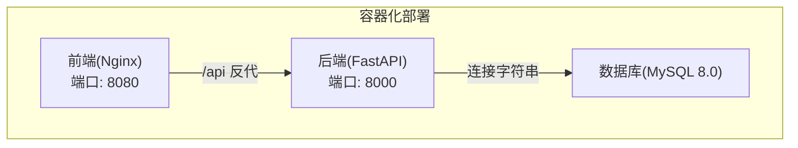
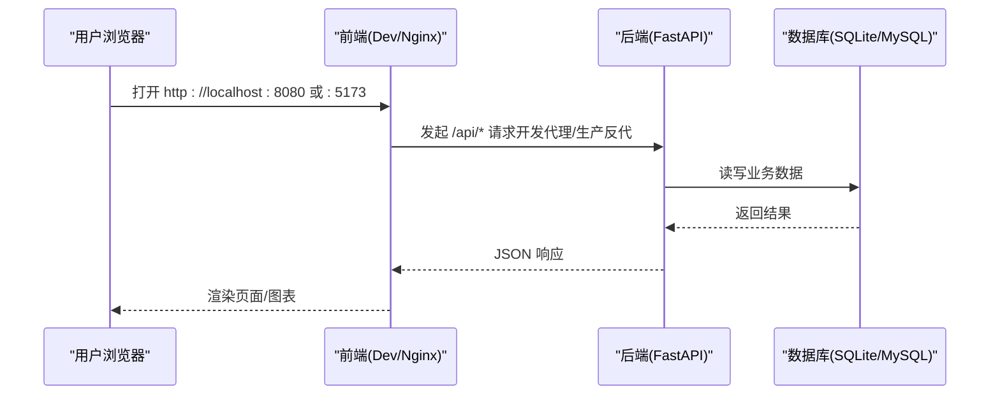

# 快速开始指南

<cite>
**本文引用的文件**
- [README.md](file://README.md)
- [docker-compose.yml](file://docker-compose.yml)
- [package.json](file://package.json)
- [backend-python/app/main.py](file://backend-python/app/main.py)
- [backend-python/app/database.py](file://backend-python/app/database.py)
- [backend-python/init_data.py](file://backend-python/init_data.py)
- [frontend-vue/package.json](file://frontend-vue/package.json)
- [frontend-vue/vite.config.ts](file://frontend-vue/vite.config.ts)
- [frontend-vue/src/api/client.ts](file://frontend-vue/src/api/client.ts)
- [render.yaml](file://render.yaml)
</cite>

## 目录
1. [简介](#简介)
2. [项目结构](#项目结构)
3. [核心组件](#核心组件)
4. [架构总览](#架构总览)
5. [详细启动方式](#详细启动方式)
6. [依赖与环境变量](#依赖与环境变量)
7. [默认账号与种子数据](#默认账号与种子数据)
8. [在线演示环境](#在线演示环境)
9. [常见问题排查](#常见问题排查)
10. [性能与并发注意事项](#性能与并发注意事项)
11. [结论](#结论)

## 简介
本指南面向首次接触“进销存·业财一体系统”的用户，目标是在最短时间内成功运行并体验核心功能。系统提供三种启动方式：
- Docker Compose 一键启动（推荐）
- 本地开发环境搭建（前后端分离）
- 根目录一键并发启动

同时包含环境变量配置、访问地址、默认账号与种子数据说明，以及在线演示环境的访问信息（真后端与纯前端 Mock 模式）。

## 项目结构
仓库采用前后端分离的模块化组织：
- 后端：Python + FastAPI，提供库存、订单、财务等 API，支持 SQLite/MySQL/PostgreSQL
- 前端：Vue 3 + Element Plus，支持开发代理与生产构建，内置 Mock 模式
- 编排：Docker Compose 一键拉起 MySQL、后端、前端（Nginx 反代）
- 根脚本：concurrently 并行启动前后端，便于本地联调

图表来源
- [docker-compose.yml:1-46](file://docker-compose.yml#L1-L46)
- [backend-python/app/database.py:1-38](file://backend-python/app/database.py#L1-L38)

章节来源
- [README.md:81-115](file://README.md#L81-L115)
- [docker-compose.yml:1-46](file://docker-compose.yml#L1-L46)

## 核心组件
- 应用生命周期：启动时自动建表并初始化示例数据（仅当库为空），注册路由与全局异常处理
- 数据库连接：优先读取 DATABASE_URL，未设置则使用 SQLite（psi_fin.db）
- 前端代理：开发模式下将 /api 请求转发到后端 8000 端口；生产由 Nginx 反代
- Mock 模式：构建时注入 VITE_USE_MOCK=true 可在浏览器内模拟接口，无需后端

章节来源
- [backend-python/app/main.py:16-69](file://backend-python/app/main.py#L16-L69)
- [backend-python/app/database.py:5-24](file://backend-python/app/database.py#L5-L24)
- [frontend-vue/vite.config.ts:19-27](file://frontend-vue/vite.config.ts#L19-L27)
- [frontend-vue/src/api/client.ts:12-16](file://frontend-vue/src/api/client.ts#L12-L16)

## 架构总览
下图展示三种启动方式的共同依赖关系与访问路径。无论哪种方式，最终都通过浏览器访问前端，再由前端调用后端 API。

图表来源
- [frontend-vue/vite.config.ts:19-27](file://frontend-vue/vite.config.ts#L19-L27)
- [docker-compose.yml:22-42](file://docker-compose.yml#L22-L42)
- [backend-python/app/database.py:5-24](file://backend-python/app/database.py#L5-L24)

## 详细启动方式

### 方式一：Docker Compose 一键启动（推荐）
适用场景：希望零配置获得完整可运行的全栈环境（含数据库）。

- 前置要求
  - 已安装 Docker 与 Docker Compose
- 步骤
  - 在仓库根目录执行：docker compose up -d --build
  - 等待服务就绪后访问：
    - 前端：http://localhost:8080
    - 后端 API 文档：http://localhost:8000/docs
- 可选配置
  - 可通过 .env 覆盖数据库账户与密码（见“依赖与环境变量”）
- 停止与清理
  - docker compose down
  - 如需重置数据，删除卷 mysql-data

章节来源
- [README.md:121-136](file://README.md#L121-L136)
- [docker-compose.yml:1-46](file://docker-compose.yml#L1-L46)

### 方式二：本地开发环境（前后端分离）
适用场景：需要分别调试前后端代码。

- 前置要求
  - Node.js 与 npm
  - Python 3.11+ 与 uv（用于后端依赖管理）
  - 可选：MySQL 8.0（若使用 SQLite 则无需额外数据库）
- 后端启动
  - 进入 backend-python 目录
  - 安装依赖并启动：uv sync && uv run uvicorn app.main:app --port 8000
  - 访问：http://localhost:8000/docs
- 前端启动
  - 进入 frontend-vue 目录
  - 安装依赖并启动：npm install && npm run dev
  - 访问：http://localhost:5173（/api 自动代理到 8000）
- 切换数据库（可选）
  - 设置 DATABASE_URL 指向 MySQL/PostgreSQL 即可无缝切换

章节来源
- [README.md:137-158](file://README.md#L137-L158)
- [backend-python/app/database.py:5-24](file://backend-python/app/database.py#L5-L24)
- [frontend-vue/vite.config.ts:19-27](file://frontend-vue/vite.config.ts#L19-L27)

### 方式三：根目录一键并发启动
适用场景：希望在根目录一条命令同时启动前后端，适合快速联调。

- 前置要求
  - Node.js 与 npm
  - Python 3.11+ 与 uv
- 步骤
  - 在仓库根目录执行：npm install
  - 然后执行：npm start
  - 该命令会并行启动后端（8000）与前端（5173）
- 访问
  - 前端：http://localhost:5173
  - 后端 API 文档：http://localhost:8000/docs

章节来源
- [package.json:1-15](file://package.json#L1-L15)
- [README.md:160-166](file://README.md#L160-L166)

## 依赖与环境变量

- 后端关键环境变量
  - DATABASE_URL：数据库连接串。未设置时使用 SQLite（psi_fin.db）；设置后可切换为 MySQL/PostgreSQL
- 前端关键环境变量
  - VITE_API_BASE：构建期注入真实后端地址（例如 https://<后端域名>/api），用于生产或 Serverless 部署
  - VITE_USE_MOCK：设置为 true 时启用浏览器内 Mock 模式，不发起真实网络请求
  - VITE_BASE：构建子路径（如 GitHub Pages 的 /psi-fin/app/）
- Docker Compose 环境变量（可选）
  - MYSQL_ROOT_PASSWORD、MYSQL_DATABASE、MYSQL_USER、MYSQL_PASSWORD：用于自定义 MySQL 账户与数据库名

章节来源
- [backend-python/app/database.py:5-24](file://backend-python/app/database.py#L5-L24)
- [frontend-vue/src/api/client.ts:4-16](file://frontend-vue/src/api/client.ts#L4-L16)
- [frontend-vue/vite.config.ts:6-12](file://frontend-vue/vite.config.ts#L6-L12)
- [docker-compose.yml:8-12](file://docker-compose.yml#L8-L12)
- [render.yaml:35-44](file://render.yaml#L35-L44)

## 默认账号与种子数据
- 默认管理员账号
  - 用户名：admin
  - 密码：admin123
- 种子数据（首次启动且库为空时自动写入）
  - 仓库：广州主仓（WH-A）、深圳保税仓（WH-B）
  - 库区：正品区、残次品区
  - 库位：带优先级（A-01-01、A-01-02、A-02-01、A-D-01、B-01-01、B-01-02）
  - 商品：5 个 SKU（含 FNSKU 与箱规）
  - 客户：3 家（A/B/C 分层）
  - 会计科目表：预置最小科目集（资产/负债/权益/收入/费用等）

章节来源
- [README.md:243-253](file://README.md#L243-L253)
- [backend-python/init_data.py:12-84](file://backend-python/init_data.py#L12-L84)
- [backend-python/init_data.py:87-100](file://backend-python/init_data.py#L87-L100)
- [backend-python/init_data.py:103-150](file://backend-python/init_data.py#L103-L150)

## 在线演示环境
- 真后端在线演示（Vercel Serverless + Neon PostgreSQL）
  - 前端：https://psi-fin.vercel.app
  - 后端 API：https://wms-silk.vercel.app（/docs 为在线接口文档）
- 纯前端 Mock 演示（GitHub Pages，无需后端）
  - 地址：https://yeyege.github.io/psi-fin/
  - 构建时通过 .env.pages 注入 VITE_USE_MOCK=true 与 VITE_BASE=/psi-fin/app/，实现纯前端运行

章节来源
- [README.md:12-33](file://README.md#L12-L33)

## 常见问题排查
- 无法登录或提示 401
  - 检查是否已正确获取并保存 token（前端会在 401 时清除登录态并跳转登录页）
  - 确认后端已启动并可访问 /api/auth
- 前端 /api 请求失败
  - 开发模式：确认 vite 代理 target 指向 http://localhost:8000
  - 生产模式：确认 nginx 反代或 VITE_API_BASE 配置正确
- 数据库连接失败
  - 检查 DATABASE_URL 是否正确（含主机、端口、用户名、密码、数据库名）
  - Docker Compose 下确保 mysql 服务健康后再启动后端
- 端口占用
  - 前端默认 5173，后端默认 8000，容器前端映射 8080，请根据实际修改或释放端口
- 无法看到种子数据
  - 仅在库为空时写入；若已有数据需手动清空或重建数据库卷（Docker 环境下）

章节来源
- [frontend-vue/src/api/client.ts:18-42](file://frontend-vue/src/api/client.ts#L18-L42)
- [frontend-vue/vite.config.ts:19-27](file://frontend-vue/vite.config.ts#L19-L27)
- [docker-compose.yml:8-33](file://docker-compose.yml#L8-L33)
- [backend-python/app/database.py:5-24](file://backend-python/app/database.py#L5-L24)

## 性能与并发注意事项
- 并发安全
  - 出库扣减使用行级锁与条件更新，防止超卖；SQLite 忽略 FOR UPDATE，MySQL/PostgreSQL 生效
- 事务一致性
  - 整单操作在事务中执行，任一明细失败回滚，避免半成品
- 建议
  - 高并发场景建议使用 MySQL/PostgreSQL
  - 合理分页与搜索防抖，减少前端渲染压力

章节来源
- [README.md:58-63](file://README.md#L58-L63)

## 结论
通过 Docker Compose、本地开发或根目录一键并发启动，你可以在几分钟内运行起完整的进销存·业财一体系统。配合默认账号与种子数据，即可快速体验入库、出库、库存、销售订单与财务应收核销等核心流程。遇到问题时，可参考“常见问题排查”逐项定位。