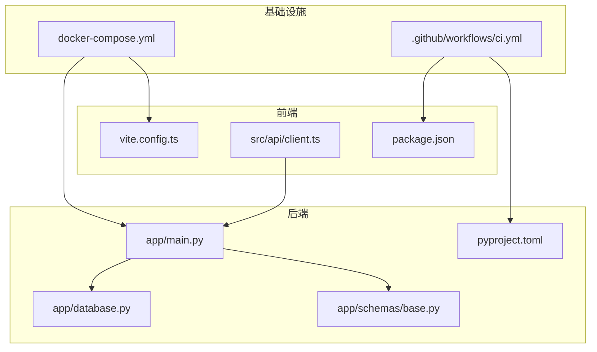
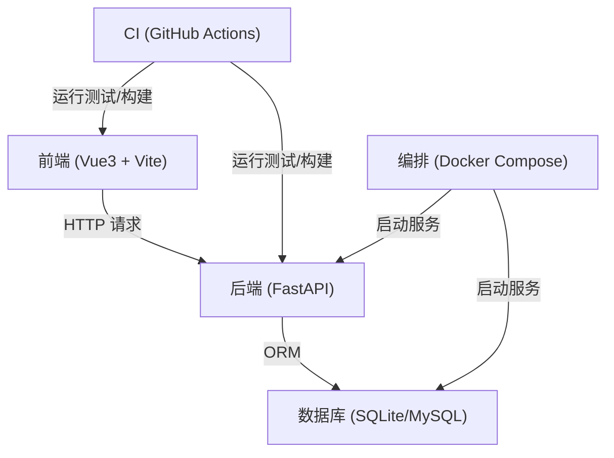
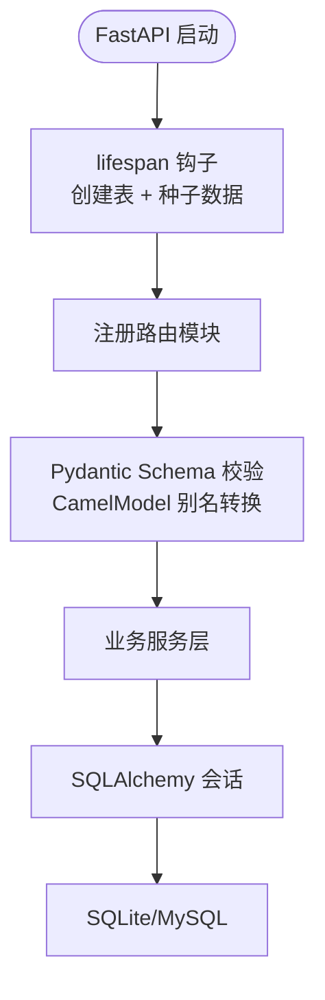
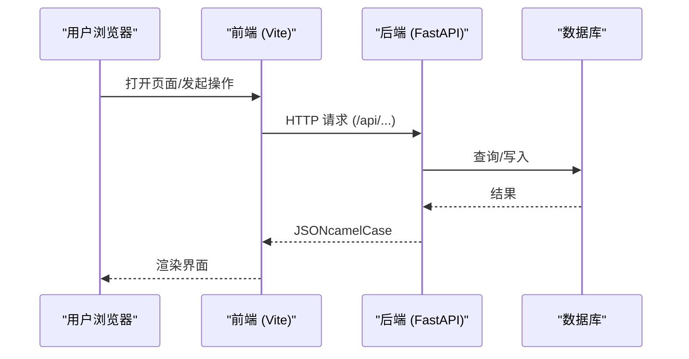
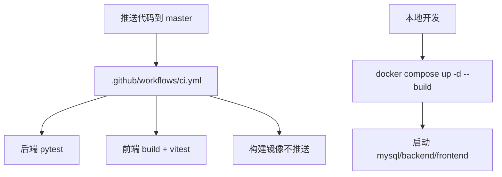
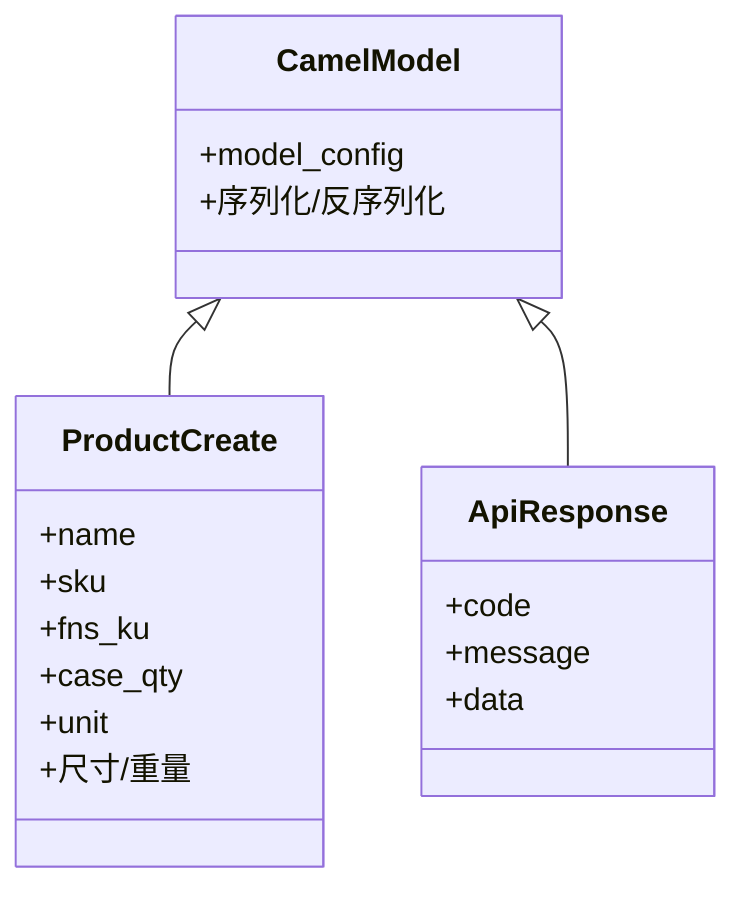
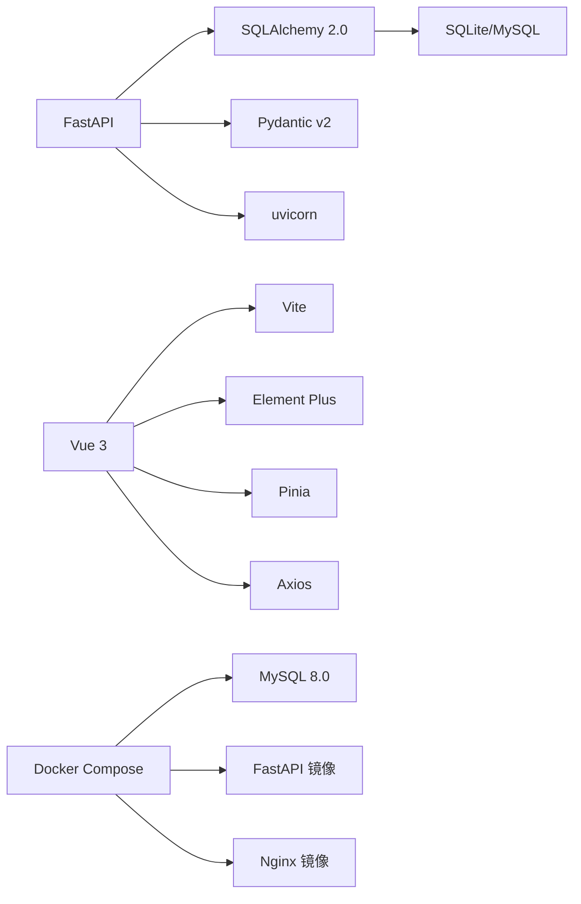

# 技术栈概览

<cite>
**本文引用的文件**
- [README.md](file://README.md)
- [docker-compose.yml](file://docker-compose.yml)
- [.github/workflows/ci.yml](file://.github/workflows/ci.yml)
- [backend-python/pyproject.toml](file://backend-python/pyproject.toml)
- [backend-python/app/main.py](file://backend-python/app/main.py)
- [backend-python/app/database.py](file://backend-python/app/database.py)
- [backend-python/app/schemas/base.py](file://backend-python/app/schemas/base.py)
- [backend-python/Dockerfile](file://backend-python/Dockerfile)
- [frontend-vue/package.json](file://frontend-vue/package.json)
- [frontend-vue/vite.config.ts](file://frontend-vue/vite.config.ts)
- [frontend-vue/src/api/client.ts](file://frontend-vue/src/api/client.ts)
- [frontend-vue/Dockerfile](file://frontend-vue/Dockerfile)
</cite>

## 目录
1. [简介](#简介)
2. [项目结构](#项目结构)
3. [核心组件](#核心组件)
4. [架构总览](#架构总览)
5. [详细组件分析](#详细组件分析)
6. [依赖关系分析](#依赖关系分析)
7. [性能考量](#性能考量)
8. [故障排查指南](#故障排查指南)
9. [结论](#结论)
10. [附录](#附录)

## 简介
本技术栈概览面向进销存·业财一体系统，聚焦后端与前端技术选型、数据库支持、测试框架、部署方案与 CI/CD 流水线，并解释前后端通过 CamelModel 统一 camelCase 契约的设计考虑。目标是帮助开发者快速理解项目的技术决策背景与版本兼容性。

- 后端：Python 3.11+ / FastAPI / SQLAlchemy 2.0 / Pydantic v2
- 前端：Vue 3 + TypeScript + Element Plus + Pinia + Vite
- 数据库：SQLite（开发零配置）/ MySQL 8.0（容器化生产）
- 测试：pytest（后端）、vitest（前端）、Playwright（E2E）
- 部署：Docker Compose（mysql + backend + frontend/nginx）
- CI：GitHub Actions（后端 pytest、前端 build/vitest、镜像构建校验）

**章节来源**
- [README.md:66-78](file://README.md#L66-L78)

## 项目结构
仓库采用前后端分离的多模块结构：
- backend-python：FastAPI 后端，包含路由、服务、模型、Schema、测试与 Dockerfile
- frontend-vue：Vue 3 前端，包含页面、状态管理、API 客户端、Vite 配置与 Dockerfile
- 根目录：docker-compose.yml 编排全栈；.github/workflows 定义 CI 流程

**图表来源**
- [backend-python/app/main.py:1-85](file://backend-python/app/main.py#L1-L85)
- [backend-python/app/database.py:1-38](file://backend-python/app/database.py#L1-L38)
- [backend-python/app/schemas/base.py:1-156](file://backend-python/app/schemas/base.py#L1-L156)
- [backend-python/pyproject.toml:1-36](file://backend-python/pyproject.toml#L1-L36)
- [frontend-vue/vite.config.ts:1-34](file://frontend-vue/vite.config.ts#L1-L34)
- [frontend-vue/src/api/client.ts:1-45](file://frontend-vue/src/api/client.ts#L1-L45)
- [frontend-vue/package.json:1-34](file://frontend-vue/package.json#L1-L34)
- [docker-compose.yml:1-46](file://docker-compose.yml#L1-L46)
- [.github/workflows/ci.yml:1-67](file://.github/workflows/ci.yml#L1-L67)

**章节来源**
- [README.md:81-115](file://README.md#L81-L115)
- [docker-compose.yml:1-46](file://docker-compose.yml#L1-L46)

## 核心组件
- 后端运行时：FastAPI 应用入口、生命周期初始化、CORS、健康检查
- 数据访问：SQLAlchemy 引擎与会话，SQLite/MySQL 双模式
- 契约层：Pydantic v2 的 CamelModel 统一 camelCase 输入输出
- 前端工程：Vite 构建、TypeScript 类型检查、Element Plus UI、Pinia 状态
- 测试体系：pytest（异步自动模式）、vitest（单元测试）、Playwright（E2E）
- 部署与 CI：Docker Compose 一键启动；GitHub Actions 执行测试与镜像构建校验

**章节来源**
- [backend-python/app/main.py:16-85](file://backend-python/app/main.py#L16-L85)
- [backend-python/app/database.py:5-24](file://backend-python/app/database.py#L5-L24)
- [backend-python/app/schemas/base.py:11-21](file://backend-python/app/schemas/base.py#L11-L21)
- [frontend-vue/vite.config.ts:6-32](file://frontend-vue/vite.config.ts#L6-L32)
- [frontend-vue/package.json:6-13](file://frontend-vue/package.json#L6-L13)
- [backend-python/pyproject.toml:19-36](file://backend-python/pyproject.toml#L19-L36)

## 架构总览
系统由前端 SPA、FastAPI 后端、MySQL 数据库组成，通过 Nginx 反代或 Vite 代理进行同源访问；CI 在每次推送时执行测试与镜像构建校验。

**图表来源**
- [docker-compose.yml:1-46](file://docker-compose.yml#L1-L46)
- [.github/workflows/ci.yml:1-67](file://.github/workflows/ci.yml#L1-L67)
- [backend-python/app/main.py:1-85](file://backend-python/app/main.py#L1-L85)
- [frontend-vue/vite.config.ts:1-34](file://frontend-vue/vite.config.ts#L1-L34)

## 详细组件分析

### 后端技术栈与实现要点
- Python 3.11+：要求与镜像基础镜像一致，确保语言特性与依赖兼容
- FastAPI：提供自动 OpenAPI 文档、异步能力与中间件（CORS）
- SQLAlchemy 2.0：声明式基类、引擎与会话管理，支持 SQLite/MySQL
- Pydantic v2：CamelModel 使用 alias_generator 同时接受 camelCase 输入并按 camelCase 输出，配合 populate_by_name 兼容 snake_case 字段名
- 依赖与工具：uvicorn 作为 ASGI 服务器；alembic 用于迁移；python-dotenv 加载环境变量

**图表来源**
- [backend-python/app/main.py:16-69](file://backend-python/app/main.py#L16-L69)
- [backend-python/app/schemas/base.py:11-21](file://backend-python/app/schemas/base.py#L11-L21)
- [backend-python/app/database.py:11-24](file://backend-python/app/database.py#L11-L24)

**章节来源**
- [backend-python/pyproject.toml:1-17](file://backend-python/pyproject.toml#L1-L17)
- [backend-python/app/main.py:1-85](file://backend-python/app/main.py#L1-L85)
- [backend-python/app/database.py:1-38](file://backend-python/app/database.py#L1-L38)
- [backend-python/app/schemas/base.py:1-156](file://backend-python/app/schemas/base.py#L1-L156)

### 前端技术栈与实现要点
- Vue 3 + TypeScript：组合式 API 与类型安全
- Element Plus：企业级 UI 组件库
- Pinia：轻量状态管理
- Vite：快速开发与构建，支持环境变量注入、开发代理与子路径部署
- 测试：vitest 单元测试；Playwright E2E 覆盖关键流程

**图表来源**
- [frontend-vue/vite.config.ts:19-26](file://frontend-vue/vite.config.ts#L19-L26)
- [frontend-vue/src/api/client.ts:4-16](file://frontend-vue/src/api/client.ts#L4-L16)
- [backend-python/app/main.py:72-85](file://backend-python/app/main.py#L72-L85)

**章节来源**
- [frontend-vue/package.json:15-31](file://frontend-vue/package.json#L15-L31)
- [frontend-vue/vite.config.ts:1-34](file://frontend-vue/vite.config.ts#L1-L34)
- [frontend-vue/src/api/client.ts:1-45](file://frontend-vue/src/api/client.ts#L1-L45)

### 数据库支持与切换策略
- 开发环境：默认 SQLite，零配置，便于本地调试与单测隔离
- 生产环境：通过 DATABASE_URL 切换至 MySQL 8.0，容器化部署并通过服务名互联
- 连接参数：SQLite 需关闭线程安全检查；MySQL 使用 utf8mb4 字符集

**章节来源**
- [backend-python/app/database.py:5-20](file://backend-python/app/database.py#L5-L20)
- [docker-compose.yml:5-20](file://docker-compose.yml#L5-L20)

### 测试框架与覆盖率
- 后端：pytest 异步自动模式，临时 SQLite 隔离测试数据，不触碰开发库
- 前端：vitest 单元测试，排除 e2e 目录；Playwright 端到端测试
- CI：GitHub Actions 在 push/PR 到 master 时触发后端 pytest、前端 build/vitest、镜像构建校验

**章节来源**
- [backend-python/pyproject.toml:19-36](file://backend-python/pyproject.toml#L19-L36)
- [backend-python/tests/conftest.py:1-90](file://backend-python/tests/conftest.py#L1-L90)
- [frontend-vue/package.json:6-13](file://frontend-vue/package.json#L6-L13)
- [.github/workflows/ci.yml:1-67](file://.github/workflows/ci.yml#L1-L67)

### 部署方案与 CI/CD
- Docker Compose：一键拉起 MySQL、后端、前端（Nginx），端口映射 8000/8080
- 后端镜像：基于 python:3.11-slim，安装依赖后以 uvicorn 启动
- 前端镜像：Node 构建 dist，Nginx 托管静态资源
- CI：三阶段任务——后端测试、前端构建与测试、镜像构建校验（不推送）

**图表来源**
- [.github/workflows/ci.yml:1-67](file://.github/workflows/ci.yml#L1-L67)
- [docker-compose.yml:1-46](file://docker-compose.yml#L1-L46)
- [backend-python/Dockerfile:1-27](file://backend-python/Dockerfile#L1-L27)
- [frontend-vue/Dockerfile:1-25](file://frontend-vue/Dockerfile#L1-L25)

**章节来源**
- [docker-compose.yml:1-46](file://docker-compose.yml#L1-L46)
- [backend-python/Dockerfile:1-27](file://backend-python/Dockerfile#L1-L27)
- [frontend-vue/Dockerfile:1-25](file://frontend-vue/Dockerfile#L1-L25)
- [.github/workflows/ci.yml:1-67](file://.github/workflows/ci.yml#L1-L67)

### 前后端契约：CamelModel 设计
- 目标：统一 camelCase 字段命名（如 supplierName、productId），避免前后端命名不一致导致的解析错误
- 机制：Pydantic v2 的 alias_generator=to_camel 与 populate_by_name=True，使同一模型既能接收 camelCase 也能处理 snake_case
- 收益：接口契约稳定、扩展成本低、减少适配层代码

**图表来源**
- [backend-python/app/schemas/base.py:11-35](file://backend-python/app/schemas/base.py#L11-L35)

**章节来源**
- [backend-python/app/schemas/base.py:11-21](file://backend-python/app/schemas/base.py#L11-L21)

## 依赖关系分析
- 后端依赖：FastAPI、uvicorn、SQLAlchemy、Pydantic、数据库驱动（aiosqlite/pymysql/psycopg2-binary）、Alembic、dotenv
- 前端依赖：Vue、Element Plus、Pinia、Axios、ECharts、Vite、TypeScript、Vitest、Playwright
- 运行时依赖：MySQL 8.0（容器）、Nginx（静态托管）

**图表来源**
- [backend-python/pyproject.toml:7-17](file://backend-python/pyproject.toml#L7-L17)
- [frontend-vue/package.json:15-31](file://frontend-vue/package.json#L15-L31)
- [docker-compose.yml:5-42](file://docker-compose.yml#L5-L42)

**章节来源**
- [backend-python/pyproject.toml:1-36](file://backend-python/pyproject.toml#L1-L36)
- [frontend-vue/package.json:1-34](file://frontend-vue/package.json#L1-L34)
- [docker-compose.yml:1-46](file://docker-compose.yml#L1-L46)

## 性能考量
- 数据库连接：SQLite 适合开发；生产建议 MySQL 并合理设置连接池与索引
- 并发与事务：出库等写操作应使用事务与条件更新，避免超卖与脏写
- 前端缓存与懒加载：列表分页、搜索防抖、按需加载图表与组件
- 构建优化：Vite 按需打包、静态资源压缩、CDN 加速（可选）

[本节为通用指导，不直接分析具体文件]

## 故障排查指南
- 后端无法连接数据库：检查 DATABASE_URL 与网络连通性；确认 MySQL 服务健康
- 前端无法调用后端：检查 Vite 代理或 Nginx 反向代理配置；确认 CORS 允许来源
- 登录态异常：前端拦截器会在 401 时清理 token 并跳转登录页
- 测试失败：确认使用临时 SQLite 且未污染开发库；检查 pytest 异步模式与 fixtures

**章节来源**
- [backend-python/app/database.py:5-20](file://backend-python/app/database.py#L5-L20)
- [frontend-vue/vite.config.ts:19-26](file://frontend-vue/vite.config.ts#L19-L26)
- [frontend-vue/src/api/client.ts:18-42](file://frontend-vue/src/api/client.ts#L18-L42)
- [backend-python/tests/conftest.py:21-90](file://backend-python/tests/conftest.py#L21-L90)

## 结论
本项目以 FastAPI + SQLAlchemy 2.0 + Pydantic v2 构建高性能、类型安全的后端；以 Vue 3 + TypeScript + Element Plus + Pinia + Vite 打造现代化前端；通过 Docker Compose 与 GitHub Actions 实现可重复的一键部署与持续集成。CamelModel 统一了前后端字段契约，降低了协作成本。整体技术选型兼顾开发效率、可维护性与可扩展性。

[本节为总结性内容，不直接分析具体文件]

## 附录
- 在线演示与部署说明见 README
- 本地开发可通过 docker compose 或前后端独立启动
- 完整 API 文档可在后端 /docs 查看

**章节来源**
- [README.md:12-33](file://README.md#L12-L33)
- [backend-python/app/main.py:72-85](file://backend-python/app/main.py#L72-L85)