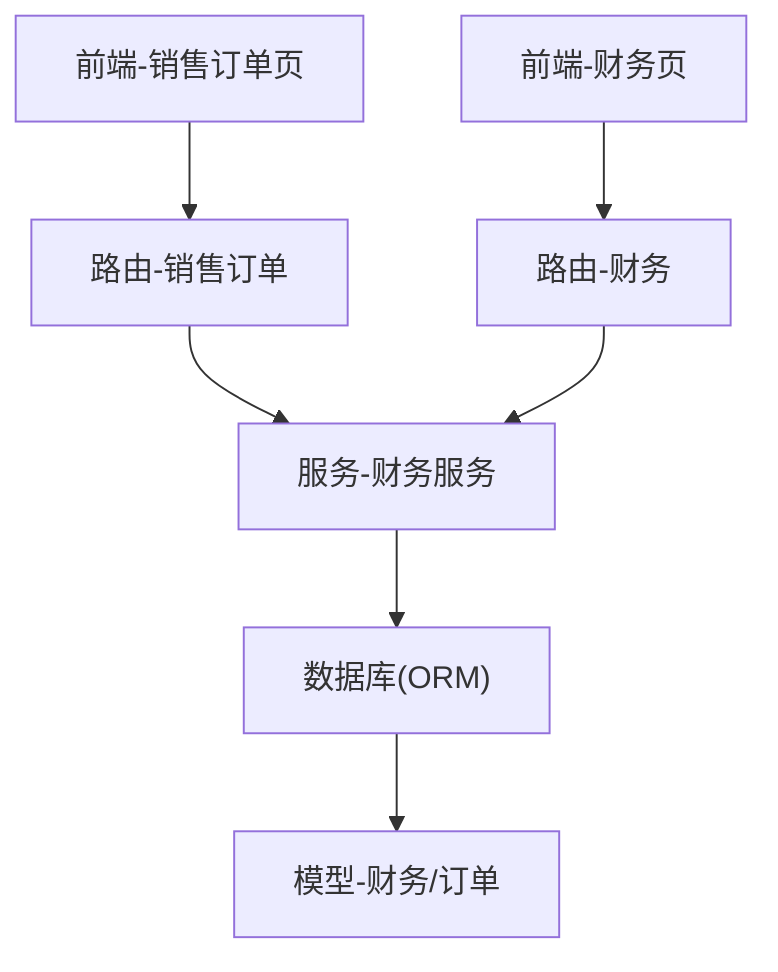
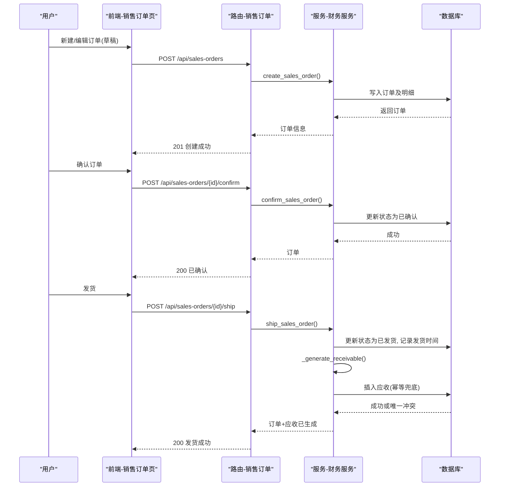
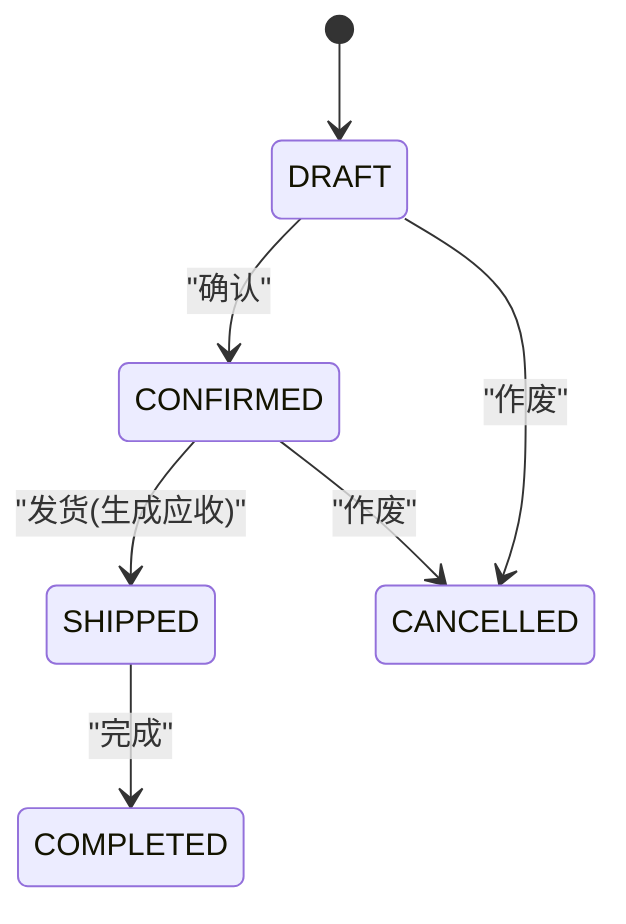
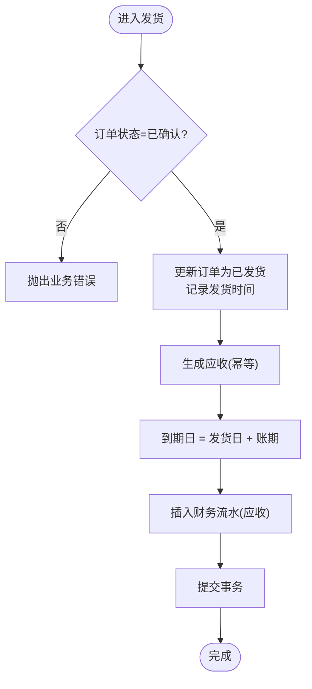
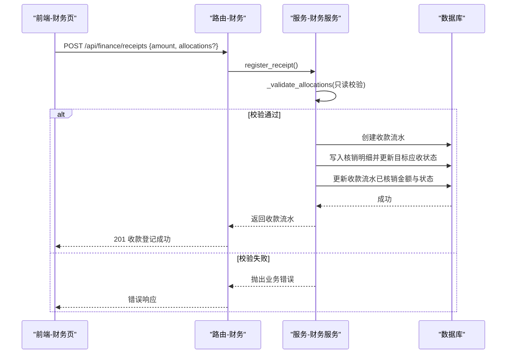
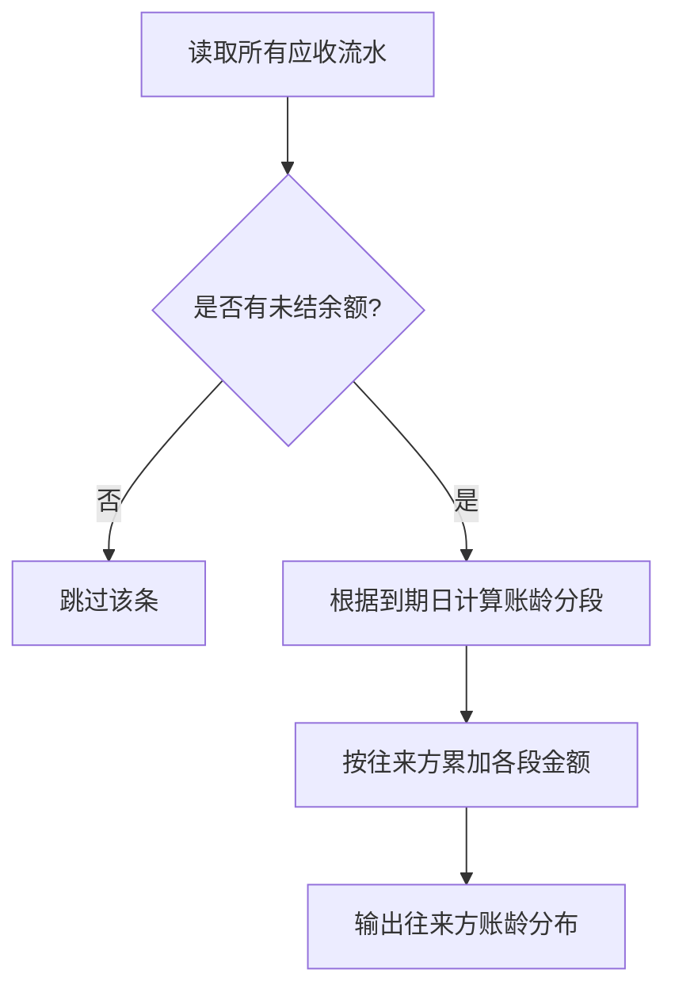
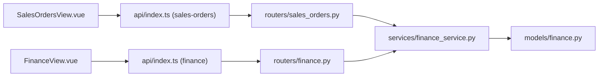

# 业财一体功能

<cite>
**本文引用的文件**
- [backend-python/app/models/finance.py](file://backend-python/app/models/finance.py)
- [backend-python/app/services/finance_service.py](file://backend-python/app/services/finance_service.py)
- [backend-python/app/routers/sales_orders.py](file://backend-python/app/routers/sales_orders.py)
- [backend-python/app/routers/finance.py](file://backend-python/app/routers/finance.py)
- [backend-python/app/schemas/finance.py](file://backend-python/app/schemas/finance.py)
- [frontend-vue/src/views/SalesOrdersView.vue](file://frontend-vue/src/views/SalesOrdersView.vue)
- [frontend-vue/src/views/FinanceView.vue](file://frontend-vue/src/views/FinanceView.vue)
- [frontend-vue/src/api/index.ts](file://frontend-vue/src/api/index.ts)
- [backend-python/tests/test_finance_service.py](file://backend-python/tests/test_finance_service.py)
</cite>

## 目录
1. [简介](#简介)
2. [项目结构](#项目结构)
3. [核心组件](#核心组件)
4. [架构总览](#架构总览)
5. [详细组件分析](#详细组件分析)
6. [依赖关系分析](#依赖关系分析)
7. [性能与一致性](#性能与一致性)
8. [故障排查指南](#故障排查指南)
9. [结论](#结论)
10. [附录：前端使用与API示例](#附录前端使用与api示例)

## 简介
本模块实现“业财一体”的应收闭环：销售订单从草稿到发货，自动触发财务应收生成；支持收款登记、部分核销、多笔核销与预收余额复用；以到期日为基准进行账龄分段统计；通过数据库唯一约束保障幂等性。前端提供销售订单操作与财务台账页面，覆盖常见业务场景（大额订单部分收款、多订单合并收款等）。

## 项目结构
后端采用 FastAPI + SQLAlchemy 分层设计：
- 路由层：暴露 REST API（销售订单、财务）
- 服务层：封装业务规则（状态机、应收生成、核销、账龄、驾驶舱）
- 模型层：定义数据表（销售订单、财务流水、核销明细）
- Schema 层：请求/响应校验
前端 Vue 页面：
- 销售订单页：创建、确认、发货、完成、作废
- 财务页：应收台账、往来账龄、收款登记与核销

图表来源
- [backend-python/app/routers/sales_orders.py:1-81](file://backend-python/app/routers/sales_orders.py#L1-L81)
- [backend-python/app/routers/finance.py:1-60](file://backend-python/app/routers/finance.py#L1-L60)
- [backend-python/app/services/finance_service.py:1-607](file://backend-python/app/services/finance_service.py#L1-L607)
- [backend-python/app/models/finance.py:1-117](file://backend-python/app/models/finance.py#L1-L117)

章节来源
- [backend-python/app/routers/sales_orders.py:1-81](file://backend-python/app/routers/sales_orders.py#L1-L81)
- [backend-python/app/routers/finance.py:1-60](file://backend-python/app/routers/finance.py#L1-L60)
- [backend-python/app/services/finance_service.py:1-607](file://backend-python/app/services/finance_service.py#L1-L607)
- [backend-python/app/models/finance.py:1-117](file://backend-python/app/models/finance.py#L1-L117)

## 核心组件
- 销售订单与明细：记录客户、账期、金额、状态、发货时间等
- 财务流水：统一抽象应收/应付/收款/付款，区分金额与已核销金额，推导状态
- 核销明细：一笔收款可分多次核销到多张应收，支持部分核销与预收余额复用
- 服务层：订单状态机、发货生成应收（幂等）、收款核销、账龄计算、经营驾驶舱聚合
- 路由层：对外暴露销售订单与财务相关接口
- 前端页面：销售订单操作、财务台账与账龄展示、收款登记与核销

章节来源
- [backend-python/app/models/finance.py:24-117](file://backend-python/app/models/finance.py#L24-L117)
- [backend-python/app/services/finance_service.py:118-607](file://backend-python/app/services/finance_service.py#L118-L607)
- [backend-python/app/routers/sales_orders.py:13-81](file://backend-python/app/routers/sales_orders.py#L13-L81)
- [backend-python/app/routers/finance.py:13-60](file://backend-python/app/routers/finance.py#L13-L60)
- [frontend-vue/src/views/SalesOrdersView.vue:1-245](file://frontend-vue/src/views/SalesOrdersView.vue#L1-L245)
- [frontend-vue/src/views/FinanceView.vue:1-220](file://frontend-vue/src/views/FinanceView.vue#L1-L220)

## 架构总览
销售订单到财务应收的完整闭环流程如下：

图表来源
- [backend-python/app/routers/sales_orders.py:52-66](file://backend-python/app/routers/sales_orders.py#L52-L66)
- [backend-python/app/services/finance_service.py:235-336](file://backend-python/app/services/finance_service.py#L235-L336)
- [backend-python/app/models/finance.py:26-45](file://backend-python/app/models/finance.py#L26-L45)

章节来源
- [backend-python/app/routers/sales_orders.py:52-66](file://backend-python/app/routers/sales_orders.py#L52-L66)
- [backend-python/app/services/finance_service.py:235-336](file://backend-python/app/services/finance_service.py#L235-L336)

## 详细组件分析

### 销售订单状态流转
- 状态机：DRAFT → CONFIRMED → SHIPPED → COMPLETED / CANCELLED
- 限制：
  - 仅 DRAFT 可编辑
  - 仅 CONFIRMED 可发货
  - 仅 SHIPPED 可完成
  - DRAFT/CONFIRMED 可作废，SHIPPED 后不可作废
- 发货时同时记录 shipped_at，用于后续到期日计算

图表来源
- [backend-python/app/services/finance_service.py:235-290](file://backend-python/app/services/finance_service.py#L235-L290)
- [backend-python/app/routers/sales_orders.py:52-81](file://backend-python/app/routers/sales_orders.py#L52-L81)

章节来源
- [backend-python/app/services/finance_service.py:235-290](file://backend-python/app/services/finance_service.py#L235-L290)
- [backend-python/app/routers/sales_orders.py:52-81](file://backend-python/app/routers/sales_orders.py#L52-L81)

### 发货自动生成应收与到期日计算
- 触发点：发货动作（ship_sales_order）
- 生成逻辑：
  - 发生日期 = 发货日期（若无则当前时间）
  - 到期日 = 发生日期 + 账期（credit_days）
  - 金额 = 订单总金额
  - 初始已核销金额 = 0，状态 = OPEN
- 幂等保证：
  - 服务层预查同一订单是否已有应收
  - 数据库唯一约束 (source_order_no, entry_type)
  - 并发冲突抛出业务错误并回滚外层事务

图表来源
- [backend-python/app/services/finance_service.py:246-336](file://backend-python/app/services/finance_service.py#L246-L336)
- [backend-python/app/models/finance.py:71-102](file://backend-python/app/models/finance.py#L71-L102)

章节来源
- [backend-python/app/services/finance_service.py:246-336](file://backend-python/app/services/finance_service.py#L246-L336)
- [backend-python/app/models/finance.py:71-102](file://backend-python/app/models/finance.py#L71-L102)

### 收款核销机制
- 收款登记：
  - 到账金额 amount 可大于核销金额，差额保留为未核销余额（预收）
  - allocations 为空表示仅登记收款不核销
- 部分核销：
  - 单张应收可被多次核销，直至 settled_amount == amount
- 多笔核销：
  - 一次登记可对多张应收分别分配不同金额
- 预收余额复用：
  - 收款流水的未核销余额可通过 allocate_receipt 继续核销到其他应收
- 校验与保护：
  - 先只读校验（目标存在、类型正确、金额为正、不超过单张未结、合计不超可用余额），再写库
  - 校验失败整单回滚，不产生任何副作用

图表来源
- [backend-python/app/routers/finance.py:39-52](file://backend-python/app/routers/finance.py#L39-L52)
- [backend-python/app/services/finance_service.py:341-439](file://backend-python/app/services/finance_service.py#L341-L439)

章节来源
- [backend-python/app/routers/finance.py:39-52](file://backend-python/app/routers/finance.py#L39-L52)
- [backend-python/app/services/finance_service.py:341-439](file://backend-python/app/services/finance_service.py#L341-L439)

### 账龄分析实现原理
- 基准：以应收的 due_date 为基准，按今日 date.today() 计算逾期天数
- 分段：
  - notDue：未到期（due_date >= 今日）
  - days1to30：逾期1-30天
  - days31to60：逾期31-60天
  - days60plus：逾期60天以上
- 汇总维度：按往来方（partner_name）汇总应收总额、已收回、未结余额及各段分布
- 实时计算：不落库，查询时动态计算

图表来源
- [backend-python/app/services/finance_service.py:467-506](file://backend-python/app/services/finance_service.py#L467-L506)

章节来源
- [backend-python/app/services/finance_service.py:467-506](file://backend-python/app/services/finance_service.py#L467-L506)

### 幂等性保证机制
- 三层防护：
  - 服务层预查：同一订单若已有应收直接返回
  - 数据库唯一约束：(source_order_no, entry_type) 防止重复插入
  - 异常兜底：捕获 IntegrityError 并抛出业务错误，外层事务回滚
- 效果：并发下不会重复生成应收，且保证“已发货必有应收”的一致性

章节来源
- [backend-python/app/models/finance.py:79-86](file://backend-python/app/models/finance.py#L79-L86)
- [backend-python/app/services/finance_service.py:295-336](file://backend-python/app/services/finance_service.py#L295-L336)

### 业务场景示例
- 大额订单的部分收款：
  - 订单金额 1000，首次收款 600 并全额核销该应收，剩余 400 保持未结
  - 再次收款 400 并核销剩余未结，最终状态变为 SETTLED
- 多个订单合并收款：
  - 登记一笔收款 1000，其中 600 核销订单A的应收，剩余 400 作为预收余额
  - 后续用该笔收款的未核销余额 400 核销订单B的应收
- 预收余额处理：
  - 收款金额 > 核销金额时，差额保留在收款流水的 outstanding 中，可后续继续核销

章节来源
- [backend-python/tests/test_finance_service.py:129-192](file://backend-python/tests/test_finance_service.py#L129-L192)

## 依赖关系分析
- 路由依赖服务：销售订单与财务路由均调用 finance_service
- 服务依赖模型：订单、财务流水、核销明细
- 前端依赖API：销售订单页与财务页通过 index.ts 中的函数调用后端接口

图表来源
- [frontend-vue/src/views/SalesOrdersView.vue:1-245](file://frontend-vue/src/views/SalesOrdersView.vue#L1-L245)
- [frontend-vue/src/views/FinanceView.vue:1-220](file://frontend-vue/src/views/FinanceView.vue#L1-L220)
- [frontend-vue/src/api/index.ts:549-718](file://frontend-vue/src/api/index.ts#L549-L718)
- [backend-python/app/routers/sales_orders.py:1-81](file://backend-python/app/routers/sales_orders.py#L1-L81)
- [backend-python/app/routers/finance.py:1-60](file://backend-python/app/routers/finance.py#L1-L60)
- [backend-python/app/services/finance_service.py:1-607](file://backend-python/app/services/finance_service.py#L1-L607)
- [backend-python/app/models/finance.py:1-117](file://backend-python/app/models/finance.py#L1-L117)

章节来源
- [frontend-vue/src/api/index.ts:549-718](file://frontend-vue/src/api/index.ts#L549-L718)
- [backend-python/app/routers/sales_orders.py:1-81](file://backend-python/app/routers/sales_orders.py#L1-L81)
- [backend-python/app/routers/finance.py:1-60](file://backend-python/app/routers/finance.py#L1-L60)
- [backend-python/app/services/finance_service.py:1-607](file://backend-python/app/services/finance_service.py#L1-L607)
- [backend-python/app/models/finance.py:1-117](file://backend-python/app/models/finance.py#L1-L117)

## 性能与一致性
- 金额精度：统一 round(..., 2)，避免浮点误差累积
- 事务边界：发货与应收生成在同一事务内，失败整体回滚，避免中间态
- 幂等与并发：服务层预查 + DB 唯一约束 + 异常兜底，确保高并发安全
- 账龄计算：实时计算，无额外存储开销
- 分页与过滤：列表接口支持分页与条件过滤，减少数据传输量

章节来源
- [backend-python/app/services/finance_service.py:45-60](file://backend-python/app/services/finance_service.py#L45-L60)
- [backend-python/app/services/finance_service.py:246-268](file://backend-python/app/services/finance_service.py#L246-L268)
- [backend-python/app/services/finance_service.py:444-464](file://backend-python/app/services/finance_service.py#L444-L464)

## 故障排查指南
- 重复发货：
  - 现象：提示“该订单已发货，不能重复发货”
  - 原因：订单状态非 CONFIRMED 或已是 SHIPPED
  - 处理：检查订单状态，避免重复调用发货
- 超额核销：
  - 现象：提示“核销金额超过应收未结余额”
  - 原因：allocations 总和超过可用余额或单张超额
  - 处理：调整核销金额，确保不超过未结余额
- 删除应收失败：
  - 现象：提示“该应收已存在核销记录，不允许删除”
  - 原因：已有关联核销明细
  - 处理：需先撤销或冲销相关核销后再删除
- 唯一约束冲突：
  - 现象：提示“订单的应收已存在(并发冲突)”
  - 原因：并发下重复生成应收
  - 处理：重试或检查上游是否重复触发

章节来源
- [backend-python/app/services/finance_service.py:246-268](file://backend-python/app/services/finance_service.py#L246-L268)
- [backend-python/app/services/finance_service.py:341-364](file://backend-python/app/services/finance_service.py#L341-L364)
- [backend-python/app/services/finance_service.py:593-607](file://backend-python/app/services/finance_service.py#L593-L607)
- [backend-python/app/services/finance_service.py:295-336](file://backend-python/app/services/finance_service.py#L295-L336)

## 结论
本模块实现了销售订单到财务应收的完整闭环，具备严格的订单状态机、发货自动生成应收、灵活的收款核销与预收余额复用、以及基于到期日的实时账龄分析。通过多层幂等保证与事务边界控制，确保数据一致性与高并发安全。前端提供直观的操作界面，覆盖常见业务场景，便于日常作业与对账。

## 附录：前端使用与API示例

### 前端使用说明
- 销售订单页：
  - 新建订单：选择客户、设置账期、添加商品明细，提交后为草稿
  - 确认订单：草稿确认后不可再编辑
  - 发货：确认后发货，系统自动生成应收（到期日=发货日+账期）
  - 完成/作废：发货后可标记完成；草稿/已确认可作废
- 财务页：
  - 应收台账：查看应收、未结余额、到期日与逾期标记
  - 往来账龄：按到期日分段统计未到期与逾期区间
  - 收款登记：输入到账金额，可选择部分或全部核销；差额为预收余额
  - 继续核销：对已有收款的未核销余额进行二次核销

章节来源
- [frontend-vue/src/views/SalesOrdersView.vue:64-140](file://frontend-vue/src/views/SalesOrdersView.vue#L64-L140)
- [frontend-vue/src/views/FinanceView.vue:16-98](file://frontend-vue/src/views/FinanceView.vue#L16-L98)

### 后端API调用示例
- 创建销售订单（草稿）
  - 方法：POST
  - 路径：/api/sales-orders
  - 请求体：包含 customerId、creditDays、items（productId、quantity、unitPrice）、remark
  - 参考：[backend-python/app/schemas/finance.py:17-22](file://backend-python/app/schemas/finance.py#L17-L22)
- 确认订单
  - 方法：POST
  - 路径：/api/sales-orders/{order_id}/confirm
  - 参考：[backend-python/app/routers/sales_orders.py:52-56](file://backend-python/app/routers/sales_orders.py#L52-L56)
- 发货（自动生成应收）
  - 方法：POST
  - 路径：/api/sales-orders/{order_id}/ship
  - 请求体（可选）：outboundOrderNo
  - 参考：[backend-python/app/routers/sales_orders.py:59-66](file://backend-python/app/routers/sales_orders.py#L59-L66)
- 登记收款并核销
  - 方法：POST
  - 路径：/api/finance/receipts
  - 请求体：partnerName、amount、occurredDate（可选）、remark（可选）、allocations（可选，targetEntryId、amount）
  - 参考：[backend-python/app/routers/finance.py:39-44](file://backend-python/app/routers/finance.py#L39-L44)
- 继续核销某笔收款的未核销余额
  - 方法：POST
  - 路径：/api/finance/receipts/{receipt_id}/allocate
  - 请求体：allocations（targetEntryId、amount）
  - 参考：[backend-python/app/routers/finance.py:47-52](file://backend-python/app/routers/finance.py#L47-L52)
- 查询应收台账
  - 方法：GET
  - 路径：/api/finance/receivables
  - 参数：partnerName、status、onlyOutstanding、onlyOverdue、page、pageSize
  - 参考：[backend-python/app/routers/finance.py:13-29](file://backend-python/app/routers/finance.py#L13-L29)
- 查询往来账龄
  - 方法：GET
  - 路径：/api/finance/aging
  - 参考：[backend-python/app/routers/finance.py:32-36](file://backend-python/app/routers/finance.py#L32-L36)

章节来源
- [backend-python/app/routers/sales_orders.py:13-81](file://backend-python/app/routers/sales_orders.py#L13-L81)
- [backend-python/app/routers/finance.py:13-60](file://backend-python/app/routers/finance.py#L13-L60)
- [backend-python/app/schemas/finance.py:17-78](file://backend-python/app/schemas/finance.py#L17-L78)