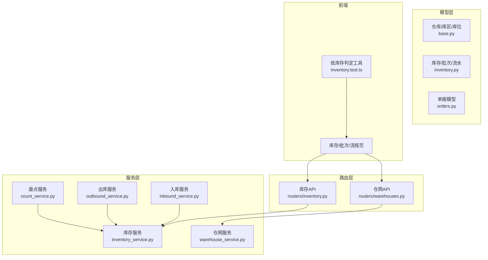
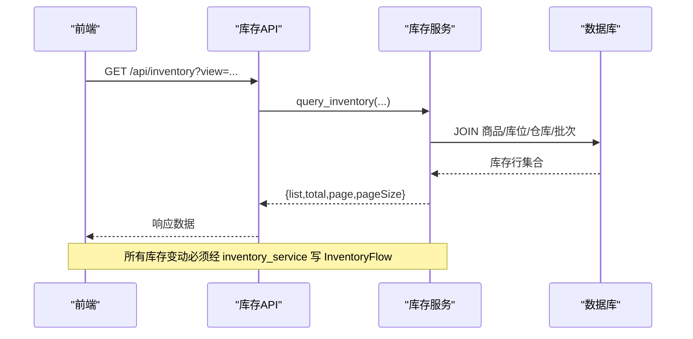
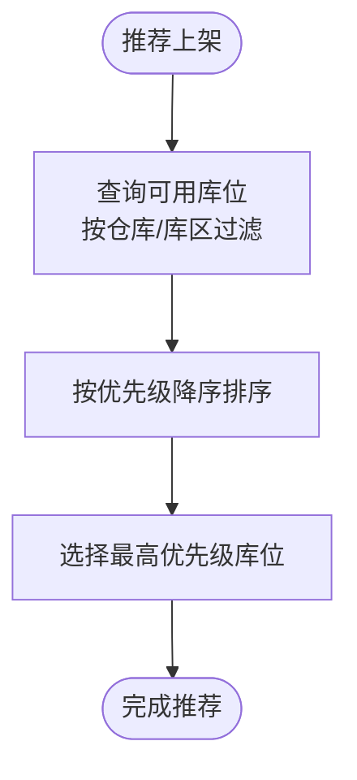
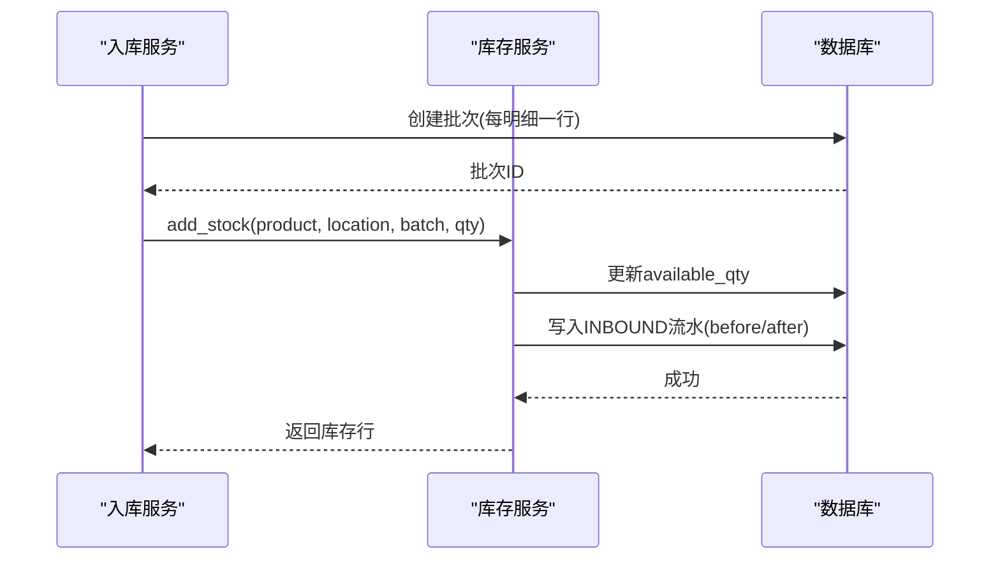
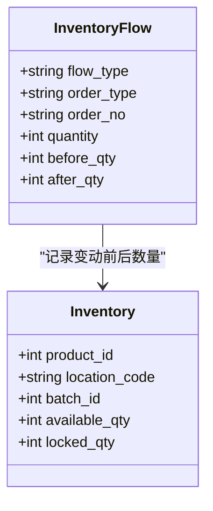
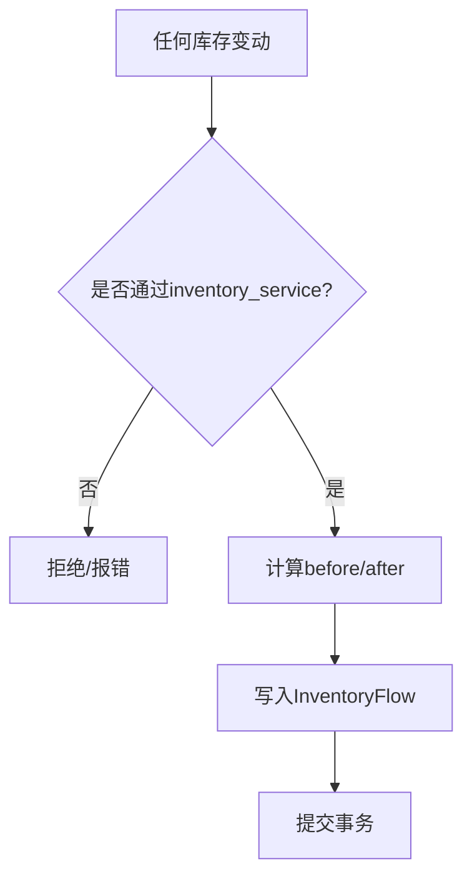
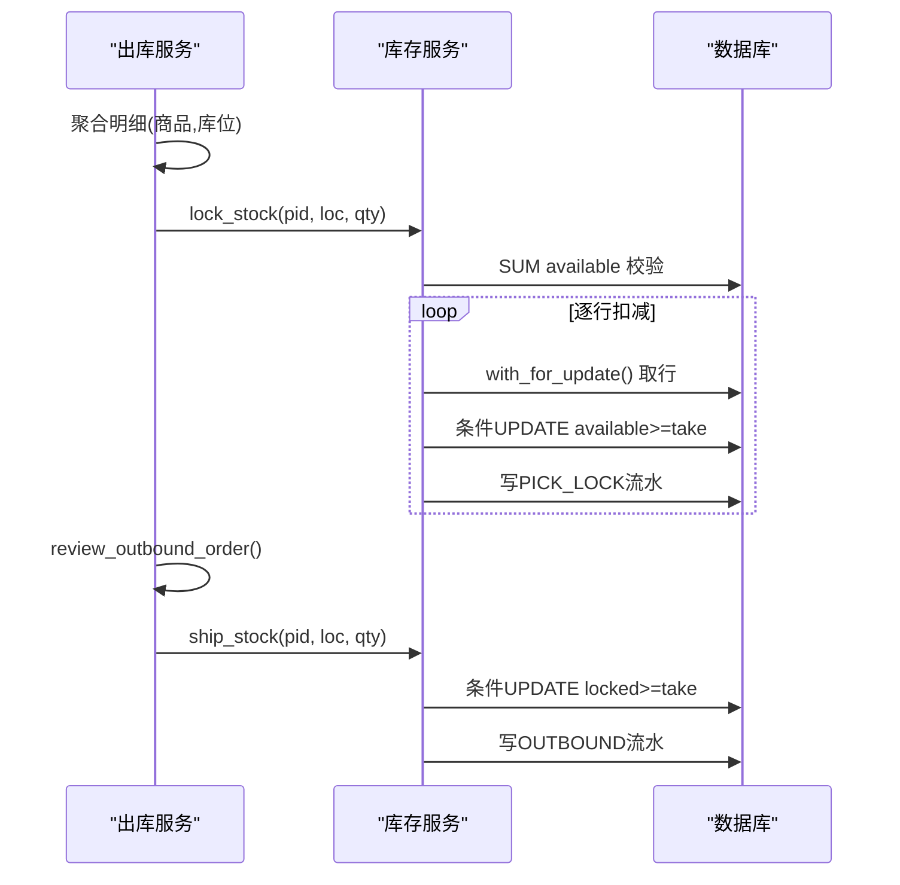
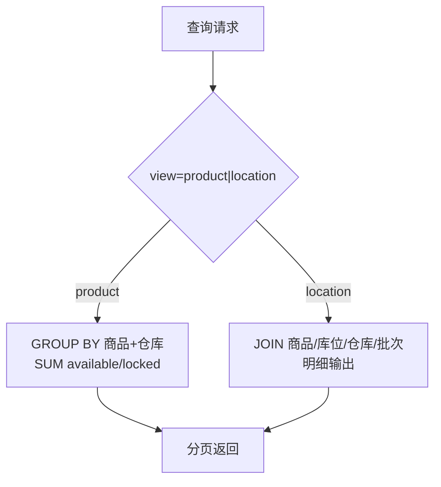
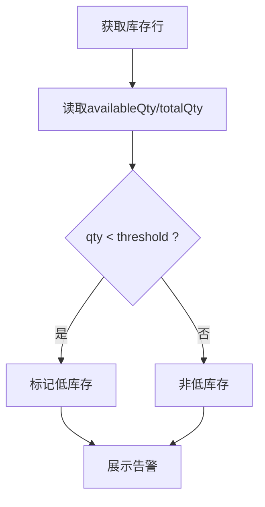
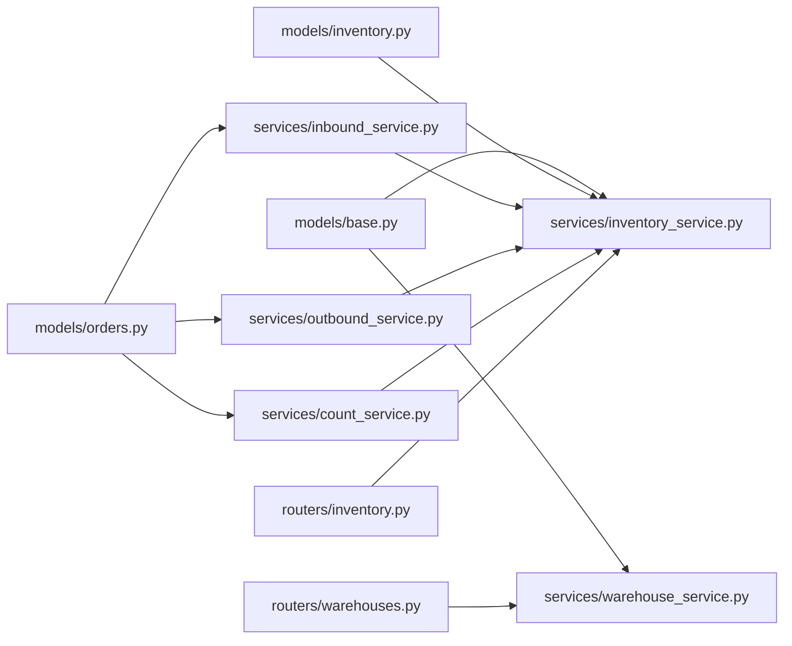

# 仓储管理功能

<cite>
**本文引用的文件**
- [inventory.py](file://backend-python/app/models/inventory.py)
- [base.py](file://backend-python/app/models/base.py)
- [orders.py](file://backend-python/app/models/orders.py)
- [inventory_service.py](file://backend-python/app/services/inventory_service.py)
- [inbound_service.py](file://backend-python/app/services/inbound_service.py)
- [outbound_service.py](file://backend-python/app/services/outbound_service.py)
- [count_service.py](file://backend-python/app/services/count_service.py)
- [warehouse_service.py](file://backend-python/app/services/warehouse_service.py)
- [inventory.py](file://backend-python/app/routers/inventory.py)
- [warehouses.py](file://backend-python/app/routers/warehouses.py)
- [inventory.py](file://backend-python/app/schemas/inventory.py)
- [test_inbound_service.py](file://backend-python/tests/test_inbound_service.py)
- [test_outbound_service.py](file://backend-python/tests/test_outbound_service.py)
- [inventory.test.ts](file://frontend-vue/src/utils/inventory.test.ts)
</cite>

## 目录
1. [简介](#简介)
2. [项目结构](#项目结构)
3. [核心组件](#核心组件)
4. [架构总览](#架构总览)
5. [详细组件分析](#详细组件分析)
6. [依赖关系分析](#依赖关系分析)
7. [性能考虑](#性能考虑)
8. [故障排查指南](#故障排查指南)
9. [结论](#结论)
10. [附录](#附录)

## 简介
本仓库实现了一套对标领星跨境仓储系统的仓储管理功能，围绕“仓库→库区→库位”的三层空间模型、批次与有效期管理、可用量与锁定量分离、全量库存流水追踪、双视图库存查询以及低库存预警等能力展开。系统通过统一的库存服务入口保证所有库存变动可追溯、可审计，并在出库拣货环节提供防超卖保障。

## 项目结构
后端采用分层设计：
- 模型层：定义仓库、库区、库位、商品、批次、库存行、库存流水及各类单据（入库/出库/波次/盘点/调整/移库/退货）。
- 服务层：封装业务逻辑，如入库收货、出库拣货/复核/发货、盘点调整、库存加减锁扣等。
- 路由层：暴露 REST API，供前端调用。
- 前端：Vue 页面与工具函数，支持库存查询、批次查看、低库存判定等。

**图表来源**
- [base.py:56-95](file://backend-python/app/models/base.py#L56-L95)
- [inventory.py:18-98](file://backend-python/app/models/inventory.py#L18-L98)
- [orders.py:17-300](file://backend-python/app/models/orders.py#L17-L300)
- [inventory_service.py:1-437](file://backend-python/app/services/inventory_service.py#L1-L437)
- [inbound_service.py:1-150](file://backend-python/app/services/inbound_service.py#L1-L150)
- [outbound_service.py:1-196](file://backend-python/app/services/outbound_service.py#L1-L196)
- [count_service.py:250-276](file://backend-python/app/services/count_service.py#L250-L276)
- [warehouse_service.py:1-96](file://backend-python/app/services/warehouse_service.py#L1-L96)
- [inventory.py:1-62](file://backend-python/app/routers/inventory.py#L1-L62)
- [warehouses.py:1-56](file://backend-python/app/routers/warehouses.py#L1-L56)
- [inventory.test.ts:1-55](file://frontend-vue/src/utils/inventory.test.ts#L1-L55)

**章节来源**
- [base.py:56-95](file://backend-python/app/models/base.py#L56-L95)
- [inventory.py:18-98](file://backend-python/app/models/inventory.py#L18-L98)
- [orders.py:17-300](file://backend-python/app/models/orders.py#L17-L300)
- [inventory_service.py:1-437](file://backend-python/app/services/inventory_service.py#L1-L437)
- [inbound_service.py:1-150](file://backend-python/app/services/inbound_service.py#L1-L150)
- [outbound_service.py:1-196](file://backend-python/app/services/outbound_service.py#L1-L196)
- [count_service.py:250-276](file://backend-python/app/services/count_service.py#L250-L276)
- [warehouse_service.py:1-96](file://backend-python/app/services/warehouse_service.py#L1-L96)
- [inventory.py:1-62](file://backend-python/app/routers/inventory.py#L1-L62)
- [warehouses.py:1-56](file://backend-python/app/routers/warehouses.py#L1-L56)
- [inventory.test.ts:1-55](file://frontend-vue/src/utils/inventory.test.ts#L1-L55)

## 核心组件
- 仓库三层结构：仓库(Warehouse) → 库区(Zone) → 库位(Location)，库位带优先级，用于推荐上架路径。
- 批次与有效期：每次入库收货为每个明细行生成独立批次，支持生产日期与有效期字段，便于先进先出与效期管理。
- 库存行与隔离：库存行维度为 (product_id, location_code, batch_id)，包含 available_qty（可用）与 locked_qty（锁定），锁定对应拣货暂存，隔离已承诺但未出库的库存。
- 全量流水：所有库存变动必须经 inventory_service 统一入口，强制写入 InventoryFlow，记录 flow_type、order_no、before_qty、after_qty 等，确保可追溯。
- 双视图查询：按产品汇总（product）与按库位明细（location）两种视图，支持仓库、批次、关键词过滤与分页。
- 低库存预警：前端提供阈值判定工具，结合库存数据展示低库存与临期预警。

**章节来源**
- [base.py:56-95](file://backend-python/app/models/base.py#L56-L95)
- [inventory.py:18-98](file://backend-python/app/models/inventory.py#L18-L98)
- [inventory_service.py:1-437](file://backend-python/app/services/inventory_service.py#L1-L437)
- [inventory.py:1-62](file://backend-python/app/routers/inventory.py#L1-L62)
- [inventory.test.ts:1-55](file://frontend-vue/src/utils/inventory.test.ts#L1-L55)

## 架构总览
库存变动的统一入口是 inventory_service，所有出入库、移库、调整、退货均通过该服务完成，并强制写流水。上层单据服务（入库/出库/盘点/移库/退货）负责状态机与业务校验，最终调用库存服务执行原子扣减或增加。

**图表来源**
- [inventory.py:12-31](file://backend-python/app/routers/inventory.py#L12-L31)
- [inventory_service.py:256-345](file://backend-python/app/services/inventory_service.py#L256-L345)

**章节来源**
- [inventory.py:12-31](file://backend-python/app/routers/inventory.py#L12-L31)
- [inventory_service.py:256-345](file://backend-python/app/services/inventory_service.py#L256-L345)

## 详细组件分析

### 仓库三层结构与库位优先级
- 仓库、库区、库位层级清晰，库位带 priority 字段，越大优先级越高；推荐上架时按优先级降序排序，优先选择高优库位。
- 库位列表接口支持按仓库、库区筛选，返回结果按 priority 降序排列。

**图表来源**
- [warehouse_service.py:70-78](file://backend-python/app/services/warehouse_service.py#L70-L78)
- [warehouses.py:43-49](file://backend-python/app/routers/warehouses.py#L43-L49)

**章节来源**
- [base.py:67-95](file://backend-python/app/models/base.py#L67-L95)
- [warehouse_service.py:70-78](file://backend-python/app/services/warehouse_service.py#L70-L78)
- [warehouses.py:43-49](file://backend-python/app/routers/warehouses.py#L43-L49)

### 批次管理与有效期
- 批次模型支持 inbound_date、manufacture_date、expiry_date，便于效期管理。
- 入库收货时，每个明细行生成一个批次（批次号=单号-明细id），并累加对应库位的可用库存，同时写 INBOUND 流水。

**图表来源**
- [inventory.py:18-31](file://backend-python/app/models/inventory.py#L18-L31)
- [inbound_service.py:92-129](file://backend-python/app/services/inbound_service.py#L92-L129)
- [inventory_service.py:75-88](file://backend-python/app/services/inventory_service.py#L75-L88)

**章节来源**
- [inventory.py:18-31](file://backend-python/app/models/inventory.py#L18-L31)
- [inbound_service.py:92-129](file://backend-python/app/services/inbound_service.py#L92-L129)
- [inventory_service.py:75-88](file://backend-python/app/services/inventory_service.py#L75-L88)
- [test_inbound_service.py:40-59](file://backend-python/tests/test_inbound_service.py#L40-L59)

### 库存隔离：可用量与锁定量
- available_qty：可用于销售或调拨的库存。
- locked_qty：已被拣货锁定但尚未发货的库存，隔离已承诺未出库部分，避免重复占用。
- 拣货阶段将 available 转为 locked；发货阶段扣减 locked。任一环节失败整体回滚，不留半成品。

**图表来源**
- [inventory.py:33-61](file://backend-python/app/models/inventory.py#L33-L61)
- [inventory.py:63-98](file://backend-python/app/models/inventory.py#L63-L98)

**章节来源**
- [inventory.py:33-61](file://backend-python/app/models/inventory.py#L33-L61)
- [inventory.py:63-98](file://backend-python/app/models/inventory.py#L63-L98)
- [outbound_service.py:102-176](file://backend-python/app/services/outbound_service.py#L102-L176)

### 全量流水追踪
- 所有库存变动必须经 inventory_service 统一入口，强制写入 InventoryFlow，包含 flow_type、order_type、order_no、quantity、before_qty、after_qty 等关键字段。
- 支持按订单号、商品、库位、流水类型过滤与分页查询。

**图表来源**
- [inventory_service.py:57-73](file://backend-python/app/services/inventory_service.py#L57-L73)
- [inventory_service.py:348-401](file://backend-python/app/services/inventory_service.py#L348-L401)

**章节来源**
- [inventory_service.py:57-73](file://backend-python/app/services/inventory_service.py#L57-L73)
- [inventory_service.py:348-401](file://backend-python/app/services/inventory_service.py#L348-L401)

### 出库流程与FIFO扣减策略
- 拣货：聚合同一(商品,库位)的明细，调用 lock_stock，将 available 转为 locked，并发下使用条件 UPDATE 与重读重试防止超卖。
- 复核：二次核对拣货数量。
- 发货：扣减 locked，写 OUTBOUND 流水。
- 扣减策略：跨批次先扣早期批次（按 id 升序），体现 FIFO 思想；盘点盘亏也遵循相同策略。

**图表来源**
- [outbound_service.py:102-176](file://backend-python/app/services/outbound_service.py#L102-L176)
- [inventory_service.py:147-251](file://backend-python/app/services/inventory_service.py#L147-L251)
- [count_service.py:250-276](file://backend-python/app/services/count_service.py#L250-L276)

**章节来源**
- [outbound_service.py:102-176](file://backend-python/app/services/outbound_service.py#L102-L176)
- [inventory_service.py:91-144](file://backend-python/app/services/inventory_service.py#L91-L144)
- [inventory_service.py:147-251](file://backend-python/app/services/inventory_service.py#L147-L251)
- [count_service.py:250-276](file://backend-python/app/services/count_service.py#L250-L276)
- [test_outbound_service.py:78-177](file://backend-python/tests/test_outbound_service.py#L78-L177)

### 库存查询双视图
- 产品视图：按 (商品, 仓库) 汇总 available/locked，适合宏观库存概览。
- 库位视图：按 (商品, 库位, 批次) 明细，适合精细化作业与追溯。
- 支持关键词搜索、仓库过滤、批次过滤与分页。

**图表来源**
- [inventory_service.py:256-345](file://backend-python/app/services/inventory_service.py#L256-L345)
- [inventory.py:12-31](file://backend-python/app/routers/inventory.py#L12-L31)

**章节来源**
- [inventory_service.py:256-345](file://backend-python/app/services/inventory_service.py#L256-L345)
- [inventory.py:12-31](file://backend-python/app/routers/inventory.py#L12-L31)

### 低库存预警
- 前端提供 isLowStock 工具函数，基于阈值判断是否为低库存；常量 LOW_STOCK_THRESHOLD 默认值为 10。
- 仪表盘展示低库存与临期预警，便于运营快速处理。

**图表来源**
- [inventory.test.ts:1-55](file://frontend-vue/src/utils/inventory.test.ts#L1-L55)

**章节来源**
- [inventory.test.ts:1-55](file://frontend-vue/src/utils/inventory.test.ts#L1-L55)

## 依赖关系分析
- 模型依赖：库存行依赖商品、库位、批次；流水依赖商品、批次。
- 服务依赖：入库/出库/盘点/移库等服务依赖库存服务；库存服务依赖模型与数据库会话。
- 路由依赖：库存与仓网路由分别依赖对应服务。

**图表来源**
- [base.py:56-95](file://backend-python/app/models/base.py#L56-L95)
- [inventory.py:18-98](file://backend-python/app/models/inventory.py#L18-L98)
- [orders.py:17-300](file://backend-python/app/models/orders.py#L17-L300)
- [inventory_service.py:1-437](file://backend-python/app/services/inventory_service.py#L1-L437)
- [inbound_service.py:1-150](file://backend-python/app/services/inbound_service.py#L1-L150)
- [outbound_service.py:1-196](file://backend-python/app/services/outbound_service.py#L1-L196)
- [count_service.py:250-276](file://backend-python/app/services/count_service.py#L250-L276)
- [warehouse_service.py:1-96](file://backend-python/app/services/warehouse_service.py#L1-L96)
- [inventory.py:1-62](file://backend-python/app/routers/inventory.py#L1-L62)
- [warehouses.py:1-56](file://backend-python/app/routers/warehouses.py#L1-L56)

**章节来源**
- [base.py:56-95](file://backend-python/app/models/base.py#L56-L95)
- [inventory.py:18-98](file://backend-python/app/models/inventory.py#L18-L98)
- [orders.py:17-300](file://backend-python/app/models/orders.py#L17-L300)
- [inventory_service.py:1-437](file://backend-python/app/services/inventory_service.py#L1-L437)
- [inbound_service.py:1-150](file://backend-python/app/services/inbound_service.py#L1-L150)
- [outbound_service.py:1-196](file://backend-python/app/services/outbound_service.py#L1-L196)
- [count_service.py:250-276](file://backend-python/app/services/count_service.py#L250-L276)
- [warehouse_service.py:1-96](file://backend-python/app/services/warehouse_service.py#L1-L96)
- [inventory.py:1-62](file://backend-python/app/routers/inventory.py#L1-L62)
- [warehouses.py:1-56](file://backend-python/app/routers/warehouses.py#L1-L56)

## 性能考虑
- 并发安全：拣货与发货使用“先总量校验 + 条件 UPDATE + 失败重读重试”，在 PostgreSQL 下配合 with_for_update 行锁，SQLite 下亦能避免陈旧读覆盖导致的超卖。
- 批量聚合：出库拣货/发货前对同一(商品,库位)的明细进行聚合，减少重复操作与锁竞争。
- 查询优化：库存与流水查询使用 JOIN 与索引列过滤，避免 N+1 问题；批次与库存查询支持分页。
- 建议：生产环境建议使用 PostgreSQL 以启用行锁；热点库位可增加索引或分片策略；大批量扣减可分批提交以降低事务长度。

[本节为通用性能建议，不直接分析具体文件]

## 故障排查指南
- 重复收货：入库单已完成时再次收货会抛出业务错误，需检查单据状态。
- 库存不足：拣货或发货时若可用/锁定不足，会抛出 409 错误；需核查库存与锁定量。
- 并发超卖：在高并发场景下，若出现锁定失败，应重试或提示用户稍后重试；确认数据库引擎与事务配置。
- 流水缺失：若发现库存变动无流水，检查是否通过 inventory_service 统一入口；确认事务提交成功。

**章节来源**
- [inbound_service.py:92-129](file://backend-python/app/services/inbound_service.py#L92-L129)
- [outbound_service.py:102-176](file://backend-python/app/services/outbound_service.py#L102-L176)
- [inventory_service.py:91-144](file://backend-python/app/services/inventory_service.py#L91-L144)
- [inventory_service.py:147-251](file://backend-python/app/services/inventory_service.py#L147-L251)

## 结论
本仓储管理系统以 inventory_service 为核心，实现了严格的批次管理、可用/锁定量分离、全量流水追踪与双视图查询，并通过优先级驱动的库位推荐提升作业效率。出库流程具备完善的防超卖机制与状态机控制，盘点与调整闭环完善。建议在生产环境使用 PostgreSQL 以获得更好的并发与一致性保障，并结合前端低库存预警提升运营效率。

[本节为总结性内容，不直接分析具体文件]

## 附录
- 业务场景示例
  - FIFO 先进先出扣减：出库拣货/发货与盘点盘亏均按“先扣早期批次”的策略执行，确保旧批次优先消耗。
  - 跨批次库存调拨：通过移库服务调用库存服务的 MOVE_OUT/MOVE_IN，分别写出库入流水，保持账实一致。
  - 低库存预警：前端根据阈值判定并展示告警，帮助及时补货或调拨。

[本节为概念性说明，不直接分析具体文件]