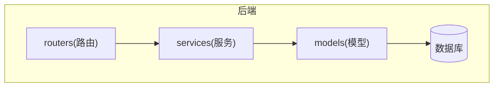
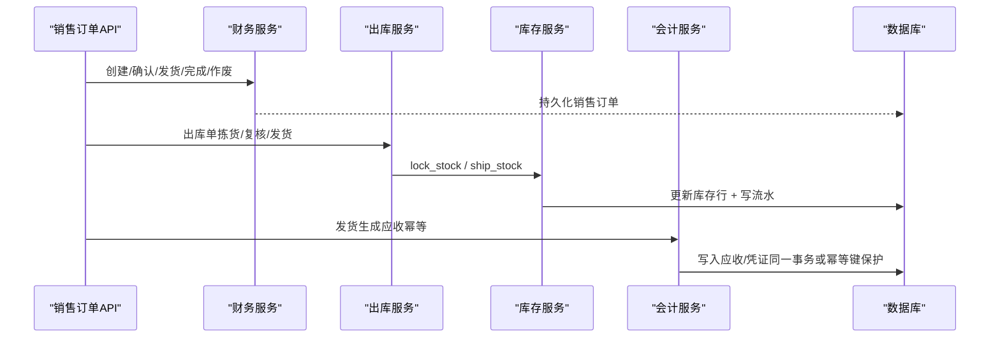
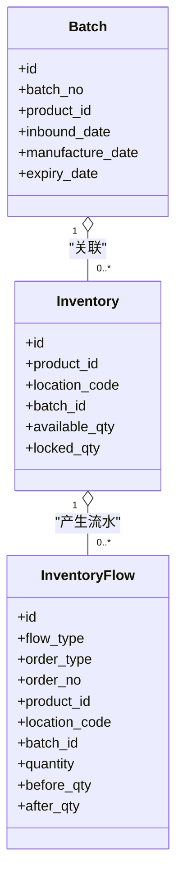
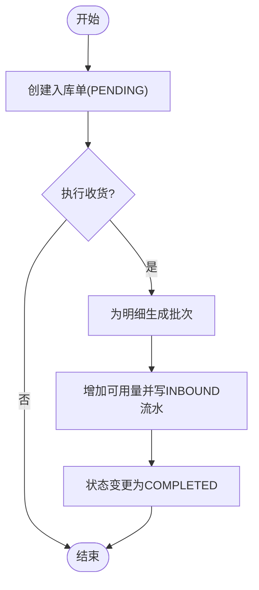
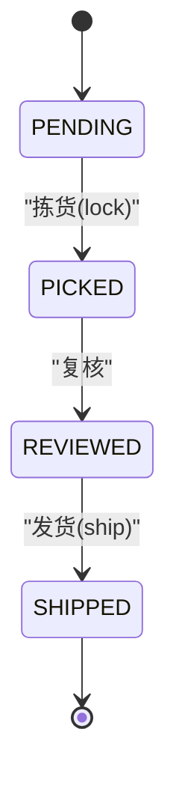
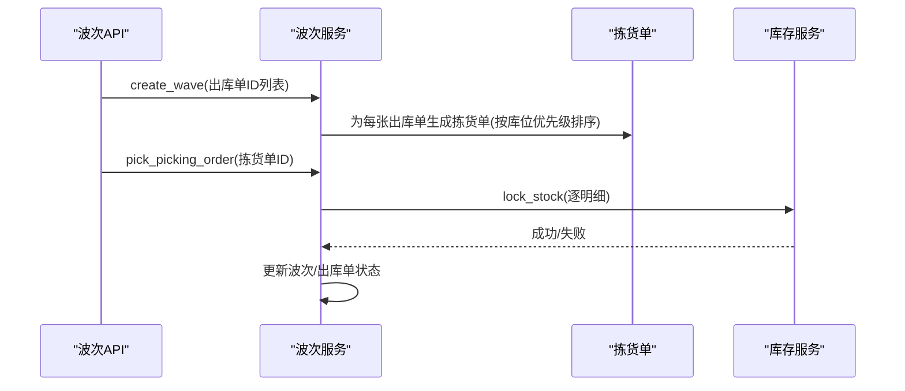
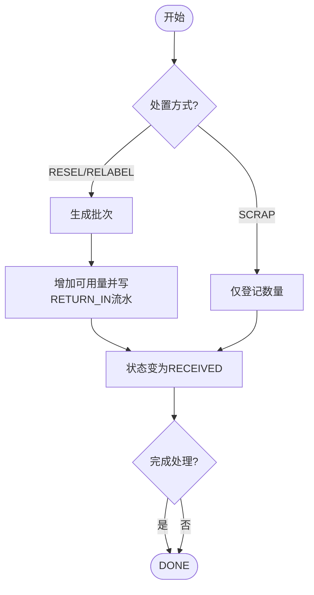
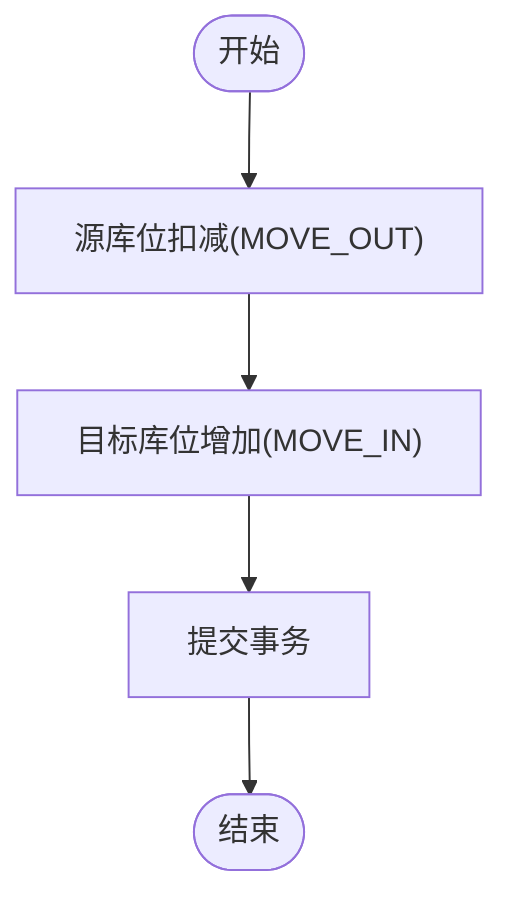
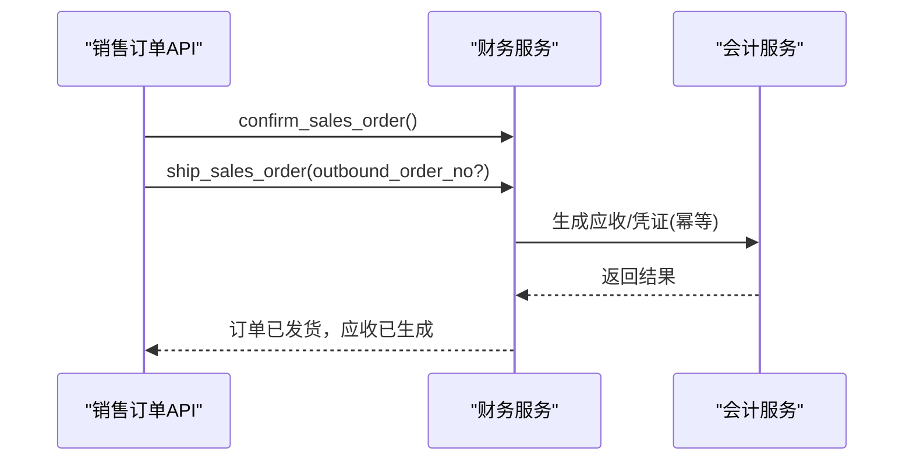
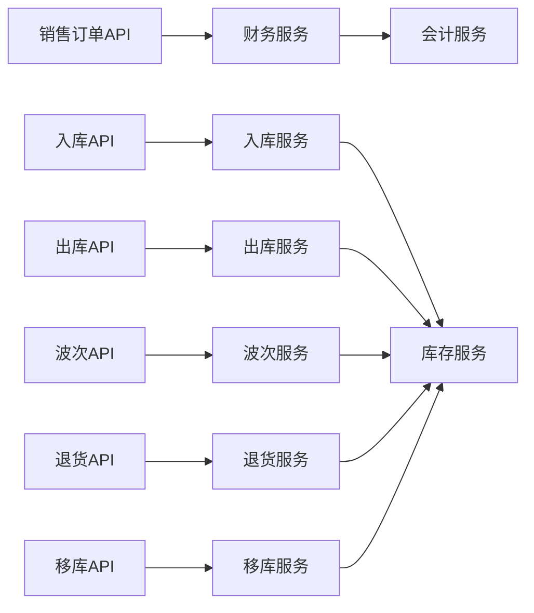

# 核心功能特性

<cite>
**本文引用的文件**
- [README.md](file://README.md)
- [PRD.md](file://docs/PRD.md)
- [orders.py](file://backend-python/app/models/orders.py)
- [inventory.py](file://backend-python/app/models/inventory.py)
- [accounting.py](file://backend-python/app/models/accounting.py)
- [sales_orders.py](file://backend-python/app/routers/sales_orders.py)
- [inbound_service.py](file://backend-python/app/services/inbound_service.py)
- [outbound_service.py](file://backend-python/app/services/outbound_service.py)
- [wave_service.py](file://backend-python/app/services/wave_service.py)
- [return_service.py](file://backend-python/app/services/return_service.py)
- [transfer_service.py](file://backend-python/app/services/transfer_service.py)
- [inventory_service.py](file://backend-python/app/services/inventory_service.py)
- [accounting_service.py](file://backend-python/app/services/accounting_service.py)
</cite>

## 目录
1. [简介](#简介)
2. [项目结构](#项目结构)
3. [核心组件](#核心组件)
4. [架构总览](#架构总览)
5. [详细组件分析](#详细组件分析)
6. [依赖关系分析](#依赖关系分析)
7. [性能与并发安全](#性能与并发安全)
8. [故障排查指南](#故障排查指南)
9. [结论](#结论)
10. [附录](#附录)

## 简介
本系统为“进销存·业财一体”中后台，围绕收入侧闭环、仓储作业与财务核算一体化展开。销售订单状态机驱动应收生成；仓储层提供批次管理、库存分离（可用量+锁定量）、全量流水追踪；出库链路通过波次拣货、复核验货、发货扣减形成完整闭环；退货、移库、调整等高级能力补齐仓库作业场景。所有库存变动统一经库存服务写入流水，确保可追溯与一致性。

## 项目结构
后端采用 FastAPI + SQLAlchemy 2.0，按领域分层：models（数据模型）→ services（业务服务）→ routers（API 路由）。仓储与财务域分别由独立服务实现，并通过统一事务边界保证一致性。前端 Vue 3 页面覆盖入库、出库、波次、退货、移库、库存、流水、批次、销售订单、财务等模块。

图表来源
- [sales_orders.py:1-81](file://backend-python/app/routers/sales_orders.py#L1-L81)
- [inbound_service.py:1-150](file://backend-python/app/services/inbound_service.py#L1-L150)
- [outbound_service.py:1-196](file://backend-python/app/services/outbound_service.py#L1-L196)
- [wave_service.py:1-238](file://backend-python/app/services/wave_service.py#L1-L238)
- [return_service.py:1-178](file://backend-python/app/services/return_service.py#L1-L178)
- [transfer_service.py:1-127](file://backend-python/app/services/transfer_service.py#L1-L127)
- [inventory_service.py:1-437](file://backend-python/app/services/inventory_service.py#L1-L437)
- [accounting_service.py:1-327](file://backend-python/app/services/accounting_service.py#L1-L327)

章节来源
- [README.md:36-64](file://README.md#L36-L64)
- [PRD.md:77-97](file://docs/PRD.md#L77-L97)

## 核心组件
- 仓储模型：批次（Batch）、库存行（Inventory，available_qty + locked_qty）、库存流水（InventoryFlow）
- 业务单据：入库单、出库单、波次/拣货单、退货单、移库单、调整单、盘点单
- 财务内核：科目表（Account）、凭证（Voucher/VoucherLine）、会计期间（Period）
- 库存服务：统一入口的加/扣/锁/发/调拨/退货入库，强制写流水
- 销售订单：草稿→确认→发货→完成/作废，发货自动生成应收（幂等）

章节来源
- [inventory.py:18-98](file://backend-python/app/models/inventory.py#L18-L98)
- [orders.py:17-300](file://backend-python/app/models/orders.py#L17-L300)
- [accounting.py:63-159](file://backend-python/app/models/accounting.py#L63-L159)
- [inventory_service.py:17-31](file://backend-python/app/services/inventory_service.py#L17-L31)
- [sales_orders.py:13-81](file://backend-python/app/routers/sales_orders.py#L13-L81)

## 架构总览
下图展示从销售订单到仓储作业与财务应收的关键交互路径：销售订单确认后，发货触发应收生成；出库单经拣货锁定、复核验货、发货扣减，全程写库存流水；退货、移库、调整均通过库存服务统一处理。

图表来源
- [sales_orders.py:52-66](file://backend-python/app/routers/sales_orders.py#L52-L66)
- [outbound_service.py:102-176](file://backend-python/app/services/outbound_service.py#L102-L176)
- [inventory_service.py:147-251](file://backend-python/app/services/inventory_service.py#L147-L251)
- [accounting_service.py:168-240](file://backend-python/app/services/accounting_service.py#L168-L240)

## 详细组件分析

### 仓储模型与库存分离机制
- 批次管理：每次入库收货为每个明细行生成独立批次，支持生产日期/有效期，便于效期与追溯管理
- 库存分离：库存行维度为 (product, location, batch)，可用量与锁定量分离，隔离已承诺未出库库存
- 全量流水：任何库存变动必须经库存服务写入 inventory_flow，记录 before/after 数量，支持按单号/商品/库位/类型查询

图表来源
- [inventory.py:18-98](file://backend-python/app/models/inventory.py#L18-L98)

章节来源
- [inventory.py:18-98](file://backend-python/app/models/inventory.py#L18-L98)
- [inventory_service.py:57-88](file://backend-python/app/services/inventory_service.py#L57-L88)
- [inventory_service.py:348-401](file://backend-python/app/services/inventory_service.py#L348-L401)

### 入库单处理流程（PENDING → COMPLETED）
- 创建入库单：仅落库，不改变库存
- 收货上架：为每个明细生成批次，累加对应库位的可用量，写 INBOUND 流水，整单事务内完成

图表来源
- [inbound_service.py:38-129](file://backend-python/app/services/inbound_service.py#L38-L129)

章节来源
- [inbound_service.py:38-129](file://backend-python/app/services/inbound_service.py#L38-L129)

### 出库单状态机与防超卖（PENDING → PICKED → REVIEWED → SHIPPED）
- 拣货（PICKED）：聚合明细，调用库存服务将 available 转为 locked，条件 UPDATE + FOR UPDATE 防并发超卖
- 复核（REVIEWED）：二次核对拣货数量
- 发货（SHIPPED）：扣减 locked，写 OUTBOUND 流水

图表来源
- [outbound_service.py:16-19](file://backend-python/app/services/outbound_service.py#L16-L19)
- [outbound_service.py:102-176](file://backend-python/app/services/outbound_service.py#L102-L176)

章节来源
- [outbound_service.py:102-176](file://backend-python/app/services/outbound_service.py#L102-L176)
- [inventory_service.py:147-251](file://backend-python/app/services/inventory_service.py#L147-L251)

### 波次拣货（WAVE）
- 波次聚合：选择多张 PENDING 出库单，逐单生成拣货单，明细按 (商品, 库位) 聚合并按库位优先级排序
- 拣货执行：锁定库存，同步推进出库单与波次状态（CREATED → PICKING → COMPLETED）

图表来源
- [wave_service.py:62-131](file://backend-python/app/services/wave_service.py#L62-L131)
- [wave_service.py:153-197](file://backend-python/app/services/wave_service.py#L153-L197)

章节来源
- [wave_service.py:62-197](file://backend-python/app/services/wave_service.py#L62-L197)

### 退货管理（PENDING → RECEIVED → DONE）
- 收货登记：对 RESELL/RELABEL 明细生成批次并累加可用量（RETURN_IN 流水），SCRAP 仅登记不累加
- 完成处理：标记为 DONE

图表来源
- [return_service.py:111-157](file://backend-python/app/services/return_service.py#L111-L157)

章节来源
- [return_service.py:111-157](file://backend-python/app/services/return_service.py#L111-L157)

### 移库与调整
- 移库：源库位扣减可用量（MOVE_OUT），目标库位增加可用量（MOVE_IN），双向写流水，整单事务
- 调整：盘盈/盘亏直接完成并写流水

图表来源
- [transfer_service.py:34-113](file://backend-python/app/services/transfer_service.py#L34-L113)

章节来源
- [transfer_service.py:34-113](file://backend-python/app/services/transfer_service.py#L34-L113)

### 销售订单与业财一体（收入侧闭环）
- 状态流转：草稿 → 已确认 → 已发货 → 已完成/已作废
- 发货即入账：发货时自动生成应收（到期日=发货日+账期），幂等由唯一约束兜底
- 收款核销：支持部分核销与多笔核销，保留预收余额用于后续核销
- 账龄与预警：以到期日为基准分段统计

图表来源
- [sales_orders.py:52-66](file://backend-python/app/routers/sales_orders.py#L52-L66)
- [accounting_service.py:168-240](file://backend-python/app/services/accounting_service.py#L168-L240)

章节来源
- [sales_orders.py:13-81](file://backend-python/app/routers/sales_orders.py#L13-L81)
- [README.md:38-43](file://README.md#L38-L43)

## 依赖关系分析
- 路由层依赖服务层：销售订单路由调用财务服务；出入库/波次/退货/移库路由调用各自服务
- 服务层依赖模型与库存服务：所有库存变动统一经 inventory_service，确保一致性与可追溯
- 财务服务与会计服务：销售订单发货触发应收生成，凭证引擎负责过账与期间控制

图表来源
- [sales_orders.py:13-81](file://backend-python/app/routers/sales_orders.py#L13-L81)
- [inbound_service.py:1-150](file://backend-python/app/services/inbound_service.py#L1-L150)
- [outbound_service.py:1-196](file://backend-python/app/services/outbound_service.py#L1-L196)
- [wave_service.py:1-238](file://backend-python/app/services/wave_service.py#L1-L238)
- [return_service.py:1-178](file://backend-python/app/services/return_service.py#L1-L178)
- [transfer_service.py:1-127](file://backend-python/app/services/transfer_service.py#L1-L127)
- [inventory_service.py:1-437](file://backend-python/app/services/inventory_service.py#L1-L437)
- [accounting_service.py:1-327](file://backend-python/app/services/accounting_service.py#L1-L327)

章节来源
- [README.md:81-115](file://README.md#L81-L115)

## 性能与并发安全
- 并发安全（防超卖）：
  - 使用 SELECT ... FOR UPDATE（PostgreSQL 生效，SQLite 忽略）
  - 条件 UPDATE（WHERE available_qty >= take）+ 失败重读重试
  - 先 SUM 校验总量，不足直接返回 False 无副作用
  - 整单事务：任一明细失败则整体回滚，不留半成品
- 查询优化：
  - joinedload 避免 N+1 查询
  - 常用过滤列建索引（如 location_code、product_id、created_at）
- 成本与精度：
  - 财务金额使用 Decimal/Numeric 精确类型（服务层 round 控制）
  - 借贷平衡比较使用 EPS 容差

章节来源
- [README.md:58-63](file://README.md#L58-L63)
- [inventory_service.py:91-251](file://backend-python/app/services/inventory_service.py#L91-L251)
- [inventory_service.py:256-345](file://backend-python/app/services/inventory_service.py#L256-L345)
- [accounting_service.py:168-240](file://backend-python/app/services/accounting_service.py#L168-L240)

## 故障排查指南
- 出库拣货失败：检查库存是否充足、库位是否存在、聚合逻辑是否正确
- 发货失败：确认已复核且锁定库存充足
- 入库收货失败：检查商品与库位存在性、批次生成与流水写入
- 退货登记失败：确认处置方式与库存动作匹配
- 移库失败：源库位可用量是否足够，目标库位是否存在
- 财务过账失败：检查期间是否开放、分录方向与金额是否合法、借贷是否平衡

章节来源
- [outbound_service.py:102-176](file://backend-python/app/services/outbound_service.py#L102-L176)
- [inbound_service.py:92-129](file://backend-python/app/services/inbound_service.py#L92-L129)
- [return_service.py:111-157](file://backend-python/app/services/return_service.py#L111-L157)
- [transfer_service.py:34-113](file://backend-python/app/services/transfer_service.py#L34-L113)
- [accounting_service.py:168-240](file://backend-python/app/services/accounting_service.py#L168-L240)

## 结论
本系统以“仓储底座 + 业财一体”为核心，通过严格的状态机与统一的库存服务，实现了从销售订单到仓储作业再到财务应收的闭环。批次管理与库存分离保障了精细化运营，全量流水确保了可追溯性。波次拣货、退货、移库与调整等高级能力完善了仓库作业场景。并发安全策略有效防止超卖，保障高并发下的数据一致性。

## 附录
- 快速启动与演示：参考 README 中的在线演示与部署说明
- 测试覆盖：后端 pytest 126 用例，前端 vitest 31 用例，Playwright E2E 覆盖核心流程
- 文档与规范：API 接口规范见 docs/API_SPEC.md，需求文档见 docs/PRD.md

章节来源
- [README.md:12-33](file://README.md#L12-L33)
- [README.md:216-229](file://README.md#L216-L229)
- [PRD.md:147-157](file://docs/PRD.md#L147-L157)