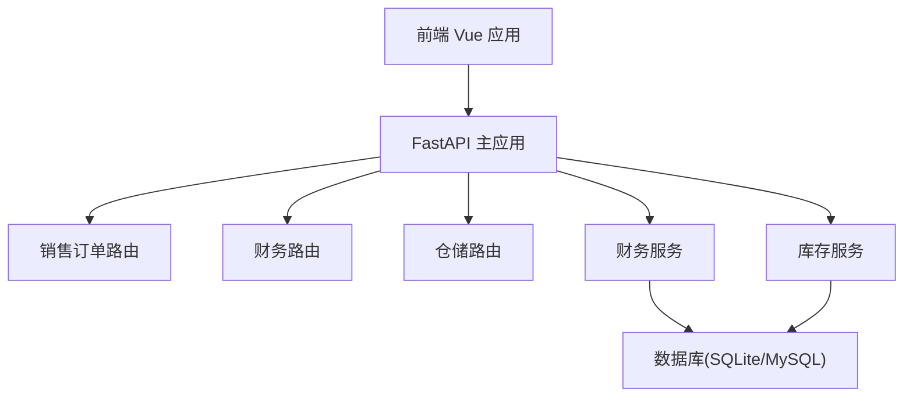
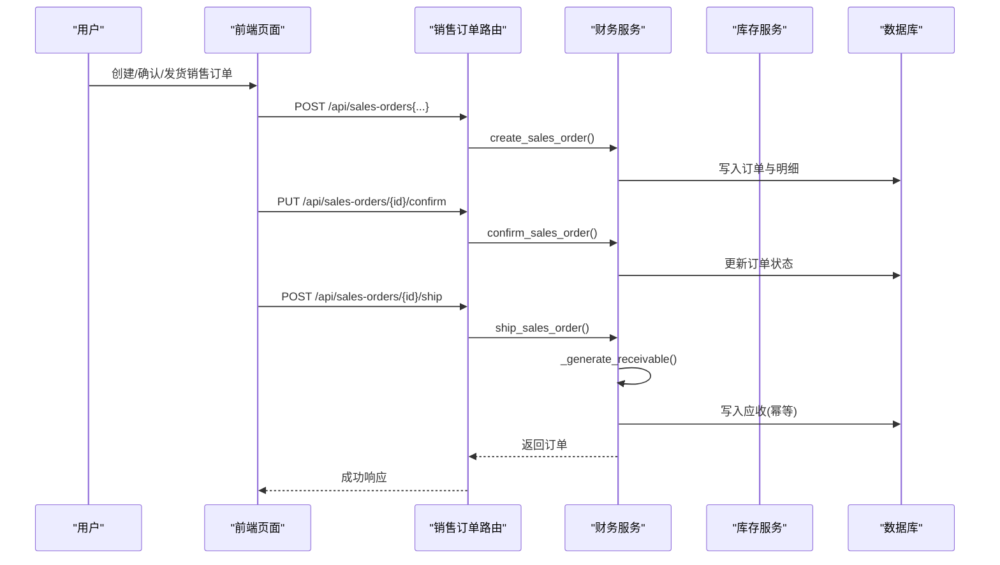
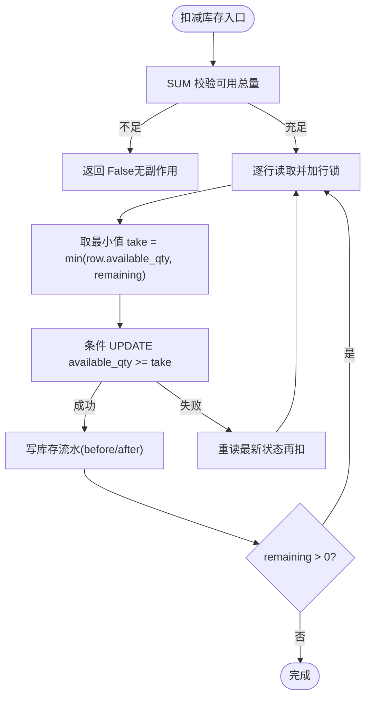
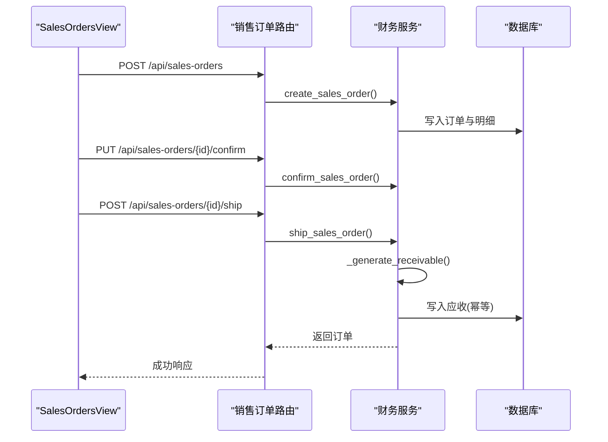
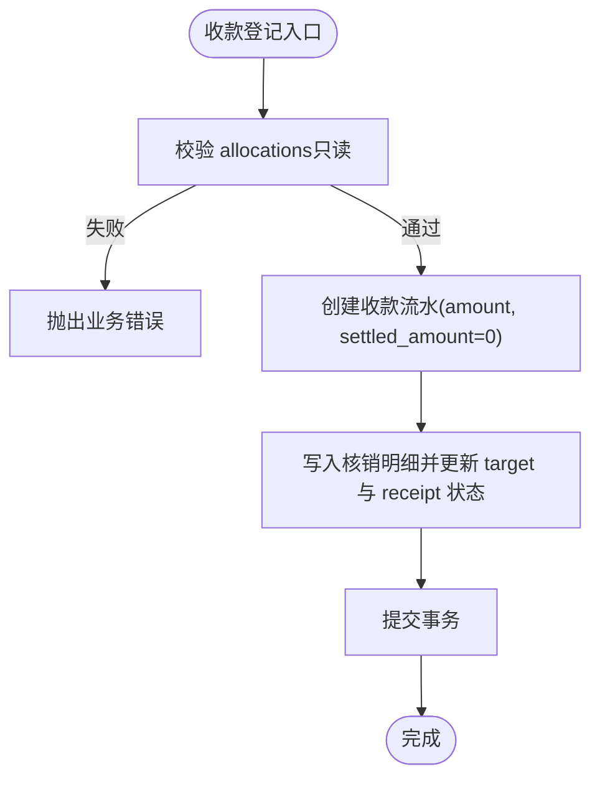
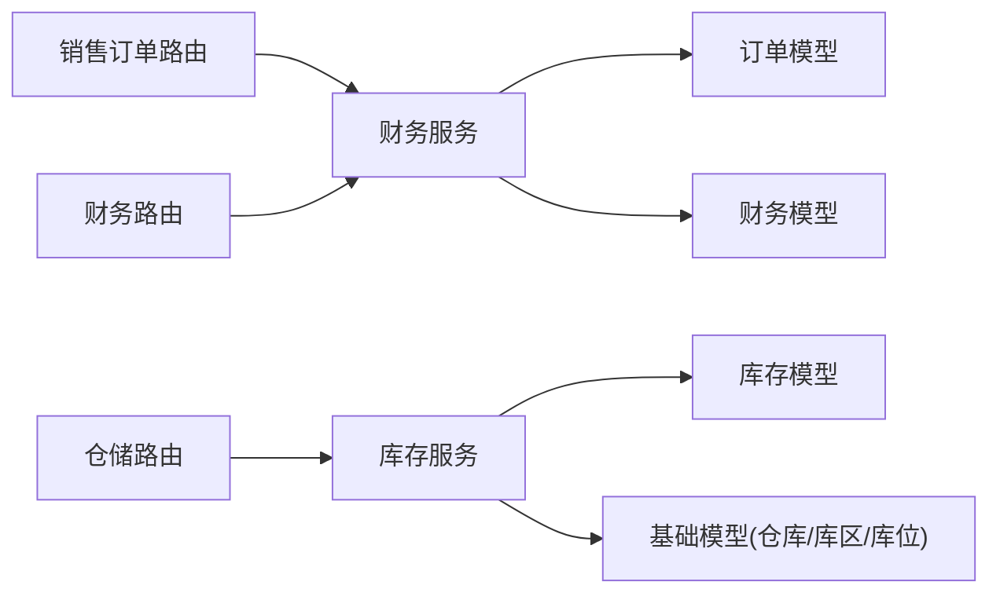

# 系统介绍与目标

<cite>
**本文引用的文件**
- [README.md](file://README.md)
- [PRD.md](file://docs/PRD.md)
- [main.py](file://backend-python/app/main.py)
- [base.py](file://backend-python/app/models/base.py)
- [orders.py](file://backend-python/app/models/orders.py)
- [inventory.py](file://backend-python/app/models/inventory.py)
- [finance.py](file://backend-python/app/models/finance.py)
- [sales_orders.py](file://backend-python/app/routers/sales_orders.py)
- [finance_service.py](file://backend-python/app/services/finance_service.py)
- [inventory_service.py](file://backend-python/app/services/inventory_service.py)
- [SalesOrdersView.vue](file://frontend-vue/src/views/SalesOrdersView.vue)
- [FinanceView.vue](file://frontend-vue/src/views/FinanceView.vue)
</cite>

## 目录
1. [引言](#引言)
2. [项目结构](#项目结构)
3. [核心组件](#核心组件)
4. [架构总览](#架构总览)
5. [详细组件分析](#详细组件分析)
6. [依赖关系分析](#依赖关系分析)
7. [性能与并发特性](#性能与并发特性)
8. [排错指南](#排错指南)
9. [结论](#结论)
10. [附录：术语与角色流程](#附录：术语与角色流程)

## 引言
本系统定位为「进销存 + 业财一体」的中后台平台，目标是让业务单据（销售、仓储）与财务数据（应收、收款核销、账龄、经营驾驶舱）同源同流，消除传统系统中“库存与财务两张皮”的痛点。通过规则驱动的业财闭环，实现从销售订单到发货、自动生成应收、收款核销（支持部分核销与预收）、账龄统计与经营驾驶舱的全链路管理。

- 核心目标
  - 以库存底座为基础，补齐销售订单与财务应收，打通收入侧业财闭环。
  - 提供仓库管理员、销售人员、财务人员等角色的端到端工作流支撑。
  - 通过幂等、事务与并发控制，确保数据一致性与可追溯性。

- 设计理念
  - 「库存底座 + 业财一体」：所有库存变动统一入口、全量流水；业务确认与财务生成在同一事务内完成，失败即回滚，杜绝中间态。
  - 状态机驱动：入库、出库、波次、退货、调整等单据均按严格状态流转，保证作业可控。
  - 三层仓储模型：仓库→库区→库位，结合批次管理与可用/锁定分离，满足精细化作业与防超卖。

**章节来源**
- [README.md:1-64](file://README.md#L1-L64)
- [PRD.md:13-47](file://docs/PRD.md#L13-L47)

## 项目结构
系统采用前后端分离架构：
- 后端：Python + FastAPI，模块化路由与服务层，数据库使用 SQLite（开发）/ MySQL（容器），启动时自动建表并初始化示例数据。
- 前端：Vue 3 + Element Plus，提供销售订单、财务、仓储等页面，支持 Mock 模式与真后端切换。

**图表来源**
- [main.py:16-69](file://backend-python/app/main.py#L16-L69)

**章节来源**
- [README.md:66-115](file://README.md#L66-L115)
- [main.py:16-69](file://backend-python/app/main.py#L16-L69)

## 核心组件
- 仓储模型
  - 仓库(Warehouse) → 库区(Zone) → 库位(Location)，库位带优先级，用于上架推荐与拣货排序。
  - 批次(Batch)：每次入库收货生成独立批次，支持生产日期/有效期。
  - 库存行(Inventory)：product+location+batch 维度，available_qty 与 locked_qty 分离，隔离已承诺未出库库存。
  - 库存流水(InventoryFlow)：全量记录每次变动的前后数量，确保可追溯。

- 业务单据
  - 入库单：PENDING → COMPLETED，收货时生成批次、累加库存、写流水。
  - 出库单：PENDING → PICKED → REVIEWED → SHIPPED，复核为发货前置环节。
  - 波次拣货：聚合多张出库单生成波次，拣货单按库位优先级排序，拣货时锁定库存。
  - 退货单：PENDING → RECEIVED → DONE，按处置方式决定是否回补库存。
  - 移库/调整单：直接完成并写双向流水。

- 业财一体（收入侧）
  - 销售订单：DRAFT → CONFIRMED → SHIPPED → COMPLETED/CANCELLED，金额=Σ(数量×单价)。
  - 发货自动生成应收：到期日=发货日+账期；幂等由唯一约束(source_order_no, entry_type)兜底。
  - 收款核销：支持部分核销与多笔核销；收款允许保留未核销余额（预收）。
  - 账龄与预警：以到期日为基准实时分段（未到期/逾期1-30/31-60/60+天）。
  - 经营驾驶舱：应收总额、已回款、未回款、逾期、欠款TOP、账龄分布、订单与回款趋势。

**章节来源**
- [base.py:14-95](file://backend-python/app/models/base.py#L14-L95)
- [orders.py:17-300](file://backend-python/app/models/orders.py#L17-L300)
- [inventory.py:18-98](file://backend-python/app/models/inventory.py#L18-L98)
- [finance.py:26-117](file://backend-python/app/models/finance.py#L26-L117)
- [README.md:38-64](file://README.md#L38-L64)

## 架构总览
系统以 FastAPI 为主入口，注册仓储、销售、财务等路由模块；服务层封装业务逻辑，调用数据模型进行持久化；前端通过 API 与后端交互，提供可视化操作界面。

**图表来源**
- [sales_orders.py:13-66](file://backend-python/app/routers/sales_orders.py#L13-L66)
- [finance_service.py:118-268](file://backend-python/app/services/finance_service.py#L118-L268)

**章节来源**
- [main.py:53-69](file://backend-python/app/main.py#L53-L69)
- [sales_orders.py:13-66](file://backend-python/app/routers/sales_orders.py#L13-L66)
- [finance_service.py:118-268](file://backend-python/app/services/finance_service.py#L118-L268)

## 详细组件分析

### 仓储模型与库存服务
- 三层仓储模型：仓库→库区→库位，库位带优先级，便于上架推荐与拣货路径优化。
- 库存行按(product_id, location_code, batch_id)维度管理，available_qty 与 locked_qty 分离，避免超卖。
- 库存服务提供统一入口：add_stock、deduct_stock、lock_stock、ship_stock，强制写 InventoryFlow，保证全量可追溯。
- 并发安全：条件 UPDATE + with_for_update（PostgreSQL 生效，SQLite 忽略），SUM 校验总量不足直接返回 False，整单事务任一失败则回滚。

**图表来源**
- [inventory_service.py:91-144](file://backend-python/app/services/inventory_service.py#L91-L144)

**章节来源**
- [base.py:56-95](file://backend-python/app/models/base.py#L56-L95)
- [inventory.py:18-98](file://backend-python/app/models/inventory.py#L18-L98)
- [inventory_service.py:91-251](file://backend-python/app/services/inventory_service.py#L91-L251)

### 销售订单与应收生成
- 销售订单状态机：DRAFT → CONFIRMED → SHIPPED → COMPLETED/CANCELLED。
- 发货在同一事务内生成应收，到期日=发货日+账期；幂等由 DB 唯一约束(source_order_no, entry_type)兜底。
- 前端 SalesOrdersView 提供新建、确认、发货、完成、作废等操作，发货提示将自动生成应收。

**图表来源**
- [sales_orders.py:13-66](file://backend-python/app/routers/sales_orders.py#L13-L66)
- [finance_service.py:118-268](file://backend-python/app/services/finance_service.py#L118-L268)
- [SalesOrdersView.vue:114-136](file://frontend-vue/src/views/SalesOrdersView.vue#L114-L136)

**章节来源**
- [finance.py:26-67](file://backend-python/app/models/finance.py#L26-L67)
- [sales_orders.py:13-66](file://backend-python/app/routers/sales_orders.py#L13-L66)
- [finance_service.py:118-268](file://backend-python/app/services/finance_service.py#L118-L268)
- [SalesOrdersView.vue:114-136](file://frontend-vue/src/views/SalesOrdersView.vue#L114-L136)

### 收款核销与账龄
- 收款登记支持部分核销与多笔核销；收款金额可大于核销金额，差额作为预收余额。
- 核销前进行只读校验（目标存在、类型正确、金额为正、不超单张未结、合计不超可核销余额），通过后写入 FinanceSettlement 并更新双方状态。
- 账龄以到期日为基准实时分段（未到期/逾期1-30/31-60/60+天），不落库，查询时计算。

**图表来源**
- [finance_service.py:341-424](file://backend-python/app/services/finance_service.py#L341-L424)

**章节来源**
- [finance.py:71-117](file://backend-python/app/models/finance.py#L71-L117)
- [finance_service.py:341-424](file://backend-python/app/services/finance_service.py#L341-L424)
- [FinanceView.vue:69-94](file://frontend-vue/src/views/FinanceView.vue#L69-L94)

### 经营驾驶舱
- 提供应收总额、已回款、未回款、逾期、订单数与金额、账龄分布、订单与回款趋势等指标。
- 数据来源与财务页同源，口径一致，便于管理层快速掌握经营状况。

**章节来源**
- [finance_service.py:511-588](file://backend-python/app/services/finance_service.py#L511-L588)
- [README.md:38-43](file://README.md#L38-L43)

## 依赖关系分析
- 路由层依赖服务层，服务层依赖数据模型与数据库。
- 销售订单路由依赖财务服务；财务服务依赖销售订单与财务流水模型。
- 库存服务被仓储相关路由复用，确保库存变动统一入口与全量流水。

**图表来源**
- [main.py:53-69](file://backend-python/app/main.py#L53-L69)
- [sales_orders.py:13-66](file://backend-python/app/routers/sales_orders.py#L13-L66)
- [finance_service.py:118-268](file://backend-python/app/services/finance_service.py#L118-L268)
- [inventory_service.py:91-251](file://backend-python/app/services/inventory_service.py#L91-L251)

**章节来源**
- [main.py:53-69](file://backend-python/app/main.py#L53-L69)
- [sales_orders.py:13-66](file://backend-python/app/routers/sales_orders.py#L13-L66)
- [finance_service.py:118-268](file://backend-python/app/services/finance_service.py#L118-L268)
- [inventory_service.py:91-251](file://backend-python/app/services/inventory_service.py#L91-L251)

## 性能与并发特性
- 并发安全：行级 SELECT ... FOR UPDATE（PostgreSQL 生效，SQLite 忽略），条件 UPDATE（WHERE available_qty >= take）+ 失败重读重试，先 SUM 校验总量不足直接返回 False 无副作用，整单事务任一失败则回滚不留半成品。
- 幂等设计：应收生成通过 DB 唯一约束(source_order_no, entry_type)兜底，重复发货不产生第二条。
- 查询优化：库存查询按商品汇总或库位明细，支持关键词、仓库筛选、批次筛选与服务端分页；流水查询支持 order_no、product_id、location_code、flow_type 过滤。

**章节来源**
- [README.md:58-64](file://README.md#L58-L64)
- [inventory_service.py:91-251](file://backend-python/app/services/inventory_service.py#L91-L251)
- [finance_service.py:295-330](file://backend-python/app/services/finance_service.py#L295-L330)

## 排错指南
- 常见业务异常
  - 客户不存在、商品不存在：检查基础数据是否完整。
  - 订单状态不允许编辑/确认/发货/作废：遵循状态机限制。
  - 核销金额超过未结余额或到账金额：调整核销金额或到账金额。
  - 并发冲突（应收已存在）：重试或检查重复发货。
- 日志与诊断
  - 库存流水包含 before/after 数量，便于定位变动原因。
  - 财务流水与核销明细可追踪应收与收款的对应关系。

**章节来源**
- [finance_service.py:118-268](file://backend-python/app/services/finance_service.py#L118-L268)
- [finance_service.py:341-424](file://backend-python/app/services/finance_service.py#L341-L424)
- [inventory_service.py:348-401](file://backend-python/app/services/inventory_service.py#L348-L401)

## 结论
本系统通过「库存底座 + 业财一体」的设计，实现了销售订单→发货→应收→收款核销的完整闭环，解决了传统进销存中库存与财务脱节的问题。三层仓储模型与批次管理保障了精细化作业与防超卖；统一的库存服务与全量流水确保了数据可追溯；幂等与并发控制保证了高并发下的数据一致性。面向仓库管理员、销售人员、财务人员等角色，提供了端到端的业务流程支撑与经营驾驶舱，助力企业实现真正的业财一体化管理。

## 附录：术语与角色流程
- 术语
  - 业财一体化：业务单据经规则自动转化为财务凭证，业务流与资金流同源。
  - 凭证引擎：读「过账规则配置表」把业务事件翻译为借贷分录的服务（未来扩展）。
  - 红字冲销：以负数金额的镜像凭证抵销原凭证，替代修改/删除，保证可审计。
  - 结账/锁账：期间封存，该期间凭证写入一律拒绝，错误只能在开放期间冲销重做。
  - 语义视图：为 ChatBI 预定义的只读宽表视图，AI 只能在其中受控查询（未来扩展）。

- 角色与流程
  - 仓库管理员：负责入库、出库、波次拣货、盘点、移库、调整等仓储作业，关注库存准确性与作业效率。
  - 销售人员：负责创建销售订单、确认订单、触发发货，关注订单状态与回款进度。
  - 财务人员：负责查看应收台账、登记收款与核销、关注账龄与回款情况，必要时进行预收处理。
  - 老板/经营层：通过经营驾驶舱查看应收总额、已回款、未回款、逾期、订单与回款趋势等关键指标。

**章节来源**
- [PRD.md:28-47](file://docs/PRD.md#L28-L47)
- [PRD.md:172-183](file://docs/PRD.md#L172-L183)