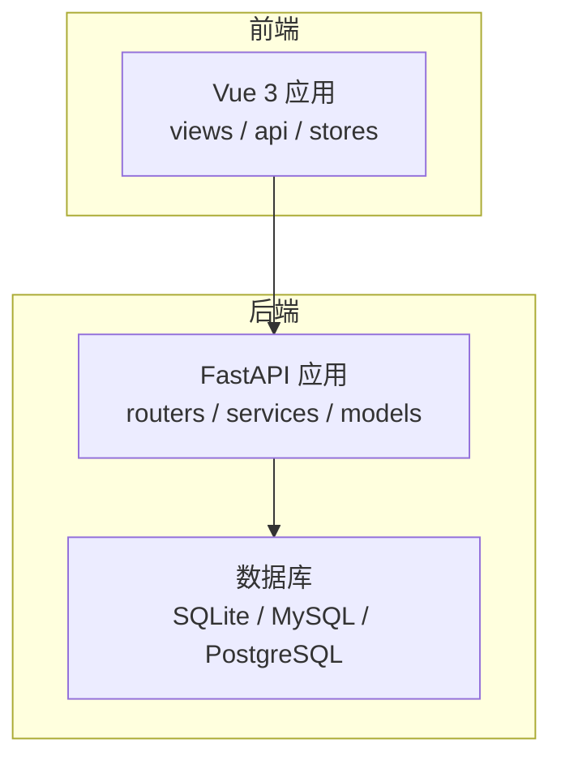
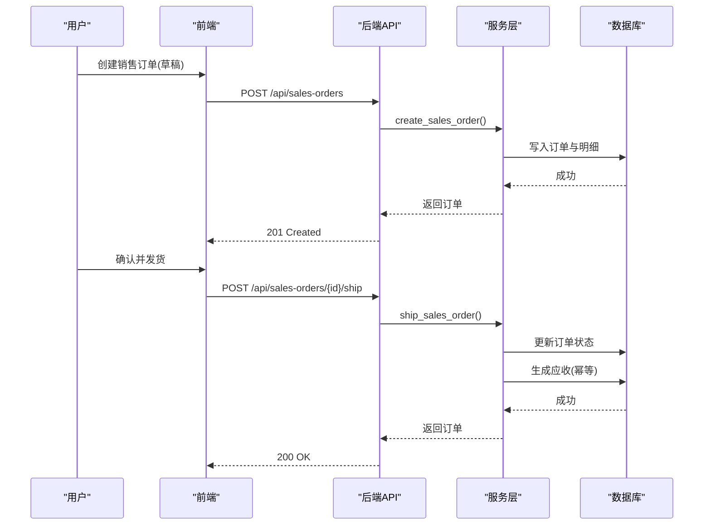
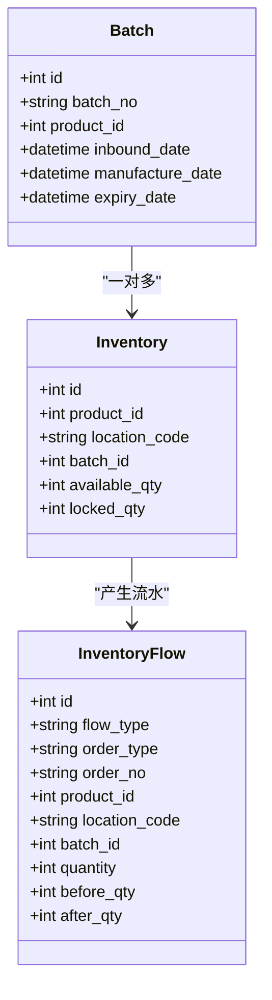
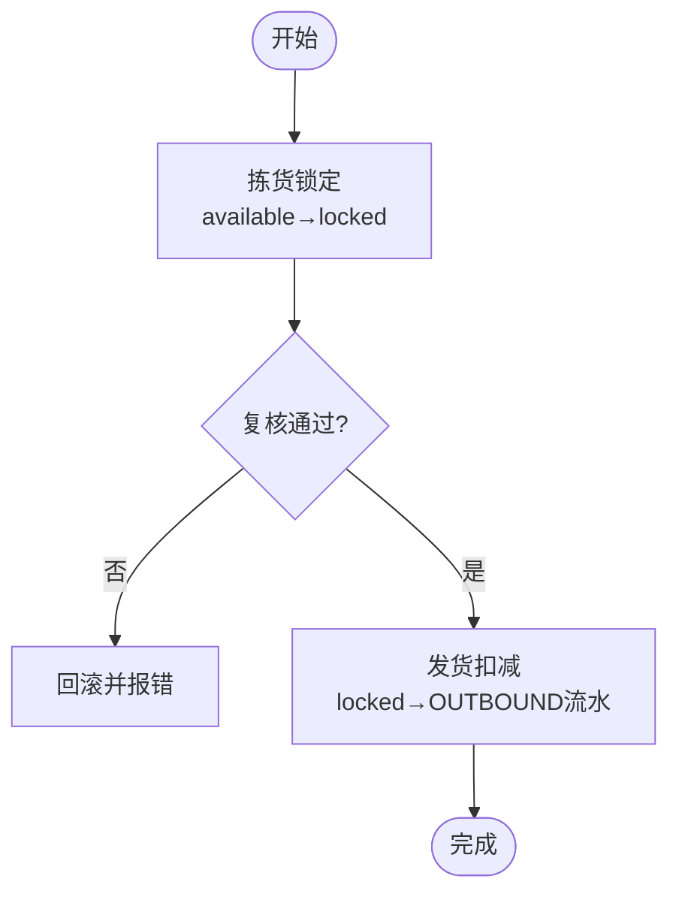
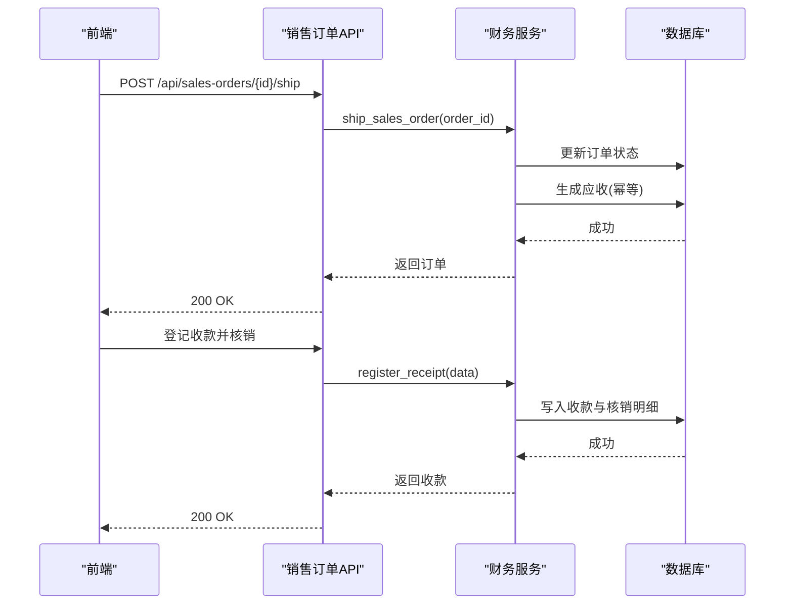

# 项目概述

<cite>
**本文引用的文件**
- [README.md](file://README.md)
- [PRD.md](file://docs/PRD.md)
- [main.py](file://backend-python/app/main.py)
- [inventory_service.py](file://backend-python/app/services/inventory_service.py)
- [outbound_service.py](file://backend-python/app/services/outbound_service.py)
- [finance_service.py](file://backend-python/app/services/finance_service.py)
- [orders.py](file://backend-python/app/models/orders.py)
- [inventory.py](file://backend-python/app/models/inventory.py)
- [finance.py](file://backend-python/app/models/finance.py)
- [sales_orders.py](file://backend-python/app/routers/sales_orders.py)
- [docker-compose.yml](file://docker-compose.yml)
- [pyproject.toml](file://backend-python/pyproject.toml)
- [package.json](file://frontend-vue/package.json)
- [SalesOrdersView.vue](file://frontend-vue/src/views/SalesOrdersView.vue)
</cite>

## 目录
1. [简介](#简介)
2. [项目结构](#项目结构)
3. [核心组件](#核心组件)
4. [架构总览](#架构总览)
5. [详细组件分析](#详细组件分析)
6. [依赖关系分析](#依赖关系分析)
7. [性能与并发特性](#性能与并发特性)
8. [快速开始](#快速开始)
9. [常见问题排查](#常见问题排查)
10. [结论](#结论)

## 简介
本项目是一个“进销存 + 业财一体”的中后台系统，围绕库存底座与收入侧业财闭环构建：销售订单确认→发货自动生成应收→收款核销（支持部分核销与预收）→账龄与经营驾驶舱。后端采用 Python + FastAPI，前端使用 Vue 3 + Element Plus + ECharts，提供 Docker Compose 一键启动能力，并配套完善的自动化测试与 CI。

- 业务价值：打通“业务单据 → 财务流水”的自动转化路径，减少人工对账成本，提升资金可视性与风险预警能力。
- 技术价值：以统一服务层封装库存变动、状态机驱动的业务流转、幂等与事务保障，确保数据一致性与可追溯性。

**章节来源**
- [README.md:1-118](file://README.md#L1-L118)
- [PRD.md:13-47](file://docs/PRD.md#L13-L47)

## 项目结构
仓库采用前后端分离与模块化组织：
- 后端：FastAPI 应用，按路由、模型、服务、Schema 分层；所有库存变动通过统一服务入口写入流水。
- 前端：Vue 3 SPA，页面按业务域划分，ECharts 用于经营驾驶舱可视化。
- 工程化：Docker Compose 编排 MySQL、后端、前端；CI 覆盖后端单测、前端构建与单测、镜像构建校验。

**图表来源**
- [main.py:27-69](file://backend-python/app/main.py#L27-L69)
- [docker-compose.yml:1-46](file://docker-compose.yml#L1-L46)

**章节来源**
- [README.md:81-118](file://README.md#L81-L118)
- [pyproject.toml:1-36](file://backend-python/pyproject.toml#L1-L36)
- [package.json:1-34](file://frontend-vue/package.json#L1-L34)

## 核心组件
- 仓储模型与库存服务：仓库→库区→库位三层结构；批次管理；可用量与锁定量分离；全量库存流水。
- 出库作业：PENDING→PICKED→REVIEWED→SHIPPED 状态机，拣货锁定、复核、发货扣减，防超卖。
- 业财一体（收入侧）：销售订单 DRAFT→CONFIRMED→SHIPPED→COMPLETED/CANCELLED；发货生成应收（到期日=发货日+账期）；收款核销（部分核销/预收）；账龄与驾驶舱聚合。
- 统一异常与契约：BusinessError 统一错误响应；CamelModel 统一 camelCase 输入输出。

**章节来源**
- [inventory.py:18-98](file://backend-python/app/models/inventory.py#L18-L98)
- [inventory_service.py:1-10](file://backend-python/app/services/inventory_service.py#L1-L10)
- [outbound_service.py:1-8](file://backend-python/app/services/outbound_service.py#L1-L8)
- [finance.py:24-117](file://backend-python/app/models/finance.py#L24-L117)
- [finance_service.py:1-8](file://backend-python/app/services/finance_service.py#L1-L8)

## 架构总览
系统由“前端界面 → 后端 API → 数据库”构成，关键流程包括：
- 入库：创建入库单→收货生成批次→累加库存→写流水。
- 出库：创建出库单→拣货锁定→复核→发货扣减→写流水。
- 销售与应收：创建销售订单→确认→发货（同一事务内生成应收）→收款登记与核销→账龄统计与驾驶舱。

**图表来源**
- [sales_orders.py:13-66](file://backend-python/app/routers/sales_orders.py#L13-L66)
- [finance_service.py:246-268](file://backend-python/app/services/finance_service.py#L246-L268)

**章节来源**
- [main.py:27-69](file://backend-python/app/main.py#L27-L69)
- [sales_orders.py:13-66](file://backend-python/app/routers/sales_orders.py#L13-L66)
- [finance_service.py:246-268](file://backend-python/app/services/finance_service.py#L246-L268)

## 详细组件分析

### 仓储模型与库存服务
- 三层仓储：仓库→库区→库位，库位带优先级，便于上架推荐与拣货排序。
- 批次管理：每次入库收货为每个明细行生成独立批次，支持生产日期/有效期。
- 库存分离：available_qty（可用量）与 locked_qty（锁定量）分离，隔离已承诺未出库库存。
- 全量流水：所有库存变动必须经 inventory_service 统一入口，强制写入 inventory_flows，记录变动前/后数量。

**图表来源**
- [inventory.py:18-98](file://backend-python/app/models/inventory.py#L18-L98)

**章节来源**
- [inventory.py:18-98](file://backend-python/app/models/inventory.py#L18-L98)
- [inventory_service.py:75-144](file://backend-python/app/services/inventory_service.py#L75-L144)
- [inventory_service.py:147-251](file://backend-python/app/services/inventory_service.py#L147-L251)

### 出库作业与防超卖
- 状态机：PENDING→PICKED→REVIEWED→SHIPPED。
- 拣货锁定：将可用库存转为锁定库存，跨批次逐行原子扣减，并发安全。
- 复核验货：二次核对拣货数量与实物一致。
- 发货扣减：从锁定库存扣减，写 OUTBOUND 流水。
- 防超卖策略：先 SUM 总量校验不足直接返回 False；条件 UPDATE 配合 with_for_update；整单事务失败回滚。

**图表来源**
- [outbound_service.py:102-176](file://backend-python/app/services/outbound_service.py#L102-L176)
- [inventory_service.py:147-251](file://backend-python/app/services/inventory_service.py#L147-L251)

**章节来源**
- [outbound_service.py:1-196](file://backend-python/app/services/outbound_service.py#L1-L196)
- [inventory_service.py:147-251](file://backend-python/app/services/inventory_service.py#L147-L251)

### 业财一体（收入侧闭环）
- 销售订单：金额 = Σ(数量 × 单价)，确认后明细锁定。
- 发货生成应收：到期日 = 发货日 + 账期；幂等由 DB 唯一约束 (source_order_no, entry_type) 兜底。
- 收款核销：支持部分核销与多笔核销；单张应收禁止超额核销；收款允许保留未核销余额（预收）。
- 账龄与预警：以到期日为基准实时分段（未到期/逾期1-30/31-60/60+天）。
- 经营驾驶舱：应收总额、已回款、未回款、逾期、欠款 TOP、账龄分布、订单与回款趋势。

**图表来源**
- [sales_orders.py:59-66](file://backend-python/app/routers/sales_orders.py#L59-L66)
- [finance_service.py:246-268](file://backend-python/app/services/finance_service.py#L246-L268)
- [finance_service.py:411-424](file://backend-python/app/services/finance_service.py#L411-L424)

**章节来源**
- [finance.py:24-117](file://backend-python/app/models/finance.py#L24-L117)
- [finance_service.py:246-268](file://backend-python/app/services/finance_service.py#L246-L268)
- [finance_service.py:411-424](file://backend-python/app/services/finance_service.py#L411-L424)
- [finance_service.py:479-506](file://backend-python/app/services/finance_service.py#L479-L506)

### 前端销售订单页面
- 提供新建、确认、发货、完成、作废等操作；发货提示“自动生成应收（到期日=发货日+账期）”。
- 列表支持状态筛选、关键词搜索、分页；新增对话框包含客户选择、账期设置、商品明细编辑。

**章节来源**
- [SalesOrdersView.vue:1-200](file://frontend-vue/src/views/SalesOrdersView.vue#L1-L200)

## 依赖关系分析
- 模块耦合：routers 仅调用 services；services 访问 models；models 定义表结构与关系。
- 外部依赖：FastAPI、SQLAlchemy 2.0、Pydantic v2、Alembic、数据库驱动（pymysql/psycopg2）、aiosqlite。
- 前端依赖：Vue 3、Element Plus、Pinia、Vite、ECharts、Playwright/Vitest。

**图表来源**
- [main.py:53-69](file://backend-python/app/main.py#L53-L69)
- [pyproject.toml:7-17](file://backend-python/pyproject.toml#L7-L17)
- [package.json:15-31](file://frontend-vue/package.json#L15-L31)

**章节来源**
- [main.py:53-69](file://backend-python/app/main.py#L53-L69)
- [pyproject.toml:7-17](file://backend-python/pyproject.toml#L7-L17)
- [package.json:15-31](file://frontend-vue/package.json#L15-L31)

## 性能与并发特性
- 并发安全：行级 SELECT ... FOR UPDATE（PostgreSQL 生效，SQLite 忽略），条件 UPDATE 重试，SUM 总量校验，整单事务保证一致性。
- 查询优化：joinedload 避免 N+1；常用过滤列建索引；库存查询支持按商品汇总或库位明细视图。
- 幂等设计：应收生成通过唯一约束与预查双重保障；重复发货不产生第二条应收。

**章节来源**
- [inventory_service.py:91-144](file://backend-python/app/services/inventory_service.py#L91-L144)
- [inventory_service.py:147-251](file://backend-python/app/services/inventory_service.py#L147-L251)
- [finance_service.py:295-330](file://backend-python/app/services/finance_service.py#L295-L330)

## 快速开始
- Docker Compose 一键启动：
  - 复制环境变量（可选）：cp .env.example .env
  - 一键构建并启动：docker compose up -d --build
  - 访问：前端 http://localhost:8080，后端 API 文档 http://localhost:8000/docs
  - 默认账号：admin / admin123
- 本地开发（前后端分离）：
  - 后端：cd backend-python && uv sync && uv run uvicorn app.main:app --port 8000
  - 前端：cd frontend-vue && npm install && npm run dev
- 根目录一键并发启动：npm start

**章节来源**
- [README.md:121-166](file://README.md#L121-L166)
- [docker-compose.yml:1-46](file://docker-compose.yml#L1-L46)

## 常见问题排查
- 业务异常统一处理：BusinessError 被全局捕获并返回 JSON 响应，便于前端展示 detail/message。
- 健康检查：/api/health 提供存活探针，供前端登录页预热与外部保活脚本使用。
- 常见错误：
  - 库存不足：拣货/发货时抛出 BusinessError，需检查可用/锁定库存与批次。
  - 并发冲突：单号冲突或并发生成应收触发 IntegrityError，服务层会重试或返回 409。
  - 权限与鉴权：路由依赖 get_current_user，未登录或无权限将拒绝访问。

**章节来源**
- [main.py:35-41](file://backend-python/app/main.py#L35-L41)
- [main.py:77-84](file://backend-python/app/main.py#L77-L84)
- [outbound_service.py:96-133](file://backend-python/app/services/outbound_service.py#L96-L133)
- [finance_service.py:295-330](file://backend-python/app/services/finance_service.py#L295-L330)

## 结论
本系统以库存底座为核心，结合状态机驱动的出入库作业与收入侧业财闭环，实现了从销售订单到应收、收款核销的全链路自动化与可追溯。通过统一服务层、幂等设计与并发安全保障，系统在中小贸易/仓储场景下具备高可用与易维护特性。配合 Docker Compose 一键部署与完善测试体系，能够快速落地与持续演进。